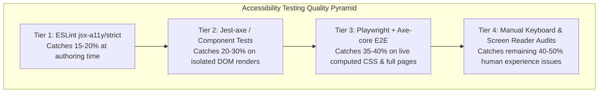

# Accessibility Tooling, Automation & CI/CD Governance

> Comprehensive guide to enterprise accessibility testing pipelines, Axe-core integration, Jest-axe unit tests, Playwright E2E audits, and CI/CD quality gates.

---

## Table of Contents

- [Accessibility Tooling, Automation \& CI/CD Governance](#accessibility-tooling-automation--cicd-governance)
  - [Table of Contents](#table-of-contents)
  - [1. The 4-Tier Testing Architecture](#1-the-4-tier-testing-architecture)
  - [2. Tier 1: Static Analysis (ESLint `jsx-a11y/strict`)](#2-tier-1-static-analysis-eslint-jsx-a11ystrict)
  - [3. Tier 2: Component Testing (`jest-axe` + Testing Library)](#3-tier-2-component-testing-jest-axe--testing-library)
  - [4. Tier 3: E2E Automation (`@axe-core/playwright` + Storybook)](#4-tier-3-e2e-automation-axe-coreplaywright--storybook)
  - [5. Tier 4: Manual Screen Reader \& Keyboard Audit Protocol](#5-tier-4-manual-screen-reader--keyboard-audit-protocol)
  - [6. CI/CD Governance \& Pull Request Quality Gates](#6-cicd-governance--pull-request-quality-gates)

---

## 1. The 4-Tier Testing Architecture

No single tool catches 100% of accessibility defects. Enterprise organizations deploy a layered pyramid:



---

## 2. Tier 1: Static Analysis (ESLint `jsx-a11y/strict`)

Catches missing attributes, non-interactive handlers, and invalid ARIA roles before code is committed.

- See [**`cheatsheets/eslint/01-a11y-strict.md`**](../cheatsheets/eslint/01-a11y-strict.md) for full configuration.

---

## 3. Tier 2: Component Testing (`jest-axe` + Testing Library)

Renders React components in JSDOM and evaluates rendered HTML against Axe rules.

```tsx
import { render } from '@testing-library/react';
import { axe, toHaveNoViolations } from 'jest-axe';
import { Modal } from './Modal';

expect.extend(toHaveNoViolations);

describe('Modal Accessibility Suite', () => {
  test('Modal dialog has zero automated Axe violations', async () => {
    const { container } = render(
      <Modal isOpen={true} title="Security Alert" onClose={jest.fn()}>
        <p>Your session will expire in 5 minutes.</p>
        <button type="button">Extend Session</button>
      </Modal>,
    );

    const results = await axe(container);
    expect(results).toHaveNoViolations();
  });
});
```

---

## 4. Tier 3: E2E Automation (`@axe-core/playwright` + Storybook)

Evaluates full computed stylesheets, color contrast, and dynamic state in headless Chromium.

```typescript
import { test, expect } from '@playwright/test';
import AxeBuilder from '@axe-core/playwright';

test.describe('E2E WCAG 2.2 AA Auditing', () => {
  test('Dashboard page passes strict WCAG 2.2 AA audit', async ({ page }) => {
    await page.goto('/dashboard');

    const scanResults = await new AxeBuilder({ page })
      .withTags(['wcag2a', 'wcag2aa', 'wcag21a', 'wcag21aa', 'wcag22aa'])
      .exclude('#third-party-widget-frame') // Scope out untrusted external iframes if necessary
      .analyze();

    expect(scanResults.violations).toEqual([]);
  });
});
```

---

## 5. Tier 4: Manual Screen Reader & Keyboard Audit Protocol

```
┌─────────────────────────────────────────────────────────────────────────────┐
│                       Manual 5-Step Audit Checklist                         │
├────┬──────────────────────┬─────────────────────────────────────────────────┤
│ 1. │ Keyboard Navigation  │ Disconnect mouse. Tab through all controls in   │
│    │                      │ reading order. Verify visible focus ring.       │
├────┼──────────────────────┼─────────────────────────────────────────────────┤
│ 2. │ Modal Traps          │ Open all overlays. Verify focus is trapped      │
│    │                      │ inside and Esc restores trigger focus.          │
├────┼──────────────────────┼─────────────────────────────────────────────────┤
│ 3. │ VoiceOver / NVDA     │ Navigate with screen reader browse mode. Verify │
│    │                      │ heading hierarchy (H1 -> H2 -> H3).             │
├────┼──────────────────────┼─────────────────────────────────────────────────┤
│ 4. │ 400% Zoom Reflow     │ Zoom page to 400% at 1280px. Verify content     │
│    │                      │ reflows without bidirectional scrollbars.       │
├────┼──────────────────────┼─────────────────────────────────────────────────┤
│ 5. │ Forced Colors Mode   │ Enable Windows High Contrast. Verify all icons, │
│    │                      │ borders, and focus rings remain visible.        │
└────┴──────────────────────┴─────────────────────────────────────────────────┘
```

---

## 6. CI/CD Governance & Pull Request Quality Gates

Incorporate automated accessibility audits into your GitHub Actions workflow:

```yaml
name: Accessibility CI Gate

on: [push, pull_request]

jobs:
  a11y-audit:
    runs-on: ubuntu-latest
    steps:
      - uses: actions/checkout@v4
      - uses: actions/setup-node@v4
        with:
          node-version: 20
      - run: npm ci
      - name: Run ESLint a11y Strict Gate
        run: npm run lint
      - name: Run Jest-Axe Component Tests
        run: npm run test:unit
      - name: Run Playwright WCAG 2.2 AA Audits
        run: npx playwright test tests/a11y.spec.ts
```
