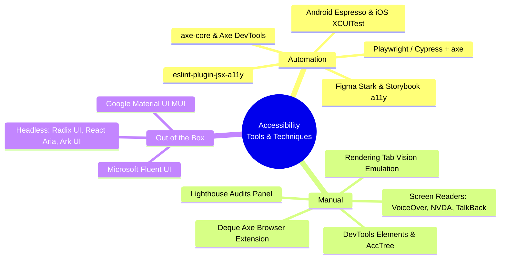
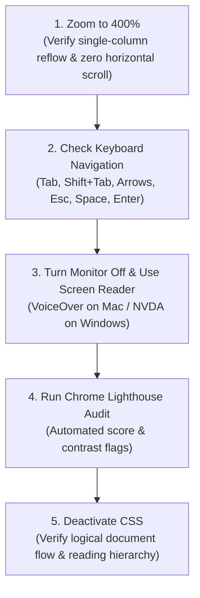
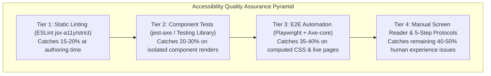

# Accessibility Tooling, Automation, Testing Protocols & CI/CD Governance

> Comprehensive engineering guide to accessibility tools, automation frameworks (Axe, ESLint, Android Espresso, Playwright), manual testing protocols, DevTools inspection, and out-of-the-box accessible design systems.

---

## Table of Contents

- [Accessibility Tooling, Automation, Testing Protocols \& CI/CD Governance](#accessibility-tooling-automation-testing-protocols--cicd-governance)
  - [Table of Contents](#table-of-contents)
  - [1. Tools \& Techniques Master Taxonomy](#1-tools--techniques-master-taxonomy)
  - [2. The 10 Core "Design for Accessibility" Engineering Rules](#2-the-10-core-design-for-accessibility-engineering-rules)
  - [3. The 5-Step Practical Accessibility Testing Protocol](#3-the-5-step-practical-accessibility-testing-protocol)
    - [Step 1: Zoom to 400% (Reflow Test)](#step-1-zoom-to-400-reflow-test)
    - [Step 2: Check Keyboard-Only Navigation](#step-2-check-keyboard-only-navigation)
    - [Step 3: Turn Monitor Off \& Use a Screen Reader](#step-3-turn-monitor-off--use-a-screen-reader)
    - [Step 4: Run Chrome Lighthouse Accessibility Audit](#step-4-run-chrome-lighthouse-accessibility-audit)
    - [Step 5: Deactivate CSS (Document Structure Test)](#step-5-deactivate-css-document-structure-test)
  - [4. Automated Tooling Deep Dive](#4-automated-tooling-deep-dive)
    - [Static Linting: ESLint `jsx-a11y`](#static-linting-eslint-jsx-a11y)
    - [Web Component Testing: `jest-axe`](#web-component-testing-jest-axe)
    - [End-to-End Automation: `@axe-core/playwright`](#end-to-end-automation-axe-coreplaywright)
    - [Mobile Automated Testing: Android Espresso \& iOS Accessibility](#mobile-automated-testing-android-espresso--ios-accessibility)
  - [5. Manual Testing \& DevTools Inspection Suite](#5-manual-testing--devtools-inspection-suite)
    - [Chrome DevTools Accessibility Tree Inspector](#chrome-devtools-accessibility-tree-inspector)
    - [Emulating Vision Deficiencies in DevTools](#emulating-vision-deficiencies-in-devtools)
  - [6. Out-of-the-Box Accessible Component Systems](#6-out-of-the-box-accessible-component-systems)
  - [7. Enterprise 4-Tier Testing Architecture \& CI/CD Pipeline](#7-enterprise-4-tier-testing-architecture--cicd-pipeline)
    - [GitHub Actions CI/CD Quality Gate](#github-actions-cicd-quality-gate)
  - [8. Interactive Live Testbeds in Repository](#8-interactive-live-testbeds-in-repository)
  - [9. Authoritative Standards, Checklists \& Auditing References](#9-authoritative-standards-checklists--auditing-references)

---

## 1. Tools & Techniques Master Taxonomy



---

## 2. The 10 Core "Design for Accessibility" Engineering Rules

| Core Design Rule                         | Implementation Requirement                                                                                       | Code / Pattern Example                                                                                                                         |
| :--------------------------------------- | :--------------------------------------------------------------------------------------------------------------- | :--------------------------------------------------------------------------------------------------------------------------------------------- |
| **1. Use Semantic HTML**                 | Exposes native roles, headings, and landmark regions to the Accessibility Tree automatically.                    | Use `<header>`, `<footer>`, `<main>`, `<nav>`, `<ul>`, `<p>`, and hierarchical `<h1>`–`<h6>`.                                                  |
| **2. Provide Text for Non-Text Content** | Every non-text element (images, charts, icons) must have a concise programmatic description.                     | ``<br>Decorative: `` or `<svg aria-hidden="true" />`.                                       |
| **3. Add Labels to Form Elements**       | Every interactive form control must have an explicitly linked native label. _Placeholder is NOT an alternative!_ | `<label for="user-search">Search</label>`<br>`<input id="user-search" type="search" />`                                                        |
| **4. Show Where Your `:focus` Is**       | Keyboard focus must always be visibly highlighted. Never strip outlines without providing `:focus-visible`.      | `button:focus-visible { outline: 2px solid #0284c7; outline-offset: 2px; }`                                                                    |
| **5. Use Contrasting Colors**            | Maintain WCAG 2.1 Level AA contrast ratios for all visible text and UI elements.                                 | • Normal Text: **$\ge 4.5:1$**<br>• Large Text ($\ge 18\text{px}$): **$\ge 3.0:1$**<br>• Form Borders/Focus Rings: **$\ge 3.0:1$**             |
| **6. Understandable Without Color**      | Never use color as the sole conveyor of information or error state. Add secondary icons or text hints.           | `<input aria-invalid="true" aria-describedby="err" />`<br>`<span id="err"><IconWarning /> Invalid Zip Code</span>`                             |
| **7. Write Descriptive Links**           | Link text must clearly explain its destination or purpose out of context.                                        | ✅ `<a href="/docs">Assignment instructions</a>`<br>❌ `<a href="/docs">Click here</a>`                                                        |
| **8. Caption Video and Audio**           | Provide synchronized closed captions, transcripts, and audio descriptions.                                       | `<video><track kind="captions" src="captions.vtt" srclang="en" default /></video>`                                                             |
| **9. Keep Pinch and Zoom Alive**         | Users with low vision rely on mobile pinch-to-zoom. Never disable user scaling.                                  | `<meta name="viewport" content="width=device-width, initial-scale=1, user-scalable=yes">`<br>_(Avoid `user-scalable=no` or `maximum-scale=1`)_ |
| **10. Use WAI-ARIA Only If Necessary**   | The 1st Rule of ARIA: Always prefer native HTML5 elements before creating custom ARIA widgets.                   | Use `<button>` instead of `<div role="button" tabindex="0">`. Use `<dialog>` instead of custom modal portals.                                  |

---

## 3. The 5-Step Practical Accessibility Testing Protocol

Before deploying any feature to production, execute this 5-step manual testing protocol:



### Step 1: Zoom to 400% (Reflow Test)

- **How to test:** Press <kbd>Cmd</kbd> / <kbd>Ctrl</kbd> + <kbd>+</kbd> until the browser reaches **400% zoom** (equivalent to $320\text{CSS px}$ at $1280\text{px}$).
- **Pass criteria:** All text must remain visible, menus should collapse into accessible mobile drawers, and there must be **zero horizontal scrolling** across the main content.

### Step 2: Check Keyboard-Only Navigation

- **How to test:** Disconnect your mouse/trackpad. Navigate the entire page using only:
  - <kbd>Tab</kbd> / <kbd>Shift</kbd> + <kbd>Tab</kbd> (Forward / Backward sequential navigation)
  - <kbd>Arrow Keys</kbd> (Tabs, Radio groups, Menus, Sliders)
  - <kbd>Spacebar</kbd> / <kbd>Enter</kbd> (Activating buttons, toggling checkboxes, submitting)
  - <kbd>Escape</kbd> (Dismissing modals, popovers, drawers)
- **Pass criteria:** Every interactive element has a visible focus ring, there are zero keyboard traps, and the **Skip Link** is reachable on the very first Tab press.

### Step 3: Turn Monitor Off & Use a Screen Reader

- **How to test:** Turn off your screen (or look away) and navigate solely with **Apple VoiceOver** (<kbd>Cmd</kbd> + <kbd>F5</kbd>) or **NVDA** (<kbd>Ctrl</kbd> + <kbd>Alt</kbd> + <kbd>N</kbd>).
- **Pass criteria:** Form inputs announce their labels and required status, buttons announce their purpose, dialogs announce their title upon opening, and dynamic updates are announced via `aria-live`.

### Step 4: Run Chrome Lighthouse Accessibility Audit

- **How to test:** Open Chrome DevTools (<kbd>F12</kbd>) $\rightarrow$ **Lighthouse** tab $\rightarrow$ Check "Accessibility" $\rightarrow$ Click **"Analyze page load"**.
- **Pass criteria:** Target a score of **100/100**, resolving all flagged color contrast, missing alt attributes, and ARIA binding issues.

### Step 5: Deactivate CSS (Document Structure Test)

- **How to test:** In Chrome DevTools, press <kbd>Cmd</kbd>/<kbd>Ctrl</kbd> + <kbd>Shift</kbd> + <kbd>P</kbd> $\rightarrow$ Type **"Disable JavaScript"** or **"Disable CSS"** (or use the Web Developer extension).
- **Pass criteria:** The unstyled HTML document flows in a logical reading order from top to bottom, with headings, lists, tables, and form controls maintaining clean visual hierarchy.

---

## 4. Automated Tooling Deep Dive

### Static Linting: ESLint `jsx-a11y`

Catches missing attributes, non-interactive handlers, and invalid ARIA roles before code is committed.

```json
// .eslintrc.json
{
  "extends": ["react-app", "plugin:jsx-a11y/strict"],
  "plugins": ["jsx-a11y"],
  "rules": {
    "jsx-a11y/no-autofocus": "error",
    "jsx-a11y/anchor-is-valid": "error",
    "jsx-a11y/click-events-have-key-events": "error",
    "jsx-a11y/no-static-element-interactions": "error"
  }
}
```

### Web Component Testing: `jest-axe`

Evaluates rendered React/Vue component trees inside JSDOM against Axe rules:

```tsx
import { render } from '@testing-library/react';
import { axe, toHaveNoViolations } from 'jest-axe';
import { FormField } from './FormField';

expect.extend(toHaveNoViolations);

describe('FormField Accessibility', () => {
  test('renders with zero automated accessibility violations', async () => {
    const { container } = render(
      <FormField
        label="Email Address"
        type="email"
        value=""
        onChange={() => {}}
        helperText="We will never share your email."
      />,
    );

    const results = await axe(container);
    expect(results).toHaveNoViolations();
  });
});
```

### End-to-End Automation: `@axe-core/playwright`

Runs accessibility scans on full computed stylesheets, active JavaScript states, and real browser viewports:

```typescript
import { test, expect } from '@playwright/test';
import AxeBuilder from '@axe-core/playwright';

test.describe('E2E WCAG 2.2 AA Auditing', () => {
  test('Checkout flow passes strict WCAG 2.2 AA audit', async ({ page }) => {
    await page.goto('/checkout');
    await page.waitForSelector('#payment-form');

    const scanResults = await new AxeBuilder({ page })
      .withTags(['wcag2a', 'wcag2aa', 'wcag21a', 'wcag21aa', 'wcag22aa'])
      .analyze();

    expect(scanResults.violations).toEqual([]);
  });
});
```

### Mobile Automated Testing: Android Espresso & iOS Accessibility

- **Android (Espresso & Accessibility Testing Framework):**

  ```java
  // Enable Accessibility Checks in Android Espresso Tests
  @BeforeClass
  public static void enableAccessibilityChecks() {
      AccessibilityChecks.enable()
          .setRunChecksFromRootView(true);
  }
  ```

  - Automatically scans Android Views for touch target sizes ($\ge 48 \times 48\text{dp}$), missing `contentDescription`, and low contrast.

- **iOS (XCUITest Accessibility Inspector):**
  ```swift
  func testButtonAccessibility() {
      let submitButton = app.buttons["SubmitOrder"]
      XCTAssertTrue(submitButton.isAccessibilityElement)
      XCTAssertEqual(submitButton.accessibilityLabel, "Submit Order")
  }
  ```

---

## 5. Manual Testing & DevTools Inspection Suite

```
┌─────────────────────────────────────────────────────────────────────────────┐
│                    Chrome DevTools Accessibility Features                   │
├─────────────────────────┬───────────────────────────────────────────────────┤
│ Feature                 │ Where to Find in DevTools                         │
├─────────────────────────┼───────────────────────────────────────────────────┤
│ Accessibility Tree      │ Elements Panel -> Click "Accessibility" Sub-Tab   │
│ Computed Properties     │ Elements Panel -> Accessibility -> Computed Props │
│ Contrast Color Picker   │ Elements Panel -> Styles -> Click Color Swatch    │
│ Vision Deficiency Sim   │ More Tools -> Rendering -> Emulate vision diff    │
│ Forced Colors Mode Sim  │ More Tools -> Rendering -> Emulate forced-colors  │
│ Lighthouse Audit        │ Lighthouse Panel -> Generate Report               │
└─────────────────────────┴───────────────────────────────────────────────────┘
```

### Chrome DevTools Accessibility Tree Inspector

- Enables inspecting what the **Accessibility Tree (AccTree)** sees (Computed Name, Role, Focusable status, and ARIA attributes).
- Switch to the **Full-page Accessibility Tree** view by clicking the human icon in the top right of the Elements tab.

### Emulating Vision Deficiencies in DevTools

In Chrome DevTools $\rightarrow$ Press <kbd>Cmd</kbd>/<kbd>Ctrl</kbd> + <kbd>Shift</kbd> + <kbd>P</kbd> $\rightarrow$ Type **"Rendering"** $\rightarrow$ Under **"Emulate vision deficiencies"**, test your app under:

1. **Protanopia** (Red-weak vision)
2. **Deuteranopia** (Green-weak vision)
3. **Tritanopia** (Blue-weak vision)
4. **Achromatopsia** (Complete monochrome color blindness)
5. **Blurred vision** (Simulates cataracts or refractive errors)

---

## 6. Out-of-the-Box Accessible Component Systems

When building modern web applications, adopting pre-tested, accessible component primitives saves months of engineering effort:

| Component Library            | Architecture             | Built-in Accessibility Features                                                                         |
| :--------------------------- | :----------------------- | :------------------------------------------------------------------------------------------------------ |
| **Google Material UI (MUI)** | Styled / Opinionated     | Full WAI-ARIA support, keyboard navigation, high contrast focus rings, form label associations.         |
| **Microsoft Fluent UI**      | Enterprise Web / Desktop | Screen reader optimizations, Windows High Contrast Mode integration, robust Roving tabindex.            |
| **Radix UI Primitives**      | **Headless / Unstyled**  | 100% WAI-ARIA APG compliant, automatic focus trapping, cyclic Tab wrapping, dismiss on Escape.          |
| **React Aria (Adobe)**       | **Headless Hooks**       | Adaptive cross-device keyboard/touch interaction, multi-screen reader tested, virtual focus comboboxes. |
| **Ark UI / Zag.js**          | **Framework Agnostic**   | State machine-driven accessibility primitives for React, Vue, and Svelte.                               |

---

## 7. Enterprise 4-Tier Testing Architecture & CI/CD Pipeline



### GitHub Actions CI/CD Quality Gate

```yaml
name: Accessibility CI Quality Gate

on: [push, pull_request]

jobs:
  a11y-audit:
    runs-on: ubuntu-latest
    steps:
      - uses: actions/checkout@v4
      - uses: actions/setup-node@v4
        with:
          node-version: 20
      - run: npm ci

      # 1. Static Linting Gate
      - name: Run ESLint a11y Strict Gate
        run: npm run lint

      # 2. Unit & Component Gate
      - name: Run Jest-Axe Component Tests
        run: npm run test:unit

      # 3. Full E2E Playwright WCAG 2.2 AA Audit
      - name: Run Playwright WCAG 2.2 AA Audits
        run: npx playwright test tests/a11y.spec.ts
```

---

## 8. Interactive Live Testbeds in Repository

All accessibility patterns and testing techniques in this repository can be evaluated live using our standalone testbed suite:

- 🚀 [**`index.html` (Master Testbed Hub)**](file:///Users/atulkumarawasthi/projects/SystemDesign/Accessibility/demos/index.html) — Launchpad linking to all 8 interactive standalone testbeds.
- 🧪 [**`01-semantic-html-and-forms.html`**](file:///Users/atulkumarawasthi/projects/SystemDesign/Accessibility/demos/01-semantic-html-and-forms.html) — Native forms, labels, and aria-describedby testing.
- 🧪 [**`02-keyboard-navigation-and-skip-links.html`**](file:///Users/atulkumarawasthi/projects/SystemDesign/Accessibility/demos/02-keyboard-navigation-and-skip-links.html) — Keyboard tab navigation & skip links testbed.
- 🧪 [**`03-modal-focus-trap-and-inert.html`**](file:///Users/atulkumarawasthi/projects/SystemDesign/Accessibility/demos/03-modal-focus-trap-and-inert.html) — Modal focus trap & background inert isolation.
- 🧪 [**`07-color-contrast-and-forced-colors.html`**](file:///Users/atulkumarawasthi/projects/SystemDesign/Accessibility/demos/07-color-contrast-and-forced-colors.html) — Live contrast validator, CVD filters, and Windows High Contrast simulation.

---

## 9. Authoritative Standards, Checklists & Auditing References

- 📋 [**Intopia "Not-Checklist" (WCAG Companion Guide)**](https://not-checklist.intopia.digital/) — Practical, role-based translation of WCAG success criteria for engineers, designers, and QA testers.
- 🌐 [**Google Chrome Learn Accessibility**](https://web.dev/learn/accessibility) — Google Chrome team's comprehensive interactive course.
- 📐 [**WebAIM WCAG 2 Checklist**](https://webaim.org/standards/wcag/checklist) — Practical, human-readable breakdown of WCAG 2.1 / 2.2 Success Criteria.
- 🚀 [**Frontend System Design: Web Accessibility (a11y)**](https://dev.to/zeeshanali0704/frontend-system-design-web-accessibility-a11y-28cf) — Deep-dive architectural guide to accessibility in frontend system design.
- 🏛️ [**W3C WCAG Standards Overview**](https://www.w3.org/WAI/standards-guidelines/wcag/) — Official W3C Web Accessibility Initiative standards hub.

