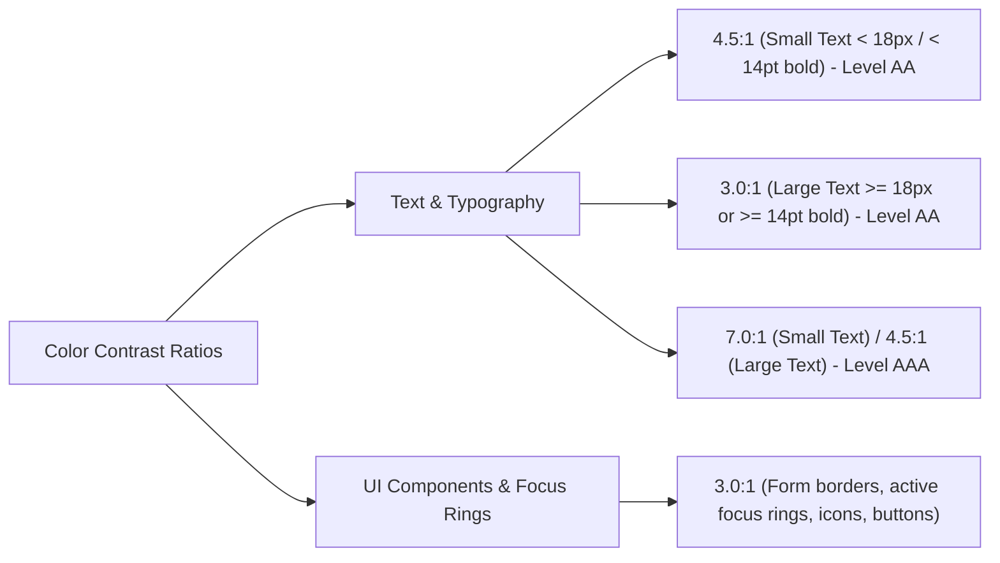
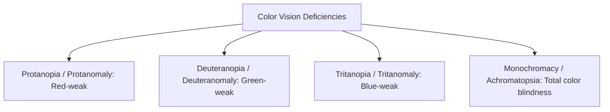

# Color Contrast, Zoom & Visual Accessibility Master Guide

> Comprehensive architectural guide to WCAG color contrast formulas, 400% Zoom Reflow, `rem`/`em` typography scaling, `prefers-color-scheme`, Windows Contrast Themes (`forced-colors`), and Color Vision Deficiency (CVD) accommodations.

---

## Table of Contents

- [Color Contrast, Zoom \& Visual Accessibility Master Guide](#color-contrast-zoom--visual-accessibility-master-guide)
  - [Table of Contents](#table-of-contents)
  - [1. Contrast Ratios \& 400% Zoom Thresholds](#1-contrast-ratios--400-zoom-thresholds)
    - [WCAG 2.1 / 2.2 Level AA Contrast Requirements](#wcag-21--22-level-aa-contrast-requirements)
    - [The 400% Zoom \& Reflow Mandate (WCAG 1.4.10)](#the-400-zoom--reflow-mandate-wcag-1410)
  - [2. Typography Units: Why `rem` / `em` Over `px`](#2-typography-units-why-rem--em-over-px)
  - [3. OS Media Queries: `prefers-color-scheme` \& `prefers-contrast`](#3-os-media-queries-prefers-color-scheme--prefers-contrast)
  - [4. JavaScript Theme Detection \& Reactive Listeners (`window.matchMedia`)](#4-javascript-theme-detection--reactive-listeners-windowmatchmedia)
  - [5. Windows High Contrast Mode \& Contrast Themes](#5-windows-high-contrast-mode--contrast-themes)
    - [CSS System Color Keywords in Forced Colors Mode](#css-system-color-keywords-in-forced-colors-mode)
  - [6. Mathematical Foundations of Relative Luminance](#6-mathematical-foundations-of-relative-luminance)
    - [1. The WCAG Contrast Ratio Formula](#1-the-wcag-contrast-ratio-formula)
    - [2. How Relative Luminance ($L$) is Calculated (Step-by-Step)](#2-how-relative-luminance-l-is-calculated-step-by-step)
      - [Step 1: Normalize 8-Bit RGB Channels to $\[0, 1\]$](#step-1-normalize-8-bit-rgb-channels-to-0-1)
      - [Step 2: Gamma De-compression (Linearization)](#step-2-gamma-de-compression-linearization)
      - [Step 3: Spectral Weighting (Human Eye Photopic Vision)](#step-3-spectral-weighting-human-eye-photopic-vision)
    - [3. Production JavaScript / TypeScript Implementation](#3-production-javascript--typescript-implementation)
  - [7. APCA (Advanced Perceptual Contrast Algorithm - WCAG 3.0 Preview)](#7-apca-advanced-perceptual-contrast-algorithm---wcag-30-preview)
  - [8. Color Vision Deficiency (CVD) System Engineering](#8-color-vision-deficiency-cvd-system-engineering)
    - [The Cardinal Rule: Never Rely on Color Alone](#the-cardinal-rule-never-rely-on-color-alone)
  - [9. Design System Token Architecture for Contrast](#9-design-system-token-architecture-for-contrast)
  - [10. Interactive Live Testbed in Repository](#10-interactive-live-testbed-in-repository)

---

## 1. Contrast Ratios & 400% Zoom Thresholds



### WCAG 2.1 / 2.2 Level AA Contrast Requirements

| Font Size Category                    | Size in Pixels / Points                                                       | Minimum Level AA Contrast Ratio | Minimum Level AAA Contrast Ratio | Examples                                                             |
| :------------------------------------ | :---------------------------------------------------------------------------- | :-----------------------------: | :------------------------------: | :------------------------------------------------------------------- |
| **Small text (Body / Inputs)**        | **$< 18\text{px}$** (or $< 14\text{pt}$ bold)                                 |            **4.5:1**            |            **7.0:1**             | Standard paragraphs, form labels, tooltips, list items.              |
| **Large text (Headings / Hero)**      | **$\ge 18\text{px}$** (or $\ge 14\text{pt}$ bold / $\ge 24\text{px}$ regular) |            **3.0:1**            |            **4.5:1**             | `<h1>` through `<h3>`, large banner titles, callout numbers.         |
| **UI Components & Graphical Objects** | N/A (Any dimensions)                                                          |            **3.0:1**            |            **4.5:1**             | Form field borders, active `:focus-visible` rings, standalone icons. |

### The 400% Zoom & Reflow Mandate (WCAG 1.4.10)

Users with low vision often zoom browser viewports up to **400%**.

- At 400% zoom on a standard $1280\text{px}$ display, the effective CSS viewport width reduces to **$320\text{CSS px}$**.
- **The Rule:** Content must reflow into a single vertical column without loss of information or functionality and **without requiring horizontal scrolling** (exceptions: data tables, maps, code blocks).

---

## 2. Typography Units: Why `rem` / `em` Over `px`

Using hardcoded `px` for font sizes prevents the browser from honoring user-defined default font preferences in operating system or browser settings (e.g. users setting base font size to $24\text{px}$ for readability).

```
┌─────────────────────────────────────────────────────────────────────────────┐
│                            Unit Scaling Comparison                          │
├─────────────┬─────────────────────────────────┬─────────────────────────────┤
│ Unit        │ Browser User-Font Zoom Scaling  │ Architectural Decision      │
├─────────────┼─────────────────────────────────┼─────────────────────────────┤
│ `px`        │ ❌ Fixed / Locked to exact px    │ Avoid for typography        │
│ `rem`       │ ✅ Scales relative to root <html>│ Recommended for typography  │
│ `em`        │ ✅ Scales relative to parent    │ Recommended for components  │
└─────────────┴─────────────────────────────────┴─────────────────────────────┘
```

```css
/* ❌ Anti-Pattern: Hardcoded px stops user-agent font scaling */
body {
  font-size: 16px;
}
h1 {
  font-size: 32px;
}

/* ✅ Best Practice: rem allows fluid OS and user-agent font scaling */
html {
  font-size: 100%; /* Defaults to 16px, but respects OS custom sizes */
}
body {
  font-size: 1rem; /* 16px default */
}
h1 {
  font-size: 2rem; /* 32px default */
}
p.caption {
  font-size: 0.875rem; /* 14px default */
}
```

---

## 3. OS Media Queries: `prefers-color-scheme` & `prefers-contrast`

Modern operating systems (macOS, Windows, iOS, Android) allow users to select their preferred visual themes. Browsers expose these preferences via standard CSS media queries:

```css
/* 1. Base / Light Theme Defaults */
:root {
  --bg-color: #ffffff;
  --text-color: #0f172a;
  --border-color: #cbd5e1;
  --focus-ring: #0284c7;
}

/* 2. System Dark Mode Detection */
@media (prefers-color-scheme: dark) {
  :root {
    --bg-color: #0f172a;
    --text-color: #f8fafc;
    --border-color: #334155;
    --focus-ring: #38bdf8;
  }
}

/* 3. High Contrast Preference (User requested higher contrast in OS) */
@media (prefers-contrast: more) {
  :root {
    --text-color: #000000;
    --border-color: #000000;
    --focus-ring: #000000;
  }
}
```

---

## 4. JavaScript Theme Detection & Reactive Listeners (`window.matchMedia`)

Applications often allow users to toggle themes manually while also syncing with system preferences automatically:

```javascript
// Function to detect current system preference
function checkSystemTheme() {
  const main = document.querySelector('.main');
  let currentTheme;

  // Check if OS dark mode is active
  if (window.matchMedia('(prefers-color-scheme: dark)').matches) {
    currentTheme = 'dark';
  } else {
    currentTheme = 'light';
  }

  document.documentElement.setAttribute('data-theme', currentTheme);
  return currentTheme;
}

// Reactive Listener: Automatically adapt when OS theme changes in real time
const colorSchemeQuery = window.matchMedia('(prefers-color-scheme: dark)');

colorSchemeQuery.addEventListener('change', (e) => {
  const newTheme = e.matches ? 'dark' : 'light';
  document.documentElement.setAttribute('data-theme', newTheme);
  console.log(`[Theme] Switched to OS preference: ${newTheme}`);
});

// Initial invocation on page load
checkSystemTheme();
```

---

## 5. Windows High Contrast Mode & Contrast Themes

In Windows (Settings $\rightarrow$ Accessibility $\rightarrow$ Contrast themes), users with low vision or photophobia can activate system-level high contrast themes:

```
┌─────────────────────────────────────────────────────────────────────────────┐
│                 Windows Accessibility > Contrast Themes                     │
├───────────────┬───────────────────────────────┬─────────────────────────────┤
│ Theme Name    │ Background                    │ Foreground Text             │
├───────────────┼───────────────────────────────┼─────────────────────────────┤
│ 1. Aquatic    │ Dark Teal / Slate (`#1b2e35`) │ Cyan / White (`#ffffff`)    │
│ 2. Desert     │ Warm Sand / Cream (`#fff1dc`) │ Deep Umber / Red (`#3d2817`)│
│ 3. Dusk       │ Dark Graphite (`#2d3238`)     │ Lavender / White (`#ffffff`)│
│ 4. Night sky  │ Pure Black (`#000000`)        │ Pure White / Gold (`#ffffff`│
└───────────────┴───────────────────────────────┴─────────────────────────────┘
```

### CSS System Color Keywords in Forced Colors Mode

When a Windows Contrast Theme is active, the browser enters **Forced Colors Mode** (`@media (forced-colors: active)`). The OS **strips all custom background images, box-shadows, and custom colors**, replacing them with standardized System Color keywords:

| System Color Keyword | Meaning & Usage                                      |
| :------------------- | :--------------------------------------------------- |
| **`Canvas`**         | Background of application content areas and dialogs. |
| **`CanvasText`**     | Primary body text color.                             |
| **`LinkText`**       | Interactive hyperlink color.                         |
| **`Highlight`**      | Selected items and focused input highlight color.    |
| **`HighlightText`**  | Text rendered on top of `Highlight`.                 |
| **`ButtonFace`**     | Background of clickable buttons.                     |
| **`ButtonText`**     | Text rendered inside buttons.                        |
| **`MarkText`**       | Text rendered inside `<mark>` highlighted elements.  |

```css
/* Accessible High-Contrast Resilient Component Architecture */
.custom-card {
  background: var(--card-bg);
  box-shadow: 0 4px 12px rgba(0, 0, 0, 0.15);
  /* Transparent border ensures border outline stays visible in Forced Colors mode! */
  border: 1px solid transparent;
}

.custom-button {
  background: #0284c7;
  color: #ffffff;
  border: 2px solid transparent;
}

@media (forced-colors: active) {
  .custom-card {
    border-color: CanvasText; /* Becomes solid high contrast border */
    box-shadow: none; /* Box shadows stripped by OS */
  }

  .custom-button {
    background: ButtonFace;
    color: ButtonText;
    border-color: ButtonText;
  }

  .custom-button:focus-visible {
    outline: 3px solid Highlight !important;
  }
}
```

---

## 6. Mathematical Foundations of Relative Luminance

### 1. The WCAG Contrast Ratio Formula

WCAG 2.x calculates contrast as the ratio between the **Relative Luminance** ($L$) of two colors:

$$\text{Contrast Ratio} = \frac{L_1 + 0.05}{L_2 + 0.05}$$

- $L_1$ is the relative luminance of the **lighter color** ($0.0 \le L_1 \le 1.0$).
- $L_2$ is the relative luminance of the **darker color** ($0.0 \le L_2 \le 1.0$).
- $+0.05$ is an ambient flare constant representing stray light reflected off the physical screen surface.
- The resulting ratio ranges from **1:1** (identical colors) to **21:1** (pure black $\#000000$ vs pure white $\#ffffff$).

---

### 2. How Relative Luminance ($L$) is Calculated (Step-by-Step)

Relative luminance represents the perceived brightness of any color normalized to $0$ (darkest black) and $1$ (lightest white).

#### Step 1: Normalize 8-Bit RGB Channels to $[0, 1]$

Given an 8-bit sRGB color $(R_{8\text{bit}}, G_{8\text{bit}}, B_{8\text{bit}})$ where each channel is between $0$ and $255$:

$$R_{\text{srgb}} = \frac{R_{8\text{bit}}}{255}, \quad G_{\text{srgb}} = \frac{G_{8\text{bit}}}{255}, \quad B_{\text{srgb}} = \frac{B_{8\text{bit}}}{255}$$

#### Step 2: Gamma De-compression (Linearization)

Because computer monitors encode colors with non-linear sRGB gamma, each channel $C_{\text{srgb}} \in \{R_{\text{srgb}}, G_{\text{srgb}}, B_{\text{srgb}}\}$ must be converted to linear RGB ($C$):

$$
C = \begin{cases}
\dfrac{C_{\text{srgb}}}{12.92} & \text{if } C_{\text{srgb}} \le 0.04045 \\[10pt]
\left(\dfrac{C_{\text{srgb}} + 0.055}{1.055}\right)^{2.4} & \text{if } C_{\text{srgb}} > 0.04045
\end{cases}
$$

#### Step 3: Spectral Weighting (Human Eye Photopic Vision)

Human eye cone receptors are unevenly sensitive to different wavelengths—human eyes are vastly more sensitive to green and yellow light than to blue. The linear components are combined using the CIE standard coefficients:

$$L = 0.2126 \times R + 0.7152 \times G + 0.0722 \times B$$

```
┌─────────────────────────────────────────────────────────────┐
│             Human Eye Photopic Spectral Sensitivity         │
├─────────────────────────────────────────────────────────────┤
│ • Green Channel (555nm):  71.52% contribution (0.7152)      │
│ • Red Channel   (700nm):  21.26% contribution (0.2126)      │
│ • Blue Channel  (435nm):   7.22% contribution (0.0722)      │
└─────────────────────────────────────────────────────────────┘
```

---

### 3. Production JavaScript / TypeScript Implementation

```typescript
/**
 * Calculates the relative luminance of an sRGB color.
 * Returns a value between 0 (black) and 1 (white).
 */
export function getRelativeLuminance(r: number, g: number, b: number): number {
  const [rs, gs, bs] = [r, g, b].map((val) => {
    const srgb = val / 255;
    return srgb <= 0.04045 ? srgb / 12.92 : Math.pow((srgb + 0.055) / 1.055, 2.4);
  });

  return 0.2126 * rs + 0.7152 * gs + 0.0722 * bs;
}

/**
 * Calculates the WCAG 2.1 contrast ratio between two hex colors.
 * Returns a ratio between 1.0 and 21.0 (e.g. 4.5 for 4.5:1).
 */
export function getContrastRatio(hex1: string, hex2: string): number {
  const parseHex = (hex: string) => {
    const clean = hex.replace('#', '');
    const num = parseInt(clean, 16);
    return [(num >> 16) & 255, (num >> 8) & 255, num & 255];
  };

  const [r1, g1, b1] = parseHex(hex1);
  const [r2, g2, b2] = parseHex(hex2);

  const l1 = getRelativeLuminance(r1, g1, b1);
  const l2 = getRelativeLuminance(r2, g2, b2);

  const lighter = Math.max(l1, l2);
  const darker = Math.min(l1, l2);

  return (lighter + 0.05) / (darker + 0.05);
}

// Example:
// getContrastRatio("#ffffff", "#0f172a") -> 15.8 (Passes AA & AAA)
```

---

## 7. APCA (Advanced Perceptual Contrast Algorithm - WCAG 3.0 Preview)

WCAG 2.x math has a known limitation: it evaluates contrast symmetrically. In human vision, white text on black is perceived differently than black text on white due to spatial frequency and display halation.

```
┌─────────────────────────────────────────────────────────────────────────────┐
│                             APCA vs WCAG 2.x                                │
├─────────────────────────┬─────────────────────────┬─────────────────────────┤
│ Metric                  │ WCAG 2.x (Ratio)        │ APCA (WCAG 3.0 / Lc)    │
├─────────────────────────┼─────────────────────────┼─────────────────────────┤
│ Scale                   │ 1:1 to 21:1             │ Lc -108 to Lc +106      │
│ Polarity Aware?         │ ❌ No (Symmetric)       │ ✅ Yes (Light vs Dark)  │
│ Font Size / Weight Link │ ⚠️ Fixed 18pt threshold │ ✅ Continuous Curve     │
│ Spatial Frequency       │ ❌ Ignored              │ ✅ Factor in lightness  │
└─────────────────────────┴─────────────────────────┴─────────────────────────┘
```

---

## 8. Color Vision Deficiency (CVD) System Engineering

Over **8% of men** and **0.5% of women** worldwide have a Color Vision Deficiency:



### The Cardinal Rule: Never Rely on Color Alone

Any state conveyed by color must also be reinforced by **text**, **icons**, or **structural indicators**:

```tsx
// ❌ BAD: Error indicated ONLY by red border (invisible to some CVD users)
<input className="border-red-500" />

// ✅ GOOD: Color + Error Icon + Accessible aria-describedby Error Text
<div className="form-field">
  <label htmlFor="user-email">Email Address</label>
  <input
    id="user-email"
    className="border-red-500"
    aria-invalid="true"
    aria-describedby="email-error"
  />
  <span id="email-error" className="error-message">
    <AlertTriangleIcon aria-hidden="true" />
    Please enter a valid business email address.
  </span>
</div>
```

---

## 9. Design System Token Architecture for Contrast

```css
:root {
  /* Light Theme - Verified >= 4.5:1 against #ffffff */
  --color-bg-canvas: #ffffff;
  --color-text-primary: #0f172a; /* 15.8:1 (Pass AA & AAA) */
  --color-text-secondary: #475569; /* 5.9:1  (Pass AA) */
  --color-border-input: #64748b; /* 3.4:1  (Pass AA UI) */
  --color-focus-ring: #0284c7; /* 3.8:1  (Pass AA UI) */
}

[data-theme='dark'] {
  /* Dark Theme - Verified >= 4.5:1 against #0f172a */
  --color-bg-canvas: #0f172a;
  --color-text-primary: #f8fafc; /* 15.6:1 (Pass AA & AAA) */
  --color-text-secondary: #94a3b8; /* 6.3:1  (Pass AA) */
  --color-border-input: #64748b; /* 3.2:1  (Pass AA UI) */
  --color-focus-ring: #38bdf8; /* 9.1:1  (Pass AA UI) */
}
```

---

## 10. Interactive Live Testbed in Repository

To test color contrast validation, Windows High Contrast Mode simulation, and Color Vision Deficiency filters live in the browser, launch the testbed:

- 🧪 [**`07-color-contrast-and-forced-colors.html`**](file:///Users/atulkumarawasthi/projects/SystemDesign/Accessibility/demos/07-color-contrast-and-forced-colors.html) — Live AA/AAA contrast calculator, real-time Protanopia/Deuteranopia/Achromatopsia filters, and Windows Forced Colors simulation.
- 🚀 [**`index.html` (Master Testbed Hub)**](file:///Users/atulkumarawasthi/projects/SystemDesign/Accessibility/demos/index.html) — Full testbed launcher.
