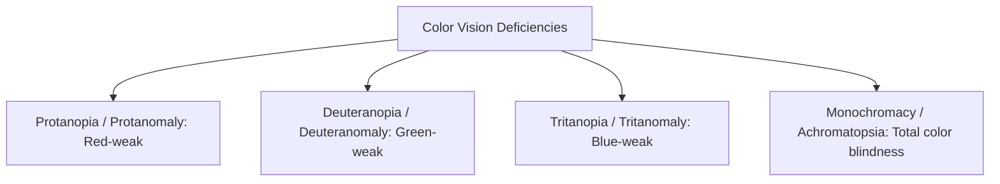

# Color Contrast & Visual Accessibility Architecture Guide

> Comprehensive architectural guide to WCAG color contrast formulas, APCA (Advanced Perceptual Contrast Algorithm), Windows Forced Colors Mode, and color vision deficiency systems.

---

## Table of Contents

- [Color Contrast \& Visual Accessibility Architecture Guide](#color-contrast--visual-accessibility-architecture-guide)
  - [Table of Contents](#table-of-contents)
  - [1. Mathematical Foundations \& Contrast Ratios](#1-mathematical-foundations--contrast-ratios)
  - [2. WCAG 2.1 / 2.2 Conformance Thresholds](#2-wcag-21--22-conformance-thresholds)
  - [3. APCA (Advanced Perceptual Contrast Algorithm - WCAG 3.0 Preview)](#3-apca-advanced-perceptual-contrast-algorithm---wcag-30-preview)
  - [4. Color Vision Deficiency (CVD) System Engineering](#4-color-vision-deficiency-cvd-system-engineering)
    - [The Cardinal Rule: Never Rely on Color Alone](#the-cardinal-rule-never-rely-on-color-alone)
  - [5. Windows High Contrast \& Forced Colors Mode](#5-windows-high-contrast--forced-colors-mode)
  - [6. Design System Token Architecture for Contrast](#6-design-system-token-architecture-for-contrast)

---

## 1. Mathematical Foundations & Contrast Ratios

WCAG 2.x calculates contrast as the ratio between the **Relative Luminance** ($L$) of two colors:

$$\text{Contrast Ratio} = \frac{L_1 + 0.05}{L_2 + 0.05}$$

- $L_1$ is the relative luminance of the lighter color ($0.0 \le L_1 \le 1.0$).
- $L_2$ is the relative luminance of the darker color ($0.0 \le L_2 \le 1.0$).
- $+0.05$ accounts for ambient light flare on physical displays.
- Range: **1:1** (identical colors) to **21:1** (pure black $\#000000$ on pure white $\#ffffff$).

---

## 2. WCAG 2.1 / 2.2 Conformance Thresholds


| UI Element Type                                                   | Minimum Level AA | Minimum Level AAA | Exceptions                                   |
| :---------------------------------------------------------------- | :--------------: | :---------------: | :------------------------------------------- |
| **Normal Body Copy**                                              |    **4.5:1**     |     **7.0:1**     | Inactive/disabled text, text in brand logos. |
| **Large Headings ($\ge 24\text{px}$ / $\ge 18.5\text{px}$ bold)** |    **3.0:1**     |     **4.5:1**     | Logos and wordmarks.                         |
| **Form Input Outlines & Borders**                                 |    **3.0:1**     |     **4.5:1**     | Inactive/disabled fields.                    |
| **Focus Visible Indicator Rings**                                 |    **3.0:1**     |     **4.5:1**     | Browser default unmodified indicators.       |
| **Graphical Data (Charts & Graphs)**                              |    **3.0:1**     |     **4.5:1**     | Purely decorative art.                       |

---

## 3. APCA (Advanced Perceptual Contrast Algorithm - WCAG 3.0 Preview)

WCAG 2.x math has a known flaw: it evaluates contrast symmetrically. In human vision, white text on black is perceived differently than black text on white due to spatial frequency and display halation.

```
┌─────────────────────────────────────────────────────────────────────────────┐
│                             APCA vs WCAG 2.x                                │
├─────────────────────────┬─────────────────────────┬─────────────────────────┤
│ Metric                  │ WCAG 2.x (Ratio)        │ APCA (WCAG 3.0 / Lc)    │
├─────────────────────────┼─────────────────────────┼─────────────────────────┤
│ Scale                   │ 1:1 to 21:1             │ Lc -108 to Lc +106      │
│ Polarity Aware?         │ ❌ No (Symmetric)       │ ✅ Yes (Light vs Dark)  │
│ Font Size / Weight Link │ ⚠️ Fixed 18pt threshold │ ✅ Continuous Curve     │
│ Spatial Frequency       │ ❌ Ignored              │ ✅ Factor in lightness  │
└─────────────────────────┴─────────────────────────┴─────────────────────────┘
```

---

## 4. Color Vision Deficiency (CVD) System Engineering

Over 8% of men and 0.5% of women have some form of Color Vision Deficiency.



### The Cardinal Rule: Never Rely on Color Alone

Any state conveyed by color must also be conveyed by **text**, **icons**, or **structural patterns**:

```tsx
// ❌ BAD: Error indicated ONLY by red border
<input className="border-red-500" />

// ✅ GOOD: Color + Error Icon + Accessible aria-describedby Error Text
<div className="form-field">
  <input
    className="border-red-500"
    aria-invalid="true"
    aria-describedby="email-error"
  />
  <span id="email-error" className="error-message">
    <AlertTriangleIcon aria-hidden="true" />
    Please enter a valid business email address.
  </span>
</div>
```

---

## 5. Windows High Contrast & Forced Colors Mode

When users enable Windows High Contrast Mode, the operating system overrides author CSS background colors, shadows, and text colors with system keyword colors (`Canvas`, `CanvasText`, `Highlight`, `ButtonFace`).

```css
/* Ensure borders and focus rings remain visible in Forced Colors Mode */
@media (forced-colors: active) {
  .card-container {
    /* Standard transparent border becomes visible in forced-colors mode */
    border: 1px solid CanvasText;
  }

  button:focus-visible {
    outline: 3px solid Highlight !important;
    outline-offset: 2px;
  }
}
```

---

## 6. Design System Token Architecture for Contrast

```css
:root {
  /* Light Theme - Verified >= 4.5:1 against #ffffff */
  --color-bg-canvas: #ffffff;
  --color-text-primary: #0f172a; /* 15.8:1 */
  --color-text-secondary: #475569; /* 5.9:1 */
  --color-border-input: #64748b; /* 3.4:1 */
  --color-focus-ring: #0284c7; /* 3.8:1 */
}

[data-theme='dark'] {
  /* Dark Theme - Verified >= 4.5:1 against #0f172a */
  --color-bg-canvas: #0f172a;
  --color-text-primary: #f8fafc; /* 15.6:1 */
  --color-text-secondary: #94a3b8; /* 6.3:1 */
  --color-border-input: #64748b; /* 3.2:1 */
  --color-focus-ring: #38bdf8; /* 9.1:1 */
}
```
