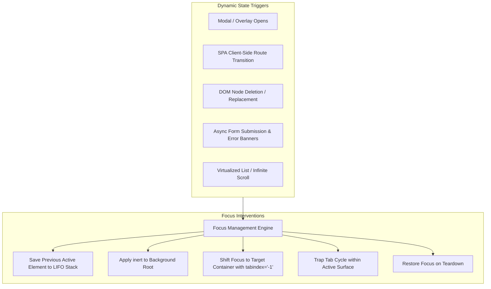
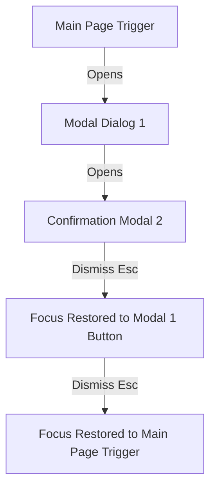
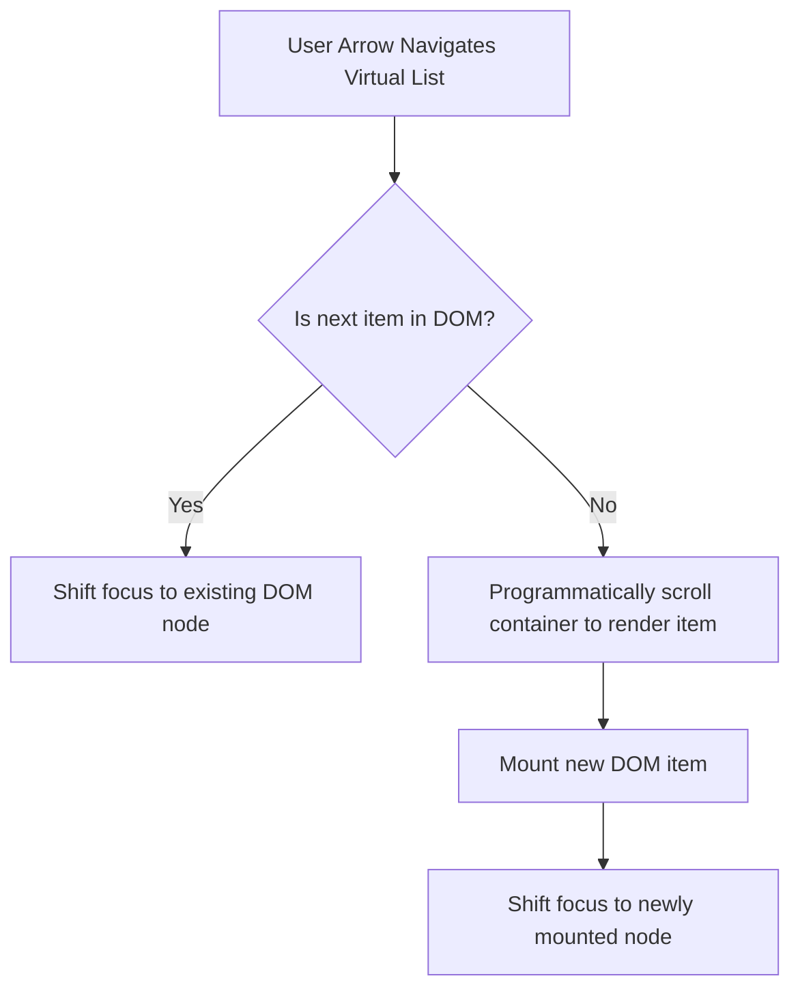

# Focus Management & Trapping Engineering Architecture

> "Focus management is the practice of controlling, preserving, and steering keyboard focus across dynamic DOM changes, view transitions, and overlay states in a web application."

---

## 1. Focus Management Architecture



---

## 2. The Focus History Stack (LIFO Pattern)

In modern enterprise applications, overlays can stack hierarchically (e.g., Page $\rightarrow$ Modal Dialog $\rightarrow$ Confirmation Alert $\rightarrow$ Date Picker Popover).



### TypeScript Focus Stack Manager

```typescript
class FocusHistoryManager {
  private stack: HTMLElement[] = [];

  public pushCurrentFocus(): void {
    if (document.activeElement instanceof HTMLElement) {
      this.stack.push(document.activeElement);
    }
  }

  public popAndRestore(): void {
    const previousElement = this.stack.pop();
    if (previousElement && document.body.contains(previousElement)) {
      previousElement.focus();
    }
  }

  public clear(): void {
    this.stack = [];
  }
}

export const focusStack = new FocusHistoryManager();
```

---

## 3. SPA Route Transitions & Focus Reset

In client-side Single Page Applications (React Router, Next.js, Vue Router), page transitions do not trigger a browser reload. If focus is not explicitly managed, the user remains focused on the unmounted link or focus drops back to `document.body`.

### The Route Announcer & Focus Shift Pattern

```tsx
import { useEffect, useRef } from 'react';
import { useLocation } from 'react-router-dom';

export function RouteFocusManager({ pageTitle }: { pageTitle: string }) {
  const location = useLocation();
  const announcerRef = useRef<HTMLDivElement>(null);

  useEffect(() => {
    // 1. Update Document Title
    document.title = `${pageTitle} | Enterprise Portal`;

    // 2. Announce route change to Screen Readers
    if (announcerRef.current) {
      announcerRef.current.textContent = `Navigated to ${pageTitle}`;
    }

    // 3. Move focus to primary main heading or main landmark
    const mainHeading = document.querySelector<HTMLElement>('main h1') || document.querySelector<HTMLElement>('main');
    if (mainHeading) {
      mainHeading.setAttribute('tabindex', '-1');
      mainHeading.focus({ preventScroll: false });
    }
  }, [location.pathname, pageTitle]);

  return (
    <div
      ref={announcerRef}
      role="status"
      aria-live="polite"
      aria-atomic="true"
      className="sr-only"
    />
  );
}
```

```css
/* Accessible Screen Reader Only utility class */
.sr-only {
  position: absolute;
  width: 1px;
  height: 1px;
  padding: 0;
  margin: -1px;
  overflow: hidden;
  clip: rect(0, 0, 0, 0);
  white-space: nowrap;
  border-width: 0;
}
```

---

## 4. The HTML `inert` Attribute

The native `inert` HTML attribute provides a modern, performant alternative to manually setting `tabindex="-1"` and `aria-hidden="true"` across dozens of background nodes.

When `inert` is applied to an element:
1. All focusable children are completely removed from sequential keyboard tab order.
2. Pointer and click events are blocked.
3. The element and its subtree are hidden from the **Accessibility Tree (AccTree)**.
4. User text selection within the element is disabled.

```html
<!-- Background app shell is inert during active modal -->
<div id="app-shell" inert>
  <header>...</header>
  <nav>...</nav>
  <main>...</main>
</div>

<!-- Modal portal is rendered as a sibling outside inert container -->
<div role="dialog" aria-modal="true" aria-labelledby="modal-heading">
  <h2 id="modal-heading">Security Confirmation</h2>
  <button type="button">Confirm</button>
</div>
```

---

## 5. Virtualized Lists & Infinite Feeds Focus Strategy

In virtualized lists (e.g. `react-window`, `react-virtualized`), DOM elements are dynamically unmounted and mounted as the user scrolls.



### Virtual Focus Best Practices:
1. **Container Navigation:** Use `aria-activedescendant` on the scrollable container rather than moving physical DOM focus. This prevents DOM unmounting race conditions.
2. **Item Count Announcement:** Provide live announcements indicating the position: `aria-setsize="5000"` and `aria-posinset="42"`.
3. **Scroll Anchoring:** When unmounting the currently focused DOM node, proactively shift focus to the nearest visible sibling before the element is destroyed.
