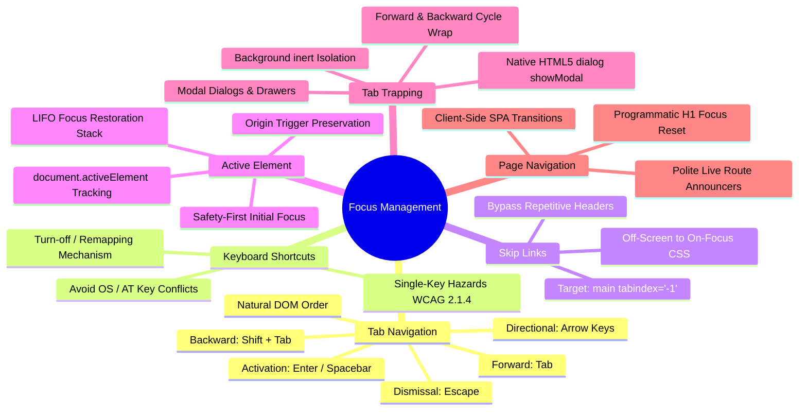

# Focus Management & Trapping Engineering Architecture

> "Focus management is the practice of controlling, preserving, and steering keyboard focus across dynamic DOM changes, view transitions, and overlay states in a web application."

---

## 1.Mindmap: The 6 Pillars of Focus Management

Focus management is not a single feature; it encompasses 6 core architectural pillars required for complete keyboard and screen reader operability:



---

## 2. Native Default Focusable Elements vs Custom `tabindex`

Browsers natively support keyboard focus on specific interactive HTML elements out of the box. These elements require **zero custom JavaScript** and automatically expose standard roles, accessible states, and keyboard event handlers (<kbd>Enter</kbd> / <kbd>Space</kbd>) to the Accessibility Tree (AccTree).

### Native Elements with Default Keyboard Focus:

| Native HTML Tag                             | Why it Naturally Receives Focus                                                                              | Default Keyboard Triggers                                                                   |
| :------------------------------------------ | :----------------------------------------------------------------------------------------------------------- | :------------------------------------------------------------------------------------------ |
| **`<a href="...">`**                        | Interactive hyperlink pointing to a valid URL/fragment. _(Note: `<a>` without `href` is **not** focusable!)_ | <kbd>Enter</kbd> (Navigates to URL)                                                         |
| **`<button type="button\|submit\|reset">`** | Interactive action trigger.                                                                                  | <kbd>Enter</kbd> and <kbd>Space</kbd> (Fires `click`)                                       |
| **`<input type="...">`**                    | Text fields, checkboxes, radios, range sliders, file pickers.                                                | Text entry, <kbd>Space</kbd> (Toggles checkbox), <kbd>Arrows</kbd> (Radio/Slider)           |
| **`<select>`**                              | Dropdown option picker.                                                                                      | <kbd>Space</kbd> / <kbd>Enter</kbd> (Opens dropdown), <kbd>Arrows</kbd> (Traverses options) |
| **`<textarea>`**                            | Multi-line text input field.                                                                                 | Multi-line typing, <kbd>Tab</kbd> moves out                                                 |
| **`<iframe>`**                              | Embedded child browsing context.                                                                             | Focus moves inside iframe frame                                                             |
| **`<details>` / `<summary>`**               | Native disclosure widget.                                                                                    | <kbd>Space</kbd> / <kbd>Enter</kbd> (Expands/collapses panel)                               |
| **`<audio controls>`, `<video controls>`**  | Native media players with controls.                                                                          | <kbd>Space</kbd> (Play/Pause), <kbd>Arrows</kbd> (Seek/Volume)                              |
| **`[contenteditable="true"]`**              | Rich-text editable DOM container.                                                                            | Direct text typing and caret navigation                                                     |

```
┌─────────────────────────────────────────────────────────────────────────────┐
│                       The 1st Rule of Focus Engineering                     │
│                                                                             │
│  "ALWAYS prefer native focusable elements (<button>, <a href>, <input>)     │
│   over custom <div tabindex="0"> elements. Native elements give you free    │
│   keyboard dispatch, focus outlines, and screen reader announcements."      │
└─────────────────────────────────────────────────────────────────────────────┘
```

---

## 3. The `tabindex` Master Matrix: When, How, and Pitfalls

The `tabindex` attribute modifies an element's participation in the sequential keyboard tab sequence and allows or disallows programmatic focus via JavaScript.

```
                   ┌──────────────────────────────────────────────────┐
                   │                 tabindex Values                  │
                   └────────────────────────┬─────────────────────────┘
                                            │
          ┌─────────────────────────────────┼────────────────────────────────┐
          ▼                                 ▼                                ▼
 ┌─────────────────┐               ┌──────────────────┐            ┌──────────────────┐
 │  tabindex="0"   │               │  tabindex="-1"   │            │ tabindex="1,2,3" │
 │  (Natural Order)│               │  (Programmatic)  │            │ (ANTI-PATTERN ❌)│
 ├─────────────────┤               ├──────────────────┤            ├──────────────────┤
 │• Focusable via  │               │• EXCLUDED from   │            │• Jumps ahead of  │
 │  keyboard Tab   │               │  keyboard Tab    │            │  natural DOM tree│
 │• Follows DOM pos│               │• Focusable via JS│            │• Creates chaotic │
 │• For custom UI  │               │  element.focus() │            │  focus traps     │
 └─────────────────┘               └──────────────────┘            └──────────────────┘
```

### Detailed Breakdown by Value:

| Value                                      | Behavior                                                                                                                                     | When to Use ✅                                                                                                                                                                                                                                                             | When NOT to Use / Pitfalls ❌                                                                                                                                                                                            |
| :----------------------------------------- | :------------------------------------------------------------------------------------------------------------------------------------------- | :------------------------------------------------------------------------------------------------------------------------------------------------------------------------------------------------------------------------------------------------------------------------- | :----------------------------------------------------------------------------------------------------------------------------------------------------------------------------------------------------------------------- |
| **`tabindex="0"`**                         | Inserts an otherwise non-interactive element into the **sequential keyboard tab order** following its exact DOM position.                    | • Custom interactive widgets (when native tags cannot be used).<br>• Scrollable containers (`overflow: auto`) so keyboard users can scroll with Arrow keys.                                                                                                                | • **Never put on native focusable tags** (`<button tabindex="0">` is redundant).<br>• Do not add to `<div>`/`<span>` without attaching `role="button"` and `onKeyDown` handlers for <kbd>Enter</kbd> / <kbd>Space</kbd>. |
| **`tabindex="-1"`**                        | **Removes** the element from the sequential `Tab` sequence, but allows it to be focused programmatically via JavaScript (`element.focus()`). | • Modal / Dialog container targets.<br>• SPA Page Headings (`<h1 tabindex="-1">`).<br>• **Skip Link targets** (`<main id="main" tabindex="-1">`).<br>• Inactive items in Roving `tabindex` widgets (Tabs, Menus).<br>• Temporarily removing native buttons from Tab order. | • Do not place on primary interactive links or submit buttons that users need to reach via normal `Tab` navigation.                                                                                                      |
| **`tabindex > 0`** _(Positive: `1, 2, 5`)_ | **Forces artificial focus priority**, jumping ahead of the natural DOM order.                                                                | • **NEVER (0% of the time).**                                                                                                                                                                                                                                              | • **CRITICAL HAZARD:** Violates WCAG 2.4.3. Causes focus to jump erratically across headers, navigation, and footer. Highly fragile in component-based apps.                                                             |

---

## 4. Tab Navigation Mechanics & Standard Key Result Table

Keyboard navigation follows strict W3C WAI-ARIA and browser conventions. Sighted keyboard users, screen reader users, and motor-impaired users rely on these standardized key actions:

| Key Combination                                                         | Result & Browser Behavior                                     | Standard UI Application                                                               |
| :---------------------------------------------------------------------- | :------------------------------------------------------------ | :------------------------------------------------------------------------------------ |
| <kbd>Tab</kbd>                                                          | Moves focus **forward** to the next focusable active element. | Sequential form filling, moving across page links.                                    |
| <kbd>Shift</kbd> + <kbd>Tab</kbd>                                       | Moves focus **backward** to the previous active element.      | Correcting a previous form field, navigating in reverse.                              |
| <kbd>Arrow Keys</kbd> ($\uparrow, \downarrow, \leftarrow, \rightarrow$) | Cycles through related controls within a composite widget.    | Radio button groups, Tab lists, Menus, Combobox suggestion lists, Sliders.            |
| <kbd>Spacebar</kbd>                                                     | Toggles interactive states and scrolls down the page.         | Toggling checkboxes/switches, pressing buttons, scrolling viewport when body focused. |
| <kbd>Shift</kbd> + <kbd>Spacebar</kbd>                                  | Moves up the viewport page.                                   | Page scrolling without mouse wheel.                                                   |
| <kbd>Enter</kbd>                                                        | Triggers specific primary controls.                           | Submitting forms, activating links (`<a href>`), firing buttons.                      |
| <kbd>Escape</kbd>                                                       | **Dismisses dynamically displayed objects**.                  | Closing modals, flyout drawers, dropdown menus, context popovers, tooltips.           |

---

## 5. Keyboard Shortcuts & WCAG 2.1.4 Compliance

Single-key shortcuts (e.g., pressing <kbd>1</kbd> to delete, or <kbd>J</kbd>/<kbd>K</kbd> to scroll) pose significant hazards for users of speech input software (like Dragon NaturallySpeaking) or users with motor tremors.

### WCAG 2.1.4 (Character Key Shortcuts) Mandate:

If a keyboard shortcut consists of a single letter, punctuation, number, or symbol character, at least one of the following must be true:

1. **Turn off:** A mechanism is provided to turn the shortcut off.
2. **Remap:** A mechanism is provided to remap the shortcut to include one or more modifier keys (<kbd>Ctrl</kbd>, <kbd>Alt</kbd>, <kbd>Cmd</kbd>).
3. **Active Only on Focus:** The shortcut is only active when the relevant component has focus.

```typescript
// Safe Application Shortcut Handler:
function handleGlobalShortcut(e: KeyboardEvent) {
  // Avoid single-key shortcuts when user is typing in an input/textarea
  const target = e.target as HTMLElement;
  if (target.matches('input, textarea, [contenteditable="true"]')) {
    return;
  }

  // Prefer modifier combinations (Ctrl/Cmd + Key)
  if ((e.ctrlKey || e.metaKey) && e.key === 'k') {
    e.preventDefault();
    openCommandPalette();
  }
}
```

---

## 6. Skip Links: Bypassing Repetitive Header Links

A **Skip Link** ("Skip to main content") is the very first interactive element in the `<body>`. It allows keyboard users to bypass long lists of header navigation links (which can have 20–50 links) and jump straight to the primary content in one keystroke.

```
┌─────────────────────────────────────────────────────────────┐
│ [Skip to main content] (Pops into view on first Tab press)  │
└─────────────────────────────────────────────────────────────┘
  ▼ (User presses Enter on Skip Link)
┌─────────────────────────────────────────────────────────────┐
│ Header Navigation (25 links bypassed)                       │
└─────────────────────────────────────────────────────────────┘
  ▼
┌─────────────────────────────────────────────────────────────┐
│ <main id="main-content" tabindex="-1"> (Focus Lands Here)   │
│   <h1>Dashboard Overview</h1>                               │
└─────────────────────────────────────────────────────────────┘
```

### Production Skip Link Implementation:

```html
<body>
  <!-- 1. Must be the FIRST focusable element inside <body> -->
  <a href="#main-content" class="skip-link">Skip to main content &darr;</a>

  <header>
    <nav>
      <!-- Dozens of navigation links -->
    </nav>
  </header>

  <!-- 2. Target container with tabindex="-1" so it receives programmatic focus -->
  <main id="main-content" tabindex="-1">
    <h1>Main Dashboard</h1>
    <!-- Page content -->
  </main>
</body>
```

```css
/* Off-screen to on-focus CSS technique */
.skip-link {
  position: absolute;
  top: -999px;
  left: 1rem;
  background: #f59e0b;
  color: #0f172a;
  padding: 0.75rem 1.25rem;
  font-weight: 700;
  border-radius: 6px;
  z-index: 10000;
  text-decoration: none;
  transition: top 0.2s ease-in-out;
}

/* Pops into view ONLY when focused by keyboard */
.skip-link:focus-visible {
  top: 1rem;
  outline: 3px solid #ffffff;
  outline-offset: 2px;
}
```

---

## 7. Active Element (`document.activeElement`) & LIFO Focus Restoration

When an overlay (modal dialog, slide-out drawer, context menu) opens:

1. The application **must record the currently active element** (`const currentItem = document.activeElement;`).
2. When the overlay is dismissed, focus **must be programmatically returned** to `currentItem.focus()`.

```javascript
// Step 1: A modal is about to be opened
// Store the current trigger / active element
const currentItem = document.activeElement;

// Step 2: Open the modal and trap focus inside
openModal();

// Step 3: On modal close (via Escape, Cancel, or Submit)
// Refocus on the original item they had open
function handleModalClose() {
  closeModal();
  if (currentItem && document.body.contains(currentItem)) {
    currentItem.focus();
  }
}
```

### Multi-Layer LIFO (Last-In-First-Out) Focus Stack Manager:

```typescript
class FocusHistoryManager {
  private stack: HTMLElement[] = [];

  public pushCurrentFocus(): void {
    if (document.activeElement instanceof HTMLElement) {
      this.stack.push(document.activeElement);
    }
  }

  public popAndRestore(): void {
    const previousElement = this.stack.pop();
    if (previousElement && document.body.contains(previousElement)) {
      previousElement.focus();
    }
  }

  public clear(): void {
    this.stack = [];
  }
}

export const focusStack = new FocusHistoryManager();
```

---

## 8. Tab Trapping in Modal Dialogs & Background Isolation

> **Core Invariant:** If a modal is open, **keyboard focus must always stay trapped inside the modal**. The user must never be able to <kbd>Tab</kbd> into background page elements.

```
             ┌────────────────────────────────────────────────┐
             │                  Window Root                   │
             │                                                │
             │   ┌────────────────────────────────────────┐   │
             │   │ App Root Container (#app-shell)        │   │
             │   │ [inert] when modal is open!            │   │
             │   └────────────────────────────────────────┘   │
             │                                                │
             │   ┌────────────────────────────────────────┐   │
             │   │ Modal Dialog Portal                    │   │
             │   │ • role="dialog" aria-modal="true"      │   │
             │   │ • Initial focus on Cancel button       │   │
             │   │ • Tab wraps: Last ──▶ First            │   │
             │   │ • Shift+Tab wraps: First ──▶ Last      │   │
             │   │ • Esc closes & restores trigger focus  │   │
             │   └────────────────────────────────────────┘   │
             └────────────────────────────────────────────────┘
```

### Modal Trapping Lifecycle Checklist:

1. **Save Trigger:** `focusStack.pushCurrentFocus()`.
2. **Isolate Background:** Set `inert` attribute on `#app-shell`.
3. **Safety-First Initial Focus:** Focus the **Cancel** button (or the dialog heading `<h2 tabindex="-1">`) so pressing <kbd>Space</kbd>/<kbd>Enter</kbd> doesn't accidentally trigger a destructive "Delete" action.
4. **Cyclic Tab Trap:**
   - On <kbd>Tab</kbd> from last focusable element $\rightarrow$ wrap to first focusable element.
   - On <kbd>Shift</kbd> + <kbd>Tab</kbd> from first focusable element $\rightarrow$ wrap to last focusable element.
5. **Escape Key:** Listen for `e.key === 'Escape'` to close the dialog.
6. **Focus Restoration:** Remove `inert` from background and call `focusStack.popAndRestore()`.

---

## 9. Page Navigation in Single Page Applications (SPAs)

In client-side SPAs (React Router, Next.js, Vue Router), route transitions occur without a full page reload. If unmanaged, the user remains stranded on the unmounted link or focus resets abruptly to `document.body`.

### The Route Announcer & Focus Shift Pattern:

```tsx
import { useEffect, useRef } from 'react';
import { useLocation } from 'react-router-dom';

export function RouteFocusManager({ pageTitle }: { pageTitle: string }) {
  const location = useLocation();
  const announcerRef = useRef<HTMLDivElement>(null);

  useEffect(() => {
    // 1. Update Document Title
    document.title = `${pageTitle} | Enterprise Portal`;

    // 2. Announce route change to Screen Readers
    if (announcerRef.current) {
      announcerRef.current.textContent = `Navigated to ${pageTitle}`;
    }

    // 3. Move focus to primary main heading
    const mainHeading = document.querySelector<HTMLElement>('main h1') || document.querySelector<HTMLElement>('main');
    if (mainHeading) {
      mainHeading.setAttribute('tabindex', '-1');
      mainHeading.focus({ preventScroll: false });
    }
  }, [location.pathname, pageTitle]);

  return <div ref={announcerRef} role="status" aria-live="polite" aria-atomic="true" className="sr-only" />;
}
```

---

## 10. Interactive Testbeds in Repository

To test these focus management patterns in live, zero-dependency browser testbeds with real-time event HUDs:

| Demo File                                                                                                                                                               | Core Focus Pattern Tested                                                                             |
| :---------------------------------------------------------------------------------------------------------------------------------------------------------------------- | :---------------------------------------------------------------------------------------------------- |
| [**`02-keyboard-navigation-and-skip-links.html`**](file:///Users/atulkumarawasthi/projects/SystemDesign/Accessibility/demos/02-keyboard-navigation-and-skip-links.html) | Skip links, `tabindex="0"` vs `"-1"`, `:focus-visible` styling, keyboard event inspector.             |
| [**`03-modal-focus-trap-and-inert.html`**](file:///Users/atulkumarawasthi/projects/SystemDesign/Accessibility/demos/03-modal-focus-trap-and-inert.html)                 | Modal cyclic focus trapping, background `inert`, safety-first focus, Escape key, trigger restoration. |
| [**`04-roving-tabindex-tabs.html`**](file:///Users/atulkumarawasthi/projects/SystemDesign/Accessibility/demos/04-roving-tabindex-tabs.html)                             | WAI-ARIA Tabs pattern with single tab-stop and Arrow key Roving `tabindex`.                           |
| [**`05-virtual-focus-combobox.html`**](file:///Users/atulkumarawasthi/projects/SystemDesign/Accessibility/demos/05-virtual-focus-combobox.html)                         | Virtual focus management with `aria-activedescendant` during search filtering.                        |
| [**`index.html` (Master Hub)**](file:///Users/atulkumarawasthi/projects/SystemDesign/Accessibility/demos/index.html)                                                    | Master launcher for all 8 standalone accessibility testbeds.                                          |
