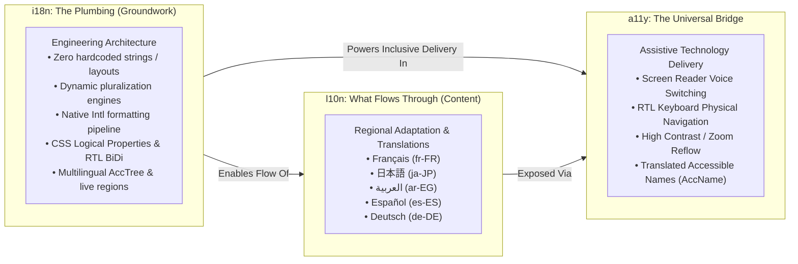
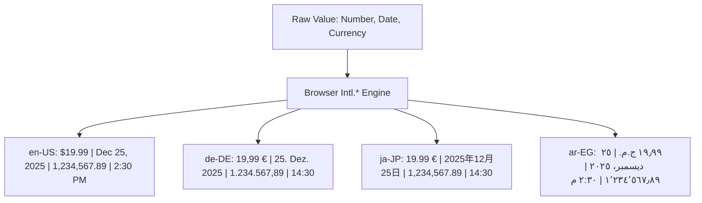
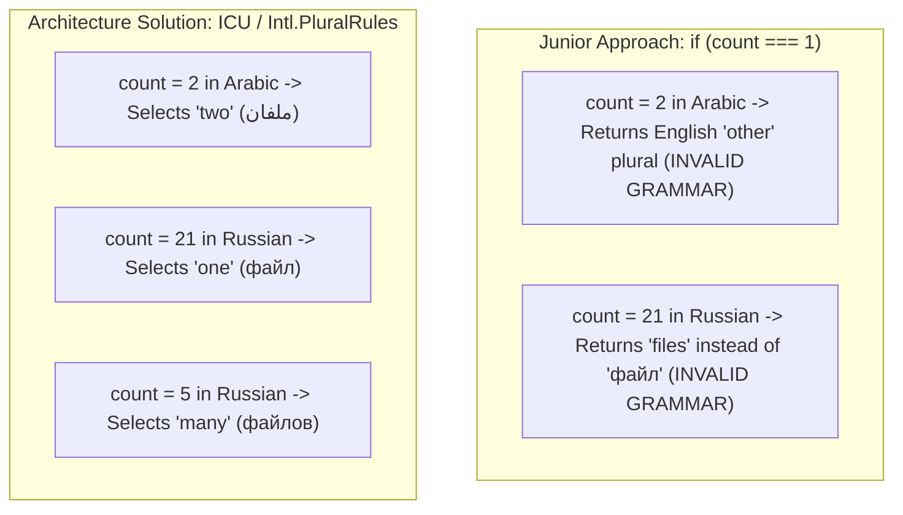
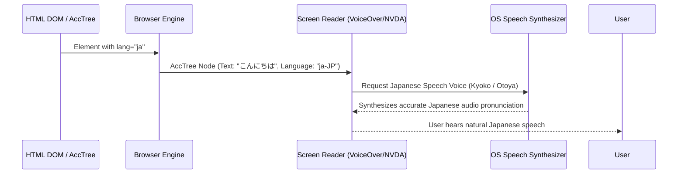
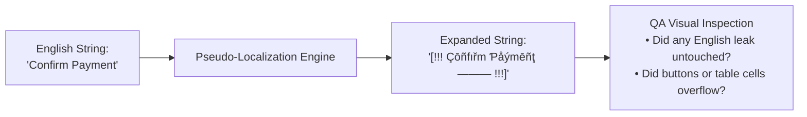

# Web Accessibility (a11y), Internationalization (i18n) & Localization (l10n) Master Architectural Reference

> "Build it so it can speak any language, format any locale, and adapt to any physical ability — without a single rewrite."
>
> A master guide connecting **Web Accessibility (a11y)**, **Internationalization (i18n)**, **Localization (l10n)**, **Native `Intl.*` APIs**, **Pluralization Architectures**, **Bidirectional (RTL/BiDi) UX**, and **Screen Reader AccTree Language Engine Synchronization**.

---

## 🧭 Executive Overview: The Numeronyms & Core Mental Model

### Why Does Everyone Write "i18n", "a11y", and "l10n"?

Engineers are lazy typists — numeronyms replace long words with their first letter, the count of omitted letters in between, and the last letter:

```
  i ─── [ 18 letters: nternationalizatio ] ─── n  ==>  i18n (Internationalization)
  a ─── [ 11 letters: ccessibilit        ] ─── y  ==>  a11y (Accessibility)
  l ─── [ 10 letters: ocalizatio         ] ─── n  ==>  l10n (Localization)
  m ─── [ 17 letters: ultilingualizatio  ] ─── n  ==>  m17n (Multilingualization)
  g ─── [ 11 letters: lobalizatio        ] ─── n  ==>  g11n (Globalization)
```



> **The Architectural Law:**
> **"i18n is the plumbing. l10n is what flows through it. a11y ensures everyone can use it."**

---

## ⚖️ i18n vs l10n: When & Which to Use (The Ultimate Breakdown)

> **Why do most developers just say "i18n" directly?**  
> Developers casually say "i18n" as an umbrella term for the whole multilingual system. However, in enterprise architecture, confusing i18n with l10n leads to bloated bundles, hardcoded strings, and organizational friction.

```
┌─────────────────────────────────────────────────────────────────────────────────────────────┐
│                       i18n vs l10n vs g11n vs m17n Decision Matrix                          │
├───────────────────┬───────────────────────────────────┬─────────────────────────────────────┤
│ Dimension         │ 🌐 i18n (Internationalization)    │ 📍 l10n (Localization)              │
├───────────────────┼───────────────────────────────────┼─────────────────────────────────────┤
│ **Definition**    │ Designing software architecture so│ Adapting product content, strings,  │
│                   │ it CAN support any language or    │ and regional rules for one SPECIFIC │
│                   │ locale without code modification. │ market (e.g. `ja-JP` or `ar-EG`).   │
├───────────────────┼───────────────────────────────────┼─────────────────────────────────────┤
│ **Metaphor**      │ **The Plumbing & Pipes**          │ **The Water Flowing Through Pipes** │
├───────────────────┼───────────────────────────────────┼─────────────────────────────────────┤
│ **Who Owns It?**  │ **Frontend & Systems Engineers**  │ **Translators, Copywriters & PMs**  │
├───────────────────┼───────────────────────────────────┼─────────────────────────────────────┤
│ **Cadence**       │ Built **once** on Day 1.          │ Continuous & ongoing per release.   │
├───────────────────┼───────────────────────────────────┼─────────────────────────────────────┤
│ **Deliverables**  │ • Zero hardcoded strings / layouts│ • `locales/ja.json`, `ar.json`      │
│                   │ • `t()` hooks & formatters        │ • Translated legal agreements       │
│                   │ • `Intl.*` formatting pipelines   │ • Localized product images / media  │
│                   │ • Dynamic bundle code-splitting   │ • Currency conversion & tax rates   │
│                   │ • CSS Logical properties (RTL)    │ • Culturally adapted color palettes │
├───────────────────┼───────────────────────────────────┼─────────────────────────────────────┤
│ **Related Terms** │ • **g11n (Globalization):** The macro business strategy combining i18n + l10n. │
│                   │ • **m17n (Multilingualization):** Supporting multiple scripts simultaneously.    │
└───────────────────┴───────────────────────────────────┴─────────────────────────────────────┘
```

### When to Use Which Term in System Design Discussions:

1. **Say "i18n" when talking about Engineering & Infrastructure:**
   - *"We need to set up i18n extraction in our CI pipeline."*
   - *"Our i18n layer dynamically splits translation chunks by route."*
   - *"We use CSS logical properties for i18n bidirectional layout support."*

2. **Say "l10n" when talking about Content, Translation & Regional Assets:**
   - *"Our French l10n team updated the checkout legal disclaimer."*
   - *"We sent the new feature strings to our TMS for Japanese l10n."*
   - *"We need local currency formatting for our German l10n rollout."*


---

## Table of Contents

- [Web Accessibility (a11y), Internationalization (i18n) \& Localization (l10n) Master Architectural Reference](#web-accessibility-a11y-internationalization-i18n--localization-l10n-master-architectural-reference)
  - [🧭 Executive Overview: The Numeronyms \& Core Mental Model](#-executive-overview-the-numeronyms--core-mental-model)
    - [Why Does Everyone Write "i18n", "a11y", and "l10n"?](#why-does-everyone-write-i18n-a11y-and-l10n)
  - [Table of Contents](#table-of-contents)
  - [1. The Native Browser `Intl.*` Engine: "One Value. Four Equally Correct Answers."](#1-the-native-browser-intl-engine-one-value-four-equally-correct-answers)
    - [Global Formatting Matrix: `en-US` vs `de-DE` vs `ja-JP` vs `ar-EG`](#global-formatting-matrix-en-us-vs-de-de-vs-ja-jp-vs-ar-eg)
    - [The Production `Intl.*` Formatter Suite (Zero Dependencies)](#the-production-intl-formatter-suite-zero-dependencies)
  - [2. The Pluralization Law: `"1 item / 2 items" is an English Assumption`](#2-the-pluralization-law-1-item--2-items-is-an-english-assumption)
    - [Global Plural Category Spectrum](#global-plural-category-spectrum)
    - [Why Binary Ternary Operators Break in Production](#why-binary-ternary-operators-break-in-production)
    - [Solving Pluralization with `Intl.PluralRules` \& ICU MessageFormat](#solving-pluralization-with-intlpluralrules--icu-messageformat)
  - [3. The a11y + i18n Intersection: Screen Reader AccTree Language Engine](#3-the-a11y--i18n-intersection-screen-reader-acctree-language-engine)
    - [The `lang` Attribute: Triggering OS Text-to-Speech Engine Voice Switching](#the-lang-attribute-triggering-os-text-to-speech-engine-voice-switching)
    - [Inline Language Shifts (`<span lang="...">`)](#inline-language-shifts-span-lang)
    - [Accessible Name Computation (AccName 1.2) in Multilingual Applications](#accessible-name-computation-accname-12-in-multilingual-applications)
  - [4. Bidirectional (BiDi) \& Right-to-Left (RTL) Accessibility Architecture](#4-bidirectional-bidi--right-to-left-rtl-accessibility-architecture)
    - [The Document Directionality Hierarchy (`dir="rtl"`, `dir="ltr"`, `dir="auto"`)](#the-document-directionality-hierarchy-dirrtl-dirltr-dirauto)
    - [CSS Logical Properties vs Physical Properties Matrix](#css-logical-properties-vs-physical-properties-matrix)
    - [Keyboard Traversal in RTL (Roving `tabIndex` \& APG Widgets)](#keyboard-traversal-in-rtl-roving-tabindex--apg-widgets)
    - [The Icon Mirroring Decision Protocol: Which Icons Flip vs Never Flip?](#the-icon-mirroring-decision-protocol-which-icons-flip-vs-never-flip)
  - [5. Dynamic Live Announcements \& Forms in Multilingual Systems](#5-dynamic-live-announcements--forms-in-multilingual-systems)
    - [Live Regions (`aria-live`) with Localized Templates](#live-regions-aria-live-with-localized-templates)
    - [Form Validation Errors \& Accessible Descriptions](#form-validation-errors--accessible-descriptions)
  - [6. Enterprise Linting, Automation \& CI/CD Quality Gates](#6-enterprise-linting-automation--cicd-quality-gates)
    - [ESLint Rules for i18n + a11y (`@formatjs` + `eslint-plugin-jsx-a11y`)](#eslint-rules-for-i18n--a11y-formatjs--eslint-plugin-jsx-a11y)
    - [Pseudo-Localization: Catching Hardcoded Strings \& UI Clipping in QA](#pseudo-localization-catching-hardcoded-strings--ui-clipping-in-qa)
  - [7. Architecture Deep-Dive: Dynamic Locale \& Namespace Code Splitting](#7-architecture-deep-dive-dynamic-locale--namespace-code-splitting)
    - [The 3 Core Library Options for Modern Frontend Stacks](#the-3-core-library-options-for-modern-frontend-stacks)
    - [Implementation: Lazy-Loading per Locale AND Namespace with `react-i18next`](#implementation-lazy-loading-per-locale-and-namespace-with-react-i18next)
    - [Page-Level Lazy Loading (e.g., Tokyo User entering Checkout)](#page-level-lazy-loading-eg-tokyo-user-entering-checkout)
  - [8. Staff / Principal Architect Interview Grill \& Scenario Challenges](#8-staff--principal-architect-interview-grill--scenario-challenges)
    - [Q1: How do you architect a high-scale design system that supports 40+ locales (including RTL) and WCAG 2.2 Level AA compliance?](#q1-how-do-you-architect-a-high-scale-design-system-that-supports-40-locales-including-rtl-and-wcag-22-level-aa-compliance)
    - [Q2: Why does `aria-label="Welcome"` fail a Spanish or Arabic screen reader user even if Google Translate is active on the page?](#q2-why-does-aria-labelwelcome-fail-a-spanish-or-arabic-screen-reader-user-even-if-google-translate-is-active-on-the-page)
    - [Q3: Scenario: A user opens your web app in Tokyo. Describe the network request waterfall for internationalization assets and how English fallback is maintained.](#q3-scenario-a-user-opens-your-web-app-in-tokyo-describe-the-network-request-waterfall-for-internationalization-assets-and-how-english-fallback-is-maintained)

---

## 1. The Native Browser `Intl.*` Engine: "One Value. Four Equally Correct Answers."

**The Golden Architectural Rule:**

> **"Never hand-roll date, number, currency, or time formatting. The browser already knows the rules."**

Hand-rolling number/currency formats using regex (`num.toString().replace(/\B(?=(\d{3})+(?!\d))/g, ",")`) or custom string splits is an anti-pattern. It creates broken formatting for over 4 billion users worldwide who use different comma/period conventions, currency placements, calendar systems, and numeral glyphs.

```
┌─────────────────────────────────────────────────────────────────────────────┐
│                       One Value. Four Equally Correct Answers.              │
│                                                                             │
│  Value: Amount = 19.99 EUR, Date = 2025-12-25, Number = 1234567.89          │
├──────────────┬────────────────────────┬─────────────────────────────────────┤
│  Locale      │ Formatted Output       │ Cultural Details                    │
├──────────────┼────────────────────────┼─────────────────────────────────────┤
│  en-US       │ Currency: €19.99       │ Dot decimal, comma thousands        │
│  (USA)       │ Date: Dec 25, 2025     │ Month-Day-Year order                │
│              │ Number: 1,234,567.89   │ Western Arabic digits               │
│              │ Time: 2:30 PM          │ 12-hour clock with AM/PM            │
├──────────────┼────────────────────────┼─────────────────────────────────────┤
│  de-DE       │ Currency: 19,99 €      │ Comma decimal, period thousands     │
│  (Germany)   │ Date: 25. Dezember 2025│ Day. Month Year order               │
│              │ Number: 1.234.567,89   │ Suffix currency symbol              │
│              │ Time: 14:30            │ 24-hour clock                       │
├──────────────┼────────────────────────┼─────────────────────────────────────┤
│  ja-JP       │ Currency: ￥20 / 19.99€│ No minor subunit for JPY            │
│  (Japan)     │ Date: 2025年12月25日   │ Year-Month-Day order with kanji     │
│              │ Number: 1,234,567.89   │ Kanji date separators               │
│              │ Time: 14:30            │ 24-hour clock                       │
├──────────────┼────────────────────────┼─────────────────────────────────────┤
│  ar-EG       │ Currency: ١٩٫٩٩ ج.م.   │ Eastern Arabic numerals (١٢٣)       │
│  (Egypt)     │ Date: ٢٥ ديسمبر، ٢٠٢٥  │ Arabic month names, RTL script      │
│              │ Number: ١٬٢٣٤٬٥٦٧٫٨٩   │ Arabic decimal (٫) & thousands (٬)  │
│              │ Time: ٢:٣٠ م           │ RTL layout with Arabic 'م' for PM   │
└──────────────┴────────────────────────┴─────────────────────────────────────┘
```

### Global Formatting Matrix: `en-US` vs `de-DE` vs `ja-JP` vs `ar-EG`



### The Production `Intl.*` Formatter Suite (Zero Dependencies)

```ts
/**
 * Battle-tested, zero-dependency formatting suite leveraging the native ECMAScript Intl API.
 * High performance: Reuses formatter instances using a memoized LRU cache pattern.
 */
class IntlFormatterService {
  private static numberCache = new Map<string, Intl.NumberFormat>();
  private static dateCache = new Map<string, Intl.DateTimeFormat>();
  private static pluralCache = new Map<string, Intl.PluralRules>();
  private static relativeCache = new Map<string, Intl.RelativeTimeFormat>();
  private static listCache = new Map<string, Intl.ListFormat>();

  public static formatCurrency(amount: number, locale: string, currency: string): string {
    const key = `${locale}-${currency}`;
    if (!this.numberCache.has(key)) {
      this.numberCache.set(key, new Intl.NumberFormat(locale, { style: 'currency', currency }));
    }
    return this.numberCache.get(key)!.format(amount);
  }

  public static formatDate(
    date: Date | number,
    locale: string,
    dateStyle: 'full' | 'long' | 'medium' | 'short' = 'long',
  ): string {
    const key = `${locale}-${dateStyle}`;
    if (!this.dateCache.has(key)) {
      this.dateCache.set(key, new Intl.DateTimeFormat(locale, { dateStyle }));
    }
    return this.dateCache.get(key)!.format(date);
  }

  public static formatNumber(num: number, locale: string, options?: Intl.NumberFormatOptions): string {
    const key = `${locale}-${JSON.stringify(options || {})}`;
    if (!this.numberCache.has(key)) {
      this.numberCache.set(key, new Intl.NumberFormat(locale, options));
    }
    return this.numberCache.get(key)!.format(num);
  }

  public static formatRelativeTime(value: number, unit: Intl.RelativeTimeFormatUnit, locale: string): string {
    const key = `${locale}`;
    if (!this.relativeCache.has(key)) {
      this.relativeCache.set(key, new Intl.RelativeTimeFormat(locale, { numeric: 'auto' }));
    }
    return this.relativeCache.get(key)!.format(value, unit);
  }

  public static formatList(
    items: string[],
    locale: string,
    type: 'conjunction' | 'disjunction' = 'conjunction',
  ): string {
    const key = `${locale}-${type}`;
    if (!this.listCache.has(key)) {
      this.listCache.set(key, new Intl.ListFormat(locale, { style: 'long', type }));
    }
    return this.listCache.get(key)!.format(items);
  }

  public static getPluralCategory(count: number, locale: string): Intl.LDMLPluralRule {
    if (!this.pluralCache.has(locale)) {
      this.pluralCache.set(locale, new Intl.PluralRules(locale));
    }
    return this.pluralCache.get(locale)!.select(count);
  }
}
```

---

## 2. The Pluralization Law: `"1 item / 2 items" is an English Assumption`

### Global Plural Category Spectrum

Many frontend codebases contain the following flaw:

```ts
// 🚨 FATAL ANTI-PATTERN: Fails in 80% of world languages!
const label = `${count} ${count === 1 ? 'file' : 'files'}`;
```

The assumption that pluralization is a binary boolean (`count === 1`) is strictly an **English and Germanic language assumption**.

```
┌─────────────────────────────────────────────────────────────────────────────┐
│                          World Language Plural Categories                   │
├──────────────┬──────────────┬───────────────────────────────────────────────┤
│ Language     │ Plural Forms │ Categories Covered                            │
├──────────────┼──────────────┼───────────────────────────────────────────────┤
│ English,     │ 2 Forms      │ • one (1)                                     │
│ Spanish,     │              │ • other (0, 2, 3, 4, 100...)                  │
│ German       │              │                                               │
├──────────────┼──────────────┼───────────────────────────────────────────────┤
│ Arabic (ar)  │ 6 Forms      │ • zero (0)                                    │
│              │              │ • one (1)                                     │
│              │              │ • two (2 - dual form)                         │
│              │              │ • few (3-10)                                  │
│              │              │ • many (11-99)                                │
│              │              │ • other (100+)                                │
├──────────────┼──────────────┼───────────────────────────────────────────────┤
│ Russian (ru),│ 3-4 Forms    │ • one (1, 21, 31, 101...)                     │
│ Polish (pl), │              │ • few (2-4, 22-24, 102-104...)                │
│ Ukrainian    │              │ • many (5-20, 25-30, 105-120...)              │
│              │              │ • other (fractions: 1.5, 2.7...)              │
├──────────────┼──────────────┼───────────────────────────────────────────────┤
│ Japanese,    │ 1 Form       │ • other (all numbers share the exact same     │
│ Chinese,     │              │   noun form without grammatical inflections)  │
│ Korean       │              │                                               │
└──────────────┴──────────────┴───────────────────────────────────────────────┘
```

### Why Binary Ternary Operators Break in Production



> **The Plural Rule:**
> **"Let the library or `Intl.PluralRules` pick the form. Never write an `if (n === 1)`."**

### Solving Pluralization with `Intl.PluralRules` & ICU MessageFormat

```tsx
import React from 'react';
import { FormattedMessage } from 'react-intl';

// ✅ Enterprise ICU MessageFormat handling all 6 plural forms
export function UnreadNotificationBadge({ count }: { count: number }) {
  return (
    <span className="badge" role="status" aria-live="polite">
      <FormattedMessage
        id="notifications.unreadCount"
        defaultMessage="{count, plural, =0 {No unread notifications} one {# unread notification} other {# unread notifications}}"
        description="Plural badge label for unread user notifications"
        values={{ count }}
      />
    </span>
  );
}
```

---

## 3. The a11y + i18n Intersection: Screen Reader AccTree Language Engine

### The `lang` Attribute: Triggering OS Text-to-Speech Engine Voice Switching

When a screen reader (Apple VoiceOver, NVDA, JAWS, Google TalkBack) encounters DOM text, it **does not guess the language**. It inspects the computed `lang` attribute on the node or its closest ancestor.

- **If `<html lang="en">` has French text without `<span lang="fr">`:** The screen reader attempts to pronounce French words using an English phonetic pronunciation dictionary, resulting in completely unintelligible gibberish for blind users.
- **If `<span lang="fr">Bonjour le monde</span>` is present:** The screen reader immediately switches its Text-to-Speech (TTS) engine voice to French phonemes with native inflection.



### Inline Language Shifts (`<span lang="...">`)

```html
<!-- ✅ WCAG SC 3.1.2 (Language of Parts) Compliant Markup -->
<article lang="en">
  <h1>World Travel Guide</h1>
  <p>
    When visiting Tokyo, the most common greeting is
    <span lang="ja" hreflang="ja">こんにちは (Konnichiwa)</span>, while in Cairo you will hear
    <span lang="ar" dir="rtl">أهلاً وسهلاً (Ahlan wa Sahlan)</span>.
  </p>
</article>
```

### Accessible Name Computation (AccName 1.2) in Multilingual Applications

When providing accessible names (`aria-label`, `aria-labelledby`, `aria-describedby`), those strings **must also participate in the i18n translation extraction pipeline**.

```tsx
import React from 'react';
import { useIntl, defineMessages } from 'react-intl';

const messages = defineMessages({
  deleteAriaLabel: {
    id: 'actions.deleteItem.ariaLabel',
    defaultMessage: 'Delete project {projectName}',
    description: 'Accessible screen reader label for delete button',
  },
});

export function DeleteButton({ projectName, onDelete }: { projectName: string; onDelete: () => void }) {
  const intl = useIntl();

  return (
    <button
      type="button"
      onClick={onDelete}
      aria-label={intl.formatMessage(messages.deleteAriaLabel, { projectName })}
      className="icon-btn-danger"
    >
      <TrashIcon aria-hidden="true" />
    </button>
  );
}
```

---

## 4. Bidirectional (BiDi) & Right-to-Left (RTL) Accessibility Architecture

### The Document Directionality Hierarchy (`dir="rtl"`, `dir="ltr"`, `dir="auto"`)

Right-to-Left languages (Arabic, Hebrew, Persian/Farsi, Urdu) are spoken by over **600 million people**. Building for RTL is an essential requirement of international enterprise software.

```html
<!-- Set global direction on html tag dynamically on locale switch -->
<!DOCTYPE html>
<html lang="ar" dir="rtl">
  <head>
    <meta charset="utf-8" />
  </head>
  <body>
    <!-- Entire page layout mirrors from right to left -->
  </body>
</html>
```

### CSS Logical Properties vs Physical Properties Matrix

Never use physical directional CSS properties (`left`, `right`, `margin-left`, `padding-right`, `border-left`). Always use **CSS Logical Properties** which automatically flip axes based on the active `dir` attribute:

| Deprecated Physical Property | Modern CSS Logical Replacement    | Behavior in LTR (`dir="ltr"`) | Behavior in RTL (`dir="rtl"`) |
| :--------------------------- | :-------------------------------- | :---------------------------- | :---------------------------- |
| `margin-left: 16px;`         | `margin-inline-start: 16px;`      | Margin on Left                | **Margin on Right**           |
| `margin-right: 24px;`        | `margin-inline-end: 24px;`        | Margin on Right               | **Margin on Left**            |
| `padding-left: 12px;`        | `padding-inline-start: 12px;`     | Padding on Left               | **Padding on Right**          |
| `left: 0;`                   | `inset-inline-start: 0;`          | Anchored to Left              | **Anchored to Right**         |
| `right: 0;`                  | `inset-inline-end: 0;`            | Anchored to Right             | **Anchored to Left**          |
| `text-align: left;`          | `text-align: start;`              | Left-aligned                  | **Right-aligned**             |
| `border-left: 2px solid;`    | `border-inline-start: 2px solid;` | Border on Left                | **Border on Right**           |

```css
/* ✅ Production Responsive & RTL-Ready Component */
.card-container {
  display: flex;
  align-items: center;
  padding-inline: 1.5rem; /* Replaces padding-left & padding-right */
  padding-block: 1rem; /* Replaces padding-top & padding-bottom */
  margin-inline-start: auto; /* Replaces margin-left: auto */
  border-inline-start: 4px solid var(--primary-color);
  text-align: start; /* Automatically flips in RTL */
}
```

### Keyboard Traversal in RTL (Roving `tabIndex` & APG Widgets)

When implementing composite widgets (Tabs, Toolbars, Carousels, Menus) with Roving `tabIndex`:

- In **LTR**: <kbd>ArrowRight</kbd> moves to the next element; <kbd>ArrowLeft</kbd> moves to the previous element.
- In **RTL**: <kbd>ArrowLeft</kbd> moves to the next visual element (to the left); <kbd>ArrowRight</kbd> moves to the previous visual element (to the right).

```ts
/**
 * Direction-Aware Arrow Key Navigation Hook for Roving tabindex
 */
export function useDirectionalKeyHandler(dir: 'ltr' | 'rtl' = 'ltr') {
  return (key: string): 'NEXT' | 'PREV' | null => {
    if (key === 'ArrowDown') return 'NEXT';
    if (key === 'ArrowUp') return 'PREV';

    if (dir === 'rtl') {
      if (key === 'ArrowLeft') return 'NEXT';
      if (key === 'ArrowRight') return 'PREV';
    } else {
      if (key === 'ArrowRight') return 'NEXT';
      if (key === 'ArrowLeft') return 'PREV';
    }

    return null;
  };
}
```

### The Icon Mirroring Decision Protocol: Which Icons Flip vs Never Flip?

```
┌─────────────────────────────────────────────────────────────────────────────┐
│                          Icon Mirroring Decision Matrix                     │
├─────────────────────────────────────────┬───────────────────────────────────┤
│  ✅ MUST FLIP IN RTL                    │  ❌ NEVER FLIP IN RTL             │
├─────────────────────────────────────────┼───────────────────────────────────┤
│  • Navigation Back / Forward arrows (→, ←) • Media controls (Play ▶, Pause ⏸,  │
│  • Breadcrumb chevrons (›, »)           │   Fast-forward ⏩ - audio flows LTR)│
│  • Chat speech bubbles with pointer tails│ • Clocks & Timers (rotate clockwise)│
│  • Sliders & Progress bars (0% at right)│ • Search magnifying glasses 🔍     │
│  • Tables with directional data columns │ • Brand / Company logos           │
│  • Unordered list bullet indentations   │ • Checkmarks (✓), Close icons (✕) │
└─────────────────────────────────────────┴───────────────────────────────────┘
```

```css
/* ✅ Mirror directional icons only in RTL context */
[dir='rtl'] .icon-directional-arrow {
  transform: scaleX(-1);
}
```

---

## 5. Dynamic Live Announcements & Forms in Multilingual Systems

### Live Regions (`aria-live`) with Localized Templates

When dynamically alerting screen readers about background updates (e.g. "Payment successful", "3 search results found"), the announcement string must be localized and formatted in the active user language before being placed into the live region:

```tsx
import React, { useEffect, useState } from 'react';
import { useIntl } from 'react-intl';

export function SearchResultsAnnouncer({ count, query }: { count: number; query: string }) {
  const intl = useIntl();
  const [announcement, setAnnouncement] = useState('');

  useEffect(() => {
    if (!query) {
      setAnnouncement('');
      return;
    }

    const message = intl.formatMessage(
      {
        id: 'search.resultsCount',
        defaultMessage:
          '{count, plural, =0 {No results found for {searchQuery}} one {# result found for {searchQuery}} other {# results found for {searchQuery}}}',
      },
      { count, searchQuery: query },
    );

    // Microtask delay guarantees AccTree mutation detection
    requestAnimationFrame(() => setAnnouncement(message));
  }, [count, query, intl]);

  return (
    <div role="status" aria-live="polite" aria-atomic="true" className="sr-only">
      {announcement}
    </div>
  );
}
```

### Form Validation Errors & Accessible Descriptions

```tsx
import React, { useId } from 'react';
import { useIntl } from 'react-intl';

interface AccessibleLocalizedInputProps {
  labelId: string;
  defaultLabel: string;
  value: string;
  onChange: (val: string) => void;
  errorId?: string;
  defaultError?: string;
  errorValues?: Record<string, any>;
}

export function AccessibleLocalizedInput({
  labelId,
  defaultLabel,
  value,
  onChange,
  errorId,
  defaultError,
  errorValues,
}: AccessibleLocalizedInputProps) {
  const id = useId();
  const intl = useIntl();
  const inputId = `${id}-input`;
  const errorDomId = `${id}-error`;

  const errorMessage = errorId ? intl.formatMessage({ id: errorId, defaultMessage: defaultError }, errorValues) : null;

  return (
    <div className="form-group">
      <label htmlFor={inputId} className="form-label">
        {intl.formatMessage({ id: labelId, defaultMessage: defaultLabel })}
      </label>

      <input
        id={inputId}
        type="text"
        value={value}
        onChange={(e) => onChange(e.target.value)}
        aria-invalid={Boolean(errorMessage)}
        aria-describedby={errorMessage ? errorDomId : undefined}
        className={`form-input ${errorMessage ? 'has-error' : ''}`}
      />

      {errorMessage && (
        <span id={errorDomId} role="alert" className="form-error-msg">
          {errorMessage}
        </span>
      )}
    </div>
  );
}
```

---

## 6. Enterprise Linting, Automation & CI/CD Quality Gates

### ESLint Rules for i18n + a11y (`@formatjs` + `eslint-plugin-jsx-a11y`)

To prevent accessibility regressions and un-localized code from reaching production, enforce strict linting in CI:

```json
{
  "plugins": ["jsx-a11y", "formatjs"],
  "extends": ["plugin:jsx-a11y/strict"],
  "rules": {
    "jsx-a11y/alt-text": "error",
    "jsx-a11y/anchor-is-valid": "error",
    "jsx-a11y/aria-props": "error",
    "jsx-a11y/aria-proptypes": "error",
    "jsx-a11y/aria-role": "error",
    "jsx-a11y/click-events-have-key-events": "error",
    "jsx-a11y/heading-has-content": "error",
    "jsx-a11y/interactive-supports-focus": "error",
    "jsx-a11y/label-has-associated-control": ["error", { "assert": "either" }],
    "jsx-a11y/no-autofocus": "error",
    "jsx-a11y/no-static-element-interactions": "error",

    "formatjs/no-literal-string-in-jsx": [
      "error",
      {
        "exclude": ["&nbsp;", "&copy;", "&middot;", "-", "|", "/", ":", "•", "→", "←"],
        "includeJSXAttributes": ["placeholder", "aria-label", "aria-description", "title", "alt"]
      }
    ],
    "formatjs/enforce-default-message": ["error", "literal"],
    "formatjs/enforce-placeholders": "error",
    "formatjs/enforce-plural-rules": ["error", { "other": true, "one": true }],
    "formatjs/enforce-id": ["error", { "idInterpolationPattern": "[sha512:contenthash:base64:6]" }],
    "formatjs/no-multiple-whitespaces": "error"
  }
}
```

### Pseudo-Localization: Catching Hardcoded Strings & UI Clipping in QA

Pseudo-localization automatically transforms strings during staging builds:

1. **Accents & Diacritics:** Replaces English characters with accented glyphs (`Account` $\to$ `[!!! Åċċōŭńţ !!!]`) to verify that the font supports foreign Unicode glyphs and the string was properly wrapped in i18n.
2. **Text Expansion:** Pads strings by 30-40% to emulate languages with longer word lengths (e.g. German, Finnish) and identify CSS truncation/overflow issues before release.



---

## 7. Architecture Deep-Dive: Dynamic Locale & Namespace Code Splitting

> **"A user in Tokyo should not download your Arabic strings."**
> **"Translations are payload. Treat them like code splitting."**

```
┌─────────────────────────────────────────────────────────────────────────────┐
│                 Network Payload for a User in Tokyo (ja-JP)                 │
├───────────────────────────────┬───────────────────────────────┬─────────────┤
│ Resource Requested            │ Transfer Status               │ Size        │
├───────────────────────────────┼───────────────────────────────┼─────────────┤
│ `common.ja.json`              │ 🟢 200 OK (Downloaded)        │ 12 KB       │
│ `checkout.ja.json`            │ 🟢 200 OK (Downloaded)        │ 8 KB        │
│ `common.fr.json`              │ ⚪ Not Sent                   │ 0 KB        │
│ `common.ar.json`              │ ⚪ Not Sent                   │ 0 KB        │
│ `common.de.json`              │ ⚪ Not Sent                   │ 0 KB        │
└───────────────────────────────┴───────────────────────────────┴─────────────┘
```

### The 3 Core Library Options for Modern Frontend Stacks

```
┌─────────────────────────────────────────────────────────────────────────────┐
│                       Choosing the Right i18n Library                       │
├───────────────────────┬───────────────────────┬─────────────────────────────┤
│ ⚛️ react-i18next       │ 🔺 next-intl          │ 🌐 react-intl (FormatJS)    │
├───────────────────────┼───────────────────────┼─────────────────────────────┤
│ **The Universal**     │ **Next.js App Router**│ **Enterprise & Big Orgs**   │
│ Any React setup:      │ Built around React    │ Strict, standards-based ICU │
│ Vite, CRA, Remix.     │ Server Components     │ formatting for professional │
│ Most widely used with │ (RSC). Zero client JS │ localization teams & TMS    │
│ huge ecosystem.       │ for static strings.   │ pipelines.                  │
└───────────────────────┴───────────────────────┴─────────────────────────────┘
```

---

### Implementation: Lazy-Loading per Locale AND Namespace with `react-i18next`

```ts
// src/i18n/config.ts
import i18n from 'i18next';
import { initReactI18next } from 'react-i18next';
import HttpBackend from 'i18next-http-backend';
import LanguageDetector from 'i18next-browser-languagedetector';

i18n
  .use(HttpBackend) // Dynamically fetches /locales/{{lng}}/{{ns}}.json on-demand
  .use(LanguageDetector)
  .use(initReactI18next)
  .init({
    fallbackLng: 'en',
    supportedLngs: ['en', 'ja', 'ar', 'de', 'fr', 'es'],
    ns: ['common'], // 'common' loaded immediately; page-specific ns loaded on route mount
    defaultNS: 'common',

    backend: {
      loadPath: '/locales/{{lng}}/{{ns}}.json', // e.g., /locales/ja/checkout.json
    },

    interpolation: {
      escapeValue: false, // React already escapes values
    },

    react: {
      useSuspense: true, // Suspends component while fetching locale JSON
    },
  });

export default i18n;
```

### Page-Level Lazy Loading (e.g., Tokyo User entering Checkout)

```tsx
// src/pages/CheckoutPage.tsx
import React, { useEffect } from 'react';
import { useTranslation } from 'react-i18next';

export default function CheckoutPage() {
  // 'checkout' namespace is downloaded asynchronously ONLY when this page renders
  const { t, i18n } = useTranslation('checkout');

  useEffect(() => {
    // Dynamically update document directionality and language for screen readers
    const isRtl = i18n.language.startsWith('ar') || i18n.language.startsWith('he');
    document.documentElement.setAttribute('dir', isRtl ? 'rtl' : 'ltr');
    document.documentElement.setAttribute('lang', i18n.language);
  }, [i18n.language]);

  return (
    <main className="checkout-container">
      <h1>{t('checkout.title')}</h1>
      <button type="button" className="btn-primary">
        {t('checkout.payNow')}
      </button>
    </main>
  );
}
```

---

## 8. Staff / Principal Architect Interview Grill & Scenario Challenges

### Q1: How do you architect a high-scale design system that supports 40+ locales (including RTL) and WCAG 2.2 Level AA compliance?

**Answer:**

1. **Foundation:** Standardize on CSS Logical Properties (`margin-inline`, `padding-block`, `inset-inline`, `start/end`) for layout primitives to ensure automatic RTL adaptation without writing separate LTR/RTL CSS sheets.
2. **Typography & Font Loading:** Use unicode-range CSS font-face declarations to load language-specific glyphs (e.g. Arabic Naskh fonts, Japanese Noto Sans) only when those locales are loaded.
3. **Plumbing (i18n):** Build around the native `Intl.*` API (`NumberFormat`, `DateTimeFormat`, `RelativeTimeFormat`, `ListFormat`, `PluralRules`) to eliminate multi-megabyte bundle dependencies like Moment.js.
4. **Accessible AccTree Synchronization:** Dynamically maintain `<html lang="..." dir="...">` on root, emit localized `aria-label` strings, and enforce bidirectional arrow navigation in roving `tabIndex` widgets.
5. **Quality Gates:** Automate `@formatjs/eslint-plugin`, `eslint-plugin-jsx-a11y/strict`, and `@axe-core/playwright` across PR pipelines.

---

### Q2: Why does `aria-label="Welcome"` fail a Spanish or Arabic screen reader user even if Google Translate is active on the page?

**Answer:**
Client-side DOM translation engines (like Google Chrome Translation) often translate visible DOM text nodes but frequently miss or corrupt HTML attributes like `aria-label`, `aria-description`, and `placeholder`. If the application hardcodes `aria-label="Welcome"`, the screen reader announces the raw English word "Welcome" in an American English synthesizer while the rest of the page is read in Spanish or Arabic.
**Remediation:** All ARIA label attributes must be extracted and translated through the application's native i18n localization pipeline with dynamic `<html lang="...">` declaration.

---

### Q3: Scenario: A user opens your web app in Tokyo. Describe the network request waterfall for internationalization assets and how English fallback is maintained.

**Answer:**

1. **Detection:** Language detector checks URL path (`/ja/dashboard`), cookie, or `navigator.language` (`ja-JP`).
2. **Initial Shell:** The browser requests the HTML document (`<html lang="ja" dir="ltr">`) and base JS chunk.
3. **Target Locale Download:** The client fetches ONLY `common.ja.json` (12 KB). French (`fr.json`), Arabic (`ar.json`), and German (`de.json`) are **never requested or sent**.
4. **Route-Specific Namespace Splitting:** When navigating to `/checkout`, the app fetches `checkout.ja.json` (8 KB) via dynamic HTTP backend or `import()`.
5. **Graceful English Fallback:** If a key is missing in `checkout.ja.json` (e.g. newly deployed feature), the client runtime gracefully falls back to `checkout.en.json` without rendering empty text or throwing a React runtime error.

---

## 9. A Solid Default for Any React Project in 2026

> **"Same work. Wildly different price."**

```
┌─────────────────────────────────────────────────────────────────────────────┐
│                   The 2026 Enterprise Frontend Blueprint                    │
├───────────────────────┬─────────────────────────────────────────────────────┤
│ 🌍 Translations       │ `react-i18next` · `next-intl`                       │
├───────────────────────┼─────────────────────────────────────────────────────┤
│ 🔍 Linting            │ `eslint-plugin-jsx-a11y` (strict mode)             │
├───────────────────────┼─────────────────────────────────────────────────────┤
│ 🧩 Components         │ `Radix UI` · `Ariakit` · `shadcn` (behind design sys)│
├───────────────────────┼─────────────────────────────────────────────────────┤
│ 🧪 Testing            │ `React Testing Library` + `jest-axe`                │
└───────────────────────┴─────────────────────────────────────────────────────┘
```

```
┌─────────────────────────────────────────────────────────────────────────────┐
│                           Day 1 vs Retrofit Price                           │
├──────────────────────────────────────┬──────────────────────────────────────┤
│ 🟢 Set up on Day One                 │ 🔴 Retrofitted Later                 │
├──────────────────────────────────────┼──────────────────────────────────────┤
│ ⏱️ **A day or two**                  │ ⏱️ **Weeks of painful refactoring**  │
│ • No hardcoded strings to audit      │ • Thousands of JSX text nodes to fix │
│ • No `<div onClick>` to rewrite      │ • Focus bugs and regressions in prod │
│ • Clean CI gates prevent decay       │ • Broken translation memory costs    │
└──────────────────────────────────────┴──────────────────────────────────────┘
```

---

## 10. Let's Land the Plane: Executive Master Cheatsheet

```
┌─────────────────────────────────────────────────────────────────────────────────────────────┐
│                          The 5-Point Architecture Summary                                   │
├─────────────────┬───────────────────────────────────────────────────────────────────────────┤
│ 🌐 **i18n**     │ Build so it CAN speak any language — without a rewrite.                   │
├─────────────────┼───────────────────────────────────────────────────────────────────────────┤
│ ♿ **a11y**     │ Same product, usable by people with disabilities — and everyone else.     │
├─────────────────┼───────────────────────────────────────────────────────────────────────────┤
│ ⚖️ **Stakes**   │ Huge audience (1.3B+), real legal risk (ADA / EAA), real revenue upside.  │
├─────────────────┼───────────────────────────────────────────────────────────────────────────┤
│ 🎙️ **Interviews**│ A scored category — say it out loud!                                      │
├─────────────────┼───────────────────────────────────────────────────────────────────────────┤
│ ⚛️ **React**    │ `react-i18next` / `next-intl` · `jsx-a11y` · Radix behind DS · RTL + axe. │
└─────────────────┴───────────────────────────────────────────────────────────────────────────┘
```

