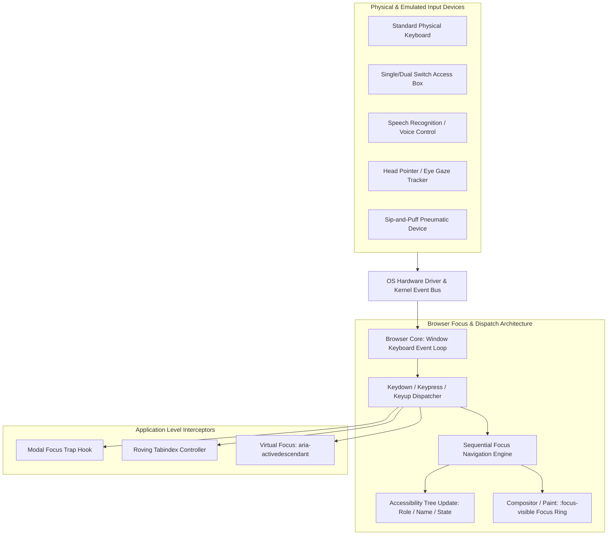
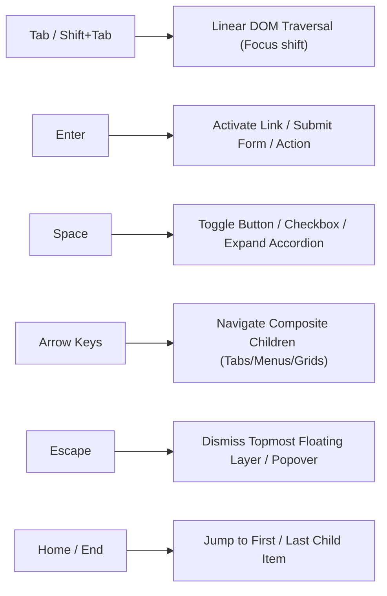
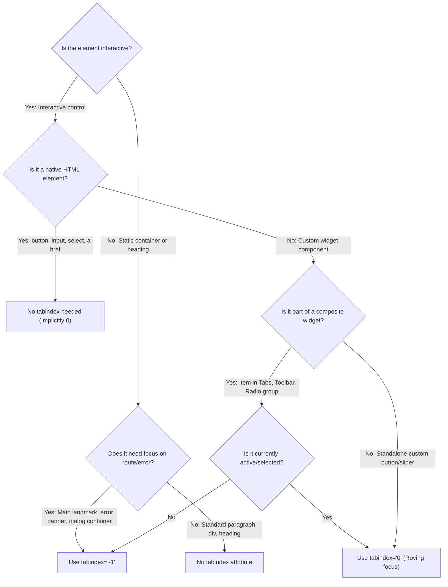
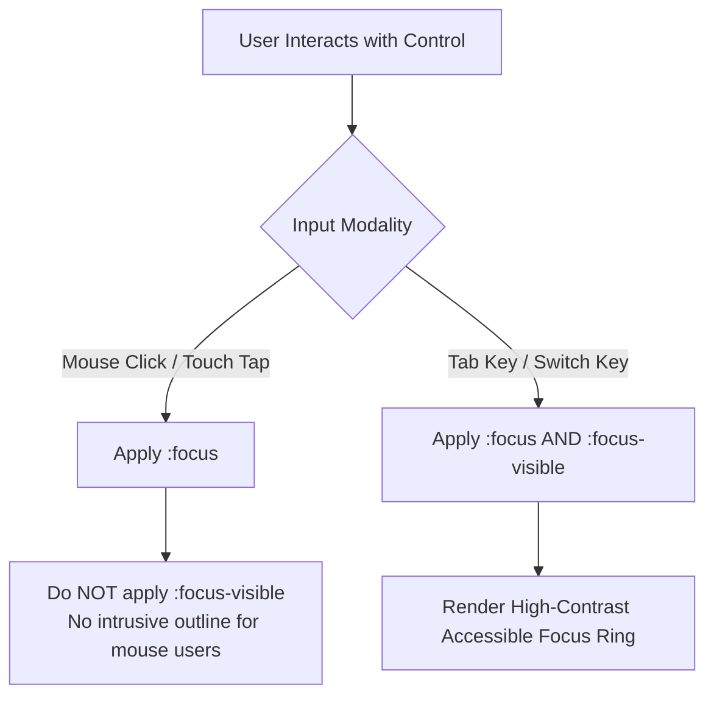
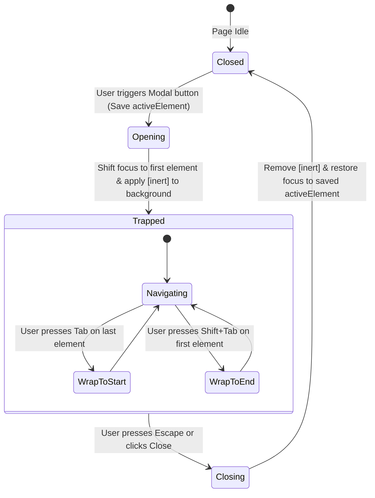
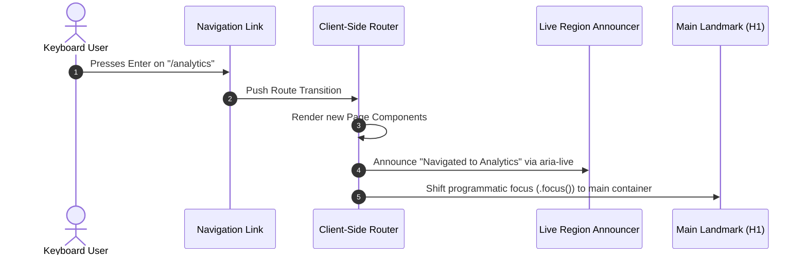
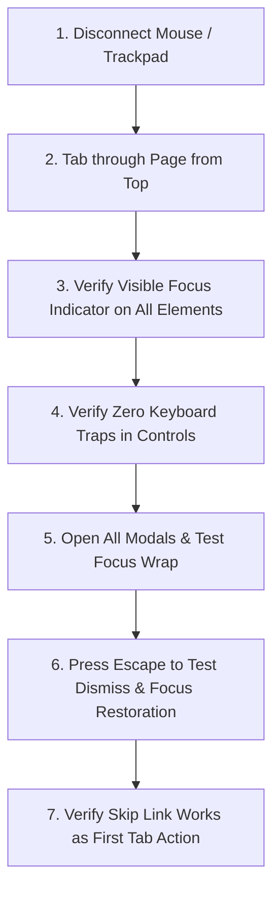

# Keyboard Accessibility & Interaction Engineering Master Guide

> "Web accessibility means that people with disabilities can use the web (perceive, understand, navigate, interact & contribute to the web). The goal of web accessibility is to eliminate barriers that may prevent people with disabilities from interacting with or accessing information on the web."

---

## Table of Contents

- [Keyboard Accessibility \& Interaction Engineering Master Guide](#keyboard-accessibility--interaction-engineering-master-guide)
  - [Table of Contents](#table-of-contents)
  - [1. Architectural Foundations \& Event Pipeline](#1-architectural-foundations--event-pipeline)
    - [The Universal Operability Mandate](#the-universal-operability-mandate)
    - [Operating System to Browser Input Flow](#operating-system-to-browser-input-flow)
    - [Who Relies on Keyboard Accessibility?](#who-relies-on-keyboard-accessibility)
  - [2. Standard Keyboard Interaction Matrix](#2-standard-keyboard-interaction-matrix)
    - [Universal Key Mappings](#universal-key-mappings)
    - [Modifier Keys \& Compound Shortcuts](#modifier-keys--compound-shortcuts)
  - [3. The `tabindex` Master Decision Engine](#3-the-tabindex-master-decision-engine)
    - [Deep Dive: `0` vs `-1` vs Positive Anti-Pattern](#deep-dive-0-vs--1-vs-positive-anti-pattern)
    - [Decision Tree: When to Use Which tabindex](#decision-tree-when-to-use-which-tabindex)
  - [4. Focus Indicators \& Visual Aesthetics](#4-focus-indicators--visual-aesthetics)
    - [The `:focus` vs `:focus-visible` Architectural Split](#the-focus-vs-focus-visible-architectural-split)
    - [The Cardinal Sin: `outline: none`](#the-cardinal-sin-outline-none)
    - [Production Focus Ring Design Tokens](#production-focus-ring-design-tokens)
    - [Windows High Contrast / Forced Colors Integration](#windows-high-contrast--forced-colors-integration)
  - [5. Focus Trapping \& Modal Dialog Lifecycles](#5-focus-trapping--modal-dialog-lifecycles)
    - [Modal Focus Lifecycle State Machine](#modal-focus-lifecycle-state-machine)
    - [Native `<dialog>` vs Custom Portal Traps](#native-dialog-vs-custom-portal-traps)
    - [Production React / TypeScript `useFocusTrap` Hook](#production-react--typescript-usefocustrap-hook)
    - [Background Tree Isolation with the `inert` Attribute](#background-tree-isolation-with-the-inert-attribute)
  - [6. Advanced Focus Navigation Patterns](#6-advanced-focus-navigation-patterns)
    - [Pattern A: Roving `tabindex` (Physical Focus)](#pattern-a-roving-tabindex-physical-focus)
    - [Pattern B: `aria-activedescendant` (Virtual Focus)](#pattern-b-aria-activedescendant-virtual-focus)
    - [Architectural Comparison Matrix: Roving vs Virtual](#architectural-comparison-matrix-roving-vs-virtual)
    - [Complete Implementation: Accessible Tabs with Roving tabindex](#complete-implementation-accessible-tabs-with-roving-tabindex)
    - [Complete Implementation: Search Combobox with Virtual Focus](#complete-implementation-search-combobox-with-virtual-focus)
  - [7. Skip Links \& Landmark Navigation](#7-skip-links--landmark-navigation)
    - [Bypassing Repetitive Navigation Blocks](#bypassing-repetitive-navigation-blocks)
    - [Production HTML \& CSS Skip Link Implementation](#production-html--css-skip-link-implementation)
  - [8. Single Page Application (SPA) Route Focus Transitions](#8-single-page-application-spa-route-focus-transitions)
    - [The Client-Side Routing Focus Problem](#the-client-side-routing-focus-problem)
    - [The Route Announcer \& Main Focus Reset Hook](#the-route-announcer--main-focus-reset-hook)
  - [9. Component-by-Component Keyboard Specification Catalog](#9-component-by-component-keyboard-specification-catalog)
    - [1. Buttons \& Icon Triggers](#1-buttons--icon-triggers)
    - [2. Disclosure \& Accordions](#2-disclosure--accordions)
    - [3. Dropdown \& Context Menus (`role="menu"`)](#3-dropdown--context-menus-rolemenu)
    - [4. Radio Groups \& Segmented Controls](#4-radio-groups--segmented-controls)
    - [5. Sliders \& Steppers (`role="slider"`)](#5-sliders--steppers-roleslider)
    - [6. Tree Views \& Hierarchical Lists (`role="tree"`)](#6-tree-views--hierarchical-lists-roletree)
    - [7. Data Grids \& Interactive Tables (`role="grid"`)](#7-data-grids--interactive-tables-rolegrid)
  - [10. Automated \& Manual Verification Protocols](#10-automated--manual-verification-protocols)
    - [Manual 7-Step Keyboard Audit Protocol](#manual-7-step-keyboard-audit-protocol)
    - [Playwright E2E Keyboard Testing Suite](#playwright-e2e-keyboard-testing-suite)
    - [React Testing Library + `user-event` Component Unit Tests](#react-testing-library--user-event-component-unit-tests)
  - [11. Staff-Level Interview Grill \& Situational Scenarios](#11-staff-level-interview-grill--situational-scenarios)
    - [Scenario 1: Legacy Codebase with 5,000 `<div onClick>` Elements](#scenario-1-legacy-codebase-with-5000-div-onclick-elements)
    - [Scenario 2: Virtualized Infinite Feed with Real-Time Incoming Items](#scenario-2-virtualized-infinite-feed-with-real-time-incoming-items)
    - [Scenario 3: Nested Modals with Multi-Step Drawers \& Date Pickers](#scenario-3-nested-modals-with-multi-step-drawers--date-pickers)
  - [12. Anti-Pattern \& Remediation Reference Matrix](#12-anti-pattern--remediation-reference-matrix)

---

## 1. Architectural Foundations & Event Pipeline

### The Universal Operability Mandate

Keyboard accessibility is the baseline for all web operability (**WCAG Principle 2: Operable**; see the [WebAIM WCAG Checklist](https://webaim.org/standards/wcag/checklist) for evaluation criteria).
If an interface requires a pointing device (mouse, trackpad) to operate, it immediately excludes millions of users who rely on assistive technologies or alternate hardware input mechanisms.

### Operating System to Browser Input Flow



### Who Relies on Keyboard Accessibility?

```
┌──────────────────────────────────────────────────────────────────────────────────┐
│                             Keyboard User Personas                               │
├────────────────────────────────┬─────────────────────────────────────────────────┤
│ Persona Group                  │ Interaction Modality                            │
├────────────────────────────────┼─────────────────────────────────────────────────┤
│ Blind & Low-Vision Users       │ Screen Readers (NVDA, JAWS, VoiceOver) issuing  │
│                                │ standard keystrokes to traverse DOM elements.   │
├────────────────────────────────┼─────────────────────────────────────────────────┤
│ Motor & Dexterity Impairments  │ Parkinson's, Tremors, Cerebral Palsy, Arthritis │
│                                │ users who cannot manipulate a precision mouse.  │
├────────────────────────────────┼─────────────────────────────────────────────────┤
│ Switch & Adaptive Tech Users   │ Single/dual switch devices scanning interfaces  │
│                                │ sequentially via mapped Tab/Enter keystrokes.   │
├────────────────────────────────┼─────────────────────────────────────────────────┤
│ Power Users & Developers       │ High-efficiency navigation using keyboard-only   │
│                                │ shortcuts and sequential tab cycling.           │
├────────────────────────────────┼─────────────────────────────────────────────────┤
│ Situational / Temporary        │ Broken arm, injured wrist, or malfunctioning     │
│ Limitations                    │ trackpad/mouse while working on the go.         │
└────────────────────────────────┴─────────────────────────────────────────────────┘
```

---

## 2. Standard Keyboard Interaction Matrix

### Universal Key Mappings



| Keystroke                                      | Semantic Purpose                                              | Architectural Requirement                                                      |
| :--------------------------------------------- | :------------------------------------------------------------ | :----------------------------------------------------------------------------- |
| <kbd>Tab</kbd>                                 | Move focus forward to the next interactive control.           | Must follow natural visual reading flow (Left-to-Right, Top-to-Bottom).        |
| <kbd>Shift</kbd> + <kbd>Tab</kbd>              | Move focus backward to the previous interactive control.      | Must precisely mirror the forward Tab sequence in reverse.                     |
| <kbd>Enter</kbd>                               | Trigger primary action, navigate hyperlinks, or submit forms. | Activates `<a href>`, `<button type="submit">`, and `role="menuitem"`.         |
| <kbd>Space</kbd>                               | Toggle stateful components (checkboxes, switches, buttons).   | Must prevent default page scrolling (`event.preventDefault()`).                |
| <kbd>Arrow Left</kbd> / <kbd>Arrow Right</kbd> | Horizontal navigation inside composite widgets.               | Used in horizontal tablists, horizontal toolbars, and radio groups.            |
| <kbd>Arrow Up</kbd> / <kbd>Arrow Down</kbd>    | Vertical navigation inside menus and lists.                   | Used in dropdown menus, listboxes, autocompletes, and vertical accordions.     |
| <kbd>Escape</kbd>                              | Dismiss/close overlays and cancel pending inputs.             | Closes active dialogs, tooltips, flyouts, and restores trigger focus.          |
| <kbd>Home</kbd> / <kbd>End</kbd>               | Jump to boundary items.                                       | Moves focus instantly to index `0` or index `length - 1` in composite widgets. |

### Modifier Keys & Compound Shortcuts

- <kbd>Alt</kbd> + <kbd>Arrow Down</kbd>: Opens a closed combobox or dropdown menu without selecting an item.
- <kbd>Ctrl</kbd> + <kbd>Home</kbd> / <kbd>Ctrl</kbd> + <kbd>End</kbd>: Jumps to the top or bottom of multi-page data grids.

---

## 3. The `tabindex` Master Decision Engine

### Deep Dive: `0` vs `-1` vs Positive Anti-Pattern

```
┌─────────────────────────────────────────────────────────────────────────────────┐
│                           HTML tabindex Mechanics                               │
├───────────────────┬───────────────────────────────────┬─────────────────────────┤
│ Attribute Value   │ Focus Behavior                    │ Correct Architectural   │
│                   │                                   │ Use Cases               │
├───────────────────┼───────────────────────────────────┼─────────────────────────┤
│ tabindex="0"      │ • Participates in standard Tab    │ • Custom buttons/links  │
│                   │   navigation sequence.            │ • Selected tab in list  │
│                   │ • Focusable via click or script.  │ • Scrollable containers │
├───────────────────┼───────────────────────────────────┼─────────────────────────┤
│ tabindex="-1"     │ • Skipped during Tab key cycling. │ • Modal dialog root     │
│                   │ • Focusable programmatically via  │ • Unselected tabs       │
│                   │   JavaScript (element.focus()).   │ • Skip-link target main │
├───────────────────┼───────────────────────────────────┼─────────────────────────┤
│ tabindex="1+"     │ • Prioritized ahead of all DOM    │ • 🚨 NEVER USE          │
│ (Positive Index)  │   elements in numerical order.    │ • Strict Anti-Pattern   │
│                   │ • Breaks natural reading order.   │ • Destroys accessibility│
└───────────────────┴───────────────────────────────────┴─────────────────────────┘
```

### Decision Tree: When to Use Which tabindex



---

## 4. Focus Indicators & Visual Aesthetics

### The `:focus` vs `:focus-visible` Architectural Split

- `:focus` fires whenever an element gains focus, including when a mouse user clicks on a button. This often leads developers to strip outlines to satisfy visual designers.
- `:focus-visible` uses modern browser heuristics to apply styles **only** when the interaction was initiated via keyboard, switch device, or programmatic script.



### The Cardinal Sin: `outline: none`

Removing focus indicators without providing an alternative violates **WCAG 2.4.7 (Focus Visible)** and **WCAG 2.2 (2.4.11 Focus Appearance)**.

```css
/* ❌ INACCESSIBLE: Completely removes focus indicator */
button:focus {
  outline: none;
}

/* ❌ SUB-OPTIMAL: Shows ring on every mouse click */
button:focus {
  outline: 2px solid #0284c7;
}

/* ✅ ENTERPRISE STANDARD: Beautiful, high-contrast, keyboard-only */
button:focus {
  outline: none; /* Strip default only if :focus-visible is implemented */
}

button:focus-visible {
  outline: 2px solid var(--theme-focus-ring, #0284c7);
  outline-offset: 2px;
  border-radius: 4px;
  box-shadow: 0 0 0 4px rgba(2, 132, 199, 0.25);
}
```

### Production Focus Ring Design Tokens

```css
:root {
  --focus-ring-color: #2563eb;
  --focus-ring-width: 2px;
  --focus-ring-offset: 2px;
  --focus-ring-shadow: 0 0 0 4px rgba(37, 99, 235, 0.2);
}

.interactive-control:focus-visible {
  outline: var(--focus-ring-width) solid var(--focus-ring-color);
  outline-offset: var(--focus-ring-offset);
  box-shadow: var(--focus-ring-shadow);
}
```

### Windows High Contrast / Forced Colors Integration

Users with severe visual impairments utilize Windows High Contrast Mode (Forced Colors Mode). Standard CSS box-shadows and background colors are stripped by the OS.

```css
@media (forced-colors: active) {
  .interactive-control:focus-visible {
    /* System color keyword guarantee visibility */
    outline: 3px solid Highlight !important;
    outline-offset: 2px;
  }
}
```

---

## 5. Focus Trapping & Modal Dialog Lifecycles

### Modal Focus Lifecycle State Machine



### Native `<dialog>` vs Custom Portal Traps

```
┌────────────────────────┬─────────────────────────────┬───────────────────────────┐
│ Feature                │ Native <dialog>             │ Custom Portal Dialog      │
├────────────────────────┼─────────────────────────────┼───────────────────────────┤
│ API Trigger            │ dialog.showModal()          │ React Portal / ReactDOM   │
│ Focus Trapping         │ ✅ Automatic (Built-in)     │ ⚠️ Requires Custom Hook   │
│ Background Freezing    │ ✅ Automatic (Built-in)     │ ⚠️ Requires inert attr    │
│ Escape Key Dismissal   │ ✅ Automatic (Built-in)     │ ⚠️ Requires keydown event │
│ Backdrop Styling       │ ::backdrop pseudo-element   │ Custom overlay div        │
│ Browser Support        │ 98%+ modern browsers        │ 100%                      │
└────────────────────────┴─────────────────────────────┴───────────────────────────┘
```

### Production React / TypeScript `useFocusTrap` Hook

```tsx
import { useEffect, useRef } from 'react';

interface FocusTrapOptions {
  isOpen: boolean;
  onClose: () => void;
  initialFocusRef?: React.RefObject<HTMLElement>;
}

export function useFocusTrap({ isOpen, onClose, initialFocusRef }: FocusTrapOptions) {
  const containerRef = useRef<HTMLDivElement>(null);
  const previouslyFocusedElement = useRef<HTMLElement | null>(null);

  useEffect(() => {
    if (!isOpen) return;

    // 1. Store trigger reference
    previouslyFocusedElement.current = document.activeElement as HTMLElement;

    const container = containerRef.current;
    if (!container) return;

    // 2. Query all focusable candidates (excluding disabled/hidden)
    const focusableQuery = [
      'button:not([disabled])',
      '[href]:not([disabled])',
      'input:not([disabled]):not([type="hidden"])',
      'select:not([disabled])',
      'textarea:not([disabled])',
      '[tabindex]:not([tabindex="-1"])',
    ].join(', ');

    const getFocusableNodes = (): HTMLElement[] => {
      const elements = Array.from(container.querySelectorAll<HTMLElement>(focusableQuery));
      return elements.filter((el) => el.offsetParent !== null && getComputedStyle(el).visibility !== 'hidden');
    };

    // 3. Set initial focus
    if (initialFocusRef?.current) {
      initialFocusRef.current.focus();
    } else {
      const focusable = getFocusableNodes();
      if (focusable.length > 0) {
        focusable[0].focus();
      } else {
        container.setAttribute('tabindex', '-1');
        container.focus();
      }
    }

    // 4. Trap Tab cycling & handle Escape
    const handleKeyDown = (event: KeyboardEvent) => {
      if (event.key === 'Escape') {
        event.preventDefault();
        event.stopPropagation();
        onClose();
        return;
      }

      if (event.key !== 'Tab') return;

      const nodes = getFocusableNodes();
      if (nodes.length === 0) {
        event.preventDefault();
        return;
      }

      const firstNode = nodes[0];
      const lastNode = nodes[nodes.length - 1];

      if (event.shiftKey) {
        // Shift + Tab on first node -> Wrap to last node
        if (document.activeElement === firstNode || document.activeElement === container) {
          event.preventDefault();
          lastNode.focus();
        }
      } else {
        // Tab on last node -> Wrap to first node
        if (document.activeElement === lastNode) {
          event.preventDefault();
          firstNode.focus();
        }
      }
    };

    document.addEventListener('keydown', handleKeyDown);

    // 5. Restore focus on unmount
    return () => {
      document.removeEventListener('keydown', handleKeyDown);
      if (previouslyFocusedElement.current && typeof previouslyFocusedElement.current.focus === 'function') {
        previouslyFocusedElement.current.focus();
      }
    };
  }, [isOpen, onClose, initialFocusRef]);

  return containerRef;
}
```

### Background Tree Isolation with the `inert` Attribute

When an overlay is open, apply the HTML `inert` attribute to the background root container. This freezes all child elements without requiring manual `tabindex="-1"` and `aria-hidden="true"` loops.

```html
<!-- Background app tree is frozen while modal is active -->
<div id="root" inert>
  <header>...</header>
  <main>...</main>
</div>

<!-- Modal Dialog portal renders outside #root -->
<div role="dialog" aria-modal="true" aria-labelledby="dialog-title">
  <h2 id="dialog-title">Confirm Account Deletion</h2>
  <button type="button">Confirm</button>
</div>
```

---

## 6. Advanced Focus Navigation Patterns

### Pattern A: Roving `tabindex` (Physical Focus)

In composite widgets (Tabs, Toolbars, Menus), only one item has `tabindex="0"`. All sibling items have `tabindex="-1"`. Pressing <kbd>Tab</kbd> enters the active item, and the next <kbd>Tab</kbd> exits the widget. Arrow keys move physical DOM focus between items.

```mermaid
flowchart LR
    subgraph Tablist [Role=Tablist Component]
        T1["Tab 1: Overview<br/>tabindex='0' (Active Focus)"]
        T2["Tab 2: Analytics<br/>tabindex='-1'"]
        T3["Tab 3: Settings<br/>tabindex='-1'"]
    end

    T1 -->|ArrowRight| T2
    T2 -->|ArrowRight| T3
    T3 -->|ArrowRight (Wrap)| T1
```

### Pattern B: `aria-activedescendant` (Virtual Focus)

```mermaid
flowchart TD
    Input["<input role='combobox' aria-activedescendant='opt-2' /> (Focused)"]

    subgraph Listbox ["<ul role='listbox'>"]
        O1["<li id='opt-1' role='option'>New York</li>"]
        O2["<li id='opt-2' role='option' class='active'>London (Virtual Focus)</li>"]
        O3["<li id='opt-3' role='option'>Tokyo</li>"]
    end

    Input -.->|Points to active ID| O2
```

In autocompletes, searchable dropdowns, and comboboxes, physical DOM focus remains on the `<input>` element. As the user presses Arrow keys, `aria-activedescendant="option-id"` updates dynamically.



### Architectural Comparison Matrix: Roving vs Virtual

| Architectural Metric       | Roving `tabindex`                                                 | `aria-activedescendant` (Virtual Focus)                           |
| :------------------------- | :---------------------------------------------------------------- | :---------------------------------------------------------------- |
| **Physical DOM Focus**     | Moves from element to element (`document.activeElement` changes). | Remains locked on the parent container / `<input>`.               |
| **Text Typing Capability** | ❌ Cannot type into inputs while navigating items.                | ✅ User can type continuously while navigating list items.        |
| **Primary Use Cases**      | Tab lists, Button toolbars, Radio groups, Menus.                  | Search comboboxes, Autocomplete lists, Large data grids.          |
| **DOM Attributes**         | `tabindex="0"` on active child; `tabindex="-1"` on siblings.      | `aria-activedescendant="child-id"` on parent; `id` on each child. |

---

### Complete Implementation: Accessible Tabs with Roving tabindex

```tsx
import React, { useState, useRef } from 'react';

interface Tab {
  id: string;
  label: string;
  content: React.ReactNode;
}

export function AccessibleTabs({ tabs }: { tabs: Tab[] }) {
  const [selectedIndex, setSelectedIndex] = useState(0);
  const tabRefs = useRef<(HTMLButtonElement | null)[]>([]);

  const handleKeyDown = (event: React.KeyboardEvent, index: number) => {
    let nextIndex = index;

    switch (event.key) {
      case 'ArrowRight':
        nextIndex = (index + 1) % tabs.length;
        break;
      case 'ArrowLeft':
        nextIndex = (index - 1 + tabs.length) % tabs.length;
        break;
      case 'Home':
        nextIndex = 0;
        break;
      case 'End':
        nextIndex = tabs.length - 1;
        break;
      default:
        return;
    }

    event.preventDefault();
    setSelectedIndex(nextIndex);
    tabRefs.current[nextIndex]?.focus();
  };

  return (
    <div className="tabs-widget">
      <div role="tablist" aria-label="Account Settings Navigation" className="tablist-container">
        {tabs.map((tab, idx) => {
          const isSelected = selectedIndex === idx;
          return (
            <button
              key={tab.id}
              role="tab"
              id={`tab-${tab.id}`}
              aria-selected={isSelected}
              aria-controls={`panel-${tab.id}`}
              tabIndex={isSelected ? 0 : -1} // Roving tabindex
              ref={(el) => (tabRefs.current[idx] = el)}
              onClick={() => setSelectedIndex(idx)}
              onKeyDown={(e) => handleKeyDown(e, idx)}
              className={`tab-btn ${isSelected ? 'selected' : ''}`}
            >
              {tab.label}
            </button>
          );
        })}
      </div>

      {tabs.map((tab, idx) => (
        <div
          key={tab.id}
          role="tabpanel"
          id={`panel-${tab.id}`}
          aria-labelledby={`tab-${tab.id}`}
          hidden={selectedIndex !== idx}
          tabIndex={0} // Makes panel scrollable for keyboard users
          className="tabpanel-content"
        >
          {tab.content}
        </div>
      ))}
    </div>
  );
}
```

---

### Complete Implementation: Search Combobox with Virtual Focus

```tsx
import React, { useState, useRef, useId } from 'react';

interface ComboboxProps {
  label: string;
  options: string[];
  onSelect: (value: string) => void;
}

export function AccessibleCombobox({ label, options, onSelect }: ComboboxProps) {
  const [query, setQuery] = useState('');
  const [isOpen, setIsOpen] = useState(false);
  const [activeIndex, setActiveIndex] = useState<number>(-1);
  const baseId = useId();

  const filteredOptions = options.filter((opt) => opt.toLowerCase().includes(query.toLowerCase()));

  const handleKeyDown = (event: React.KeyboardEvent) => {
    if (!isOpen && (event.key === 'ArrowDown' || event.key === 'ArrowUp')) {
      setIsOpen(true);
      setActiveIndex(0);
      event.preventDefault();
      return;
    }

    switch (event.key) {
      case 'ArrowDown':
        event.preventDefault();
        setActiveIndex((prev) => (prev + 1) % filteredOptions.length);
        break;
      case 'ArrowUp':
        event.preventDefault();
        setActiveIndex((prev) => (prev - 1 + filteredOptions.length) % filteredOptions.length);
        break;
      case 'Enter':
        if (isOpen && activeIndex >= 0 && filteredOptions[activeIndex]) {
          event.preventDefault();
          const selected = filteredOptions[activeIndex];
          setQuery(selected);
          onSelect(selected);
          setIsOpen(false);
          setActiveIndex(-1);
        }
        break;
      case 'Escape':
        event.preventDefault();
        setIsOpen(false);
        setActiveIndex(-1);
        break;
    }
  };

  const activeOptionId = isOpen && activeIndex >= 0 ? `${baseId}-opt-${activeIndex}` : undefined;

  return (
    <div className="combobox-wrapper">
      <label id={`${baseId}-label`} htmlFor={`${baseId}-input`}>
        {label}
      </label>
      <input
        id={`${baseId}-input`}
        type="text"
        role="combobox"
        aria-autocomplete="list"
        aria-expanded={isOpen}
        aria-controls={`${baseId}-listbox`}
        aria-activedescendant={activeOptionId}
        value={query}
        onChange={(e) => {
          setQuery(e.target.value);
          setIsOpen(true);
          setActiveIndex(0);
        }}
        onFocus={() => setIsOpen(true)}
        onKeyDown={handleKeyDown}
        className="combobox-input"
      />

      {isOpen && filteredOptions.length > 0 && (
        <ul id={`${baseId}-listbox`} role="listbox" aria-labelledby={`${baseId}-label`} className="combobox-listbox">
          {filteredOptions.map((opt, idx) => (
            <li
              key={opt}
              id={`${baseId}-opt-${idx}`}
              role="option"
              aria-selected={activeIndex === idx}
              onClick={() => {
                setQuery(opt);
                onSelect(opt);
                setIsOpen(false);
              }}
              className={`combobox-option ${activeIndex === idx ? 'highlighted' : ''}`}
            >
              {opt}
            </li>
          ))}
        </ul>
      )}
    </div>
  );
}
```

---

## 7. Skip Links & Landmark Navigation

### Bypassing Repetitive Navigation Blocks

Screen reader and keyboard users navigate linearly. If a page features a header with 60 navigation links, a keyboard user must press <kbd>Tab</kbd> 60 times on every page reload to reach the content.

### Production HTML & CSS Skip Link Implementation

```html
<!-- First child of <body> -->
<a href="#main-content" class="skip-to-main-link"> Skip to main content </a>

<header>
  <nav aria-label="Global Header Navigation">
    <!-- 50+ Navigation items -->
  </nav>
</header>

<main id="main-content" tabindex="-1">
  <h1>Dashboard Overview</h1>
</main>
```

```css
.skip-to-main-link {
  position: absolute;
  top: -1000px;
  left: 1rem;
  background: #0f172a;
  color: #ffffff;
  padding: 0.75rem 1.5rem;
  font-weight: 700;
  border-radius: 0 0 6px 6px;
  border: 2px solid #38bdf8;
  z-index: 999999;
  text-decoration: none;
  transition: top 0.15s ease-in-out;
}

.skip-to-main-link:focus-visible {
  top: 0;
  outline: 3px solid #38bdf8;
  outline-offset: 2px;
}
```

---

## 8. Single Page Application (SPA) Route Focus Transitions

### The Client-Side Routing Focus Problem

In client-side SPAs (React Router, Next.js App Router, Vue Router), page transitions do not trigger a full browser reload. Without explicit focus management, focus either remains on the unmounted link or drops to `document.body`.



### The Route Announcer & Main Focus Reset Hook

```tsx
import { useEffect, useRef } from 'react';
import { useLocation } from 'react-router-dom';

export function RouteFocusManager({ pageTitle }: { pageTitle: string }) {
  const location = useLocation();
  const liveAnnouncerRef = useRef<HTMLDivElement>(null);

  useEffect(() => {
    // 1. Update Document Title
    document.title = `${pageTitle} - Enterprise Cloud Platform`;

    // 2. Announce route change dynamically
    if (liveAnnouncerRef.current) {
      liveAnnouncerRef.current.textContent = `Navigated to ${pageTitle}`;
    }

    // 3. Shift focus to main heading
    const targetHeading = document.querySelector<HTMLElement>('main h1') || document.querySelector<HTMLElement>('main');

    if (targetHeading) {
      targetHeading.setAttribute('tabindex', '-1');
      targetHeading.focus({ preventScroll: false });
    }
  }, [location.pathname, pageTitle]);

  return <div ref={liveAnnouncerRef} role="status" aria-live="polite" aria-atomic="true" className="sr-only" />;
}
```

```css
/* Accessible Screen Reader Only utility */
.sr-only {
  position: absolute;
  width: 1px;
  height: 1px;
  padding: 0;
  margin: -1px;
  overflow: hidden;
  clip: rect(0, 0, 0, 0);
  white-space: nowrap;
  border-width: 0;
}
```

---

## 9. Component-by-Component Keyboard Specification Catalog

### 1. Buttons & Icon Triggers

- **Key Bindings:** <kbd>Enter</kbd> AND <kbd>Space</kbd> trigger click action.
- **Rule:** Never use `<div onClick={...}>` without `role="button"`, `tabindex="0"`, and keydown handlers.

### 2. Disclosure & Accordions

- **Key Bindings:** <kbd>Enter</kbd> or <kbd>Space</kbd> toggles expanded state.
- **Attributes:** Header button has `aria-expanded="true|false"` and `aria-controls="panel-id"`.

### 3. Dropdown & Context Menus (`role="menu"`)

- **Key Bindings:**
  - <kbd>Enter</kbd> / <kbd>Space</kbd> / <kbd>Arrow Down</kbd>: Opens menu from trigger button.
  - <kbd>Arrow Down</kbd> / <kbd>Arrow Up</kbd>: Cycles through `role="menuitem"` items.
  - <kbd>Escape</kbd>: Closes menu and returns focus to trigger button.
  - <kbd>Tab</kbd>: Closes menu and moves focus to next sequential control.

### 4. Radio Groups & Segmented Controls

- **Key Bindings:** <kbd>Arrow Left</kbd> / <kbd>Arrow Right</kbd> or <kbd>Arrow Up</kbd> / <kbd>Arrow Down</kbd> checks option and moves focus simultaneously. Only the checked radio has `tabindex="0"`.

### 5. Sliders & Steppers (`role="slider"`)

- **Key Bindings:**
  - <kbd>Arrow Right</kbd> / <kbd>Arrow Up</kbd>: Increases value by step.
  - <kbd>Arrow Left</kbd> / <kbd>Arrow Down</kbd>: Decreases value by step.
  - <kbd>Page Up</kbd> / <kbd>Page Down</kbd>: Large step increase / decrease ($10\times$).
  - <kbd>Home</kbd> / <kbd>End</kbd>: Sets value to minimum / maximum.

### 6. Tree Views & Hierarchical Lists (`role="tree"`)

- **Key Bindings:**
  - <kbd>Arrow Right</kbd>: Expands closed node or moves to first child.
  - <kbd>Arrow Left</kbd>: Collapses open node or moves to parent node.
  - <kbd>Arrow Down</kbd> / <kbd>Arrow Up</kbd>: Traverses visible tree items.

### 7. Data Grids & Interactive Tables (`role="grid"`)

- **Key Bindings:** 2D directional navigation using all four <kbd>Arrow Keys</kbd> across grid cells (`role="gridcell"`).

---

## 10. Automated & Manual Verification Protocols

For a comprehensive criteria audit, align manual and automated checks with the [WebAIM WCAG Checklist](https://webaim.org/standards/wcag/checklist).

### Manual 7-Step Keyboard Audit Protocol



### Playwright E2E Keyboard Testing Suite

```typescript
import { test, expect } from '@playwright/test';

test.describe('Automated Keyboard & Focus Suite', () => {
  test('Complete Modal Dialog Focus Trapping & Restoration Flow', async ({ page }) => {
    await page.goto('/dashboard');

    // 1. Tab to Modal Trigger Button
    await page.keyboard.press('Tab');
    const trigger = page.getByRole('button', { name: 'Delete Project' });
    await expect(trigger).toBeFocused();

    // 2. Open Modal via Enter key
    await page.keyboard.press('Enter');
    const dialog = page.getByRole('dialog', { name: 'Confirm Deletion' });
    await expect(dialog).toBeVisible();

    // 3. Confirm initial focus shifted inside modal
    const cancelBtn = dialog.getByRole('button', { name: 'Cancel' });
    const confirmInput = dialog.getByLabel('Type project name to confirm');
    await expect(confirmInput).toBeFocused();

    // 4. Test Focus Trapping (Cycle Forward)
    await page.keyboard.press('Tab'); // Move to Cancel
    await page.keyboard.press('Tab'); // Move to Delete
    await page.keyboard.press('Tab'); // Wrap back to confirmInput
    await expect(confirmInput).toBeFocused();

    // 5. Test Focus Trapping (Cycle Backward)
    await page.keyboard.press('Shift+Tab');
    const deleteBtn = dialog.getByRole('button', { name: 'Permanently Delete' });
    await expect(deleteBtn).toBeFocused();

    // 6. Dismiss with Escape
    await page.keyboard.press('Escape');
    await expect(dialog).toBeHidden();

    // 7. Verify Focus Restoration to Trigger Button
    await expect(trigger).toBeFocused();
  });
});
```

### React Testing Library + `user-event` Component Unit Tests

```tsx
import { render, screen } from '@testing-library/react';
import userEvent from '@testing-library/user-event';
import { AccessibleTabs } from './AccessibleTabs';

test('Keyboard user navigates tabs via Arrow Keys (Roving Tabindex)', async () => {
  const user = userEvent.setup();
  const testTabs = [
    { id: '1', label: 'General', content: 'General Panel' },
    { id: '2', label: 'Security', content: 'Security Panel' },
    { id: '3', label: 'Billing', content: 'Billing Panel' },
  ];

  render(<AccessibleTabs tabs={testTabs} />);

  const tab1 = screen.getByRole('tab', { name: 'General' });
  const tab2 = screen.getByRole('tab', { name: 'Security' });
  const tab3 = screen.getByRole('tab', { name: 'Billing' });

  // Initial focus on tab1
  tab1.focus();
  expect(tab1).toHaveFocus();
  expect(tab1).toHaveAttribute('tabindex', '0');
  expect(tab2).toHaveAttribute('tabindex', '-1');

  // Press ArrowRight to move to tab2
  await user.keyboard('{ArrowRight}');
  expect(tab2).toHaveFocus();
  expect(tab2).toHaveAttribute('aria-selected', 'true');
  expect(screen.getByText('Security Panel')).toBeVisible();

  // Press End to jump to last tab
  await user.keyboard('{End}');
  expect(tab3).toHaveFocus();
  expect(tab3).toHaveAttribute('aria-selected', 'true');
});
```

---

## 11. Staff-Level Interview Grill & Situational Scenarios

### Scenario 1: Legacy Codebase with 5,000 `<div onClick>` Elements

**Interviewer:** _"You join an enterprise company with a 2-million-line codebase where 5,000 custom buttons are coded as `<div onClick={...}>`. You cannot rewrite everything overnight. How do you systematically remediate this?"_

**Staff-Level Solution:**

1. **ESLint Static Analysis Gate:** Deploy `eslint-plugin-jsx-a11y` rule `no-static-element-interactions` and `click-events-have-key-events` as warnings in CI to prevent new violations.
2. **Automated Codemod AST Migration:** Author a Babel / jscodeshift codemod that transforms simple `<div onClick={fn}>` into semantic `<button type="button" onClick={fn}>` where layout styles permit.
3. **Enterprise Design System Wrapper:** Build a Polymorphic `<Clickable>` or `<Button>` primitive that automatically injects `role="button"`, `tabindex="0"`, and keydown handlers if a custom tag is provided.
4. **CSS Normalization:** Implement a CSS reset for button styles (`all: unset; cursor: pointer;`) to prevent layout breakage when switching tags.

---

### Scenario 2: Virtualized Infinite Feed with Real-Time Incoming Items

**Interviewer:** _"You have a social media feed where 20 new items arrive every minute at the top. How do you handle focus and screen reader announcements without causing audio chaos or throwing the keyboard user out of position?"_

**Staff-Level Solution:**

1. **Never Inject Above Active Focus:** New posts must be held in an incoming buffer and rendered only when the user explicitly triggers a "Show 15 new posts" banner.
2. **Virtual Focus Anchoring:** Anchor keyboard navigation to the item's unique stable ID, not DOM index position.
3. **Debounced Live Announcer:** Announce the count of new posts through an `aria-live="polite"` region debounced every 10–15 seconds, preventing screen reader speech interruption.

---

### Scenario 3: Nested Modals with Multi-Step Drawers & Date Pickers

**Interviewer:** _"How do you architect a focus restoration stack when a user opens a Modal, which opens a Date Picker Popover, which opens a Confirmation Alert?"_

**Staff-Level Solution:**

1. **LIFO Focus Stack Architecture:** Implement a centralized `FocusHistoryManager` stack.
2. **Push on Mount:** Each layer pushes `document.activeElement` onto the stack upon mounting.
3. **Pop on Teardown:** When a layer dismisses via <kbd>Esc</kbd>, it pops the top element and validates `document.body.contains(el)` before invoking `.focus()`.
4. **Background Freezing:** Apply `inert` hierarchically so that only the topmost surface remains interactive.

---

## 12. Anti-Pattern & Remediation Reference Matrix

| Anti-Pattern                                               | Root Cause of Failure                                                      | Architectural Remediation                                                                      |
| :--------------------------------------------------------- | :------------------------------------------------------------------------- | :--------------------------------------------------------------------------------------------- |
| `<div onClick={...}>`                                      | Missing from tab order, missing role, cannot be activated via keyboard.    | Use native `<button type="button">` or add `role="button" tabindex="0"` with keydown handlers. |
| `outline: none`                                            | Strips focus indicator; sighted keyboard users cannot see active location. | Use `:focus-visible { outline: 2px solid ...; outline-offset: 2px; }`.                         |
| Visually hidden dropdowns with `opacity: 0` or `height: 0` | Element is visually hidden but remains in DOM tab order.                   | Apply `display: none`, `visibility: hidden`, or the `inert` attribute to inactive panels.      |
| Positive `tabindex="1+"`                                   | Overrides natural DOM order, forcing focus out of logical sequence.        | Refactor DOM tree order and use `tabindex="0"` or `-1`.                                        |
| Focus loss on item deletion                                | When focused element is deleted, focus drops back to `<body>`.             | Programmatically move focus to the adjacent item or parent list container.                     |
| Un-restored focus after drawer/modal close                 | Focus gets stranded at bottom of DOM or reset to page top.                 | Capture `document.activeElement` on open and call `.focus()` on close.                         |
| Positive tabindex in forms                                 | Creates unpredictable jumps across form columns.                           | Rely strictly on natural DOM source ordering.                                                  |
| Missing keyboard trigger on custom sliders                 | Mouse-drag only components cannot be adjusted.                             | Add keydown listener for Arrow, Home, End, PageUp, and PageDown keys.                          |
