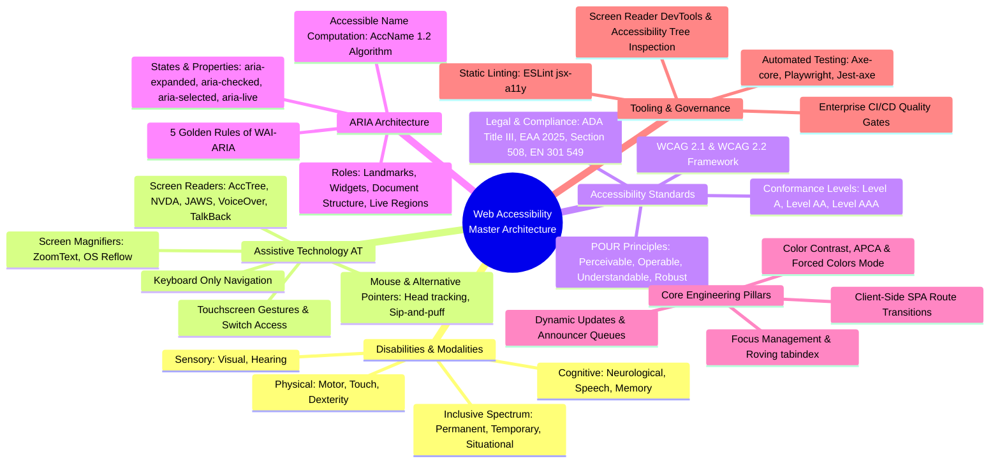
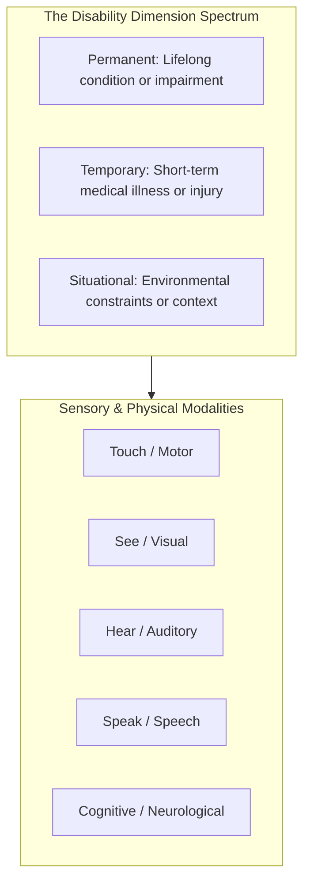
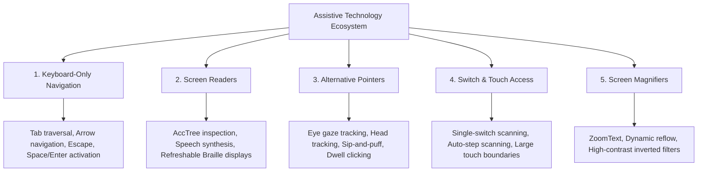
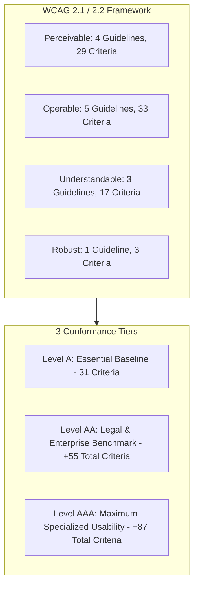
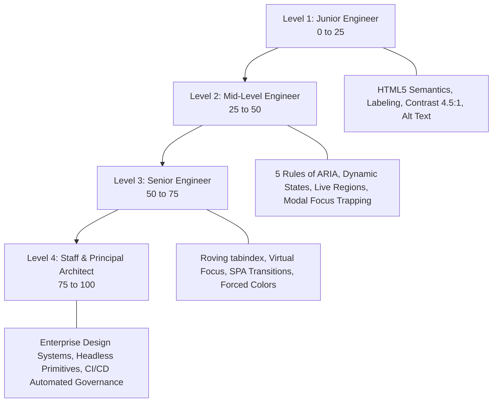

# Web Accessibility (a11y) Master Architectural Reference & System Design Guide

> "Web accessibility means that people with disabilities can use the web (perceive, understand, navigate, interact & contribute to the web). The goal of web accessibility is to eliminate barriers that may prevent people with disabilities from interacting with or accessing information on the web."

---

## 1. Master Architecture & Taxonomy Map



---

## 2. Inclusive Design Framework & Disability Spectrum

Web accessibility is not an edge-case optimization for a small minority. According to the World Health Organization (WHO), over **1.3 billion people (16% of the global population)** live with a significant disability. Furthermore, disability is context-dependent and dynamic.

The Microsoft Inclusive Design Model categorizes human limitations across three distinct temporal dimensions: **Permanent**, **Temporary**, and **Situational**.



### Comprehensive Modality & Dimension Matrix

| Modality              | Permanent                                                                        | Temporary                                                                      | Situational                                                                       | Engineering & Architecture Impact                                                                                                                                                                                         |
| :-------------------- | :------------------------------------------------------------------------------- | :----------------------------------------------------------------------------- | :-------------------------------------------------------------------------------- | :------------------------------------------------------------------------------------------------------------------------------------------------------------------------------------------------------------------------ |
| **Touch / Motor**     | Single-limb amputation, quadriplegia, cerebral palsy, Parkinson's disease.       | Broken arm in a cast, wrist sprain, post-surgery bandaging.                    | Carrying groceries, holding an infant with one arm, riding a bumpy subway.        | • Minimum touch target size ($44 \times 44\text{px}$ or $48 \times 48\text{px}$).<br>• Zero requirement for multi-touch or complex drag gestures.<br>• Full keyboard operable without simultaneous key press constraints. |
| **See / Visual**      | Total blindness, severe glaucoma, macular degeneration, color vision deficiency. | Post-operative eye dilation, cataract recovery, lost corrective lenses.        | Bright sunlight glare on a mobile screen, driving a vehicle (eyes on road).       | • Strict color contrast ($\ge 4.5:1$ text, $\ge 3:1$ UI components).<br>• Fully programmatic Accessible Name and Role for Screen Readers.<br>• Responsive reflow up to 400% zoom without loss of functionality.           |
| **Hear / Auditory**   | Congenital deafness, profound sensorineural hearing loss.                        | Acute ear infection, fluid buildup, temporary hearing loss after loud concert. | Loud construction site, noisy bar, quiet library, muted mobile phone in public.   | • High-accuracy synchronized captions for all video streams.<br>• Complete audio transcripts for podcasts and voice notes.<br>• Visual alerts and badges for audio-driven alerts and ringers.                             |
| **Speak / Speech**    | Non-verbal conditions, selective mutism, vocal cord paralysis.                   | Acute laryngitis, throat infection, oral dental surgery numbness.              | Heavy foreign accent with low-confidence STT, noisy environment, library silence. | • Text chat and form alternatives for all voice-activated workflows.<br>• No mandatory voice-only authentication or input paths.                                                                                          |
| **Cognitive & Neuro** | Down syndrome, severe autism spectrum, dementia, clinical ADHD, dyslexia.        | Chemotherapy brain fog, acute concussion, severe sleep deprivation.            | High workplace stress, cognitive panic, severe sensory overstimulation.           | • Simple, scannable typography with clear visual hierarchy.<br>• Support for `prefers-reduced-motion` to stop vestibular triggers.<br>• Explicit error prevention, validation suggestions, and confirmation dialogs.      |

---

## 3. Assistive Technology (AT) Deep-Dive

Assistive Technologies bridge hardware and digital interfaces, transforming DOM structures into alternate sensory outputs.



### Detailed Breakdown of Assistive Technologies

#### 1. Keyboard-Only Navigation

- **Primary Users:** Motor-impaired individuals, power users, visually impaired users.
- **Operating Mechanism:** Uses operating system event dispatchers to traverse focusable DOM elements sequentially.
- **Core Architectural Invariant:** An application must be 100% operable without a pointing device. There must be zero keyboard traps (`tabindex` must cycle properly or allow exit via <kbd>Esc</kbd>).

#### 2. Screen Readers

- **Primary Users:** Blind, low-vision, dyslexic, and cognitive disability users.
- **Top Implementations:**
  - **NVDA (NonVisual Desktop Access):** Free, open-source for Windows, highly compliant with W3C standards.
  - **JAWS (Job Access With Speech):** Enterprise Windows screen reader with deep legacy application support.
  - **Apple VoiceOver:** Deeply integrated into macOS, iOS, iPadOS, and watchOS.
  - **Google TalkBack:** Native screen reader for Android and ChromeOS.
- **Operating Mechanism:** Screen readers do not parse raw HTML text directly. They communicate with the browser's **Accessibility Tree (AccTree)** via platform APIs (MSAA, UI Automation, NSAccessibility, AT-SPI).

#### 3. Alternative Pointers & Tracking Devices

- **Primary Users:** Individuals with severe motor limitations, paralysis, ALS, or muscular dystrophy.
- **Devices:** Eye-tracking cameras, infrared head pointers, chin joysticks, sip-and-puff pneumatic tubes.
- **Operating Mechanism:** Uses dwell-clicking (resting cursor over a target for $N$ milliseconds) or single-button physical toggles.
- **Architectural Requirement:** Ample target spacing ($8\text{px}+$ padding between interactive controls) to prevent accidental misclicks.

#### 4. Switch Access & Scanning Systems

- **Primary Users:** Users with very limited physical mobility (e.g., movement limited to a single finger, toe, or head nod).
- **Operating Mechanism:** An automated highlight box scans through screen groups sequentially. The user taps their switch when the desired element group is highlighted, drilling down hierarchically.
- **Architectural Requirement:** Clear, linear DOM tree hierarchies and landmark regions (`<header>`, `<nav>`, `<main>`, `<footer>`) to reduce scan cycles.

#### 5. Screen Magnifiers

- **Primary Users:** Low vision, macular degeneration, diabetic retinopathy.
- **Tools:** ZoomText, Windows Magnifier, macOS Zoom.
- **Operating Mechanism:** Enlarges portions of the viewport up to 1600%.
- **Architectural Requirement:** Compliance with **WCAG 1.4.10 (Reflow)**. Content must reflow into a single column at 400% zoom (equivalent to $1280\text{px}$ viewport at $320\text{CSS px}$) without requiring both horizontal and vertical scrolling.

---

## 4. Accessibility Standards: The WCAG Framework

The **Web Content Accessibility Guidelines (WCAG)**, maintained by the W3C Web Accessibility Initiative (WAI), define international technical benchmarks. For practical audits and team evaluation, refer to the [WebAIM WCAG Checklist](https://webaim.org/standards/wcag/checklist).



### The POUR Principles in Architecture

#### Principle 1: Perceivable

Content and UI components must be presentable in ways users can sense (see or hear).

- **1.1 Text Alternatives:** Every non-text element (images, icons, charts) must have a text alternative (`alt="description"` or `aria-label`).
- **1.2 Time-based Media:** Synchronized captions for prerecorded and live audio/video.
- **1.3 Adaptable:** Content structure must be programmatically determinable (correct heading levels `<h1>`-`<h6>`, table headers `<th scope="col">`).
- **1.4 Distinguishable:**
  - Color is never used as the sole conveyor of meaning.
  - Text contrast is at least **4.5:1** for normal text and **3:1** for large text ($18\text{pt}$ or $14\text{pt}$ bold).
  - UI components and focus boundaries have at least **3:1** contrast against adjacent colors.

#### Principle 2: Operable

User interface components and navigation must be operable by any input method.

- **2.1 Keyboard Accessible:** 100% functionality available via keyboard alone; no keyboard traps.
- **2.2 Enough Time:** Provide users the ability to pause, stop, or extend session timeouts.
- **2.3 Seizures & Physical Reactions:** Zero flashes exceeding 3 times per second (prevents photosensitive seizures).
- **2.4 Navigable:** Provide skip links, meaningful page titles, logical focus order, and visible focus indicators.
- **2.5 Input Modalities (WCAG 2.1/2.2):** Minimum touch target sizes ($24 \times 24\text{px}$ Level AA minimum, $44 \times 44\text{px}$ Level AAA), dragging alternatives, and single-pointer cancellation.

#### Principle 3: Understandable

Information and operation must be clear, predictable, and forgiving of user error.

- **3.1 Readable:** Programmatically declared document language (`<html lang="en">`) and inline language shifts (`<span lang="es">`).
- **3.2 Predictable:** Components do not trigger unexpected context shifts on receiving focus or input change.
- **3.3 Input Assistance:** Clear error messages, explicit field association (`aria-describedby`), and recovery suggestions.

#### Principle 4: Robust

Content must be robust enough to be interpreted reliably by diverse user agents, including assistive technologies.

- **4.1 Compatible:** Clean, valid markup without duplicate IDs; adherence to standard ARIA roles, states, and properties.

---

## 5. The 5 Golden Rules of WAI-ARIA

WAI-ARIA (Accessible Rich Internet Applications) provides semantic attributes to bridge gaps where HTML5 native elements are insufficient.

```
Rule 1: Native First ──▶ If native HTML exists (<button>, <select>), DO NOT use ARIA.
Rule 2: Don't Break  ──▶ Do not change native semantics unless strictly necessary.
Rule 3: Full Keyboard──▶ All interactive ARIA controls MUST be 100% keyboard operable.
Rule 4: Keep Focus   ──▶ Never use aria-hidden="true" or role="presentation" on focusable elements.
Rule 5: Name Every   ──▶ Every interactive control MUST have a computed Accessible Name.
```

### 1. The Accessible Name Computation (AccName 1.2) Priority

When assistive technology determines what to announce for an element, it evaluates in this strict priority:


---

## 6. Engineering Roadmap: From 0 to 100 (Junior to Staff Architect)



### Level 1: Junior Foundations (0-25)

- Replace generic `<div onClick>` and `<span onClick>` with native `<button type="button">`.
- Provide meaningful `alt` descriptions on images (`alt="Financial growth chart Q3"`) and empty `alt=""` on decorative icons.
- Guarantee that form inputs have explicitly linked `<label for="id">` elements.
- Maintain at least **4.5:1** contrast on normal body copy and **3:1** on headers and inputs.

### Level 2: Mid-Level Engineering (25-50)

- Manage ARIA component state transitions: `aria-expanded="true|false"` on accordions and menus; `aria-checked="true|false"` on custom toggles.
- Construct accessible modal dialogs using native `<dialog>` or custom focus traps with `<kbd>Escape</kbd>` listeners.
- Use `aria-live="polite"` for non-disruptive dynamic content updates (toast notifications, search count updates).
- Eliminate all positive `tabindex` attributes (`tabindex="1+"`), adhering strictly to `0` and `-1`.

### Level 3: Senior Architecture (50-75)

- Architect composite widgets with **Roving `tabindex`** (Tabs, Toolbars, Menus) and **`aria-activedescendant`** (Comboboxes, Auto-completes).
- Implement SPA Route Announcers to manage focus shift and announce page updates on client-side routing.
- Support Windows High Contrast / Forced Colors Mode (`@media (forced-colors: active)`) using semantic system colors (`Canvas`, `CanvasText`, `Highlight`).
- Handle complex focus restoration stacks when deeply nested flyouts, drawers, or dialogs open and close.

### Level 4: Staff & Principal Governance (75-100)

- **Design System Standardization:** Standardize the enterprise on battle-tested headless UI primitives (e.g., Radix UI, React Aria, Ark UI) to eliminate custom accessible widget wheel-reinvention.
- **CI/CD Quality Gates:** Deploy automated `@axe-core/playwright` and `lighthouse-ci` testing on every Pull Request, blocking regressions automatically.
- **Accessibility Budget & Scorecards:** Establish an engineering metric dashboard tracking automated pass rates, color token compliance, and manual screen reader test sign-offs.
- **Legal Compliance Readiness:** Audit digital properties against European Accessibility Act (EAA June 2025) and ADA Title III compliance mandates.

---

## 7. Knowledge Hub Deep-Dive Directory

| Document                                                                                                                                      | Scope & Target                    | Core Architectural Content                                                                                               |
| :-------------------------------------------------------------------------------------------------------------------------------------------- | :-------------------------------- | :----------------------------------------------------------------------------------------------------------------------- |
| [**Keyboard Accessibility & Interaction Guide**](file:///Users/atulkumarawasthi/projects/SystemDesign/Accessibility/KeyboardAccessibility.md) | Focus & Keyboard Engineering      | Full keyboard event pipelines, `tabindex` rules, Focus Trap hooks, Roving `tabindex` vs virtual focus, Playwright tests. |
| [**WCAG 2.1/2.2 Reference & Architect Grill**](file:///Users/atulkumarawasthi/projects/SystemDesign/Accessibility/WCAG_Accessibility.md)      | Standards & Staff Interview Grill | Comprehensive criteria breakdown, Staff-level scenario interviews, trade-offs, and enterprise remediation blueprints.    |
| [**Focus Management & Trapping**](file:///Users/atulkumarawasthi/projects/SystemDesign/Accessibility/FocusManagement.md)                      | Focus Lifecycles                  | Modal trapping mechanics, SPA routing focus reset, `inert` attribute, virtual list a11y.                                 |
| [**Screen Readers & Accessibility Tree**](file:///Users/atulkumarawasthi/projects/SystemDesign/Accessibility/ScreenReader.md)                 | AccTree & Assistive Tech          | AccTree compilation, NVDA/JAWS/VoiceOver heuristics, live region queues, and screen reader testing.                      |
| [**Color Contrast & High Contrast Themes**](file:///Users/atulkumarawasthi/projects/SystemDesign/Accessibility/ColorContrast.md)              | Visual Systems & Colors           | APCA vs WCAG contrast math, Forced Colors mode, color-blindness accommodations.                                          |
| [**Accessibility Tooling & CI/CD Governance**](file:///Users/atulkumarawasthi/projects/SystemDesign/Accessibility/AccessbilityTools.md)       | Test Automation & Auditing        | Axe-core, Jest-axe, Playwright automation, ESLint rules, and manual audit protocols.                                     |
