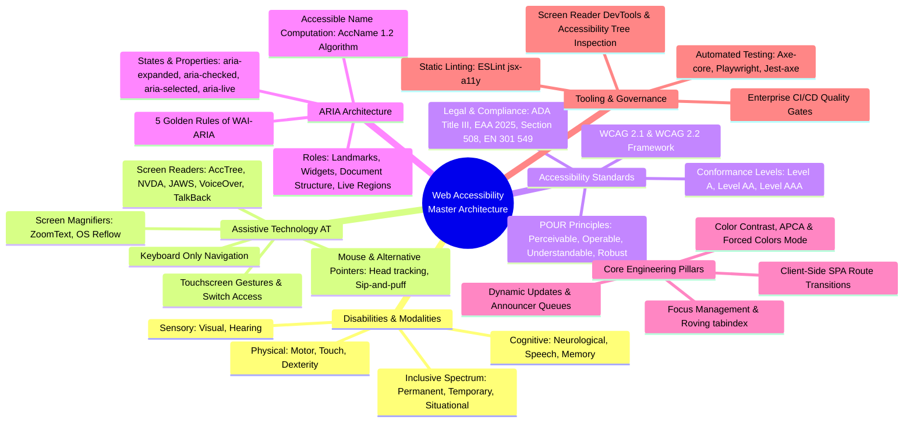
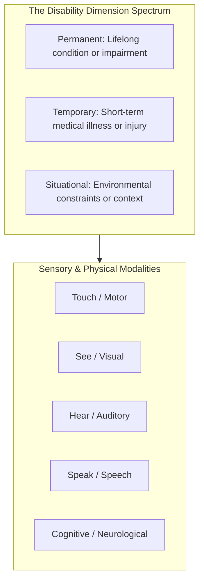
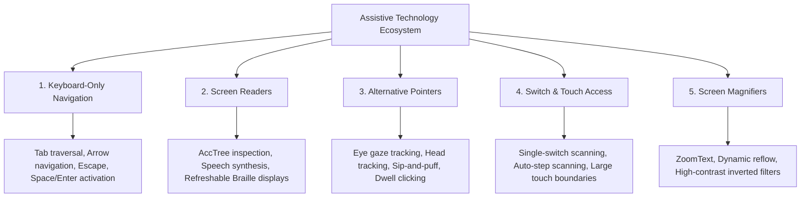
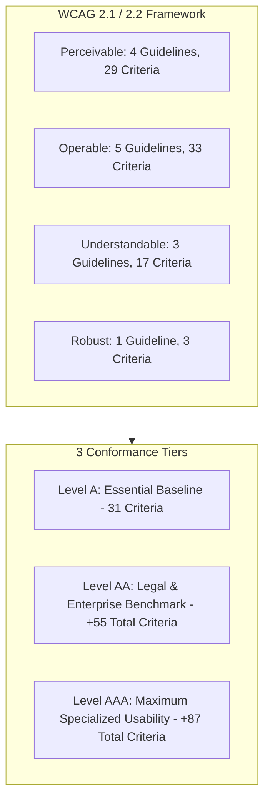
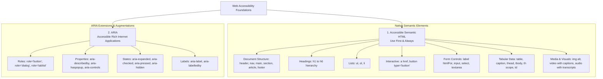
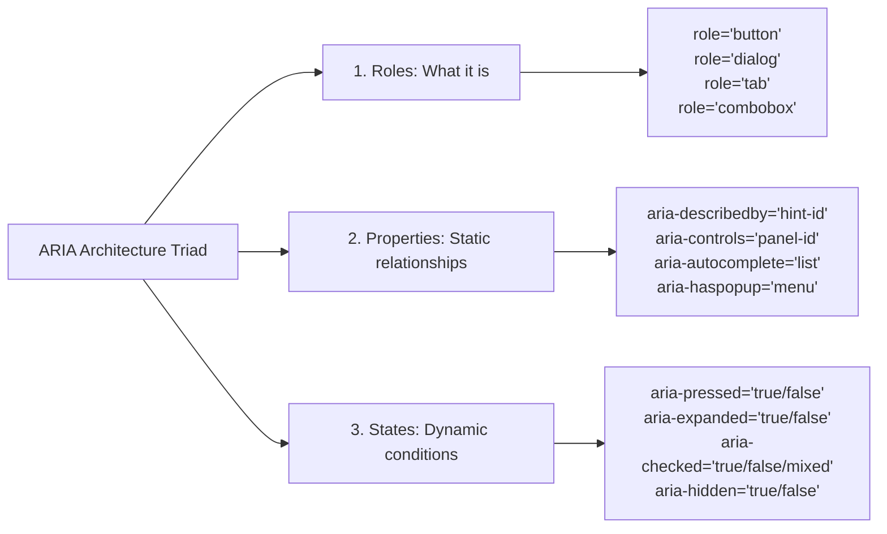
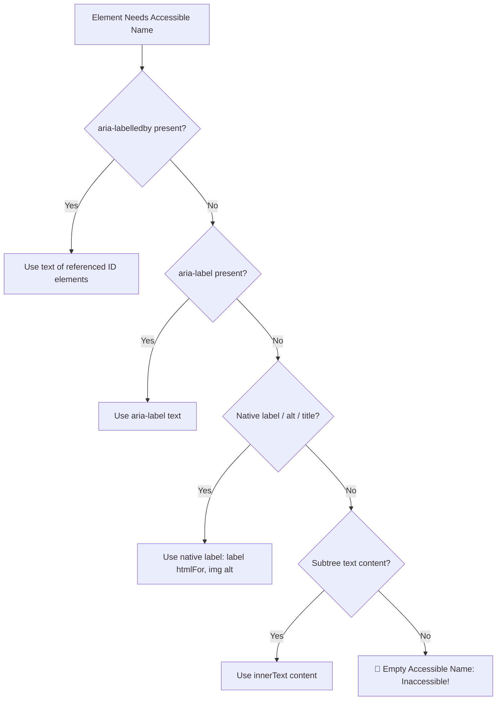
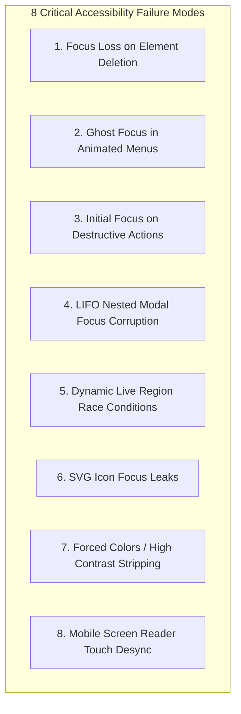
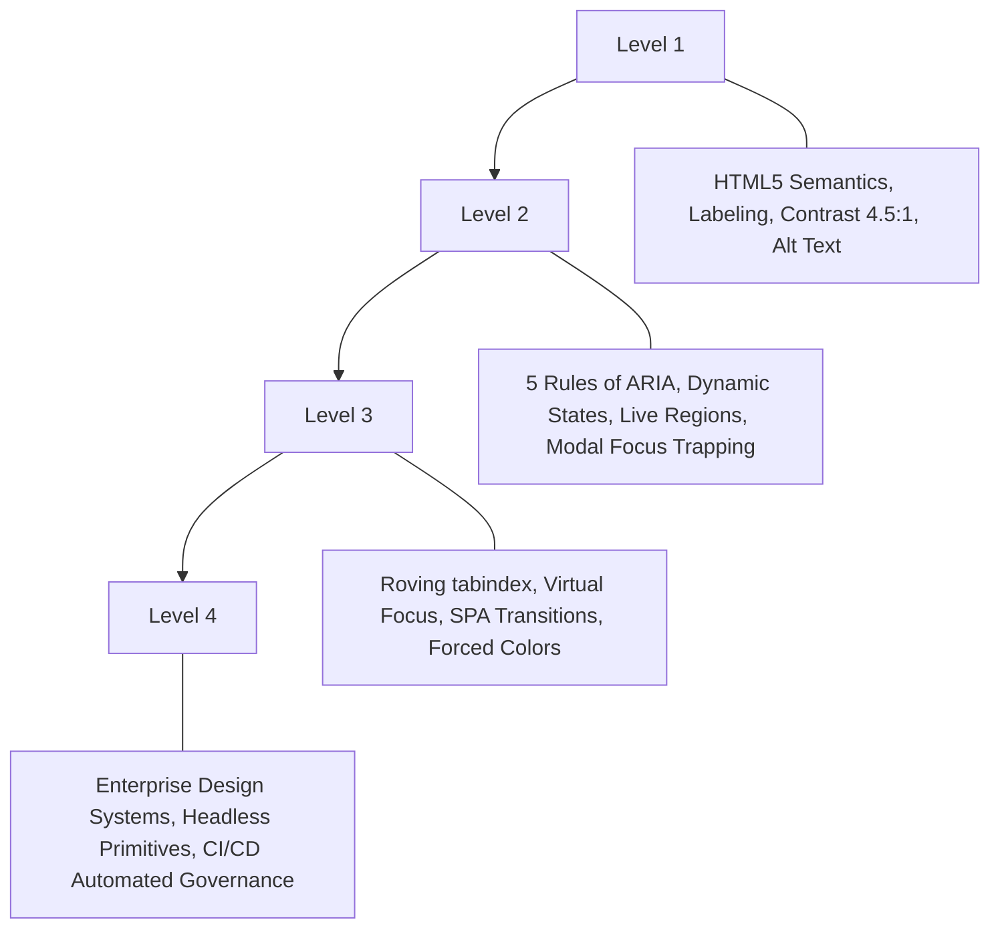

# Web Accessibility (a11y) Master Architectural Reference & System Design Guide

> "Web accessibility means that people with disabilities can use the web (perceive, understand, navigate, interact & contribute to the web). The goal of web accessibility is to eliminate barriers that may prevent people with disabilities from interacting with or accessing information on the web."

---

## 🧭 Step-by-Step Module Learning & Navigation Track

Explore this comprehensive accessibility repository sequentially through our 7-stage architectural learning track, or jump directly into any specialized module:

```mermaid
flowchart LR
    M1["<b>01. WCAG & Standards</b><br/>POUR & Conformance Levels"] --> M2["<b>02. Focus Management</b><br/>6 Pillars & Skip Links"]
    M2 --> M3["<b>03. Keyboard a11y</b><br/>APG & Roving tabindex"]
    M3 --> M4["<b>04. Color & Contrast</b><br/>Luminance & Forced Colors"]
    M4 --> M5["<b>05. Screen Readers</b><br/>AccTree & Live Regions"]
    M5 --> M6["<b>06. Tools & CI/CD</b><br/>Axe, DevTools & Rules"]
    M6 --> M7["<b>07. Interactive Demos</b><br/>8 Live HTML Testbeds"]

    classDef active fill:#2563eb,stroke:#1d4ed8,color:#ffffff,stroke-width:2px;
    classDef demo fill:#10b981,stroke:#059669,color:#ffffff,stroke-width:2px;
    class M1,M2,M3,M4,M5,M6 active;
    class M7 demo;
```



|  Step  | Module Document                                                                                                                          | Scope & Focus             | Key Takeaways & Deliverables                                                                           |
| :----: | :--------------------------------------------------------------------------------------------------------------------------------------- | :------------------------ | :----------------------------------------------------------------------------------------------------- |
| **01** | [**WCAG Standards & Architect Grill**](file:///Users/atulkumarawasthi/projects/SystemDesign/Accessibility/WCAG_Accessibility.md)         | Standards & Compliance    | POUR Principles, Conformance Levels (A, AA, AAA), 5 Rules of ARIA, Staff-level interview questions.    |
| **02** | [**Focus Management & Navigation**](file:///Users/atulkumarawasthi/projects/SystemDesign/Accessibility/FocusManagement.md)               | Focus Lifecycles          | 6 Focus Pillars, Native Focusable Tags Table, Custom `tabindex` Matrix, Skip Links, Modal Trapping.    |
| **03** | [**Keyboard Accessibility & APG Patterns**](file:///Users/atulkumarawasthi/projects/SystemDesign/Accessibility/KeyboardAccessibility.md) | Keyboard Engineering      | Roving `tabindex`, Virtual Focus (`aria-activedescendant`), W3C APG Widgets (Tabs, Menus, Comboboxes). |
| **04** | [**Color Contrast & Visual Accessibility**](file:///Users/atulkumarawasthi/projects/SystemDesign/Accessibility/ColorContrast.md)         | Visual Systems & Contrast | Relative Luminance Mathematical Formula, 400% Zoom Reflow, Forced Colors / Windows High Contrast.      |
| **05** | [**Screen Readers & AccTree Architecture**](file:///Users/atulkumarawasthi/projects/SystemDesign/Accessibility/ScreenReader.md)          | Assistive Tech & AccTree  | Browser AccTree Compilation, OS APIs, ARIA Live Queues, Programmatic DOM Mutations, OS Runbooks.       |
| **06** | [**Accessibility Tools, Testing & Governance**](file:///Users/atulkumarawasthi/projects/SystemDesign/Accessibility/AccessbilityTools.md) | Quality & Automation      | 10 Golden Design Rules, 5-Step Testing Protocol, Axe-core, Playwright CI/CD, DevTools Inspection.      |
| **07** | [**Interactive Browser Testbed Hub**](file:///Users/atulkumarawasthi/projects/SystemDesign/Accessibility/demos/index.html)               | Live Browser Labs         | 8 Standalone HTML interactive testbeds with real-time Event HUDs and zero external dependencies.       |

---

## Table of Contents

- [Web Accessibility (a11y) Master Architectural Reference \& System Design Guide](#web-accessibility-a11y-master-architectural-reference--system-design-guide)
  - [🧭 Step-by-Step Module Learning \& Navigation Track](#-step-by-step-module-learning--navigation-track)
  - [Table of Contents](#table-of-contents)
  - [1. Master Architecture \& Taxonomy Map](#1-master-architecture--taxonomy-map)
  - [2. Inclusive Design Framework \& Disability Spectrum](#2-inclusive-design-framework--disability-spectrum)
    - [Comprehensive Modality \& Dimension Matrix](#comprehensive-modality--dimension-matrix)
  - [3. Assistive Technology (AT) Deep-Dive](#3-assistive-technology-at-deep-dive)
    - [Detailed Breakdown of Assistive Technologies](#detailed-breakdown-of-assistive-technologies)
      - [1. Keyboard-Only Navigation](#1-keyboard-only-navigation)
      - [2. Screen Readers](#2-screen-readers)
      - [3. Alternative Pointers \& Tracking Devices](#3-alternative-pointers--tracking-devices)
      - [4. Switch Access \& Scanning Systems](#4-switch-access--scanning-systems)
      - [5. Screen Magnifiers](#5-screen-magnifiers)
  - [4. Accessibility Standards: The WCAG Framework](#4-accessibility-standards-the-wcag-framework)
    - [The POUR Principles in Architecture](#the-pour-principles-in-architecture)
      - [Principle 1: Perceivable](#principle-1-perceivable)
      - [Principle 2: Operable](#principle-2-operable)
      - [Principle 3: Understandable](#principle-3-understandable)
      - [Principle 4: Robust](#principle-4-robust)
  - [5. Semantic HTML vs ARIA (Accessible Rich Internet Applications)](#5-semantic-html-vs-aria-accessible-rich-internet-applications)
    - [What is ARIA?](#what-is-aria)
    - [The Two Pillars: Accessible HTML vs ARIA](#the-two-pillars-accessible-html-vs-aria)
    - [How DOM + ARIA Build the Accessibility Tree](#how-dom--aria-build-the-accessibility-tree)
    - [The ARIA Triad: Roles vs Properties vs States](#the-aria-triad-roles-vs-properties-vs-states)
    - [Form Labeling Matrix: When to Use Which?](#form-labeling-matrix-when-to-use-which)
    - [The 5 Golden Rules of WAI-ARIA](#the-5-golden-rules-of-wai-aria)
    - [The Accessible Name Computation (AccName 1.2) Priority](#the-accessible-name-computation-accname-12-priority)
  - [6. Practical React Component Recipes for Accessibility](#6-practical-react-component-recipes-for-accessibility)
    - [Recipe 1: Accessible Icon Button (No Visual Text)](#recipe-1-accessible-icon-button-no-visual-text)
    - [Recipe 2: Form Field with Label, Hint \& Validation Error](#recipe-2-form-field-with-label-hint--validation-error)
    - [Recipe 3: Accessible Toggle Switch (`role="switch"`, `aria-checked`)](#recipe-3-accessible-toggle-switch-roleswitch-aria-checked)
    - [Recipe 4: Accessible Accordion / Disclosure (`aria-expanded`, `aria-controls`)](#recipe-4-accessible-accordion--disclosure-aria-expanded-aria-controls)
    - [Recipe 5: Live Announcer / Toast (`role="status"`, `aria-live="polite"`)](#recipe-5-live-announcer--toast-rolestatus-aria-livepolite)
  - [7. Critical Accessibility Edge Cases \& Failure Modes (Frontend \& React)](#7-critical-accessibility-edge-cases--failure-modes-frontend--react)
    - [Edge Case 1: Focus Loss on Element Deletion (The `document.body` Reset Bug)](#edge-case-1-focus-loss-on-element-deletion-the-documentbody-reset-bug)
    - [Edge Case 2: Ghost Focus in Collapsed/Animated Subtrees](#edge-case-2-ghost-focus-in-collapsedanimated-subtrees)
    - [Edge Case 3: Initial Focus on Destructive Actions in Modals (Safety-First Focus)](#edge-case-3-initial-focus-on-destructive-actions-in-modals-safety-first-focus)
    - [Edge Case 4: Nested Modals \& Stacked Overlays Focus Restoration](#edge-case-4-nested-modals--stacked-overlays-focus-restoration)
    - [Edge Case 5: Dynamic Live Region Race Conditions](#edge-case-5-dynamic-live-region-race-conditions)
    - [Edge Case 6: SVG Icon Focus Leaks in Mobile WebKit \& Legacy Engines](#edge-case-6-svg-icon-focus-leaks-in-mobile-webkit--legacy-engines)
    - [Edge Case 7: High Contrast / Forced Colors Mode Styling Stripping](#edge-case-7-high-contrast--forced-colors-mode-styling-stripping)
    - [Edge Case 8: Mobile Screen Reader Touch Swipe vs DOM Focus Desynchronization](#edge-case-8-mobile-screen-reader-touch-swipe-vs-dom-focus-desynchronization)
  - [8. Interactive Standalone HTML Testbeds (Live Browser Demos)](#8-interactive-standalone-html-testbeds-live-browser-demos)
  - [9. Engineering Roadmap](#9-engineering-roadmap)
    - [Level 1: Foundations](#level-1-foundations)
    - [Level 2: Mid-Level Engineering](#level-2-mid-level-engineering)
    - [Level 3: Senior Architecture](#level-3-senior-architecture)
    - [Level 4: Arch\&Principal Governance](#level-4-archprincipal-governance)
  - [10. Knowledge Hub Deep-Dive Directory](#10-knowledge-hub-deep-dive-directory)
  - [11. Authoritative External Standards \& Learning Courses](#11-authoritative-external-standards--learning-courses)

---

## 1. Master Architecture & Taxonomy Map



---

## 2. Inclusive Design Framework & Disability Spectrum

Web accessibility is not an edge-case optimization for a small minority. According to the World Health Organization (WHO), over **1.3 billion people (16% of the global population)** live with a significant disability. Furthermore, disability is context-dependent and dynamic.

The Microsoft Inclusive Design Model categorizes human limitations across three distinct temporal dimensions: **Permanent**, **Temporary**, and **Situational**.



### Comprehensive Modality & Dimension Matrix

| Modality              | Permanent                                                                        | Temporary                                                                      | Situational                                                                       | Engineering & Architecture Impact                                                                                                                                                                                         |
| :-------------------- | :------------------------------------------------------------------------------- | :----------------------------------------------------------------------------- | :-------------------------------------------------------------------------------- | :------------------------------------------------------------------------------------------------------------------------------------------------------------------------------------------------------------------------ |
| **Touch / Motor**     | Single-limb amputation, quadriplegia, cerebral palsy, Parkinson's disease.       | Broken arm in a cast, wrist sprain, post-surgery bandaging.                    | Carrying groceries, holding an infant with one arm, riding a bumpy subway.        | • Minimum touch target size ($44 \times 44\text{px}$ or $48 \times 48\text{px}$).<br>• Zero requirement for multi-touch or complex drag gestures.<br>• Full keyboard operable without simultaneous key press constraints. |
| **See / Visual**      | Total blindness, severe glaucoma, macular degeneration, color vision deficiency. | Post-operative eye dilation, cataract recovery, lost corrective lenses.        | Bright sunlight glare on a mobile screen, driving a vehicle (eyes on road).       | • Strict color contrast ($\ge 4.5:1$ text, $\ge 3:1$ UI components).<br>• Fully programmatic Accessible Name and Role for Screen Readers.<br>• Responsive reflow up to 400% zoom without loss of functionality.           |
| **Hear / Auditory**   | Congenital deafness, profound sensorineural hearing loss.                        | Acute ear infection, fluid buildup, temporary hearing loss after loud concert. | Loud construction site, noisy bar, quiet library, muted mobile phone in public.   | • High-accuracy synchronized captions for all video streams.<br>• Complete audio transcripts for podcasts and voice notes.<br>• Visual alerts and badges for audio-driven alerts and ringers.                             |
| **Speak / Speech**    | Non-verbal conditions, selective mutism, vocal cord paralysis.                   | Acute laryngitis, throat infection, oral dental surgery numbness.              | Heavy foreign accent with low-confidence STT, noisy environment, library silence. | • Text chat and form alternatives for all voice-activated workflows.<br>• No mandatory voice-only authentication or input paths.                                                                                          |
| **Cognitive & Neuro** | Down syndrome, severe autism spectrum, dementia, clinical ADHD, dyslexia.        | Chemotherapy brain fog, acute concussion, severe sleep deprivation.            | High workplace stress, cognitive panic, severe sensory overstimulation.           | • Simple, scannable typography with clear visual hierarchy.<br>• Support for `prefers-reduced-motion` to stop vestibular triggers.<br>• Explicit error prevention, validation suggestions, and confirmation dialogs.      |

---

## 3. Assistive Technology (AT) Deep-Dive

Assistive Technologies bridge hardware and digital interfaces, transforming DOM structures into alternate sensory outputs.



### Detailed Breakdown of Assistive Technologies

#### 1. Keyboard-Only Navigation

- **Primary Users:** Motor-impaired individuals, power users, visually impaired users.
- **Operating Mechanism:** Uses operating system event dispatchers to traverse focusable DOM elements sequentially.
- **Core Architectural Invariant:** An application must be 100% operable without a pointing device. There must be zero keyboard traps (`tabindex` must cycle properly or allow exit via <kbd>Esc</kbd>).

#### 2. Screen Readers

- **Primary Users:** Blind, low-vision, dyslexic, and cognitive disability users.
- **Top Implementations:**
  - **NVDA (NonVisual Desktop Access):** Free, open-source for Windows, highly compliant with W3C standards.
  - **JAWS (Job Access With Speech):** Enterprise Windows screen reader with deep legacy application support.
  - **Apple VoiceOver:** Deeply integrated into macOS, iOS, iPadOS, and watchOS.
  - **Google TalkBack:** Native screen reader for Android and ChromeOS.
- **Operating Mechanism:** Screen readers do not parse raw HTML text directly. They communicate with the browser's **Accessibility Tree (AccTree)** via platform APIs (MSAA, UI Automation, NSAccessibility, AT-SPI).

#### 3. Alternative Pointers & Tracking Devices

- **Primary Users:** Individuals with severe motor limitations, paralysis, ALS, or muscular dystrophy.
- **Devices:** Eye-tracking cameras, infrared head pointers, chin joysticks, sip-and-puff pneumatic tubes.
- **Operating Mechanism:** Uses dwell-clicking (resting cursor over a target for $N$ milliseconds) or single-button physical toggles.
- **Architectural Requirement:** Ample target spacing ($8\text{px}+$ padding between interactive controls) to prevent accidental misclicks.

#### 4. Switch Access & Scanning Systems

- **Primary Users:** Users with very limited physical mobility (e.g., movement limited to a single finger, toe, or head nod).
- **Operating Mechanism:** An automated highlight box scans through screen groups sequentially. The user taps their switch when the desired element group is highlighted, drilling down hierarchically.
- **Architectural Requirement:** Clear, linear DOM tree hierarchies and landmark regions (`<header>`, `<nav>`, `<main>`, `<footer>`) to reduce scan cycles.

#### 5. Screen Magnifiers

- **Primary Users:** Low vision, macular degeneration, diabetic retinopathy.
- **Tools:** ZoomText, Windows Magnifier, macOS Zoom.
- **Operating Mechanism:** Enlarges portions of the viewport up to 1600%.
- **Architectural Requirement:** Compliance with **WCAG 1.4.10 (Reflow)**. Content must reflow into a single column at 400% zoom (equivalent to $1280\text{px}$ viewport at $320\text{CSS px}$) without requiring both horizontal and vertical scrolling.

---

## 4. Accessibility Standards: The WCAG Framework

The **Web Content Accessibility Guidelines (WCAG)**, maintained by the W3C Web Accessibility Initiative (WAI), define international technical benchmarks. For comprehensive structured learning, explore [web.dev Learn Accessibility](https://web.dev/learn/accessibility), and for practical team evaluation, refer to the [WebAIM WCAG Checklist](https://webaim.org/standards/wcag/checklist).



### The POUR Principles in Architecture

#### Principle 1: Perceivable

Content and UI components must be presentable in ways users can sense (see or hear).

- **1.1 Text Alternatives:** Every non-text element (images, icons, charts) must have a text alternative (`alt="description"` or `aria-label`).
- **1.2 Time-based Media:** Synchronized captions for prerecorded and live audio/video.
- **1.3 Adaptable:** Content structure must be programmatically determinable (correct heading levels `<h1>`-`<h6>`, table headers `<th scope="col">`).
- **1.4 Distinguishable:**
  - Color is never used as the sole conveyor of meaning.
  - Text contrast is at least **4.5:1** for normal text and **3:1** for large text ($18\text{pt}$ or $14\text{pt}$ bold).
  - UI components and focus boundaries have at least **3:1** contrast against adjacent colors.

#### Principle 2: Operable

User interface components and navigation must be operable by any input method.

- **2.1 Keyboard Accessible:** 100% functionality available via keyboard alone; no keyboard traps.
- **2.2 Enough Time:** Provide users the ability to pause, stop, or extend session timeouts.
- **2.3 Seizures & Physical Reactions:** Zero flashes exceeding 3 times per second (prevents photosensitive seizures).
- **2.4 Navigable:** Provide skip links, meaningful page titles, logical focus order, and visible focus indicators.
- **2.5 Input Modalities (WCAG 2.1/2.2):** Minimum touch target sizes ($24 \times 24\text{px}$ Level AA minimum, $44 \times 44\text{px}$ Level AAA), dragging alternatives, and single-pointer cancellation.

#### Principle 3: Understandable

Information and operation must be clear, predictable, and forgiving of user error.

- **3.1 Readable:** Programmatically declared document language (`<html lang="en">`) and inline language shifts (`<span lang="es">`).
- **3.2 Predictable:** Components do not trigger unexpected context shifts on receiving focus or input change.
- **3.3 Input Assistance:** Clear error messages, explicit field association (`aria-describedby`), and recovery suggestions.

#### Principle 4: Robust

Content must be robust enough to be interpreted reliably by diverse user agents, including assistive technologies.

- **4.1 Compatible:** Clean, valid markup without duplicate IDs; adherence to standard ARIA roles, states, and properties.

---

## 5. Semantic HTML vs ARIA (Accessible Rich Internet Applications)

### What is ARIA?

**ARIA** stands for **Accessible Rich Internet Applications** (WAI-ARIA). It is a W3C specification that provides special HTML attributes to expose roles, states, and properties to assistive technologies when standard HTML elements alone are not sufficient.

```
┌─────────────────────────────────────────────────────────────────────────────┐
│                       The 1st Rule of ARIA (W3C Standard)                   │
│                                                                             │
│  "If you can use a native HTML element or attribute with the semantics and  │
│   behavior you already need, then do so instead of re-purposing an element  │
│   and adding an ARIA role, state, or property to make it accessible."       │
│                                                                             │
│                        👉 ALWAYS USE SEMANTIC HTML FIRST 👈                 │
└─────────────────────────────────────────────────────────────────────────────┘
```

---

### The Two Pillars: Accessible HTML vs ARIA



---

### How DOM + ARIA Build the Accessibility Tree

The browser parses the HTML DOM alongside ARIA attributes to construct the **Accessibility Tree (AccTree)**. Assistive technologies (screen readers, switch devices) interact with this generated tree.

```
┌──────────────────────────────────────┐          ┌──────────────────────────────────────┐
│        DOM Tree (HTML + ARIA)        │          │          Accessibility Tree          │
│                                      │          │                                      │
│  <button                             │          │  Role: button                        │
│    aria-expanded="true"              │  ─────▶  │  Name: "Account Menu"                │
│    aria-controls="menu-list">        │          │  State: expanded = true              │
│    Account Menu                      │          │  Controls: "menu-list"               │
│  </button>                           │          │                                      │
└──────────────────────────────────────┘          └──────────────────────────────────────┘
```

---

### The ARIA Triad: Roles vs Properties vs States



| Type           | Purpose                                                                       | Changes Dynamically? | Concrete Example                                                      |
| :------------- | :---------------------------------------------------------------------------- | :------------------: | :-------------------------------------------------------------------- |
| **Roles**      | Defines the type/widget of the element.                                       |  ❌ Rarely (Static)  | `role="button"`, `role="tab"`, `role="alert"`                         |
| **Properties** | Defines essential characteristics, relationships, or references to other IDs. |    ⚠️ Infrequent     | `aria-describedby="password-rules"`, `aria-controls="menu-1"`         |
| **States**     | Defines current interactive conditions resulting from user interaction.       | ✅ **Yes (Dynamic)** | `aria-expanded="true"`, `aria-checked="true"`, `aria-pressed="false"` |

---

### Form Labeling Matrix: When to Use Which?

```
┌─────────────────────────────────────────────────────────────────────────────────┐
│                          Form Labeling Decision Hierarchy                       │
├───────────────────────┬─────────────────────────────────────────────────────────┤
│ 1. Native <label>     │ <label htmlFor="user-email">Email Address</label>       │
│    (Preferred Always) │ <input id="user-email" type="email" />                  │
│                       │ • Visual label + Click-to-focus + Screen Reader name    │
├───────────────────────┼─────────────────────────────────────────────────────────┤
│ 2. aria-labelledby    │ <h2 id="billing-hdr">Billing Address</h2>               │
│    (Multiple Visible) │ <section aria-labelledby="billing-hdr">                 │
│                       │ • References one or more visible DOM text elements      │
├───────────────────────┼─────────────────────────────────────────────────────────┤
│ 3. aria-label         │ <button aria-label="Close dialog">✕</button>            │
│    (No Visible Label) │ • Supplies an invisible string for icon-only buttons    │
├───────────────────────┼─────────────────────────────────────────────────────────┤
│ 4. aria-describedby   │ <input aria-describedby="pwd-hint pwd-err" />           │
│    (Secondary Info)   │ • References helper text, instructions, or error msgs   │
└───────────────────────┴─────────────────────────────────────────────────────────┘
```

---

### The 5 Golden Rules of WAI-ARIA

```
Rule 1: Native First ──▶ If native HTML exists (<button>, <select>, <dialog>), DO NOT use ARIA.
Rule 2: Don't Break  ──▶ Do not change native semantics (e.g. don't write <h1 role="button">).
Rule 3: Full Keyboard──▶ All interactive ARIA controls MUST be 100% keyboard operable.
Rule 4: Keep Focus   ──▶ Never use aria-hidden="true" or role="presentation" on focusable elements.
Rule 5: Name Every   ──▶ Every interactive control MUST have a computed Accessible Name.
```

### The Accessible Name Computation (AccName 1.2) Priority

When assistive technology determines what to announce for an element, it evaluates in this strict priority:



---

## 6. Practical React Component Recipes for Accessibility

Below are battle-tested, copy-paste React (TypeScript) component recipes illustrating how to write 100% accessible UI widgets.

---

### Recipe 1: Accessible Icon Button (No Visual Text)

When a button contains only an SVG icon, it has no native accessible name. You must supply `aria-label` on the `<button>` and hide the decorative SVG with `aria-hidden="true"`.

```tsx
import React from 'react';

interface IconButtonProps extends React.ButtonHTMLAttributes<HTMLButtonElement> {
  label: string; // Mandatory accessible name
  icon: React.ReactNode;
}

export function AccessibleIconButton({ label, icon, onClick, ...props }: IconButtonProps) {
  return (
    <button
      type="button"
      aria-label={label} // Screen reader announces this label
      onClick={onClick}
      className="icon-button"
      {...props}
    >
      <span aria-hidden="true" className="icon-wrapper">
        {icon}
      </span>
    </button>
  );
}

// Usage:
// <AccessibleIconButton label="Close modal dialog" icon={<CloseIcon />} onClick={closeModal} />
```

---

### Recipe 2: Form Field with Label, Hint & Validation Error

Demonstrates the native `<label htmlFor>` paired with `aria-describedby` for helper text and dynamic error messages.

```tsx
import React, { useId } from 'react';

interface FormFieldProps {
  label: string;
  type?: string;
  value: string;
  onChange: (e: React.ChangeEvent<HTMLInputElement>) => void;
  helperText?: string;
  errorMessage?: string;
}

export function FormField({ label, type = 'text', value, onChange, helperText, errorMessage }: FormFieldProps) {
  const id = useId();
  const inputId = `${id}-input`;
  const hintId = `${id}-hint`;
  const errorId = `${id}-error`;

  const isInvalid = Boolean(errorMessage);

  // Link both hint and error into aria-describedby
  const describedBy = [helperText ? hintId : null, isInvalid ? errorId : null].filter(Boolean).join(' ');

  return (
    <div className="form-field-group">
      <label htmlFor={inputId} className="form-label">
        {label}
      </label>

      <input
        id={inputId}
        type={type}
        value={value}
        onChange={onChange}
        aria-invalid={isInvalid}
        aria-describedby={describedBy || undefined}
        className={`form-input ${isInvalid ? 'input-error' : ''}`}
      />

      {helperText && (
        <span id={hintId} className="form-helper-text">
          {helperText}
        </span>
      )}

      {isInvalid && (
        <span id={errorId} role="alert" className="form-error-text">
          {errorMessage}
        </span>
      )}
    </div>
  );
}
```

---

### Recipe 3: Accessible Toggle Switch (`role="switch"`, `aria-checked`)

Demonstrates how to build a custom switch toggle with semantic roles, keyboard operability (<kbd>Space</kbd>/<kbd>Enter</kbd>), and state bindings.

```tsx
import React from 'react';

interface SwitchProps {
  label: string;
  checked: boolean;
  onChange: (checked: boolean) => void;
}

export function AccessibleSwitch({ label, checked, onChange }: SwitchProps) {
  const handleKeyDown = (e: React.KeyboardEvent) => {
    if (e.key === ' ' || e.key === 'Enter') {
      e.preventDefault();
      onChange(!checked);
    }
  };

  return (
    <div className="switch-wrapper">
      <span id="switch-label" className="switch-title">
        {label}
      </span>
      <button
        type="button"
        role="switch"
        aria-checked={checked}
        aria-labelledby="switch-label"
        onClick={() => onChange(!checked)}
        onKeyDown={handleKeyDown}
        className={`switch-button ${checked ? 'switch-on' : 'switch-off'}`}
      >
        <span className="switch-thumb" aria-hidden="true" />
      </button>
    </div>
  );
}
```

---

### Recipe 4: Accessible Accordion / Disclosure (`aria-expanded`, `aria-controls`)

Demonstrates header button triggering an animated panel using `visibility` and `interpolate-size` to prevent ghost focus.

```tsx
import React, { useState, useId } from 'react';

interface AccordionProps {
  title: string;
  children: React.ReactNode;
}

export function AccessibleAccordion({ title, children }: AccordionProps) {
  const [isOpen, setIsOpen] = useState(false);
  const baseId = useId();
  const headerId = `${baseId}-header`;
  const panelId = `${baseId}-panel`;

  return (
    <div className="accordion-item">
      <h3>
        <button
          type="button"
          id={headerId}
          aria-expanded={isOpen}
          aria-controls={panelId}
          onClick={() => setIsOpen((prev) => !prev)}
          className="accordion-trigger"
        >
          <span>{title}</span>
          <span aria-hidden="true" className={`chevron ${isOpen ? 'open' : ''}`}>
            ▼
          </span>
        </button>
      </h3>

      <div id={panelId} role="region" aria-labelledby={headerId} data-open={isOpen} className="accordion-panel">
        <div className="panel-content">{children}</div>
      </div>
    </div>
  );
}
```

```css
/* CSS for Accessible Accordion with zero ghost focus */
:root {
  interpolate-size: allow-keywords;
}

.accordion-panel {
  height: 0;
  overflow: hidden;
  visibility: hidden;
  transition:
    height 0.3s ease-in-out,
    visibility 0.3s step-end;
}

.accordion-panel[data-open='true'] {
  height: auto;
  visibility: visible;
  transition:
    height 0.3s ease-in-out,
    visibility 0.3s step-start;
}
```

---

### Recipe 5: Live Announcer / Toast (`role="status"`, `aria-live="polite"`)

Demonstrates how to announce asynchronous state updates without pulling keyboard focus away from the user.

```tsx
import React from 'react';

interface AnnouncerProps {
  message: string;
  politeness?: 'polite' | 'assertive';
}

export function LiveAnnouncer({ message, politeness = 'polite' }: AnnouncerProps) {
  return (
    <div
      role={politeness === 'assertive' ? 'alert' : 'status'}
      aria-live={politeness}
      aria-atomic="true"
      className="sr-only" // Visually hidden from sighted users, announced by screen readers
    >
      {message}
    </div>
  );
}

// Utility CSS
// .sr-only { position: absolute; width: 1px; height: 1px; padding: 0; margin: -1px; overflow: hidden; clip: rect(0,0,0,0); border: 0; }
```

---

## 7. Critical Accessibility Edge Cases & Failure Modes (Frontend & React)

Writing accessible UI is not just about initial rendering; it requires handling dynamic state mutations, unmounting lifecycles, and OS-level platform quirks. Below is an architectural analysis of the most frequent accessibility failure modes and their production solutions.



---

### Edge Case 1: Focus Loss on Element Deletion (The `document.body` Reset Bug)

- **The Failure Mode:** A user presses <kbd>Enter</kbd> on a "Delete" button inside a row or list item. React updates state and unmounts the list item. Because the focused element is detached from the DOM, the browser automatically resets active focus to `document.body`. The keyboard and screen reader user loses their position completely and must re-tab through the entire page header and navigation.
- **The Fix:** Before executing the unmount/deletion, calculate the next logical focus target (the next sibling, the previous sibling, or a fallback parent container), and explicitly move focus using `requestAnimationFrame`.

```tsx
import React, { useRef } from 'react';

interface Item {
  id: string;
  name: string;
}

export function AccessibleDeleteList({ items, onDelete }: { items: Item[]; onDelete: (id: string) => void }) {
  const itemRefs = useRef<Map<string, HTMLButtonElement>>(new Map());

  const handleDelete = (id: string, index: number) => {
    // Determine the next element to focus after deletion
    const remainingItems = items.filter((item) => item.id !== id);
    let nextFocusId: string | null = null;

    if (remainingItems.length > 0) {
      // Focus next item, or fallback to the previous item if deleting the last item
      const nextIndex = index < remainingItems.length ? index : remainingItems.length - 1;
      nextFocusId = remainingItems[nextIndex].id;
    }

    onDelete(id);

    // After state update and DOM reconciliation, move focus to the calculated sibling
    requestAnimationFrame(() => {
      if (nextFocusId && itemRefs.current.has(nextFocusId)) {
        itemRefs.current.get(nextFocusId)?.focus();
      }
    });
  };

  return (
    <ul aria-label="Manage Items List" className="item-list">
      {items.map((item, index) => (
        <li key={item.id} className="item-row">
          <span>{item.name}</span>
          <button
            ref={(el) => {
              if (el) itemRefs.current.set(item.id, el);
              else itemRefs.current.delete(item.id);
            }}
            type="button"
            aria-label={`Delete ${item.name}`}
            onClick={() => handleDelete(item.id, index)}
          >
            Delete
          </button>
        </li>
      ))}
    </ul>
  );
}
```

---

### Edge Case 2: Ghost Focus in Collapsed/Animated Subtrees

- **The Failure Mode:** An accordion, dropdown, or off-canvas drawer collapses with CSS transitions (`height: 0; overflow: hidden; opacity: 0;`). Although visually hidden, the interactive links and buttons inside the container remain focusable in the DOM tab order. Keyboard users tab into invisible space on the screen.
- **The Fix:** Combine CSS `visibility: hidden` (which removes elements from sequential focus navigation and the AccTree) or use the HTML5 `inert` attribute on collapsed subtrees.

```css
/* ✅ Production CSS: Prevents Ghost Focus */
.collapsible-drawer {
  height: 0;
  overflow: hidden;
  visibility: hidden; /* Removes from tab order when collapsed */
  transition:
    height 0.3s ease,
    visibility 0.3s step-end; /* Keep visible during closing animation */
}

.collapsible-drawer[data-open='true'] {
  height: auto;
  visibility: visible;
  transition:
    height 0.3s ease,
    visibility 0.3s step-start; /* Immediately make visible on opening */
}
```

---

### Edge Case 3: Initial Focus on Destructive Actions in Modals (Safety-First Focus)

- **The Failure Mode:** When opening a confirmation dialog (e.g., "Delete Database Cluster"), a generic focus trap automatically focuses the first interactive button ("Confirm Delete"). A user reflexively pressing <kbd>Space</kbd> or <kbd>Enter</kbd> accidentally triggers the destructive action.
- **The Fix:** Explicitly pass an `initialFocusRef` to target the safe action (the "Cancel" button) or the dialog heading (`tabIndex={-1}`) so screen readers read the warning context first.

```tsx
export function ConfirmDeleteDialog({
  isOpen,
  onCancel,
  onConfirm,
}: {
  isOpen: boolean;
  onCancel: () => void;
  onConfirm: () => void;
}) {
  const cancelBtnRef = useRef<HTMLButtonElement>(null);

  if (!isOpen) return null;

  return (
    <div
      role="alertdialog"
      aria-modal="true"
      aria-labelledby="dialog-title"
      aria-describedby="dialog-desc"
      className="dialog-overlay"
    >
      <div className="dialog-box">
        <h2 id="dialog-title">Delete Project?</h2>
        <p id="dialog-desc">This action cannot be undone. All database records will be permanently removed.</p>

        <div className="dialog-actions">
          {/* ✅ Initial focus lands safely on Cancel button */}
          <button ref={cancelBtnRef} autoFocus type="button" onClick={onCancel}>
            Cancel
          </button>
          <button type="button" className="danger-button" onClick={onConfirm}>
            Yes, Delete Project
          </button>
        </div>
      </div>
    </div>
  );
}
```

---

### Edge Case 4: Nested Modals & Stacked Overlays Focus Restoration

- **The Failure Mode:** A user opens Modal A, which triggers Drawer B, which opens Confirmation Alert C. When Alert C is dismissed, focus drops to `document.body` or jumps back to the root trigger of Modal A, breaking the user's multi-step workflow.
- **The Fix:** Implement a LIFO (Last-In-First-Out) Focus Restoration Stack where every open overlay pushes `document.activeElement` onto the stack and restores focus to the top of the stack on dismissal.

```ts
// LIFO Focus Manager Singleton
class FocusStackManager {
  private static stack: HTMLElement[] = [];

  public static pushCurrentFocus() {
    if (document.activeElement instanceof HTMLElement) {
      this.stack.push(document.activeElement);
    }
  }

  public static popAndRestoreFocus() {
    const previousElement = this.stack.pop();
    if (previousElement && document.contains(previousElement)) {
      previousElement.focus();
    }
  }
}
```

---

### Edge Case 5: Dynamic Live Region Race Conditions

- **The Failure Mode:** A React component dynamically renders an alert into the DOM: `{isSuccess && <div role="status">Saved!</div>}`. Screen readers (especially VoiceOver and NVDA) frequently ignore the announcement because the `role="status"` / `aria-live` node was created simultaneously with the text mutation, missing the mutation observer trigger in the AccTree.
- **The Fix:** Mount a permanent, persistent live region container once in the application root, and update only its inner text content with a microtask delay.

```tsx
import React, { useState, useEffect } from 'react';

// Global Live Announcer Singleton Component mounted at App Root
export function GlobalLiveRegionAnnouncer() {
  const [announcement, setAnnouncement] = useState('');

  useEffect(() => {
    const handleAnnounce = (event: CustomEvent<string>) => {
      setAnnouncement(''); // Clear first to force re-announcement if text is identical
      requestAnimationFrame(() => {
        setAnnouncement(event.detail);
      });
    };

    window.addEventListener('app-announce' as any, handleAnnounce);
    return () => window.removeEventListener('app-announce' as any, handleAnnounce);
  }, []);

  return (
    <div aria-live="polite" aria-atomic="true" className="sr-only" role="status">
      {announcement}
    </div>
  );
}

// Global dispatch helper:
export function announceToScreenReader(message: string) {
  window.dispatchEvent(new CustomEvent('app-announce', { detail: message }));
}
```

---

### Edge Case 6: SVG Icon Focus Leaks in Mobile WebKit & Legacy Engines

- **The Failure Mode:** In Internet Explorer 11, legacy Edge, and certain embedded WebKit views, inline `<svg>` elements are focusable by default, causing phantom tab stops where the screen reader announces "Graphic" with no action.
- **The Fix:** Always specify `focusable="false"` and `aria-hidden="true"` on decorative inline SVGs.

```tsx
export function SafeDecorativeIcon({ children }: { children: React.ReactNode }) {
  return (
    <svg
      focusable="false" // Stops IE / WebKit phantom tab stops
      aria-hidden="true" // Hides decorative visual from AccTree
      className="ui-icon"
    >
      {children}
    </svg>
  );
}
```

---

### Edge Case 7: High Contrast / Forced Colors Mode Styling Stripping

- **The Failure Mode:** In Windows High Contrast Mode (`forced-colors: active`), operating system themes strip all custom `box-shadow`, custom color gradients, and translucent backgrounds. A custom button or input border rendered solely with CSS `box-shadow` becomes completely invisible.
- **The Fix:** Always provide fallback transparent borders and utilize CSS system color keywords (`CanvasText`, `Canvas`, `Highlight`, `ButtonText`).

```css
/* Accessible High Contrast Integration */
.custom-input {
  border: 1px solid #ccc;
  outline: 2px solid transparent; /* Becomes visible in Forced Colors mode */
}

.custom-input:focus-visible {
  outline: 2px solid #005fcc;
}

@media (forced-colors: active) {
  .custom-input:focus-visible {
    /* Uses native OS accent highlight in High Contrast */
    outline: 2px solid Highlight;
  }
}
```

---

### Edge Case 8: Mobile Screen Reader Touch Swipe vs DOM Focus Desynchronization

- **The Failure Mode:** When building composite widgets like Comboboxes or Menus with `aria-activedescendant` (virtual focus), desktop keyboard arrow navigation updates the virtual index. However, a mobile screen reader user (iOS VoiceOver or Android TalkBack) navigates via linear swipe gestures, completely bypassing keydown handlers and causing out-of-sync announcements.
- **The Fix:** Ensure all items in the dropdown list remain accessible in the DOM traversal, or support explicit touch selection events that synchronize active descendant state.

---

## 8. Interactive Standalone HTML Testbeds (Live Browser Demos)

All core accessibility patterns in this repository are available as **zero-dependency, standalone HTML testbeds** located in [`Accessibility/demos/`](file:///Users/atulkumarawasthi/projects/SystemDesign/Accessibility/demos/index.html). You can double-click or open them directly in any browser to test keyboard traps, screen reader announcements (VoiceOver / NVDA), and ARIA attributes with built-in real-time event HUDs.

| Interactive Demo File                                                                                                                                                   | Pattern / Topic          | Live Testing Features                                                                                |
| :---------------------------------------------------------------------------------------------------------------------------------------------------------------------- | :----------------------- | :--------------------------------------------------------------------------------------------------- |
| [**`01-semantic-html-and-forms.html`**](file:///Users/atulkumarawasthi/projects/SystemDesign/Accessibility/demos/01-semantic-html-and-forms.html)                       | Native Forms & Labels    | `<label for>`, `aria-describedby` hint & error, `<fieldset>`, accessible icon buttons.               |
| [**`02-keyboard-navigation-and-skip-links.html`**](file:///Users/atulkumarawasthi/projects/SystemDesign/Accessibility/demos/02-keyboard-navigation-and-skip-links.html) | Skip Links & Focus Rings | Bypass navigation link, `:focus-visible` styling, `tabindex="0"` vs `-1` tester.                     |
| [**`03-modal-focus-trap-and-inert.html`**](file:///Users/atulkumarawasthi/projects/SystemDesign/Accessibility/demos/03-modal-focus-trap-and-inert.html)                 | Modal Focus Trapping     | Cyclic <kbd>Tab</kbd> trapping, <kbd>Escape</kbd> dismissal, background `inert`, safety-first focus. |
| [**`04-roving-tabindex-tabs.html`**](file:///Users/atulkumarawasthi/projects/SystemDesign/Accessibility/demos/04-roving-tabindex-tabs.html)                             | Roving `tabindex` Tabs   | Single tab stop, Arrow key physical navigation, Home/End jump, `aria-selected`.                      |
| [**`05-virtual-focus-combobox.html`**](file:///Users/atulkumarawasthi/projects/SystemDesign/Accessibility/demos/05-virtual-focus-combobox.html)                         | Virtual Focus Combobox   | `aria-activedescendant` search autocomplete, screen reader count announcer.                          |
| [**`06-live-regions-and-announcements.html`**](file:///Users/atulkumarawasthi/projects/SystemDesign/Accessibility/demos/06-live-regions-and-announcements.html)         | ARIA Live Regions        | `role="status"` toast, `role="alert"` emergency timeout, `role="log"` chat stream, `aria-busy`.      |
| [**`07-color-contrast-and-forced-colors.html`**](file:///Users/atulkumarawasthi/projects/SystemDesign/Accessibility/demos/07-color-contrast-and-forced-colors.html)     | Contrast & Forced Colors | Level AA 4.5:1 / 3:1 calculator, Windows High Contrast mode, Protanopia/Deuteranopia filters.        |
| [**`08-disclosure-and-accordion.html`**](file:///Users/atulkumarawasthi/projects/SystemDesign/Accessibility/demos/08-disclosure-and-accordion.html)                     | Accordion & Disclosure   | `aria-expanded`, `aria-controls`, `visibility: hidden` transition (zero ghost focus).                |
| [**`index.html` (Master Demo Hub)**](file:///Users/atulkumarawasthi/projects/SystemDesign/Accessibility/demos/index.html)                                               | Master Testbed Hub       | Launchpad linking to all 8 standalone HTML interactive testbeds.                                     |

---

## 9. Engineering Roadmap



### Level 1: Foundations

- Replace generic `<div onClick>` and `<span onClick>` with native `<button type="button">`.
- Provide meaningful `alt` descriptions on images (`alt="Financial growth chart Q3"`) and empty `alt=""` on decorative icons.
- Guarantee that form inputs have explicitly linked `<label for="id">` elements.
- Maintain at least **4.5:1** contrast on normal body copy and **3:1** on headers and inputs.

### Level 2: Mid-Level Engineering

- Manage ARIA component state transitions: `aria-expanded="true|false"` on accordions and menus; `aria-checked="true|false"` on custom toggles.
- Construct accessible modal dialogs using native `<dialog>` or custom focus traps with `<kbd>Escape</kbd>` listeners.
- Use `aria-live="polite"` for non-disruptive dynamic content updates (toast notifications, search count updates).
- Eliminate all positive `tabindex` attributes (`tabindex="1+"`), adhering strictly to `0` and `-1`.

### Level 3: Senior Architecture

- Architect composite widgets with **Roving `tabindex`** (Tabs, Toolbars, Menus) and **`aria-activedescendant`** (Comboboxes, Auto-completes).
- Implement SPA Route Announcers to manage focus shift and announce page updates on client-side routing.
- Support Windows High Contrast / Forced Colors Mode (`@media (forced-colors: active)`) using semantic system colors (`Canvas`, `CanvasText`, `Highlight`).
- Handle complex focus restoration stacks when deeply nested flyouts, drawers, or dialogs open and close.

### Level 4: Arch&Principal Governance

- **Design System Standardization:** Standardize the enterprise on battle-tested headless UI primitives (e.g., Radix UI, React Aria, Ark UI) to eliminate custom accessible widget wheel-reinvention.
- **CI/CD Quality Gates:** Deploy automated `@axe-core/playwright` and `lighthouse-ci` testing on every Pull Request, blocking regressions automatically.
- **Accessibility Budget & Scorecards:** Establish an engineering metric dashboard tracking automated pass rates, color token compliance, and manual screen reader test sign-offs.
- **Legal Compliance Readiness:** Audit digital properties against European Accessibility Act (EAA June 2025) and ADA Title III compliance mandates.

---

## 10. Knowledge Hub Deep-Dive Directory

| Document                                                                                                                                      | Scope & Target                    | Core Architectural Content                                                                                               |
| :-------------------------------------------------------------------------------------------------------------------------------------------- | :-------------------------------- | :----------------------------------------------------------------------------------------------------------------------- |
| [**Keyboard Accessibility & Interaction Guide**](file:///Users/atulkumarawasthi/projects/SystemDesign/Accessibility/KeyboardAccessibility.md) | Focus & Keyboard Engineering      | Full keyboard event pipelines, `tabindex` rules, Focus Trap hooks, Roving `tabindex` vs virtual focus, Playwright tests. |
| [**WCAG 2.1/2.2 Reference & Architect Grill**](file:///Users/atulkumarawasthi/projects/SystemDesign/Accessibility/WCAG_Accessibility.md)      | Standards & Staff Interview Grill | Comprehensive criteria breakdown, Staff-level scenario interviews, trade-offs, and enterprise remediation blueprints.    |
| [**Focus Management & Trapping**](file:///Users/atulkumarawasthi/projects/SystemDesign/Accessibility/FocusManagement.md)                      | Focus Lifecycles                  | Modal trapping mechanics, SPA routing focus reset, `inert` attribute, virtual list a11y.                                 |
| [**Screen Readers & Accessibility Tree**](file:///Users/atulkumarawasthi/projects/SystemDesign/Accessibility/ScreenReader.md)                 | AccTree & Assistive Tech          | AccTree compilation, NVDA/JAWS/VoiceOver heuristics, live region queues, and screen reader testing.                      |
| [**Color Contrast & High Contrast Themes**](file:///Users/atulkumarawasthi/projects/SystemDesign/Accessibility/ColorContrast.md)              | Visual Systems & Colors           | APCA vs WCAG contrast math, Forced Colors mode, color-blindness accommodations.                                          |
| [**Accessibility Tooling & CI/CD Governance**](file:///Users/atulkumarawasthi/projects/SystemDesign/Accessibility/AccessbilityTools.md)       | Test Automation & Auditing        | Axe-core, Jest-axe, Playwright automation, ESLint rules, and manual audit protocols.                                     |

---

## 11. Authoritative External Standards & Learning Courses

- 🌐 [**web.dev / Learn Accessibility**](https://web.dev/learn/accessibility) — Google Chrome team's comprehensive, interactive web accessibility course.
- 📋 [**Intopia "Not-Checklist" (WCAG Companion)**](https://not-checklist.intopia.digital/) — A practical, non-overwhelming translation of WCAG success criteria for developers, designers, and testers.
- 📐 [**WebAIM WCAG 2 Checklist**](https://webaim.org/standards/wcag/checklist) — Practical, human-readable breakdown of WCAG 2.1 / 2.2 Success Criteria.
- 🚀 [**Frontend System Design: Web Accessibility (a11y)**](https://dev.to/zeeshanali0704/frontend-system-design-web-accessibility-a11y-28cf) — Deep-dive guide to accessibility in frontend system design.
- 🏛️ [**W3C WCAG Standards Overview**](https://www.w3.org/WAI/standards-guidelines/wcag/) — Official W3C Web Accessibility Initiative standards hub.
- 📐 [**W3C WAI-ARIA Authoring Practices Guide (APG)**](https://www.w3.org/WAI/ARIA/apg/) — Official keyboard interaction design patterns and widget roles.
- 📜 [**W3C Web Content Accessibility Guidelines (WCAG 2.2 Specification)**](https://www.w3.org/TR/WCAG22/) — The international standard technical specification.
