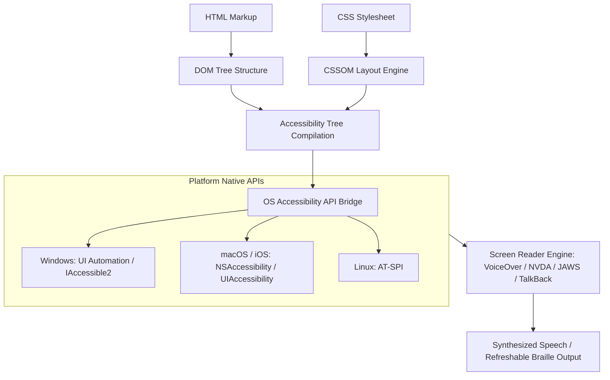
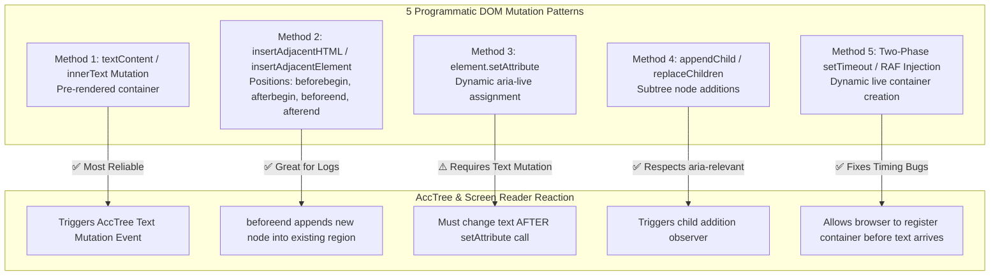
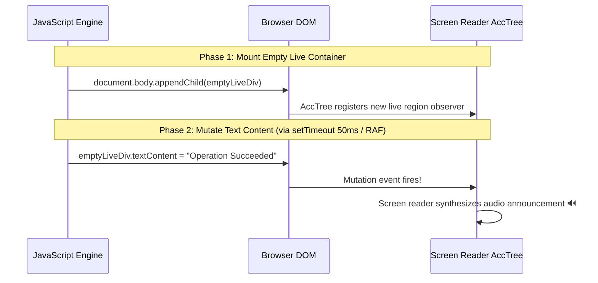
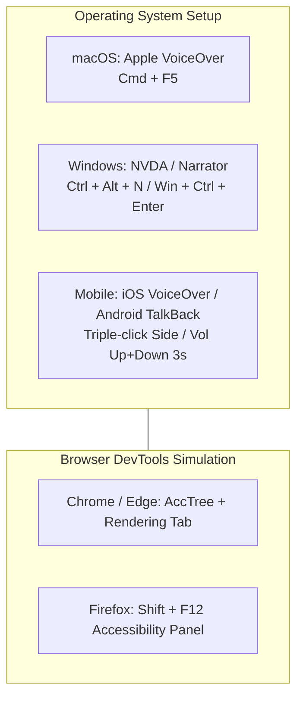

# Screen Readers & Accessibility Tree Architecture Guide

> Comprehensive guide to how browsers compile the DOM into the Accessibility Tree (AccTree), how Screen Readers (NVDA, JAWS, VoiceOver, TalkBack) parse it, and how to build accessible live regions.

---

## Table of Contents

- [Screen Readers \& Accessibility Tree Architecture Guide](#screen-readers--accessibility-tree-architecture-guide)
  - [Table of Contents](#table-of-contents)
  - [1. The Accessibility Tree (AccTree) Compilation Pipeline](#1-the-accessibility-tree-acctree-compilation-pipeline)
    - [The 4 Core Properties of Every AccTree Node:](#the-4-core-properties-of-every-acctree-node)
  - [2. Major Screen Readers \& Operating System APIs](#2-major-screen-readers--operating-system-apis)
  - [3. Virtual Cursor vs Forms / Focus Mode](#3-virtual-cursor-vs-forms--focus-mode)
  - [4. Master ARIA Live Regions Architecture](#4-master-aria-live-regions-architecture)
    - [The ARIA Live Attributes Taxonomy](#the-aria-live-attributes-taxonomy)
    - [Specialized ARIA Live Region Roles (Semantic Shortcuts)](#specialized-aria-live-region-roles-semantic-shortcuts)
    - [Programmatic DOM Mutation Patterns for `aria-live` (Vanilla JS \& DOM APIs)](#programmatic-dom-mutation-patterns-for-aria-live-vanilla-js--dom-apis)
      - [Method 1: Pre-Rendered Persistent Container + `textContent` (Industry Gold Standard)](#method-1-pre-rendered-persistent-container--textcontent-industry-gold-standard)
      - [Method 2: DOM Injection via `insertAdjacentHTML()` Positions](#method-2-dom-injection-via-insertadjacenthtml-positions)
        - [Code Example: Chat Stream with `insertAdjacentHTML('beforeend')`](#code-example-chat-stream-with-insertadjacenthtmlbeforeend)
      - [Method 3: Dynamic Attribute Manipulation with `setAttribute()`](#method-3-dynamic-attribute-manipulation-with-setattribute)
      - [Method 4: Node Creation \& Subtree Appends via `appendChild()` / `replaceChildren()`](#method-4-node-creation--subtree-appends-via-appendchild--replacechildren)
      - [Method 5: The Two-Phase Dynamic Injection Pattern (`setTimeout` / `requestAnimationFrame`)](#method-5-the-two-phase-dynamic-injection-pattern-settimeout--requestanimationframe)
    - [4 Golden Rules for Flawless Live Region Engineering](#4-golden-rules-for-flawless-live-region-engineering)
    - [6 Production-Grade React \& TypeScript Live Region Examples](#6-production-grade-react--typescript-live-region-examples)
      - [Example 1: Search Result Count Announcer (`role="status"`, `aria-atomic="true"`)](#example-1-search-result-count-announcer-rolestatus-aria-atomictrue)
      - [Example 2: Critical Session Timeout Alert (`role="alert"`, `aria-live="assertive"`)](#example-2-critical-session-timeout-alert-rolealert-aria-liveassertive)
      - [Example 3: Streaming Live Chat Log (`role="log"`, `aria-atomic="false"`, `aria-relevant="additions"`)](#example-3-streaming-live-chat-log-rolelog-aria-atomicfalse-aria-relevantadditions)
      - [Example 4: Data Table Loading State with `aria-busy`](#example-4-data-table-loading-state-with-aria-busy)
      - [Example 5: Periodic Countdown Timer (`role="timer"`)](#example-5-periodic-countdown-timer-roletimer)
      - [Example 6: Enterprise Toast Notification Queue Manager (`useAnnouncer`)](#example-6-enterprise-toast-notification-queue-manager-useannouncer)
  - [5. Accessible Name \& Description Computation](#5-accessible-name--description-computation)
  - [6. Debugging the Accessibility Tree in Chrome / Safari DevTools](#6-debugging-the-accessibility-tree-in-chrome--safari-devtools)
  - [7. Operating System \& Browser Accessibility Setup Guide (macOS \& Windows)](#7-operating-system--browser-accessibility-setup-guide-macos--windows)
    - [Part A: macOS VoiceOver Setup \& Operation](#part-a-macos-voiceover-setup--operation)
      - [1. How to Enable \& Disable VoiceOver](#1-how-to-enable--disable-voiceover)
      - [2. Mandatory Safari Configuration (One-Time Setup)](#2-mandatory-safari-configuration-one-time-setup)
      - [3. Essential VoiceOver Keyboard Shortcuts Cheat Sheet](#3-essential-voiceover-keyboard-shortcuts-cheat-sheet)
    - [Part B: Windows NVDA \& Narrator Setup \& Operation](#part-b-windows-nvda--narrator-setup--operation)
      - [1. NVDA (NonVisual Desktop Access) — The Industry Standard for Windows](#1-nvda-nonvisual-desktop-access--the-industry-standard-for-windows)
        - [NVDA Browse Mode vs Focus Mode](#nvda-browse-mode-vs-focus-mode)
        - [NVDA Single-Letter Quick Navigation in Browse Mode](#nvda-single-letter-quick-navigation-in-browse-mode)
      - [2. Windows Narrator (Built-in Alternative)](#2-windows-narrator-built-in-alternative)
      - [3. Windows High Contrast / Forced Colors Mode](#3-windows-high-contrast--forced-colors-mode)
    - [Part C: Mobile Testing (iOS \& Android)](#part-c-mobile-testing-ios--android)
      - [1. iOS VoiceOver](#1-ios-voiceover)
      - [2. Android TalkBack](#2-android-talkback)
    - [Part D: Browser DevTools Simulation (Instant Testing without Audio)](#part-d-browser-devtools-simulation-instant-testing-without-audio)

---

## 1. The Accessibility Tree (AccTree) Compilation Pipeline

Browsers do not pass raw HTML strings to screen readers. The browser parses HTML into the **DOM**, parses CSS into the **CSSOM**, and synthesizes them into an internal **Accessibility Tree (AccTree)**.



### The 4 Core Properties of Every AccTree Node:

1. **Role:** What the element is (`button`, `heading`, `dialog`, `checkbox`, `banner`).
2. **Name:** The human-readable label announced to the user (`"Submit Payment"`, `"Account Settings"`).
3. **State:** Dynamic conditions (`expanded="true"`, `checked="mixed"`, `disabled`, `busy`).
4. **Value:** Numeric or range data (`value="75%"` on a progress bar).

---

## 2. Major Screen Readers & Operating System APIs

| Screen Reader       | Platform    |         Market Share          | Underlying Native API             | Key Interaction Mechanism                                                                  |
| :------------------ | :---------- | :---------------------------: | :-------------------------------- | :----------------------------------------------------------------------------------------- |
| **NVDA**            | Windows     |             ~40%              | IAccessible2 / UI Automation      | Desktop Keys: <kbd>NVDA Key</kbd> (<kbd>Insert</kbd> / <kbd>Caps Lock</kbd>) + Navigation. |
| **JAWS**            | Windows     |             ~38%              | MSAA / UI Automation              | Enterprise Standard: Deep application and forms mode heuristics.                           |
| **Apple VoiceOver** | macOS / iOS | ~11% (Desktop), ~65% (Mobile) | NSAccessibility / UIAccessibility | Rotor navigation (<kbd>VO</kbd> + <kbd>U</kbd> on Mac, two-finger twist on iOS).           |
| **Google TalkBack** | Android     |         ~30% (Mobile)         | Android Accessibility Framework   | Linear swipe navigation and talkback gestures.                                             |

---

## 3. Virtual Cursor vs Forms / Focus Mode

Desktop screen readers (NVDA, JAWS) operate in two distinct keyboard interaction modes:

```
┌─────────────────────────────────────────────────────────────────────────────┐
│                       Browse Mode vs Forms / Focus Mode                     │
├──────────────────────────┬──────────────────────────────────────────────────┤
│ Mode                     │ Behavior & Key Capture                           │
├──────────────────────────┼──────────────────────────────────────────────────┤
│ Browse / Virtual Mode    │ Screen reader intercepts all single-key presses: │
│                          │ • Pressing 'H' jumps to the next heading         │
│                          │ • Pressing 'T' jumps to the next table           │
│                          │ • Pressing 'B' jumps to the next button          │
├──────────────────────────┼──────────────────────────────────────────────────┤
│ Forms / Focus Mode       │ Screen reader passes keystrokes directly to the  │
│                          │ web application so the user can type into inputs,│
│                          │ use Arrow keys in custom grids, or type letters. │
└──────────────────────────┴──────────────────────────────────────────────────┘
```

---

## 4. Master ARIA Live Regions Architecture

Live regions notify screen reader users of dynamic, asynchronous content updates without shifting physical keyboard focus or interrupting user navigation.

```mermaid
flowchart TD
    subgraph ARIA_Live_Engine [ARIA Live Region Engine]
        Trigger[Dynamic Asynchronous DOM Mutation] --> CheckLive{Evaluate aria-live}

        CheckLive -->|polite| PoliteQueue[Queue in Speech Synthesizer Buffer]
        PoliteQueue --> P_Play[Announce during next natural speech pause]

        CheckLive -->|assertive| AssertiveQueue[Flush & Preempt Speech Buffer]
        AssertiveQueue --> A_Play[Interrupt speech immediately for critical alert]

        CheckLive -->|off| Silent[No programmatic audio announcement]
    end

    subgraph Modifiers [Live Region Attribute Modifiers]
        Atomic[aria-atomic: true | false]
        Relevant[aria-relevant: additions | removals | text | all]
        Busy[aria-busy: true | false]
    end

    ARIA_Live_Engine --- Modifiers
```

---

### The ARIA Live Attributes Taxonomy

| Attribute           | Valid Values                                         |      Default       | Purpose & AccTree Impact                                                                                                                                                         |
| :------------------ | :--------------------------------------------------- | :----------------: | :------------------------------------------------------------------------------------------------------------------------------------------------------------------------------- |
| **`aria-live`**     | `"off"` \| `"polite"` \| `"assertive"`               |      `"off"`       | Sets the urgency of dynamic announcements. `"polite"` queues speech; `"assertive"` interrupts active speech immediately.                                                         |
| **`aria-atomic`**   | `"true"` \| `"false"`                                |     `"false"`      | When `"true"`, assistive technology reads the **entire live region subtree** when any part changes. When `"false"`, it announces **only the exact modified/appended text node**. |
| **`aria-relevant`** | `"additions"` \| `"removals"` \| `"text"` \| `"all"` | `"additions text"` | Controls which DOM mutations trigger an announcement. Use `"additions"` for chat logs, and `"all"` when item removals must be explicitly communicated.                           |
| **`aria-busy`**     | `"true"` \| `"false"`                                |     `"false"`      | Informs screen readers that an element is currently updating/fetching data. Screen readers pause reading until `aria-busy="false"`, preventing partial or garbled announcements. |

---

### Specialized ARIA Live Region Roles (Semantic Shortcuts)

Rather than manually configuring `aria-live` and `aria-atomic` attributes, W3C defines built-in roles with predefined live region semantics:

```
┌────────────────────────────────────────────────────────────────────────────────────────┐
│                        Predefined ARIA Live Region Roles Matrix                        │
├─────────────────┬───────────┬─────────────┬────────────────────────────────────────────┤
│ ARIA Role       │ aria-live │ aria-atomic │ Typical Architectural Use Case             │
├─────────────────┼───────────┼─────────────┼────────────────────────────────────────────┤
│ role="status"   │ polite    │ true        │ Toasts, search counts, cart quantity, save │
├─────────────────┼───────────┼─────────────┼────────────────────────────────────────────┤
│ role="alert"    │ assertive │ true        │ Critical validation errors, timeouts       │
├─────────────────┼───────────┼─────────────┼────────────────────────────────────────────┤
│ role="log"      │ polite    │ false       │ Chat streams, terminal logs, audit history │
├─────────────────┼───────────┼─────────────┼────────────────────────────────────────────┤
│ role="timer"    │ off       │ false       │ Stopwatch, countdown clocks (polled)       │
├─────────────────┼───────────┼─────────────┼────────────────────────────────────────────┤
│ role="marquee"  │ off       │ false       │ Stock tickers, continuous breaking news    │
├─────────────────┼───────────┼─────────────┼────────────────────────────────────────────┤
│ <output> (HTML) │ polite    │ true        │ Native form calculation / conversion result│
└─────────────────┴───────────┴─────────────┴────────────────────────────────────────────┘
```

---

### Programmatic DOM Mutation Patterns for `aria-live` (Vanilla JS & DOM APIs)

Screen readers do not monitor JavaScript variables; they monitor **DOM Mutation Events in the browser's Accessibility Tree (AccTree)**. How you inject and mutate DOM nodes determines whether assistive technology speaks or stays silent.



---

#### Method 1: Pre-Rendered Persistent Container + `textContent` (Industry Gold Standard)

The most robust, cross-browser technique. Mount an empty container in HTML, and mutate its `textContent` when events occur:

```html
<!-- In static HTML or App Root -->
<div id="global-announcer" role="status" aria-live="polite" aria-atomic="true" class="sr-only"></div>
```

```javascript
function announceMessage(message) {
  const announcer = document.getElementById('global-announcer');

  // ⚠️ TRAP: If new message equals old message, Screen Readers ignore it.
  // 💡 FIX: Clear first, then set new text on the next animation frame.
  announcer.textContent = '';
  requestAnimationFrame(() => {
    announcer.textContent = message;
  });
}

// Usage:
announceMessage('Profile updated successfully.');
```

---

#### Method 2: DOM Injection via `insertAdjacentHTML()` Positions

`insertAdjacentHTML(position, text)` allows precise insertion relative to target elements. Understanding positions is crucial for live region architecture:

```
                  <!-- 'beforebegin' -->
┌─────────────────────────────────────────────────────────┐
│ <div id="live-chat-feed" role="log" aria-live="polite"> │
│                                                         │
│   <!-- 'afterbegin'  (Prepends newest message at top)   │
│   <p class="msg">Newest Message</p>                     │
│                                                         │
│   <p class="msg">Existing Message 1</p>                 │
│   <p class="msg">Existing Message 2</p>                 │
│                                                         │
│   <!-- 'beforeend'   (Appends newest message at bottom) │
│   <p class="msg">Incoming Chat Message</p>              │
│                                                         │
└─────────────────────────────────────────────────────────┘
                  <!-- 'afterend' -->
```

| Position            | Relative Placement                         | AccTree & Live Region Behavior                                                                                                                                    |
| :------------------ | :----------------------------------------- | :---------------------------------------------------------------------------------------------------------------------------------------------------------------- |
| **`'beforeend'`**   | Inside target, after its last child.       | **Recommended for Feeds & Logs:** Appends a new item into an active `role="log"` region. With `aria-atomic="false"`, screen reader announces _only_ the new item. |
| **`'afterbegin'`**  | Inside target, before its first child.     | **Recommended for Reverse Chronological Timelines:** Prepends new notifications at the top of the list.                                                           |
| **`'beforebegin'`** | Outside target, before the element itself. | Inserts _outside_ the target element. Will not be announced unless the target is already enclosed in a parent live region.                                        |
| **`'afterend'`**    | Outside target, after the element itself.  | Inserts _outside_ the target element. Useful for appending standalone dismissible alert banners.                                                                  |

##### Code Example: Chat Stream with `insertAdjacentHTML('beforeend')`

```javascript
function appendChatMessage(sender, text) {
  const chatLog = document.getElementById('live-chat-feed');

  // Clean, escaped HTML string
  const messageHTML = `
    <li class="chat-item">
      <strong>${escapeHTML(sender)}:</strong> ${escapeHTML(text)}
    </li>
  `;

  // ✅ Appends directly inside the existing live region
  chatLog.insertAdjacentHTML('beforeend', messageHTML);
}
```

---

#### Method 3: Dynamic Attribute Manipulation with `setAttribute()`

```javascript
// ❌ WRONG: Setting aria-live on an element that ALREADY has text
const banner = document.getElementById('error-banner'); // contains "Error 500"
banner.setAttribute('aria-live', 'assertive'); // 🚨 FAILS: Screen readers will NOT read existing text!

// ✅ CORRECT: Set aria-live FIRST, then mutate text content
const statusNode = document.createElement('div');
statusNode.setAttribute('role', 'status');
statusNode.setAttribute('aria-live', 'polite');
statusNode.setAttribute('aria-atomic', 'true');
statusNode.className = 'sr-only';
document.body.appendChild(statusNode);

// Mutate text in subsequent execution step
setTimeout(() => {
  statusNode.textContent = 'Data synchronization complete.';
}, 50);
```

---

#### Method 4: Node Creation & Subtree Appends via `appendChild()` / `replaceChildren()`

When managing dynamic widgets (e.g., toast queues), you can append structured DOM elements:

```javascript
function spawnToastNotification(message, type = 'polite') {
  const container = document.getElementById('toast-container'); // Has aria-live="polite"

  const toast = document.createElement('div');
  toast.className = `toast-item toast-${type}`;
  toast.textContent = message;

  // Append new node into the live container
  container.appendChild(toast);

  // Automatically clean up after 5 seconds
  setTimeout(() => {
    if (container.contains(toast)) {
      container.removeChild(toast);
    }
  }, 5000);
}
```

---

#### Method 5: The Two-Phase Dynamic Injection Pattern (`setTimeout` / `requestAnimationFrame`)

If an application must create a live region **on the fly** (e.g., in a standalone microfrontend or modal where no pre-rendered root container exists), you must split the creation into **two asynchronous phases**:



```javascript
/**
 * Standalone transient live announcement helper
 * Safely creates, announces, and destroys a dynamic live region
 */
function announceTransient(message, priority = 'polite', durationMs = 4000) {
  // Phase 1: Create and attach EMPTY live region to DOM
  const region = document.createElement('div');
  region.setAttribute('role', priority === 'assertive' ? 'alert' : 'status');
  region.setAttribute('aria-live', priority);
  region.setAttribute('aria-atomic', 'true');
  region.className = 'sr-only';
  document.body.appendChild(region);

  // Phase 2: Inject text after browser paints AccTree node (50ms delay)
  setTimeout(() => {
    region.textContent = message;
  }, 50);

  // Phase 3: Teardown and cleanup from DOM after announcement finishes
  setTimeout(() => {
    if (document.body.contains(region)) {
      document.body.removeChild(region);
    }
  }, durationMs);
}

// Usage:
// announceTransient("Payment approved. Redirecting to receipt...", "polite");
```

---

### 4 Golden Rules for Flawless Live Region Engineering

```
Rule 1: Pre-Render Container  ──▶ The live container MUST exist in the DOM before injecting text.
Rule 2: Never aria-live="assertive" by default ──▶ Reserve for critical session or security alerts.
Rule 3: Use .sr-only, Never display:none ──▶ display:none or visibility:hidden destroys AccTree listeners.
Rule 4: Clear Before Re-announcing ──▶ If message text is identical, clear string first to trigger AccTree mutation.
```

---

### 6 Production-Grade React & TypeScript Live Region Examples

---

#### Example 1: Search Result Count Announcer (`role="status"`, `aria-atomic="true"`)

Announces debounced search results without shifting keyboard focus from the search input field.

```tsx
import React, { useState, useEffect } from 'react';

export function SearchFilterWithAnnouncer({ items }: { items: string[] }) {
  const [query, setQuery] = useState('');
  const [announcement, setAnnouncement] = useState('');

  const filteredItems = items.filter((item) => item.toLowerCase().includes(query.toLowerCase()));

  // Debounce announcement to avoid overwhelming screen reader while typing
  useEffect(() => {
    const timer = setTimeout(() => {
      if (query.trim()) {
        const count = filteredItems.length;
        setAnnouncement(count === 1 ? '1 result available.' : `${count} results available.`);
      } else {
        setAnnouncement('');
      }
    }, 400);

    return () => clearTimeout(timer);
  }, [query, filteredItems.length]);

  return (
    <div className="search-widget">
      <label htmlFor="search-input">Search Knowledge Base</label>
      <input
        id="search-input"
        type="search"
        value={query}
        onChange={(e) => setQuery(e.target.value)}
        placeholder="Type to filter..."
        className="search-field"
      />

      {/* ✅ Persistent live region: container is in DOM from initial render */}
      <div role="status" aria-live="polite" aria-atomic="true" className="sr-only">
        {announcement}
      </div>

      <ul className="results-list">
        {filteredItems.map((item) => (
          <li key={item}>{item}</li>
        ))}
      </ul>
    </div>
  );
}
```

---

#### Example 2: Critical Session Timeout Alert (`role="alert"`, `aria-live="assertive"`)

Uses `role="alert"` for high-priority security warnings that must interrupt ongoing screen reader speech immediately.

```tsx
import React, { useState, useEffect } from 'react';

export function SessionTimeoutMonitor({ timeoutSeconds = 300 }: { timeoutSeconds?: number }) {
  const [secondsRemaining, setSecondsRemaining] = useState(timeoutSeconds);
  const [alertMessage, setAlertMessage] = useState('');

  useEffect(() => {
    const interval = setInterval(() => {
      setSecondsRemaining((prev) => {
        if (prev <= 1) {
          clearInterval(interval);
          setAlertMessage('Your session has expired. You have been logged out.');
          return 0;
        }
        if (prev === 60) {
          // Assertive interruption at critical threshold (1 minute warning)
          setAlertMessage('Warning: Your session will expire in 60 seconds due to inactivity.');
        }
        return prev - 1;
      });
    }, 1000);

    return () => clearInterval(interval);
  }, []);

  return (
    <div>
      {/* ✅ Critical alert region: pre-rendered, triggers when alertMessage updates */}
      <div role="alert" aria-live="assertive" aria-atomic="true" className="sr-only">
        {alertMessage}
      </div>

      {secondsRemaining <= 60 && secondsRemaining > 0 && (
        <div className="visible-warning-banner">
          <p>⚠️ Session expiring in {secondsRemaining} seconds. Please save your work.</p>
        </div>
      )}
    </div>
  );
}
```

---

#### Example 3: Streaming Live Chat Log (`role="log"`, `aria-atomic="false"`, `aria-relevant="additions"`)

Demonstrates streaming chat messages where only new messages are read out (atomic = false) without re-reading the entire message history.

```tsx
import React from 'react';

interface ChatMessage {
  id: string;
  sender: string;
  text: string;
  timestamp: string;
}

export function StreamingChatLog({ messages }: { messages: ChatMessage[] }) {
  return (
    <div className="chat-container">
      <h2>Team Discussion</h2>

      {/* ✅ role="log" with aria-atomic="false" and aria-relevant="additions" */}
      <ul
        role="log"
        aria-live="polite"
        aria-atomic="false"
        aria-relevant="additions text"
        aria-label="Live conversation feed"
        className="chat-stream"
      >
        {messages.map((msg) => (
          <li key={msg.id} className="chat-bubble">
            <span className="sender">{msg.sender}:</span>
            <span className="message-body">{msg.text}</span>
            <time className="timestamp">{msg.timestamp}</time>
          </li>
        ))}
      </ul>
    </div>
  );
}
```

---

#### Example 4: Data Table Loading State with `aria-busy`

Prevents screen readers from reading partial or stale data while asynchronous fetching is active.

```tsx
import React, { useState, useEffect } from 'react';

interface UserData {
  id: string;
  name: string;
  role: string;
}

export function AccessibleAsyncTable() {
  const [data, setData] = useState<UserData[]>([]);
  const [isLoading, setIsLoading] = useState(false);

  const fetchUsers = async () => {
    setIsLoading(true);
    try {
      const res = await fetch('/api/users');
      const json = await res.json();
      setData(json);
    } finally {
      setIsLoading(false);
    }
  };

  return (
    <div>
      <button type="button" onClick={fetchUsers} disabled={isLoading}>
        {isLoading ? 'Refreshing...' : 'Refresh User Data'}
      </button>

      {/* ✅ aria-busy pauses AccTree reading while data updates */}
      <div role="region" aria-live="polite" aria-busy={isLoading} aria-label="User roster" className="table-wrapper">
        {isLoading ? (
          <div role="status" className="loading-spinner">
            Loading user records, please wait...
          </div>
        ) : (
          <table>
            <thead>
              <tr>
                <th scope="col">Name</th>
                <th scope="col">Role</th>
              </tr>
            </thead>
            <tbody>
              {data.map((user) => (
                <tr key={user.id}>
                  <td>{user.name}</td>
                  <td>{user.role}</td>
                </tr>
              ))}
            </tbody>
          </table>
        )}
      </div>
    </div>
  );
}
```

---

#### Example 5: Periodic Countdown Timer (`role="timer"`)

Avoids auditory spam by suppressing continuous ticking updates, announcing only at key interval milestones.

```tsx
import React, { useState, useEffect } from 'react';

export function AccessibleMilestoneTimer({ durationMinutes = 15 }: { durationMinutes?: number }) {
  const [secondsRemaining, setSecondsRemaining] = useState(durationMinutes * 60);
  const [periodicSpeech, setPeriodicSpeech] = useState('');

  useEffect(() => {
    const interval = setInterval(() => {
      setSecondsRemaining((prev) => {
        if (prev <= 1) {
          clearInterval(interval);
          setPeriodicSpeech('Time is up. Assessment submitted.');
          return 0;
        }

        const next = prev - 1;
        // Announce at 10m, 5m, 1m, and 30s milestones only
        if (next === 600) setPeriodicSpeech('10 minutes remaining.');
        if (next === 300) setPeriodicSpeech('5 minutes remaining.');
        if (next === 60) setPeriodicSpeech('1 minute remaining.');
        if (next === 30) setPeriodicSpeech('30 seconds remaining.');

        return next;
      });
    }, 1000);

    return () => clearInterval(interval);
  }, []);

  const formatTime = (totalSec: number) => {
    const mins = Math.floor(totalSec / 60);
    const secs = totalSec % 60;
    return `${mins}:${secs.toString().padStart(2, '0')}`;
  };

  return (
    <div className="timer-card">
      {/* Visual countdown clock with role="timer" */}
      <div role="timer" aria-label="Exam remaining time" className="timer-display">
        {formatTime(secondsRemaining)}
      </div>

      {/* ✅ Throttled milestone speech announcer */}
      <div role="status" aria-live="polite" aria-atomic="true" className="sr-only">
        {periodicSpeech}
      </div>
    </div>
  );
}
```

---

#### Example 6: Enterprise Toast Notification Queue Manager (`useAnnouncer`)

Global singleton portal providing debounced, deduplicated polite and assertive announcements across an entire React SPA.

```tsx
import React, { useState, useEffect, createContext, useContext, useCallback } from 'react';

type Politeness = 'polite' | 'assertive';

interface Announcement {
  id: number;
  message: string;
  politeness: Politeness;
}

interface AnnouncerContextValue {
  announce: (message: string, politeness?: Politeness) => void;
}

const AnnouncerContext = createContext<AnnouncerContextValue>({
  announce: () => {},
});

export function AnnouncerProvider({ children }: { children: React.ReactNode }) {
  const [politeMessage, setPoliteMessage] = useState('');
  const [assertiveMessage, setAssertiveMessage] = useState('');

  const announce = useCallback((message: string, politeness: Politeness = 'polite') => {
    if (politeness === 'assertive') {
      // Clear first to guarantee re-announcement of identical strings
      setAssertiveMessage('');
      requestAnimationFrame(() => setAssertiveMessage(message));
    } else {
      setPoliteMessage('');
      requestAnimationFrame(() => setPoliteMessage(message));
    }
  }, []);

  return (
    <AnnouncerContext.Provider value={{ announce }}>
      {children}

      {/* ✅ Global Persistent Live Regions Portal */}
      <div aria-hidden="false" className="announcer-portal">
        <div role="status" aria-live="polite" aria-atomic="true" className="sr-only">
          {politeMessage}
        </div>
        <div role="alert" aria-live="assertive" aria-atomic="true" className="sr-only">
          {assertiveMessage}
        </div>
      </div>
    </AnnouncerContext.Provider>
  );
}

// Custom Hook for consuming components
export function useAnnouncer() {
  return useContext(AnnouncerContext);
}

// Usage in any child component:
// const { announce } = useAnnouncer();
// announce("Item added to shopping cart.");
// announce("Network disconnected. Retrying...", "assertive");
```

---

## 5. Accessible Name & Description Computation

Assistive technology computes the label of an element using the W3C **AccName 1.2** specification:

```html
<!-- Priority 1: aria-labelledby (Highest) -->
<h2 id="billing-title">Billing Information</h2>
<section aria-labelledby="billing-title">...</section>

<!-- Priority 2: aria-label -->
<button aria-label="Close dialog">✕</button>

<!-- Priority 3: Native label association -->
<label htmlFor="card-num">Card Number</label>
<input id="card-num" />

<!-- Priority 4: Subtree text content (Lowest) -->
<button>Submit Order</button>
```

---

## 6. Debugging the Accessibility Tree in Chrome / Safari DevTools

1. **Chrome DevTools:** Open Elements panel $\rightarrow$ Select element $\rightarrow$ Open **Accessibility** tab (shows Computed Properties, ARIA Attributes, and Full Page Accessibility Tree toggle).
2. **Full Page AccTree Toggle:** Click the human icon in the top right of Chrome Elements panel to switch the entire DOM tree view into the Accessibility Tree.
3. **Safari Web Inspector:** Open Elements $\rightarrow$ Node inspector $\rightarrow$ Accessibility tab to view NSAccessibility hierarchy on macOS.

---

## 7. Operating System & Browser Accessibility Setup Guide (macOS & Windows)

Below is the step-by-step operational runbook to enable, configure, and operate screen readers and high contrast modes on macOS and Windows.



---

### Part A: macOS VoiceOver Setup & Operation

Apple VoiceOver is built directly into macOS (zero installation required).

#### 1. How to Enable & Disable VoiceOver

- **Toggle Shortcut:** Press <kbd>Cmd</kbd> + <kbd>F5</kbd> (or triple-click <kbd>Touch ID</kbd> / Power button).
- **VoiceOver Modifier Key (<kbd>VO</kbd>):** By default, <kbd>Control</kbd> + <kbd>Option</kbd> (or <kbd>Caps Lock</kbd> if enabled in VoiceOver Utility).

#### 2. Mandatory Safari Configuration (One-Time Setup)

By default, macOS Safari skips non-input links when pressing <kbd>Tab</kbd>. You must enable full web tab navigation:

1. Open **Safari** $\rightarrow$ **Settings** (or <kbd>Cmd</kbd> + <kbd>,</kbd>).
2. Navigate to the **Advanced** tab.
3. Check **"Press Tab to highlight each item on a webpage"**.
4. _(macOS Sonoma+)_: In System Settings $\rightarrow$ **Keyboard** $\rightarrow$ enable **"Keyboard navigation"** (Full Keyboard Access).

#### 3. Essential VoiceOver Keyboard Shortcuts Cheat Sheet

| Action                            | Shortcut                              | Description                                                                |
| :-------------------------------- | :------------------------------------ | :------------------------------------------------------------------------- |
| **Start / Stop VoiceOver**        | <kbd>Cmd</kbd> + <kbd>F5</kbd>        | Toggles VoiceOver on/off.                                                  |
| **Pause / Resume Speech**         | <kbd>Control</kbd>                    | Instantly silences or resumes current speech output.                       |
| **Navigate Next Item**            | <kbd>VO</kbd> + <kbd>&rarr;</kbd>     | Moves VoiceOver cursor to the next element.                                |
| **Navigate Previous Item**        | <kbd>VO</kbd> + <kbd>&larr;</kbd>     | Moves VoiceOver cursor to the previous element.                            |
| **Activate / Click Element**      | <kbd>VO</kbd> + <kbd>Space</kbd>      | Clicks the currently focused link, button, or toggle.                      |
| **Open VoiceOver Rotor**          | <kbd>VO</kbd> + <kbd>U</kbd>          | Opens the popup menu to jump across Headings, Landmarks, Links, and Forms. |
| **Navigate Rotor Categories**     | <kbd>&larr;</kbd> / <kbd>&rarr;</kbd> | Switches between Landmarks, Headings, Form Controls, Links, Tables.        |
| **Read from Current Position**    | <kbd>VO</kbd> + <kbd>A</kbd>          | Reads the rest of the document continuously.                               |
| **Read Entire Document from Top** | <kbd>VO</kbd> + <kbd>B</kbd>          | Starts reading from the very beginning of the page.                        |

---

### Part B: Windows NVDA & Narrator Setup & Operation

#### 1. NVDA (NonVisual Desktop Access) — The Industry Standard for Windows

NVDA is the most widely used screen reader on Windows (free & open-source).

- **Download:** [https://www.nvaccess.org/download/](https://www.nvaccess.org/download/)
- **Start NVDA:** Press <kbd>Ctrl</kbd> + <kbd>Alt</kbd> + <kbd>N</kbd> (or launch from Start menu).
- **Stop / Exit NVDA:** Press <kbd>NVDA</kbd> + <kbd>Q</kbd>, then press <kbd>Enter</kbd>.
- **NVDA Modifier Key (<kbd>NVDA</kbd>):** <kbd>Insert</kbd> (on numpad or main keyboard) or <kbd>Caps Lock</kbd>.

##### NVDA Browse Mode vs Focus Mode

- **Browse Mode (Default for reading):** Single-letter keystrokes navigate page elements.
- **Focus / Forms Mode (For typing in inputs):** Passes keystrokes directly to the browser.
- **Toggle Mode Manually:** Press <kbd>NVDA</kbd> + <kbd>Space</kbd>.

##### NVDA Single-Letter Quick Navigation in Browse Mode

|             Single Key              | Jump Destination                                                            |
| :---------------------------------: | :-------------------------------------------------------------------------- |
| <kbd>H</kbd> / <kbd>Shift + H</kbd> | Next / Previous Heading (any level)                                         |
|    <kbd>1</kbd> to <kbd>6</kbd>     | Jump specifically to Heading level 1 through 6                              |
| <kbd>D</kbd> / <kbd>Shift + D</kbd> | Next / Previous Landmark Region (`<main>`, `<nav>`, `<header>`)             |
| <kbd>F</kbd> / <kbd>Shift + F</kbd> | Next / Previous Form Field (`<input>`, `<select>`, `<textarea>`)            |
| <kbd>B</kbd> / <kbd>Shift + B</kbd> | Next / Previous Button (`<button>`, `role="button"`)                        |
| <kbd>K</kbd> / <kbd>Shift + K</kbd> | Next / Previous Link (`<a>`)                                                |
| <kbd>T</kbd> / <kbd>Shift + T</kbd> | Next / Previous Data Table (`<table>`, `role="grid"`)                       |
|        <kbd>NVDA + F7</kbd>         | Open **Elements List** dialog (Tree view of all Headings, Links, Landmarks) |

---

#### 2. Windows Narrator (Built-in Alternative)

Built directly into Windows 10 & 11 without downloading anything:

- **Toggle Shortcut:** Press <kbd>Win</kbd> + <kbd>Ctrl</kbd> + <kbd>Enter</kbd>.
- **Narrator Modifier Key:** <kbd>Caps Lock</kbd> or <kbd>Insert</kbd>.
- **Navigate:** <kbd>Caps Lock</kbd> + <kbd>&larr;</kbd> / <kbd>&rarr;</kbd> Arrow keys.

---

#### 3. Windows High Contrast / Forced Colors Mode

To test `@media (forced-colors: active)` and verify that borders and system colors render properly:

- **Toggle Shortcut:** Press <kbd>Left Alt</kbd> + <kbd>Left Shift</kbd> + <kbd>Print Screen</kbd>.
- **Settings Path:** Windows **Settings** $\rightarrow$ **Accessibility** $\rightarrow$ **Contrast Themes** (Choose _Aquatic_, _Desert_, _Dusk_, or _Night Sky_).

---

### Part C: Mobile Testing (iOS & Android)

#### 1. iOS VoiceOver

- **How to Enable:** Settings $\rightarrow$ **Accessibility** $\rightarrow$ **VoiceOver** $\rightarrow$ Toggle **On**.
- **Quick Accessibility Shortcut:** Settings $\rightarrow$ **Accessibility** $\rightarrow$ **Accessibility Shortcut** $\rightarrow$ Check **VoiceOver**. Now triple-click the Side/Power button to toggle VoiceOver anytime.
- **Gestures:**
  - **Swipe Right / Left:** Move focus to next/previous element.
  - **Double-Tap:** Activate focused button/link.
  - **Two-Finger Rotation (Rotor):** Rotate two fingers like a dial to choose navigation by Headings, Links, or Landmarks, then swipe up/down.

#### 2. Android TalkBack

- **How to Enable:** Settings $\rightarrow$ **Accessibility** $\rightarrow$ **TalkBack** $\rightarrow$ Toggle **On**.
- **Quick Shortcut:** Press and hold **both Volume Up + Volume Down buttons** for 3 seconds.
- **Gestures:**
  - **Swipe Right / Left:** Move focus sequentially.
  - **Double-Tap:** Activate selected element.
  - **Swipe Up then Right:** Open the TalkBack Global Context Menu.

---

### Part D: Browser DevTools Simulation (Instant Testing without Audio)

If you need to test accessibility features quickly without turning on speech:

```
┌─────────────────────────────────────────────────────────────────────────────┐
│                   Chrome & Edge DevTools Accessibility Tools                │
├──────────────────────────┬──────────────────────────────────────────────────┤
│ Tool                     │ How to Access & What it Tests                    │
├──────────────────────────┼──────────────────────────────────────────────────┤
│ Full AccTree Viewer      │ DevTools → Elements → Click Human Icon (top-rt)  │
│                          │ Inspects the full compiled Accessibility Tree.   │
├──────────────────────────┼──────────────────────────────────────────────────┤
│ Contrast & Color Picker  │ Inspect element with text → Click color swatch   │
│                          │ Displays APCA & WCAG AA/AAA pass/fail indicator. │
├──────────────────────────┼──────────────────────────────────────────────────┤
│ Vision Deficiencies      │ DevTools (Cmd+Shift+P) → Type "Rendering" →      │
│                          │ Emulate vision deficiencies (Protanopia, etc.)   │
├──────────────────────────┼──────────────────────────────────────────────────┤
│ Forced Colors Mode       │ DevTools → Rendering tab →                       │
│                          │ Emulate CSS media feature forced-colors: active  │
└──────────────────────────┴──────────────────────────────────────────────────┘
```
