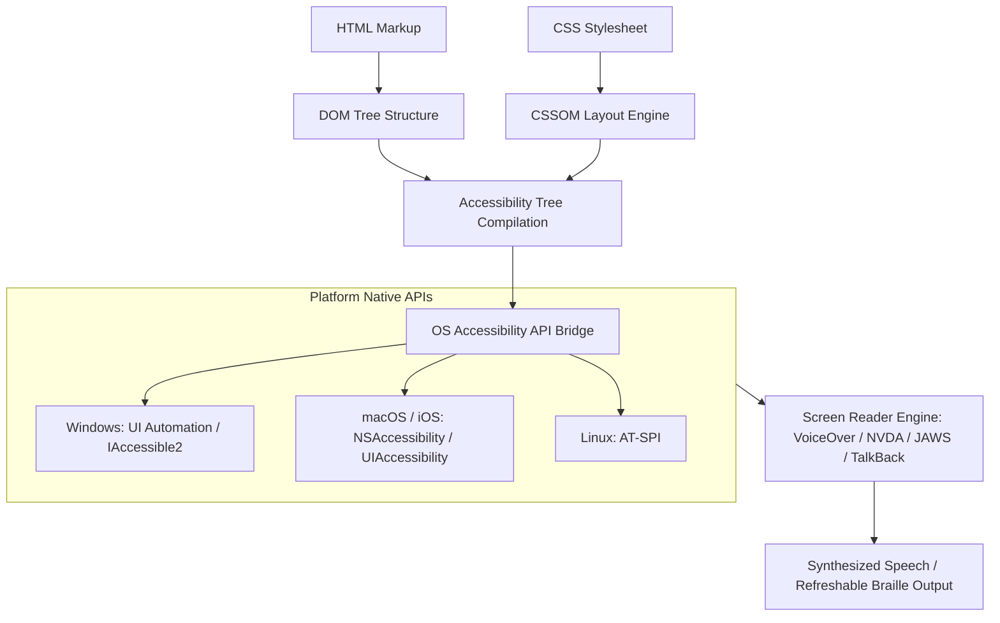
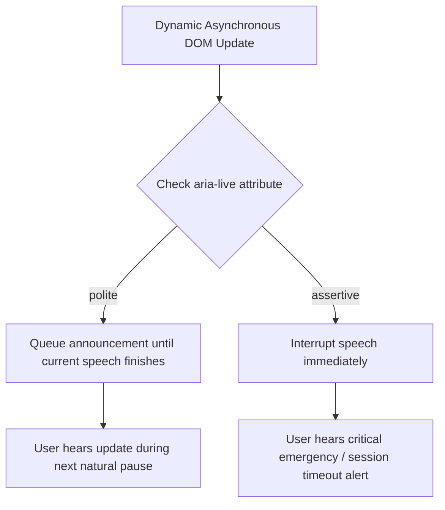

# Screen Readers & Accessibility Tree Architecture Guide

> Comprehensive guide to how browsers compile the DOM into the Accessibility Tree (AccTree), how Screen Readers (NVDA, JAWS, VoiceOver, TalkBack) parse it, and how to build accessible live regions.

---

## Table of Contents

- [Screen Readers \& Accessibility Tree Architecture Guide](#screen-readers--accessibility-tree-architecture-guide)
  - [Table of Contents](#table-of-contents)
  - [1. The Accessibility Tree (AccTree) Compilation Pipeline](#1-the-accessibility-tree-acctree-compilation-pipeline)
    - [The 4 Core Properties of Every AccTree Node:](#the-4-core-properties-of-every-acctree-node)
  - [2. Major Screen Readers \& Operating System APIs](#2-major-screen-readers--operating-system-apis)
  - [3. Virtual Cursor vs Forms / Focus Mode](#3-virtual-cursor-vs-forms--focus-mode)
  - [4. Live Regions: `aria-live="polite"` vs `aria-live="assertive"`](#4-live-regions-aria-livepolite-vs-aria-liveassertive)
    - [Best Practice Rules for Live Regions:](#best-practice-rules-for-live-regions)
  - [5. Accessible Name \& Description Computation](#5-accessible-name--description-computation)
  - [6. Debugging the Accessibility Tree in Chrome / Safari DevTools](#6-debugging-the-accessibility-tree-in-chrome--safari-devtools)

---

## 1. The Accessibility Tree (AccTree) Compilation Pipeline

Browsers do not pass raw HTML strings to screen readers. The browser parses HTML into the **DOM**, parses CSS into the **CSSOM**, and synthesizes them into an internal **Accessibility Tree (AccTree)**.



### The 4 Core Properties of Every AccTree Node:

1. **Role:** What the element is (`button`, `heading`, `dialog`, `checkbox`, `banner`).
2. **Name:** The human-readable label announced to the user (`"Submit Payment"`, `"Account Settings"`).
3. **State:** Dynamic conditions (`expanded="true"`, `checked="mixed"`, `disabled`, `busy`).
4. **Value:** Numeric or range data (`value="75%"` on a progress bar).

---

## 2. Major Screen Readers & Operating System APIs

| Screen Reader       | Platform    |         Market Share          | Underlying Native API             | Key Interaction Mechanism                                                                  |
| :------------------ | :---------- | :---------------------------: | :-------------------------------- | :----------------------------------------------------------------------------------------- |
| **NVDA**            | Windows     |             ~40%              | IAccessible2 / UI Automation      | Desktop Keys: <kbd>NVDA Key</kbd> (<kbd>Insert</kbd> / <kbd>Caps Lock</kbd>) + Navigation. |
| **JAWS**            | Windows     |             ~38%              | MSAA / UI Automation              | Enterprise Standard: Deep application and forms mode heuristics.                           |
| **Apple VoiceOver** | macOS / iOS | ~11% (Desktop), ~65% (Mobile) | NSAccessibility / UIAccessibility | Rotor navigation (<kbd>VO</kbd> + <kbd>U</kbd> on Mac, two-finger twist on iOS).           |
| **Google TalkBack** | Android     |         ~30% (Mobile)         | Android Accessibility Framework   | Linear swipe navigation and talkback gestures.                                             |

---

## 3. Virtual Cursor vs Forms / Focus Mode

Desktop screen readers (NVDA, JAWS) operate in two distinct keyboard interaction modes:

```
┌─────────────────────────────────────────────────────────────────────────────┐
│                       Browse Mode vs Forms / Focus Mode                     │
├──────────────────────────┬──────────────────────────────────────────────────┤
│ Mode                     │ Behavior & Key Capture                           │
├──────────────────────────┼──────────────────────────────────────────────────┤
│ Browse / Virtual Mode    │ Screen reader intercepts all single-key presses: │
│                          │ • Pressing 'H' jumps to the next heading         │
│                          │ • Pressing 'T' jumps to the next table           │
│                          │ • Pressing 'B' jumps to the next button          │
├──────────────────────────┼──────────────────────────────────────────────────┤
│ Forms / Focus Mode       │ Screen reader passes keystrokes directly to the  │
│                          │ web application so the user can type into inputs,│
│                          │ use Arrow keys in custom grids, or type letters. │
└──────────────────────────┴──────────────────────────────────────────────────┘
```

---

## 4. Live Regions: `aria-live="polite"` vs `aria-live="assertive"`

Live regions notify screen reader users of dynamic asynchronous content changes without shifting physical keyboard focus.



### Best Practice Rules for Live Regions:

1. **Instantiate Early:** The live region container element must exist in the initial DOM. Injecting both the container and text simultaneously often fails to trigger announcements.
2. **Use `aria-live="polite"` for 95% of cases:** Toasts, search result counts, cart quantity updates.
3. **Reserve `aria-live="assertive"` for critical emergencies:** Session expiration warnings, system error alerts.

```tsx
export function ToastAnnouncer({ message }: { message: string }) {
  return (
    <div role="status" aria-live="polite" aria-atomic="true" className="sr-only">
      {message}
    </div>
  );
}
```

---

## 5. Accessible Name & Description Computation

Assistive technology computes the label of an element using the W3C **AccName 1.2** specification:

```html
<!-- Priority 1: aria-labelledby (Highest) -->
<h2 id="billing-title">Billing Information</h2>
<section aria-labelledby="billing-title">...</section>

<!-- Priority 2: aria-label -->
<button aria-label="Close dialog">✕</button>

<!-- Priority 3: Native label association -->
<label htmlFor="card-num">Card Number</label>
<input id="card-num" />

<!-- Priority 4: Subtree text content (Lowest) -->
<button>Submit Order</button>
```

---

## 6. Debugging the Accessibility Tree in Chrome / Safari DevTools

1. **Chrome DevTools:** Open Elements panel $\rightarrow$ Select element $\rightarrow$ Open **Accessibility** tab (shows Computed Properties, ARIA Attributes, and Full Page Accessibility Tree toggle).
2. **Full Page AccTree Toggle:** Click the human icon in the top right of Chrome Elements panel to switch the entire DOM tree view into the Accessibility Tree.
3. **Safari Web Inspector:** Open Elements $\rightarrow$ Node inspector $\rightarrow$ Accessibility tab to view NSAccessibility hierarchy on macOS.
