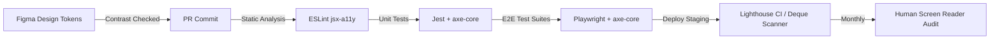

# ♿ Web Accessibility (a11y) & WCAG Architectural Reference & Interview Grill

> Comprehensive architectural guide and interview grill for **Web Accessibility (a11y)**, **WCAG 2.1 / 2.2 standards**, accessible system design patterns, anti-patterns, trade-offs, and Staff/Architect-level situational challenges.

---

## 📑 Table of Contents

- [♿ Web Accessibility (a11y) \& WCAG Architectural Reference \& Interview Grill](#-web-accessibility-a11y--wcag-architectural-reference--interview-grill)
  - [📑 Table of Contents](#-table-of-contents)
  - [🏛️ High-Level Architectural Foundations](#️-high-level-architectural-foundations)
    - [Why a11y is a Core Architectural Non-Functional Requirement (NFR)](#why-a11y-is-a-core-architectural-non-functional-requirement-nfr)
    - [The POUR Principles (WCAG Foundation)](#the-pour-principles-wcag-foundation)
    - [WCAG Conformance Levels (A vs AA vs AAA)](#wcag-conformance-levels-a-vs-aa-vs-aaa)
    - [Authoritative WCAG Standards \& Checklists](#authoritative-wcag-standards--checklists)
    - [WCAG 2.2 Key Additions Every Architect Must Know](#wcag-22-key-additions-every-architect-must-know)
  - [📜 The 5 Golden Rules of ARIA](#-the-5-golden-rules-of-aria)
  - [⚖️ When to Use vs When NOT to Use (Decisions \& Anti-Patterns)](#️-when-to-use-vs-when-not-to-use-decisions--anti-patterns)
    - [1. Semantic HTML vs Custom ARIA Matrix](#1-semantic-html-vs-custom-aria-matrix)
    - [2. Hiding Elements: `inert` vs `aria-hidden` vs `display:none` vs `sr-only`](#2-hiding-elements-inert-vs-aria-hidden-vs-displaynone-vs-sr-only)
      - [Accessible `.sr-only` CSS Implementation](#accessible-sr-only-css-implementation)
    - [3. The `tabIndex` Master Guide (`0`, `-1`, `<0`, `>0`)](#3-the-tabindex-master-guide-0--1-0-0)
      - [Detailed Breakdown by Value:](#detailed-breakdown-by-value)
    - [4. Focus Management: Roving `tabIndex` vs `aria-activedescendant`](#4-focus-management-roving-tabindex-vs-aria-activedescendant)
      - [Decision Matrix: When to choose which?](#decision-matrix-when-to-choose-which)
    - [5. Dynamic Updates: `aria-live` Regions (`polite` vs `assertive`)](#5-dynamic-updates-aria-live-regions-polite-vs-assertive)
  - [🏗️ Complex UI Architectural Patterns](#️-complex-ui-architectural-patterns)
    - [Pattern 1: Modal Dialogs \& Focus Trapping (Native `<dialog>` vs Custom Portal)](#pattern-1-modal-dialogs--focus-trapping-native-dialog-vs-custom-portal)
      - [Modal Architecture Checklist](#modal-architecture-checklist)
    - [Pattern 2: Combobox / Autocomplete / Select Architecture](#pattern-2-combobox--autocomplete--select-architecture)
    - [Pattern 3: Single Page Application (SPA) Route Transitions \& Focus Reset](#pattern-3-single-page-application-spa-route-transitions--focus-reset)
      - [Solution Architecture: The Route Announcer Pattern](#solution-architecture-the-route-announcer-pattern)
    - [Pattern 4: Virtualized Lists / Infinite Scrolling a11y Challenge](#pattern-4-virtualized-lists--infinite-scrolling-a11y-challenge)
    - [Pattern 5: Toast Notification Queue Architecture](#pattern-5-toast-notification-queue-architecture)
    - [Pattern 6: Micro-Frontend (MFE) a11y Coordination \& Live Announcers](#pattern-6-micro-frontend-mfe-a11y-coordination--live-announcers)
  - [🟢 Level 1: Foundational (SDE-1 / Junior)](#-level-1-foundational-sde-1--junior)
    - [Q: What is the difference between `alt=""` (empty alt) and omitting the `alt` attribute on an `` tag?](#q-what-is-the-difference-between-alt-empty-alt-and-omitting-the-alt-attribute-on-an-img-tag)
    - [Q: What are the WCAG 2.1 Level AA color contrast requirements for text vs UI components?](#q-what-are-the-wcag-21-level-aa-color-contrast-requirements-for-text-vs-ui-components)
    - [Q: What are the differences between `tabindex="0"`, `tabindex="-1"`, and `tabindex="5"`?](#q-what-are-the-differences-between-tabindex0-tabindex-1-and-tabindex5)
    - [Q: Why should you never remove the outline with `outline: none` or `outline: 0` in CSS?](#q-why-should-you-never-remove-the-outline-with-outline-none-or-outline-0-in-css)
    - [Q: What is the difference between `:focus` and `:focus-visible`?](#q-what-is-the-difference-between-focus-and-focus-visible)
  - [🟡 Level 2: Experienced (SDE-2 / Senior)](#-level-2-experienced-sde-2--senior)
    - [Q: What is the difference between `aria-label`, `aria-labelledby`, and `aria-describedby`?](#q-what-is-the-difference-between-aria-label-aria-labelledby-and-aria-describedby)
    - [Q: How do you build an accessible SVG icon button?](#q-how-do-you-build-an-accessible-svg-icon-button)
    - [Q: Why is `placeholder` an unacceptable substitute for `<label>`?](#q-why-is-placeholder-an-unacceptable-substitute-for-label)
    - [Q: Explain the concept of "Skip Links" (Skip to Main Content) and how to implement it.](#q-explain-the-concept-of-skip-links-skip-to-main-content-and-how-to-implement-it)
  - [🔴 Level 3: Advanced (Staff / Lead Architect)](#-level-3-advanced-staff--lead-architect)
    - [Q: Design an automated Accessibility Testing \& CI/CD Governance Strategy for a 200-engineer organization.](#q-design-an-automated-accessibility-testing--cicd-governance-strategy-for-a-200-engineer-organization)
    - [Q: How does Windows High Contrast Mode (Forced Colors Mode) impact modern CSS styling, and how do you architect for it?](#q-how-does-windows-high-contrast-mode-forced-colors-mode-impact-modern-css-styling-and-how-do-you-architect-for-it)
    - [Q: Compare Headless UI Libraries (Radix UI, React Aria, Ark UI) vs Custom UI components from scratch for Enterprise Design Systems.](#q-compare-headless-ui-libraries-radix-ui-react-aria-ark-ui-vs-custom-ui-components-from-scratch-for-enterprise-design-systems)
  - [🏛️ Level 4: Situational Architect's Grill (Deep Logic)](#️-level-4-situational-architects-grill-deep-logic)
    - [Q: Scenario: You have a legacy, 2-million-line SPA where hundreds of interactive buttons are coded as `<div onClick={...}>`. How do you remediate this systematically without rewriting the entire frontend overnight?](#q-scenario-you-have-a-legacy-2-million-line-spa-where-hundreds-of-interactive-buttons-are-coded-as-div-onclick-how-do-you-remediate-this-systematically-without-rewriting-the-entire-frontend-overnight)
    - [Q: Scenario: You are designing an Infinite Feed / Social Media Stream with real-time incoming posts. Sighted users see new posts pop in at the top. How do you design this for screen reader users without causing audio chaos?](#q-scenario-you-are-designing-an-infinite-feed--social-media-stream-with-real-time-incoming-posts-sighted-users-see-new-posts-pop-in-at-the-top-how-do-you-design-this-for-screen-reader-users-without-causing-audio-chaos)
  - [📊 Accessibility Testing \& Governance Pipeline](#-accessibility-testing--governance-pipeline)
    - [Quick Code: Playwright + Axe Automated Test](#quick-code-playwright--axe-automated-test)
    - [🧪 Testing Query Priority: Why `data-testid` is a Last Resort](#-testing-query-priority-why-data-testid-is-a-last-resort)
      - [Why relying on `data-testid` gives **False Confidence**:](#why-relying-on-data-testid-gives-false-confidence)
      - [When is `data-testid` genuinely justified?](#when-is-data-testid-genuinely-justified)
  - [🏁 Summary: Key Takeaways for Frontend \& System Architects](#-summary-key-takeaways-for-frontend--system-architects)
  - [🧪 Interactive Browser Testbed Hub](#-interactive-browser-testbed-hub)

---

## 🏛️ High-Level Architectural Foundations

### Why a11y is a Core Architectural Non-Functional Requirement (NFR)

Accessibility is not a last-minute styling layer or a cosmetic badge. At enterprise architecture scale:

1. **Legal & Compliance Mandate:** ADA Title III (US), European Accessibility Act (EAA 2025), Section 508, AODA (Canada). Non-compliance carries severe legal and financial penalties.
2. **Device & Modality Agnostic:** Architecture must serve Assistive Technologies (Screen Readers like NVDA, JAWS, VoiceOver, TalkBack; Switch Access; Braille displays; Eye tracking; Voice input).
3. **SEO & Machine Readability:** Search engine crawlers interpret the DOM much like a screen reader. Semantic accessibility directly correlates with high search ranking.
4. **Performance & Clean Tree:** Semantic markup produces smaller, flatter DOM trees with superior browser rendering and lower memory overhead compared to "div soup".

```
┌─────────────────────────────────────────────────────────────┐
│                    DOM Tree (HTML Structure)                 │
└──────────────────────────────┬──────────────────────────────┘
                               │
               ┌───────────────┴──────────────┐
               ▼                              ▼
┌─────────────────────────────┐┌──────────────────────────────┐
│  Render Tree (Layout/Paint) ││      Accessibility Tree      │
│  (CSSOM + Visual Elements)  ││   (Role, Name, State, Value) │
└──────────────┬──────────────┘└──────────────┬───────────────┘
               ▼                              ▼
      [ Visual Display ]            [ Assistive Tech API ]
      (Monitor / Mobile)            (Screen Reader / Switch)
```

---

### The POUR Principles (WCAG Foundation)

| Principle              | Meaning                                                                                                     | Architectural Implementation Requirement                                                                                                                                                                                                                                                      |
| :--------------------- | :---------------------------------------------------------------------------------------------------------- | :-------------------------------------------------------------------------------------------------------------------------------------------------------------------------------------------------------------------------------------------------------------------------------------------- |
| **P - Perceivable**    | Information and UI components must be presentable to users in ways they can perceive.                       | • Provide text alternatives (`alt`, `aria-label`).<br>• Captions and transcripts for media.<br>• Minimum color contrast ratios (4.5:1 text, 3:1 UI components).<br>• Support zoom up to 200% without loss of content/functionality.                                                           |
| **O - Operable**       | UI components and navigation must be operable via any input method.                                         | • 100% Keyboard navigation (No keyboard traps).<br>• Ample touch targets (min $24 \times 24\text{px}$ in WCAG 2.2, recommended $44 \times 44\text{px}$ / $48 \times 48\text{px}$).<br>• Meaningful focus order and visual focus rings.<br>• Sufficient time limits with extend/pause options. |
| **U - Understandable** | Information and operation of UI must be understandable.                                                     | • Page language (`<html lang="en">`).<br>• Predictable navigation across pages.<br>• Input assistance: Explicit error identification, descriptive hints, and recovery suggestions.                                                                                                            |
| **R - Robust**         | Content must be robust enough to be interpreted reliably by diverse user agents and assistive technologies. | • Clean HTML without duplicate IDs.<br>• Adherence to standard ARIA specifications.<br>• Backward/Forward compatibility across modern web platforms.                                                                                                                                          |

---

### WCAG Conformance Levels (A vs AA vs AAA)

There are three levels of accessibility compliance in the WCAG, which reflect the priority of support:

```
        ┌────────────────────────────────────────────────────────┐
        │  AAA: Specialized Support                              │
        │  (7:1 contrast, sign language, complete timeouts)      │
        ├────────────────────────────────────────────────────────┤
        │  AA: Ideal Support (Enterprise & Legal Standard)       │
        │  (4.5:1 contrast, focus visible, 200% zoom, reflow)    │
        ├────────────────────────────────────────────────────────┤
        │  A: Essential Baseline                                 │
        │  (Alt text, keyboard access, no traps, form labels)    │
        └────────────────────────────────────────────────────────┘
```

- **Level A (Essential):** If this isn't met, assistive technology may not be able to read, understand, or fully operate the page or view (e.g., severe keyboard traps, missing `alt` attributes, unlabelled form inputs).
- **Level AA (Ideal Support - Enterprise & Legal Baseline):** Required for multiple government, enterprise, and public body websites (ADA Title III, European Accessibility Act EAA 2025, Section 508). The A11Y Project and global standards benchmark on Level AA compliance. Covers color contrast ($\ge 4.5:1$ text, $\ge 3:1$ UI components), visible focus indicators, 400% zoom reflow, and error prevention.
- **Level AAA (Specialized Support):** Typically reserved for parts of websites and web apps that serve a specialized audience (e.g., $7:1$ contrast, sign language video alternatives, complete distraction-free timeouts). Not globally mandated across entire general-purpose websites.

> [!NOTE]
> _The different levels of WCAG support do not necessarily indicate an increased level of difficulty to implement; they represent the breadth and necessity of assistive support._

---

### Authoritative WCAG Standards & Checklists

- 🌐 [**Google Chrome Learn Accessibility**](https://web.dev/learn/accessibility) — Complete interactive course.
- 📋 [**Intopia "Not-Checklist"**](https://not-checklist.intopia.digital/) — Clear, actionable WCAG companion guide.
- 📐 [**WebAIM WCAG 2 Checklist**](https://webaim.org/standards/wcag/checklist) — Practical breakdown of WCAG criteria.
- 🚀 [**Frontend System Design: Web Accessibility (a11y)**](https://dev.to/zeeshanali0704/frontend-system-design-web-accessibility-a11y-28cf) — Architectural guide to frontend a11y.
- 🏛️ [**W3C WCAG Standards Overview**](https://www.w3.org/WAI/standards-guidelines/wcag/) — Official W3C WAI standards portal.

---

### WCAG 2.2 Key Additions Every Architect Must Know

1. **Focus Appearance (2.4.11 - Level AA):** Focus indicator must have a minimum contrast area and ratio ($\ge 3:1$) against both background and unfocused states.
2. **Focus Not Obscured (2.4.12 - Level AA):** Sticky footers, headers, or banners must **never** completely conceal the focused component.
3. **Dragging Movements (2.5.7 - Level AA):** Any drag-and-drop interaction (e.g., Kanban cards, sliders) must have a single-pointer alternative (buttons for "Move Up / Move Down").
4. **Target Size Minimum (2.5.8 - Level AA):** Interactive targets must be at least $24 \times 24\text{px}$ (or provide sufficient spacing to prevent accidental taps).
5. **Accessible Authentication (3.3.8 - Level AA):** Do not force cognitive tests (solving math problems, memorizing passwords, visual puzzles) without an alternative (password managers, WebAuthn/Passkeys, or copy-paste).
6. **Redundant Entry (3.3.7 - Level A):** Previously entered form data in multi-step flows must be auto-populated or available for selection.

---

## 📜 The 5 Golden Rules of ARIA

> [!IMPORTANT]
> **W3C 1st Rule of ARIA:** _If you can use a native HTML element or attribute with the semantics and behavior already built in, then do so._

```
1. Use Native HTML first ──────────> Use <button> instead of <div role="button">
2. Do not change native semantics ─> <h2 role="tab"> ❌ | <div role="tab"> or <button role="tab"> ✅
3. Keyboard accessibility is must ─> Any custom widget MUST support Enter, Space, Arrows, Esc, Tab
4. Never hide focusable elements ──> Do NOT put aria-hidden="true" or role="presentation" on focusable items
5. Every interactive item must name> Elements must have accessible name via text, aria-label, or aria-labelledby
```

---

## ⚖️ When to Use vs When NOT to Use (Decisions & Anti-Patterns)

### 1. Semantic HTML vs Custom ARIA Matrix

| Use Case                    | ✅ Native Semantic HTML (Preferred)                                                 | 🛠️ Custom ARIA Pattern (When Justified)                                                           | ❌ Anti-Pattern (Common Trap)                                                       |
| :-------------------------- | :---------------------------------------------------------------------------------- | :------------------------------------------------------------------------------------------------ | :---------------------------------------------------------------------------------- |
| **Clickable Action**        | `<button type="button">`                                                            | `<div role="button" tabIndex={0} onKeyDown={...}>` (Only if building ultra-custom canvas/WASM UI) | `<div onClick={handleClick}>` (Inaccessible to keyboard & screen readers)           |
| **Navigation Link**         | `<a href="/path">`                                                                  | `<span role="link" tabIndex={0} ...>`                                                             | `<button onClick={() => navigate('/path')}>` for standard resource navigation       |
| **Form Input Label**        | `<label htmlFor="email">Email</label><input id="email" />`                          | `<input aria-label="Email" />` or `<input aria-labelledby="label-id" />`                          | `<input placeholder="Email" />` (Placeholder disappears upon typing; not a label)   |
| **Expandable Accordion**    | `<details><summary>Title</summary>Body</details>`                                   | `<button aria-expanded="false" aria-controls="sec1">` + `<div id="sec1">`                         | `<div onClick={toggle}>` without `aria-expanded` and keyboard handlers              |
| **Modal / Dialog**          | `<dialog open>` with native `.showModal()`                                          | Custom Portal + Focus Trap + `role="dialog"` + `aria-modal="true"`                                | `<div className="modal">` without focus trap, escape key handler, or aria tagging   |
| **Page Landmark**           | `<header>`, `<nav>`, `<main>`, `<aside>`, `<footer>`                                | `<div role="banner">`, `<div role="navigation">`, `<div role="main">`                             | Using 50 nested `<div>`s with zero landmarks (screen readers cannot jump sections)  |
| **Visual Icon Only Button** | `<button><svg aria-hidden="true" /><span className="sr-only">Close</span></button>` | `<button aria-label="Close"><svg aria-hidden="true" /></button>`                                  | `<button><svg /></button>` with no label (Screen reader reads "Button, unlabelled") |

---

### 2. Hiding Elements: `inert` vs `aria-hidden` vs `display:none` vs `sr-only`

| Technique                                  |      Visible on Screen?       |   Focusable via Tab?    | In Accessibility Tree? | Primary Architectural Use Case                                                                                                       |
| :----------------------------------------- | :---------------------------: | :---------------------: | :--------------------: | :----------------------------------------------------------------------------------------------------------------------------------- |
| `display: none` / `hidden` attribute       |             ❌ No             |          ❌ No          |         ❌ No          | Completely hidden/unrendered UI (closed accordion items, inactive tabs).                                                             |
| `visibility: hidden`                       | ❌ No (reserves layout space) |          ❌ No          |         ❌ No          | Visual animations where layout dimensions must stay locked.                                                                          |
| `inert` (HTML5 attribute)                  |        ✅ Yes / ❌ No         |          ❌ No          |         ❌ No          | **Background of Modal Dialogs**, inactive side-drawers, off-screen carousels. Freezes pointer + keyboard + AT.                       |
| `aria-hidden="true"`                       |            ✅ Yes             |  ⚠️ **YES (Danger!)**   |         ❌ No          | **Purely decorative icons/SVGs**, visual illustrations. **NEVER** use on focusable or container elements holding focusable elements. |
| `.sr-only` / `.visually-hidden` (CSS clip) |             ❌ No             | ✅ Yes (if interactive) |         ✅ Yes         | Screen reader explanations, skip links, dynamic status announcements for blind users.                                                |

> [!CAUTION]
> **The `aria-hidden="true"` on Focusable Element Bug:**
> If you apply `aria-hidden="true"` to a container that contains an `<input>` or `<button>`, a sighted keyboard user can Tab to it, but a screen reader user will experience total silence with focus lost in a "ghost" element. Use `inert` or `tabIndex={-1}` instead!

#### Accessible `.sr-only` CSS Implementation

```css
/* Standard Accessible Off-Screen Utility */
.sr-only {
  position: absolute;
  width: 1px;
  height: 1px;
  padding: 0;
  margin: -1px;
  overflow: hidden;
  clip: rect(0, 0, 0, 0);
  white-space: nowrap;
  border-width: 0;
}
```

---

### 3. The `tabIndex` Master Guide (`0`, `-1`, `<0`, `>0`)

The `tabindex` attribute determines whether an element is focusable, how it enters sequential keyboard navigation (`Tab` / `Shift+Tab`), and whether JavaScript can programmatically focus it.

```
                  ┌──────────────────────────────────────────────────┐
                  │                 tabindex Values                  │
                  └────────────────────────┬─────────────────────────┘
                                           │
         ┌─────────────────────────────────┼────────────────────────────────┐
         ▼                                 ▼                                ▼
┌─────────────────┐               ┌──────────────────┐            ┌──────────────────┐
│  tabindex="0"   │               │  tabindex="-1"   │            │ tabindex="1,2,3" │
│  (Natural Order)│               │  (Programmatic)  │            │ (ANTI-PATTERN ❌)│
├─────────────────┤               ├──────────────────┤            ├──────────────────┤
│• Focusable via  │               │• EXCLUDED from   │            │• Jumps ahead of  │
│  keyboard Tab   │               │  keyboard Tab    │            │  natural DOM tree│
│• Follows DOM pos│               │• Focusable via JS│            │• Creates chaotic │
│• For custom UI  │               │  element.focus() │            │  focus traps     │
└─────────────────┘               └──────────────────┘            └──────────────────┘
```

#### Detailed Breakdown by Value:

| `tabindex` Value                                                                | Meaning & Browser Behavior                                                                                                                                                     | When to Use ✅                                                                                                                                                                                                                                                                                     | When NOT to Use / Anti-Pattern ❌                                                                                                                                                                             |
| :------------------------------------------------------------------------------ | :----------------------------------------------------------------------------------------------------------------------------------------------------------------------------- | :------------------------------------------------------------------------------------------------------------------------------------------------------------------------------------------------------------------------------------------------------------------------------------------------- | :------------------------------------------------------------------------------------------------------------------------------------------------------------------------------------------------------------ |
| **`tabindex="0"`**                                                              | • Inserts non-interactive elements into the **sequential keyboard tab order**.<br>• Focus order strictly follows its position in the DOM tree.                                 | • Custom interactive controls (`<div role="button">`, custom tabs).<br>• Scrollable containers with overflow (`overflow: auto`) so keyboard users can scroll with Arrow keys.<br>• Embedded widgets and custom canvas elements.                                                                    | • On native interactive elements (`<button>`, `<a>`, `<input>`, `<select>`, `<textarea>`) — they are naturally focusable by default!                                                                          |
| **`tabindex="-1"`**                                                             | • **Excludes** the element from sequential keyboard `Tab` navigation.<br>• Element **CAN** be focused programmatically via JavaScript (`element.focus()`).                     | • **Modal / Dialog containers** when opened.<br>• **Page Headings (`<h1 tabindex="-1">`)** during SPA route transitions.<br>• **Inactive items** in Roving `tabIndex` widgets (Tabs, Menus).<br>• **Skip Link targets** (`<main id="main" tabindex="-1">`).<br>• Form error summary alert banners. | • On primary buttons, interactive links, or form controls that keyboard users need to reach via regular `Tab` key.                                                                                            |
| **`tabindex="-2"`, `tabindex="-5"` (Any negative integer $< 0$)**               | • The HTML specification defines **any negative value** ($< 0$) as behaving **identically to `-1`**.<br>• Excluded from Tab sequence; focusable only via `.focus()`.           | • None. (Stick to standard `-1` for codebase consistency and readability).                                                                                                                                                                                                                         | • Avoid using `-2`, `-3`, etc. It creates confusion without providing any behavioral difference over `-1`.                                                                                                    |
| **`tabindex="1"`, `tabindex="2"`, `tabindex="3"` (Any positive integer $> 0$)** | • **Overrides natural DOM order**.<br>• Browser processes positive numbers first in ascending order ($1 \to 2 \to 3$), and _only then_ visits natural `tabindex="0"` elements. | • **NEVER (0% of the time).** Considered a severe anti-pattern in modern frontend architecture.                                                                                                                                                                                                    | • **CRITICAL HAZARD:** Violates WCAG 2.4.3 (Focus Order). Causes the keyboard cursor to jump wildly across the page, bypassing headers, navigation, and skip links. Highly fragile in modular/MFE components. |

> [!CAUTION]
> **Why Positive `tabindex` (`>0`) Breaks Enterprise Architecture:**
> If Team A puts `tabindex="1"` on a banner button and Team B puts `tabindex="1"` on a checkout form, the browser tab order becomes unpredictable and breaks whenever components reorder or lazy load. **Always structure your physical DOM order correctly or use CSS Grid/Flexbox for visual layout.**

---

### 4. Focus Management: Roving `tabIndex` vs `aria-activedescendant`

When building complex composite widgets (Tabs, Toolbars, Menus, Grids, Trees, Comboboxes), you must prevent the user from having to press `Tab` 500 times to pass through the widget.

```
┌────────────────────────────────────────────────────────────────────────┐
│                        COMPOSITE WIDGET STRATEGIES                     │
├──────────────────────────────────┬─────────────────────────────────────┤
│      Roving tabIndex             │      aria-activedescendant          │
├──────────────────────────────────┼─────────────────────────────────────┤
│ • Only active item has tabIndex=0│ • Container holds actual DOM focus  │
│ • All other items have tabIndex=-1│ • Changes aria-activedescendant="id"│
│ • Arrow keys update tabIndex &   │ • Virtual scroll / Large lists      │
│   physically call element.focus()│   (No DOM focus churn)              │
│ • Best for: Toolbars, Menus, Tabs│ • Best for: Combobox, Autocomplete, │
│                                  │   Data Grids, Suggestion Dropdowns  │
└──────────────────────────────────┴─────────────────────────────────────┘
```

#### Decision Matrix: When to choose which?

- **Use Roving `tabIndex` when:** Items are distinct interactive DOM elements, number of items is modest ($< 100$), and elements benefit from native focus states (`:focus-visible`).
- **Use `aria-activedescendant` when:** The widget has an active input field (like a Combobox or search bar) that must retain physical focus while the user browses suggestions with Up/Down arrows, or when items are virtualized.

---

### 5. Dynamic Updates: `aria-live` Regions (`polite` vs `assertive`)

`aria-live` instructs screen readers to announce dynamic content injected into the DOM without user navigation.

```html
<!-- Container MUST be present in the initial DOM tree before content is injected! -->
<div aria-live="polite" aria-atomic="true" class="sr-only" id="global-announcer">
  <!-- Dynamic messages injected here -->
</div>
```

| `aria-live` Setting     | Screen Reader Behavior                                           | When to Use                                                                                                                                  | When NOT to Use                                                                                       |
| :---------------------- | :--------------------------------------------------------------- | :------------------------------------------------------------------------------------------------------------------------------------------- | :---------------------------------------------------------------------------------------------------- |
| `aria-live="polite"`    | Waits until user finishes current speech/action before speaking. | • Form submission success/failure<br>• Filter/Search results count ("24 items found")<br>• Cart total updates<br>• Non-critical toast alerts | • Routine hover effects<br>• Chat typing indicators (too spammy)<br>• Time-sensitive emergency alerts |
| `aria-live="assertive"` | **Interrupts** the screen reader immediately in mid-sentence.    | • Critical system errors<br>• Session timeout warnings ("You will be logged out in 60s")<br>• Urgent payment failure alerts                  | • Regular page updates<br>• Form validation messages<br>• Routine notifications                       |
| `aria-atomic="true"`    | Reads the **entire** region when any part changes.               | • Counters ("3 of 10 items selected")<br>• Status badges ("Status: Approved")                                                                | • Long continuous log streams                                                                         |

> [!WARNING]
> **Live Region Injection Anti-Pattern:**
> Creating a dynamic `<div aria-live="polite">Message</div>` and mounting it to the DOM simultaneously will **fail** in many screen readers (VoiceOver, NVDA). The live region container must be mounted in the DOM beforehand, and text injected into it afterward!

---

## 🏗️ Complex UI Architectural Patterns

### Pattern 1: Modal Dialogs & Focus Trapping (Native `<dialog>` vs Custom Portal)

```
             ┌────────────────────────────────────────────────┐
             │                  Window Root                   │
             │                                                │
             │   ┌────────────────────────────────────────┐   │
             │   │ App Root Container (document.body)     │   │
             │   │ [inert] when modal is open!             │   │
             │   └────────────────────────────────────────┘   │
             │                                                │
             │   ┌────────────────────────────────────────┐   │
             │   │ Modal Dialog Portal                    │   │
             │   │ • role="dialog" aria-modal="true"      │   │
             │   │ • aria-labelledby="modal-title"        │   │
             │   │ • Focus trapped inside                 │   │
             │   │ • Esc closes & returns focus to trigger│   │
             │   └────────────────────────────────────────┘   │
             └────────────────────────────────────────────────┘
```

#### Modal Architecture Checklist

1. **Trigger Remembrance:** Save reference to the element that triggered the modal (`document.activeElement`).
2. **Backdrop Inactivation:** Apply `inert` attribute to all background sibling containers (or modern HTML `<dialog>.showModal()` which does this natively in the top layer).
3. **Initial Focus:** Move focus to the first interactive element or the dialog title/close button.
4. **Focus Trap:** Tab on the last element wraps around to the first; Shift+Tab on the first wraps to the last.
5. **Escape Key Handling:** Pressing `Escape` closes the modal.
6. **Focus Restoration:** Return focus back to the saved trigger element on unmount.

---

### Pattern 2: Combobox / Autocomplete / Select Architecture

```html
<!-- Accessible Combobox APG Pattern -->
<div class="combobox-wrapper">
  <label id="combo-label" for="combo-input">Select Country</label>
  <div class="input-group">
    <input
      id="combo-input"
      type="text"
      role="combobox"
      aria-autocomplete="list"
      aria-expanded="true"
      aria-haspopup="listbox"
      aria-controls="combo-listbox"
      aria-labelledby="combo-label"
      aria-activedescendant="option-2"
    />
  </div>
  <ul id="combo-listbox" role="listbox" aria-labelledby="combo-label">
    <li id="option-1" role="option" aria-selected="false">Australia</li>
    <li id="option-2" role="option" aria-selected="true" class="focused">Brazil</li>
    <li id="option-3" role="option" aria-selected="false">Canada</li>
  </ul>
</div>
```

---

### Pattern 3: Single Page Application (SPA) Route Transitions & Focus Reset

**Problem:** In traditional multi-page apps, a full page reload announces the new page `<title>` and resets focus to the top. In SPAs (`react-router`, `next.js`, `vue-router`), route transitions happen via JavaScript; screen reader users are left stranded on the previous link with no feedback.

#### Solution Architecture: The Route Announcer Pattern

```typescript
// RouteFocusAnnouncer Component in Root Router
function RouteAnnouncer() {
  const location = useLocation();
  const [announcement, setAnnouncement] = useState('');

  useEffect(() => {
    // 1. Update Document Title
    const newTitle = document.title || 'New Page';

    // 2. Announce to Screen Reader
    setAnnouncement(`Navigated to ${newTitle}`);

    // 3. Move physical focus to primary H1 or main container
    const mainHeading = document.querySelector('h1') || document.querySelector('main');
    if (mainHeading) {
      mainHeading.setAttribute('tabIndex', '-1');
      mainHeading.focus({ preventScroll: false });
    }
  }, [location.pathname]);

  return (
    <div
      role="status"
      aria-live="polite"
      aria-atomic="true"
      className="sr-only"
    >
      {announcement}
    </div>
  );
}
```

---

### Pattern 4: Virtualized Lists / Infinite Scrolling a11y Challenge

**The Problem:** Virtualized lists (`react-window`, `tanstack-virtual`) unmount off-screen DOM nodes to save memory.

- Screen readers cannot read elements that do not exist in the DOM (e.g., "Item 1 of 5000").
- Search on page (`Ctrl+F`) fails.
- Reading flow breaks unexpectedly.

**Architectural Solutions:**

1. **Explicit Counter & Boundaries:** Expose container-level metadata: `<div role="feed" aria-busy="false" aria-label="Order History, 5000 items total">`.
2. **`aria-rowcount` & `aria-rowindex` (for Tables/Grids):**
   ```html
   <table role="grid" aria-rowcount="5000">
     <!-- Render only visible rows, but preserve total index -->
     <tr role="row" aria-rowindex="45">
       ...
     </tr>
     <tr role="row" aria-rowindex="46">
       ...
     </tr>
   </table>
   ```
3. **Pagination Fallback Toggle:** Provide a "View as Paginated Table" alternative for screen reader and keyboard power users.

---

### Pattern 5: Toast Notification Queue Architecture

Toasts present multiple a11y hazards: disappearing before slow readers finish, interrupting screen reader announcements, and stealing keyboard focus.

```
┌────────────────────────────────────────────────────────────┐
│                  Toast Queue System Manager                │
├────────────────────────────────────────────────────────────┤
│ • Polite Live Region Container                             │
│ • No Auto-Dismiss for Errors / Critical Actions            │
│ • Minimum display duration: 5000ms + (words * 300ms)       │
│ • Pause timer on mouse hover & keyboard focus              │
│ • Actionable toasts must provide focus shortcut            │
│   (e.g., Alt + T to focus Toast notification center)       │
└────────────────────────────────────────────────────────────┘
```

---

### Pattern 6: Micro-Frontend (MFE) a11y Coordination & Live Announcers

In a multi-team Micro-Frontend architecture (Webpack Module Federation, Single-SPA):

- **Problem 1 (Duplicate IDs):** Team A and Team B both render `<input id="search">` or `<div id="dialog">`, corrupting `aria-labelledby` and `<label htmlFor>`.
- **Problem 2 (Live Region Storm):** 4 MFEs each mount their own `aria-live` region, shouting over each other simultaneously.

**Architecture Solution:**

1. **ID Prefix Scoping:** Design System `useId()` hook namespaces IDs with MFE prefix (`mfe-cart_input-12`).
2. **Singleton Live Announcer Bus:** Host shell exposes a global event bus / Custom Event `window.dispatchEvent(new CustomEvent('a11y-announce', { detail: { message, priority } }))` consumed by one single root announcer.

---

## 🟢 Level 1: Foundational (SDE-1 / Junior)

### Q: What is the difference between `alt=""` (empty alt) and omitting the `alt` attribute on an `` tag?

**1-Liner:** `alt=""` marks the image as **decorative** (screen readers skip it); omitting `alt` makes the screen reader read the raw file path/URL (e.g. "image-slash-dsc-underscore-1024-dot-png"), degrading accessibility.

---

### Q: What are the WCAG 2.1 Level AA color contrast requirements for text vs UI components?

**Answer:**

- **Regular Body Text ($< 18.5\text{px}$ regular or $< 14\text{px}$ bold):** Minimum **$4.5:1$** contrast against background.
- **Large Text ($\ge 18.5\text{px}$ regular or $\ge 14\text{px}$ bold):** Minimum **$3.0:1$** contrast.
- **UI Components & Graphical Objects (Input borders, focus rings, icons):** Minimum **$3.0:1$** contrast.

---

### Q: What are the differences between `tabindex="0"`, `tabindex="-1"`, and `tabindex="5"`?

**Answer:**

- `tabindex="0"`: Inserts the element into the natural keyboard tab order in its DOM position.
- `tabindex="-1"`: Removes element from sequential keyboard navigation, but allows it to be focused programmatically via JavaScript (`element.focus()`).
- `tabindex=">0"` (**Anti-pattern**): Forces unnatural tab order, overriding DOM order. Creates maintenance nightmares and is strictly prohibited in modern codebases.

---

### Q: Why should you never remove the outline with `outline: none` or `outline: 0` in CSS?

**1-Liner:** It removes the visual focus indicator for keyboard users; if removing default browser styles, you **must** supply an equally prominent custom `:focus-visible` replacement.

```css
/* ✅ Correct Modern Approach */
button:focus {
  outline: none; /* remove fallback */
}
button:focus-visible {
  outline: 2px solid #005fcc;
  outline-offset: 2px;
}
```

---

### Q: What is the difference between `:focus` and `:focus-visible`?

**1-Liner:** `:focus` triggers on both mouse clicks and keyboard navigation; `:focus-visible` only triggers when the browser detects keyboard or non-pointer navigation (preventing unwanted focus rings for mouse users while preserving accessibility for keyboard users).

---

## 🟡 Level 2: Experienced (SDE-2 / Senior)

### Q: What is the difference between `aria-label`, `aria-labelledby`, and `aria-describedby`?

**Answer:**

- `aria-label`: Takes a literal string to name an element (`aria-label="Close dialog"`).
- `aria-labelledby`: Takes one or more element IDs whose inner text provides the accessible **name** (`aria-labelledby="modal-heading-id"`). Overrides standard text.
- `aria-describedby`: Takes one or more element IDs that provide auxiliary **description / help text** (read _after_ the name and role, e.g., `<input aria-describedby="password-rules-id" />`).

---

### Q: How do you build an accessible SVG icon button?

**Answer:**

```html
<button type="button" class="icon-btn">
  <!-- Hide visual SVG from assistive tech -->
  <svg aria-hidden="true" focusable="false" viewBox="0 0 24 24">
    <path d="M19 6.41L17.59 5 12 10.59 6.41 5 5 6.41 10.59 12 5 17.59 6.41 19 12 13.41 17.59 19 19 17.59 13.41 12z" />
  </svg>
  <!-- Provide accessible label (either sr-only span OR aria-label on button) -->
  <span class="sr-only">Close Settings Dialog</span>
</button>
```

---

### Q: Why is `placeholder` an unacceptable substitute for `<label>`?

**Answer:**

1. **Transience:** Placeholder disappears once the user begins typing, leaving users with cognitive impairments or memory deficits confused about the field's purpose.
2. **Poor Contrast:** Default browser placeholder text often fails the $4.5:1$ contrast ratio requirement.
3. **Screen Reader Inconsistency:** Some assistive technologies do not announce placeholders as accessible field labels.
4. **Translation Failures:** Automatic browser translation tools frequently skip placeholder attributes.

---

### Q: Explain the concept of "Skip Links" (Skip to Main Content) and how to implement it.

**Answer:**

- **Purpose:** Allows keyboard-only users to bypass long header navigation bars (which may have dozens of links) and jump straight to the page's `<main>` content with one keystroke.
- **Implementation:**

```html
<!-- Must be the first focusable element in <body> -->
<a href="#main-content" class="skip-link">Skip to main content</a>

<nav>...</nav>

<main id="main-content" tabindex="-1">
  <h1>Page Title</h1>
</main>
```

```css
.skip-link {
  position: absolute;
  top: -999px;
  left: 0;
  background: #000;
  color: #fff;
  padding: 8px 16px;
  z-index: 10000;
}
.skip-link:focus {
  top: 0; /* Pops into view only when Tabbed to */
}
```

---

## 🔴 Level 3: Advanced (Staff / Lead Architect)

### Q: Design an automated Accessibility Testing & CI/CD Governance Strategy for a 200-engineer organization.

```
┌────────────────────────────────────────────────────────────────────────┐
│               ENTERPRISE ACCESSIBILITY GOVERNANCE PYRAMID              │
├───────────────────────────────────┬────────────────────────────────────┤
│ 1. Design Tokens (Figma Tokens)   │ Contrast automated checks in Figma │
├───────────────────────────────────┼────────────────────────────────────┤
│ 2. ESLint (`eslint-plugin-jsx-a11y│ Static analysis at compile time    │
├───────────────────────────────────┼────────────────────────────────────┤
│ 3. Unit / Component (axe-core)    │ Jest / Vitest + `jest-axe` tests   │
├───────────────────────────────────┼────────────────────────────────────┤
│ 4. E2E CI Gate (Playwright Axe)   │ Playwright / Cypress + `@axe-core` │
├───────────────────────────────────┼────────────────────────────────────┤
│ 5. Automated Scanner Monitoring   │ Lighthouse CI / Deque Axe Monitor  │
├───────────────────────────────────┼────────────────────────────────────┤
│ 6. Manual & Assistive Tech Audits │ Human QA with NVDA, VoiceOver (50%)│
└───────────────────────────────────┴────────────────────────────────────┘
```

**Key Architectural Principle:** Automated tooling (`axe-core`, Lighthouse, linters) can only catch **30% to 57%** of WCAG issues (e.g., automated tools cannot know if an alt text makes conceptual sense or if keyboard navigation flow is logical).

**Strategy:**

1. **Shift Left:** Centralize accessible primitives in a Headless Design System (Radix UI / React Aria / Ark UI) so product teams get keyboard traps, focus handling, and ARIA for free.
2. **Pre-commit / CI Gates:** Block PRs that introduce `eslint-plugin-jsx-a11y` errors or zero-tolerance `axe-core` violations in Playwright test suites.
3. **Dedicated Manual Auditing:** Schedule quarterly assistive technology audits (NVDA + Firefox, JAWS + Chrome, VoiceOver + Safari).

---

### Q: How does Windows High Contrast Mode (Forced Colors Mode) impact modern CSS styling, and how do you architect for it?

**Answer:**

- **Mechanism:** In Forced Colors Mode (`@media (forced-colors: active)`), the operating system strips custom colors, `box-shadow`, `background-color`, and gradients, replacing them with a strict system palette (Canvas, CanvasText, Highlight, ButtonText).
- **The Pitfall:** Visual UI boundaries created solely with `box-shadow` or background color differences become invisible.
- **Architectural Solution:**
  1. Use transparent CSS borders on interactive elements:
     ```css
     .card {
       box-shadow: 0 4px 6px rgba(0, 0, 0, 0.1);
       border: 1px solid transparent; /* Becomes visible in High Contrast Mode! */
     }
     ```
  2. Use System Color keywords: `color: LinkText;`, `background: Canvas;`.
  3. Ensure SVGs use `currentColor` so they adapt automatically to OS contrast themes.

---

### Q: Compare Headless UI Libraries (Radix UI, React Aria, Ark UI) vs Custom UI components from scratch for Enterprise Design Systems.

**Answer:**

| Dimension                | Headless Primitives (Radix / React Aria)                                                          | Custom In-House from Scratch                                                                    |
| :----------------------- | :------------------------------------------------------------------------------------------------ | :---------------------------------------------------------------------------------------------- |
| **A11y Compliance**      | Pre-tested across NVDA, VoiceOver, JAWS; adheres to W3C WAI-ARIA authoring practices guide (APG). | High risk of subtle keyboard traps, missed edge cases, and ARIA state sync bugs.                |
| **Styling Freedom**      | 100% unstyled; fully compatible with Tailwind, CSS Modules, Styled-Components, Vanilla CSS.       | Complete control over DOM hierarchy.                                                            |
| **Development Velocity** | Months of development time saved on complex widgets (Combobox, DatePicker, Dialog, Tree).         | Heavy ongoing engineering cost to maintain assistive tech compatibility across browser updates. |
| **Bundle Size**          | Modest dependency footprint ($5 - 15\text{kB}$ per component).                                    | Minimal (if features are intentionally omitted).                                                |
| **Recommendation**       | **Adopt Headless Primitives** as the foundation of your enterprise design system.                 | Build custom only when building unique domain-specific canvas/visual graph editors.             |

---

## 🏛️ Level 4: Situational Architect's Grill (Deep Logic)

### Q: Scenario: You have a legacy, 2-million-line SPA where hundreds of interactive buttons are coded as `<div onClick={...}>`. How do you remediate this systematically without rewriting the entire frontend overnight?

**Architectural Remediation Roadmap:**

1. **Step 1: Codemod & Automated AST Migration:**
   Run a `jscodeshift` / Babel AST codemod to scan JSX for `<div onClick>` and replace them with `<button type="button">` where layout/CSS will not break.
2. **Step 2: Universal `AccessibleClickable` Polyfill Component:**
   For complex divs where replacing with `<button>` breaks CSS grid/flex formatting:
   ```typescript
   export function ClickableDiv({ onClick, children, ...props }) {
     return (
       <div
         role="button"
         tabIndex={0}
         onClick={onClick}
         onKeyDown={(e) => {
           if (e.key === 'Enter' || e.key === ' ') {
             e.preventDefault();
             onClick(e);
           }
         }}
         {...props}
       >
         {children}
       </div>
     );
   }
   ```
3. **Step 3: ESLint Strict Ban Rule:**
   Add `jsx-a11y/no-static-element-interactions` and `jsx-a11y/click-events-have-key-events` to CI as warnings on legacy code, errors on all new files.
4. **Step 4: Design System Mandate:**
   Migrate features component-by-component into unified Design System components.

---

### Q: Scenario: You are designing an Infinite Feed / Social Media Stream with real-time incoming posts. Sighted users see new posts pop in at the top. How do you design this for screen reader users without causing audio chaos?

**Architecture Strategy:**

1. **Do NOT inject live announcements for every single incoming post:** In high-velocity feeds (e.g. 50 posts/sec), `aria-live="assertive"` or `aria-live="polite"` will crash the screen reader or produce continuous, unusable audio speech.
2. **The "New Posts Available" Banner Pattern (Twitter / BlueSky model):**
   - Render a polite, static button at the top of the feed: `<button aria-live="polite">12 New Posts Available. Click to view.</button>`.
   - Update the count quietly in an `aria-live="polite"` region without shifting the DOM focus under the user's current reading cursor.
   - When the user activates the button, move focus to the first newly prepended item.
3. **Virtual Feed Landmark Structure:**
   - Wrap the stream in `<div role="feed" aria-busy={isLoading} aria-label="Social timeline">`.
   - Each card is structured as an `<article aria-posinset={index} aria-setsize={total}>`.

---

## 📊 Accessibility Testing & Governance Pipeline



### Quick Code: Playwright + Axe Automated Test

```typescript
import { test, expect } from '@playwright/test';
import AxeBuilder from '@axe-core/playwright';

test.describe('Checkout Flow a11y', () => {
  test('should pass automated WCAG 2.2 AA audit', async ({ page }) => {
    await page.goto('/checkout');
    await page.waitForSelector('#payment-form');

    const accessibilityScanResults = await new AxeBuilder({ page })
      .withTags(['wcag2a', 'wcag2aa', 'wcag21a', 'wcag21aa', 'wcag22aa'])
      .analyze();

    expect(accessibilityScanResults.violations).toEqual([]);
  });
});
```

---

### 🧪 Testing Query Priority: Why `data-testid` is a Last Resort

> [!IMPORTANT]
> **The Golden Rule of Testing (Testing Library):**
> _"The more your tests resemble the way your software is used, the more confidence they can give you."_
> Real users and Assistive Technologies (Screen Readers, Voice Control, Switch Access) **cannot see or interact with `data-testid`**.

```
       ┌─────────────────────────────────────────────────────────┐
       │ 1. Accessible to Everyone (PRIMARY / PREFERRED)         │
       │    • getByRole(role, { name: '...' })                   │
       │    • getByLabelText('Email Address')                    │
       │    • getByPlaceholderText('...')                        │
       │    • getByText('Welcome')                               │
       │    • getByDisplayValue('...')                           │
       ├─────────────────────────────────────────────────────────┤
       │ 2. Semantic Queries                                     │
       │    • getByAltText('Company Logo')                       │
       │    • getByTitle('...')                                  │
       ├─────────────────────────────────────────────────────────┤
       │ 3. Test IDs (LAST RESORT / ESCAPE HATCH)                │
       │    • getByTestId('submit-btn')                          │
       └─────────────────────────────────────────────────────────┘
```

#### Why relying on `data-testid` gives **False Confidence**:

| Feature / Flaw                                   |               Query by `getByTestId('submit-btn')`                |          Query by `getByRole('button', { name: /submit/i })`           |
| :----------------------------------------------- | :---------------------------------------------------------------: | :--------------------------------------------------------------------: |
| **Catches non-semantic `<div onClick>`?**        | ❌ **No** (Test passes, but broken for keyboard & screen readers) |        ✅ **Yes** (Fails: No element with role `button` found)         |
| **Catches missing accessible name/label?**       |        ❌ **No** (Test passes on unlabelled icon buttons)         |            ✅ **Yes** (Fails if button has no name or text)            |
| **Catches missing `<label>` to `<input>` link?** |      ❌ **No** (`data-testid="email-input"` ignores labels)       | ✅ **Yes** (`getByLabelText('Email')` fails if `htmlFor`/`id` missing) |
| **Catches broken `aria-expanded` / states?**     |      ❌ **No** (Test clicks testid without verifying state)       | ✅ **Yes** (`getByRole('button', { expanded: true })` verifies state)  |
| **Resilient to UI refactoring?**                 |        ⚠️ Low (Couples test to artificial test attributes)        |  ✅ High (Tests user-facing contract, unaffected by markup refactor)   |

#### When is `data-testid` genuinely justified?

1. **Dynamic / Non-deterministic text:** UI content where text changes rapidly or comes from localized strings that would make tests brittle.
2. **Invisible structural boundaries:** Containers, modals portals, or layout dividers where no ARIA role exists or makes semantic sense.
3. **Canvas / WebGL / Third-party SDK embeds:** Elements rendered outside standard HTML DOM elements where screen reader trees are not present.

---

## 🏁 Summary: Key Takeaways for Frontend & System Architects

1. **Semantic HTML is 90% of a11y:** `<button>`, `<nav>`, `<main>`, `<dialog>`, and `<label>` solve most accessibility challenges out of the box.
2. **ARIA is for Polyfilling Semantics:** Only use ARIA when native HTML5 cannot express the custom UI behavior.
3. **Keyboard Parity is Non-Negotiable:** Every feature operable with a mouse must be equally operable via standard keyboard conventions (`Tab`, `Shift+Tab`, `Space`, `Enter`, `Esc`, `Arrow Keys`).
4. **Automated Testing is a Floor, Not a Ceiling:** Always combine `axe-core` / CI checks with manual assistive technology testing.

---

## 🧪 Interactive Browser Testbed Hub

To test all the patterns discussed in this document (including focus trapping, roving `tabindex`, combobox virtual focus, live regions, contrast calculators, and zero-ghost-focus accordions), open the [**Interactive Testbed Hub**](file:///Users/atulkumarawasthi/projects/SystemDesign/Accessibility/demos/index.html) in your browser.
