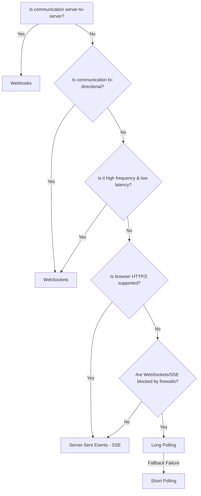

# 🌐 System Design: 15 Core Communication Protocol Questions & Answers

This Q&A document provides a structured, tiered review of web communication protocols, polling strategies, push mechanisms, and advanced real-time systems architecture.

---

## 📚 Table of Contents

1. [Short Polling & Workflows (Q1 - Q3)](#1-short-polling--workflows-q1---q3)
2. [Long Polling & Hanging Requests (Q4 - Q6)](#2-long-polling--hanging-requests-q4---q6)
3. [WebSockets & Full-Duplex Streaming (Q7 - Q9)](#3-websockets--full-duplex-streaming-q7---q9)
4. [Server-Sent Events (SSE) (Q10 - Q12)](#4-server-sent-events-sse-q10---q12)
5. [Webhooks & Event-Driven Callbacks (Q13 - Q14)](#5-webhooks--event-driven-callbacks-q13---q14)
6. [Architect's Decision Matrix (Q15)](#6-architects-decision-matrix-q15)

---

## 1. Short Polling & Workflows (Q1 - Q3)

### Q1: What is short polling, and how does it differ from other communication techniques like long polling and WebSockets?

- **Definition:** Short polling is a client-initiated pulling technique where the client repeatedly sends standard HTTP requests to the server at fixed time intervals (e.g., every 5 seconds) to ask: _"Are there any new updates?"_
- **Key Differences:**
  - **Short Polling:** The connection closes immediately after the server responds, regardless of whether new data is available.
  - **Long Polling:** The connection remains open ("hangs") on the server until new data is available or a timeout occurs, reducing empty responses.
  - **WebSockets:** An upgrade from HTTP to a persistent, full-duplex TCP socket connection allowing bidirectional push/pull data frames anytime without request/response locking.

### Q2: Explain the basic workflow of short polling in web development.

1.  **Request:** The client triggers an AJAX/fetch call (e.g., `GET /api/notifications`).
2.  **Response:** The server checks the database or cache. It immediately responds with the current status (an empty payload or status code `200 OK` with data).
3.  **Teardown:** The TCP/HTTP connection is closed.
4.  **Interval Wait:** The client-side scheduler (e.g., `setInterval` or recursive `setTimeout`) waits for a predetermined interval of _N_ seconds.
5.  **Re-initiate:** The cycle repeats from step 1 indefinitely.

### Q3: What are the advantages and disadvantages of using short polling for real-time communication?

- **Advantages:**
  - **Simplicity:** Extremely easy to write, test, and debug.
  - **Compatibility:** Works on any server stack, proxy, browser, or networking architecture without special protocols.
  - **No Persistent Connections:** Does not tie up server sockets or file descriptors long-term, which is useful for short, stateless serverless functions.
- **Disadvantages:**
  - **High Network Overhead:** Creates a barrage of HTTP request/response headers, even when no updates occur.
  - **Poor Latency:** Real-time latency is limited by the polling interval (e.g., if data changes immediately after a poll, the client must wait the full interval to see it).
  - **Mobile Battery Drain:** Waking up the device's cellular radio repeatedly drains battery rapidly.

---

## 2. Long Polling & Hanging Requests (Q4 - Q6)

### Q4: Describe the concept of long polling and how it addresses some of the limitations of short polling.

- **Concept:** Long polling is an optimization of short polling. The client sends a request, and instead of responding immediately with an empty payload, the server **holds the request open** (keeps the connection hanging). The server only responds when new data becomes available or a timeout limit (typically 30–60 seconds) is reached.
- **Mitigation of Short Polling Limits:**
  - Eliminates the CPU and network overhead of thousands of empty "No new data" HTTP round-trips.
  - Drastically reduces latency, as the server flushes updates to the client the instant they occur.

### Q5: What scenarios are suitable for using long polling, and what are its potential drawbacks?

- **Suitable Scenarios:**
  - Near-real-time updates behind strict enterprise proxies or Deep Packet Inspection (DPI) firewalls that block standard WebSockets or SSE upgrades.
  - Systems with low-frequency updates where WebSockets would sit idle wasting heartbeat keep-alives.
- **Potential Drawbacks:**
  - **Resource Consumption:** Keeping connections open requires significant server memory and file descriptors.
  - **The Reconnection Gap:** During the brief window when a client receives a response and immediately issues the next request, updates can theoretically be missed unless a tracking cursor (like an offset or message ID) is passed.

### Q6: Explain how long polling can be implemented on the client and server sides.

- **Client-Side Implementation:** Uses a recursive fetching function that starts the next request immediately in the `.then()` or `finally` block of the previous request:
  ```javascript
  function poll() {
    fetch('/api/updates?lastSeenId=' + lastId)
      .then((res) => res.json())
      .then((data) => {
        process(data);
        lastId = data.id;
      })
      .catch((err) => console.error(err))
      .finally(() => setTimeout(poll, 1000)); // Delay slightly to avoid rapid loops on server error
  }
  ```
- **Server-Side Implementation:** The request handler holds the client's HTTP response object in an internal array or registers a callback listener (using non-blocking asynchronous event loops, like Node.js event emitters or Go channels). When a data-change event is published, the server pops the waiting client response objects and flushes the data:
  ```javascript
  app.get('/api/updates', (req, res) => {
    waitingQueue.push(res);
    // Timeout guard: resolve connection empty if no event after 30s
    setTimeout(() => {
      const index = waitingQueue.indexOf(res);
      if (index > -1) {
        waitingQueue.splice(index, 1);
        res.status(204).end();
      }
    }, 30000);
  });
  ```

---

## 3. WebSockets & Full-Duplex Streaming (Q7 - Q9)

### Q7: What is a WebSocket, and how does it enable full-duplex communication between clients and servers?

- **Definition:** A WebSocket is a stateful protocol (RFC 6455) providing a persistent, bi-directional, full-duplex communication channel over a single TCP connection.
- **Full-Duplex Mechanics:** In standard HTTP (half-duplex), only the client can initiate requests, and communication runs one-way at a time. WebSockets establish an open TCP tunnel where both the client and the server can independently transmit lightweight data frames at the same time without waiting for an authorization request handshake.

### Q8: How does WebSocket handle bi-directional communication, and what are its key advantages for real-time applications?

- **Handling Mechanics:** Once a connection is established, the application uses WebSocket framing (wrapping payload fragments with short opcodes like text, binary, ping, or pong). There is no HTTP header overhead on each frame, allowing continuous bidirectional communication.
- **Key Advantages:**
  - **Minimal Overhead:** Data packets omit expensive HTTP header overhead (cookies, user-agents), reducing bandwidth consumption to just a few bytes per frame.
  - **Lowest Latency:** Near-zero transmission delay, perfect for high-frequency interactive apps.
  - **Event-Driven Push:** The server can push messages instantly without the client polling or requesting them.

### Q9: Explain the WebSocket handshake process and the role of the "Upgrade" header.

- **Handshake Process:**
  1.  The client sends a standard HTTP request to the server, including specific headers requesting a protocol switch.
  2.  The server validates the handshake security key and returns a `101 Switching Protocols` status code if it supports the protocol.
  3.  The HTTP connection is immediately upgraded to a raw TCP socket, and both parties can begin sending frames.
- **Role of the "Upgrade" Header:**
  - The `Upgrade: websocket` header (accompanied by `Connection: Upgrade`) tells intermediaries (proxies, reverse-proxies, load balancers) and the destination server that the client wants to switch protocols.
  - The client also sends a `Sec-WebSocket-Key` header, which the server signs and returns as `Sec-WebSocket-Accept` in its response, verifying that the server actively supports WebSockets and isn't just treating it as a standard HTTP connection.

---

## 4. Server-Sent Events (SSE) (Q10 - Q12)

### Q10: What are Server-Sent Events (SSE), and how do they differ from other real-time communication techniques?

- **Definition:** Server-Sent Events (SSE) is a standardized browser API (`EventSource`) that enables unidirectional, persistent streaming of text-based updates from the server to the client over standard HTTP.
- **Differences:**
  - **vs. WebSockets:** WebSockets are bi-directional and use a custom TCP protocol; SSE is unidirectional (Server-to-Client only) and operates entirely over standard HTTP.
  - **vs. Polling:** Polling involves making multiple individual requests; SSE keeps a single HTTP connection open (`Content-Type: text/event-stream`) and streams events sequentially.

### Q11: Describe the steps involved in implementing Server-Sent Events in a web application.

1.  **Client Connection:** The client instantiates the `EventSource` API:
    ```javascript
    const source = new EventSource('/api/stream');
    source.onmessage = (event) => console.log(event.data);
    ```
2.  **Server Response Headers:** The server responds with specific headers keeping the HTTP request open indefinitely:
    ```http
    Content-Type: text/event-stream
    Cache-Control: no-cache
    Connection: keep-alive
    ```
3.  **Streaming Protocol Formatting:** The server streams text data formatted in standard blocks separated by double newlines (`\n\n`):

    ```http
    id: 101
    event: update
    data: {"message": "New price updated"}

    ```

4.  **Automatic Reconnect:** If the network drops, the browser automatically sends a new connection request containing the `Last-Event-ID` header, enabling the server to replay missed messages.

### Q12: What types of applications benefit most from using SSE, and what are the potential limitations?

- **Beneficiaries:**
  - Real-time read-heavy dashboards (e.g., server resource monitors, dashboard statistics).
  - Live text feeds (e.g., news tickers, sports scoring, chat message feeds).
  - AI response streaming (e.g., ChatGPT style token-by-token sentence streaming).
- **Potential Limitations:**
  - **Unidirectional Only:** The client cannot write back over the stream; it must send separate HTTP POST requests.
  - **HTTP/1.1 Connection Limits:** Browsers limit standard HTTP/1.1 connections to ~6 per domain. If multiple tabs open SSE, the browser runs out of connections unless **HTTP/2 multiplexing** is enabled.
  - **Text-Only Payload:** Cannot native-stream raw binary data (requires expensive base64 encoding).

---

## 5. Webhooks & Event-Driven Callbacks (Q13 - Q14)

### Q13: Define what a webhook is and how it facilitates communication between applications.

- **Definition:** A webhook is a server-to-server, event-driven HTTP callback. Rather than client-to-server fetching, Webhooks allow one service (the Provider) to push data to a public URL hosted by another service (the Consumer) immediately when an event occurs.
- **Facilitation:** It enables loose coupling between systems. For example, when a checkout payment clears on Stripe (Provider), Stripe sends an HTTP POST containing the transaction details directly to your backend server (Consumer).

### Q14: Compare webhooks with other real-time communication techniques in terms of use cases and implementation complexity.

- **Use Cases:**
  - **Webhooks:** Exclusively for asynchronous, server-to-server integrations (e.g., GitHub notifying your CI/CD runner of a code push, Slack message hooks).
  - **WebSockets/SSE:** Exclusively for client-to-server (browser/mobile) real-time interactive UI updates.
- **Implementation Complexity:**
  - **Webhooks:** Low complexity. The provider only needs to make standard HTTP POST requests, and the consumer just exposes a REST endpoint. However, the provider must implement robust **Retry Logic (Exponential Backoff)** for down consumers, and consumers must verify payload integrity using **HMAC signatures**.
  - **WebSockets:** High complexity. Requires stateful servers, sticky sessions on load balancers, and a Pub/Sub backplane (Redis) to broadcast messages across server instances.

---

## 6. Architect's Decision Matrix (Q15)

### Q15: When would you choose WebSockets over other communication techniques like short polling or long polling, and vice versa?

Choosing a protocol requires matching latency requirements against server state overhead:



#### Detailed Protocol Selection Table:

| Protocol          | Latency | Connection Type     | Scale & Infrastructure Costs                                     | Best Use Case                                             |
| :---------------- | :------ | :------------------ | :--------------------------------------------------------------- | :-------------------------------------------------------- |
| **Short Polling** | High    | Ephemeral HTTP      | Low per-request; high overhead at scale (empty requests).        | Non-critical background checks (e.g., config changes).    |
| **Long Polling**  | Medium  | Hanging HTTP        | High memory overhead; requires async servers.                    | Fallback when WebSockets are blocked by strict firewalls. |
| **SSE**           | Low     | Unidirectional HTTP | Medium overhead; requires HTTP/2 multiplexing.                   | Real-time read-only feeds, AI text token streams.         |
| **WebSockets**    | Lowest  | Bidirectional TCP   | Highest overhead; stateful connection managers, Redis backplane. | Chat apps, multiplayer games, collaborative editors.      |

---

[Return to Communication Strategies Hub](./README.md)
