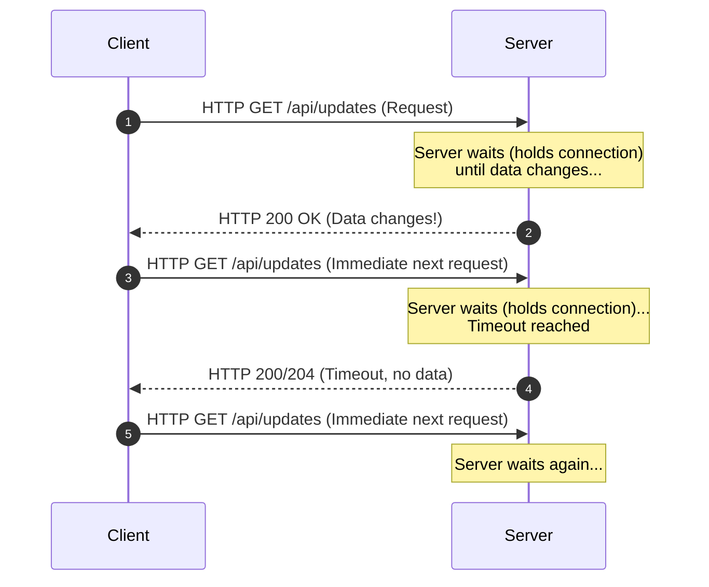
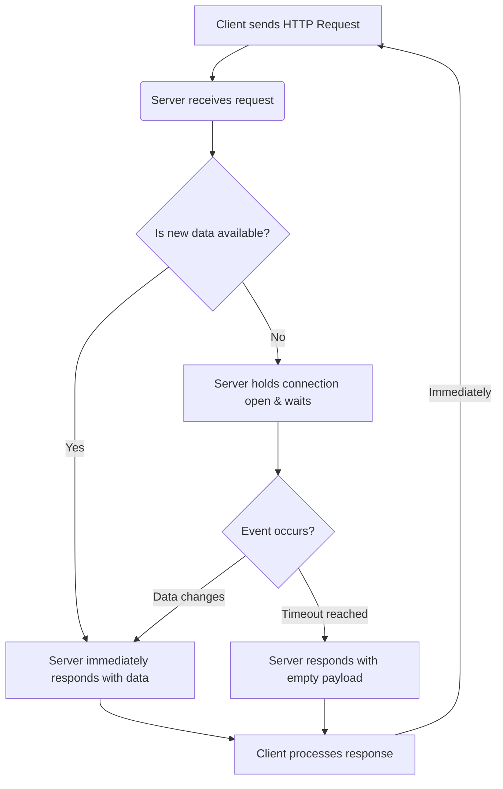

# Long Polling

Long Polling is a client-server communication technique where the client sends an HTTP request, and the server **holds the connection open** until new data becomes available (or until a timeout occurs). Once the client receives the response, it immediately sends a new request to start the process over.

> Long polling = client sends a request → server waits until data changes (or timeout) → responds → client immediately sends next request.

## Sequence Diagram

Here is a visual representation of how long polling works:

---

---

## How it Works

1. Client sends an HTTP request to the server.
2. Server does **not** respond immediately if it has no new information.
3. Server waits (holds the connection open) until new data is available or a timeout limit is reached.
4. Server responds with the new data (or an empty response on timeout).
5. Client processes the response and **immediately** sends a new request.
6. **→ cycle repeats**

## Key Characteristics

- **Single Long-Lived Connection:** The connection remains open until an event occurs or it times out.
- **Event-Driven Responding:** The server drives when the response is sent based on internal data changes.
- **Reduces Request Overhead:** Eliminates the continuous barrage of empty requests seen in Short Polling.

## Pros

- **Near Real-Time:** Clients receive updates almost instantly after the server gets the data.
- **Fewer Wasted Calls:** Dramatically reduces the number of empty HTTP requests and HTTP header overhead compared to Short Polling.
- **Broad Compatibility:** Works anywhere standard HTTP is supported, making it a great fallback when WebSockets are blocked by proxies or firewalls.

## Cons

- **Server Resource Heavy:** Holding thousands of connections open requires a lot of memory and server resources (requires non-blocking I/O or asynchronous servers to scale well).
- **Connection Management:** Dealing with timeouts, network drops, and immediate reconnections makes the client-side logic slightly more complex.
- **Latency on Reconnect:** During the brief window when a client is reconnecting after receiving a response, updates can theoretically be missed or delayed.

---

## 🔥 Senior/Staff Level "Grill" Questions

### Q1: Why is Long Polling "Memory Heavy" compared to Short Polling?

> **Answer:** In Short Polling, the request is parsed, handled, and the thread is released immediately. In Long Polling, the server must **keep the connection open** for 30-60 seconds. Each open connection consumes a **File Descriptor** and a chunk of **RAM** (the request context).
>
> - **Scale Tip:** Use an **Asynchronous/Non-blocking server** (like Node.js or Go with Goroutines) to handle thousands of "waiting" connections without spawning thousands of OS threads.

### Q2: How do you handle "The Thundering Herd" when the server restarts?

> **Answer:** If your server restarts, all 100,000 long-polling connections will drop simultaneously. When the server comes back up, all 100,000 clients will immediately send a new request to reconnect.
>
> - **The Fix:** Implement **Client-side Jitter**. The client should add a random delay (e.g., 0-5 seconds) before attempting to reconnect after a failure or server-side drop.

---

## Key Differences: Short Polling vs. Long Polling

| Feature               | Short Polling                            | Long Polling                                |
| :-------------------- | :--------------------------------------- | :------------------------------------------ |
| **Trigger Mechanism** | Fixed interval (Time-driven)             | Event-driven (Data changes)                 |
| **Request Volume**    | Many empty, wasted requests              | Fewer wasted calls                          |
| **Server Load**       | High CPU load (constant request parsing) | High Memory load (holding connections open) |
| **Latency**           | High (depends on the polling interval)   | Low (updates sent immediately)              |
| **Complexity**        | Very Simple                              | Slightly Complex (needs timeout handling)   |

## Typical Use Cases

- **Notifications:** Pushing a sudden alert or badge count update to a user.
- **Job Status Tracking:** Waiting for a long-running background task (like a video render or file export) to complete.
- **Near Real-Time Dashboards:** Updating graphs or metrics without hammering the database every second.
- **Restricted Environments:** Systems where strict corporate firewalls or proxies block WebSocket connections.

## When NOT to Use

- **High-Frequency Real-Time Systems:** Fast-paced multiplayer gaming or live high-speed financial trading.
- **Intense Real-Time Chat:** While historically used for chat, modern chat apps require lower overhead.
- **Massive Concurrent User Bases (C10K problem):** If you have hundreds of thousands of concurrent clients, holding all those standard HTTP connections open can exhaust server resources quickly.

## Alternatives

If Long Polling creates too much server load or doesn't meet latency needs, consider:

- **Server-Sent Events (SSE)** - Persistent one-way (server-to-client) real-time stream. Much more efficient for one-way updates.
- **WebSockets** - Persistent full-duplex (two-way) real-time communication for high-frequency, low-latency apps.
