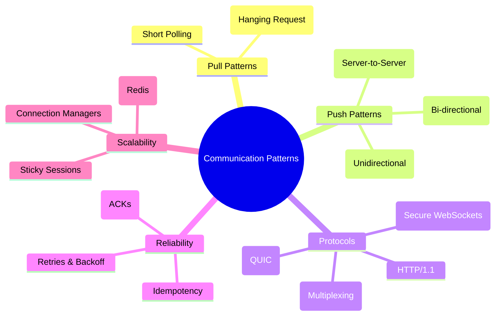

# System Design: Communication Strategies & Patterns

Effective communication is the backbone of any distributed system. This directory serves as a comprehensive laboratory for modern communication patterns used in distributed systems. This guide covers how components—from browsers to databases—talk to each other, the protocols they use, and how to choose the right pattern for your use case. From simple polling to full-duplex bi-directional streams, these patterns define how our services interact, scale, and deliver real-time experiences.

---

## 🗺️ Communication Landscape

---

## 🚀 The Decision Tree: Which One to Use?

Use this quick guide to determine the best strategy for your requirements:

1.  **Do you need Server-to-Server notifications?**
    - 👉 Use **[Webhooks](./Webhooks/README.md)**.
2.  **Does the Client only need updates FROM the Server (Unidirectional)?**
    - 👉 Use **[Server-Sent Events (SSE)](./ServerSentEvent/README.md)**.
3.  **Do you need two-way, high-frequency, low-latency interaction (Bidirectional)?**
    - 👉 Use **[WebSockets](./WebSocket/README.md)**.
4.  **Are you on a restricted network that blocks non-HTTP traffic?**
    - 👉 Use **[Long Polling](./LongPolling/README.md)**.
5.  **Is real-time NOT critical and simplicity is key?**
    - 👉 Use **[Short Polling](./ShortPolling/README.md)**.

---

## 🛠️ Implemented Techniques

### 1. [Short Polling](./ShortPolling/)

The client repeatedly asks the server for data at fixed intervals.

**Mode:** Pull (Client-initiated)

- **Pros:** Simplest to implement; works on any server/browser without special protocols.
- **Cons:** High server overhead due to constant empty requests; significant battery drain on mobile.
- **Example:** A dashboard checking for new email count every 60 seconds.
- **Use Case:** Simple status checks where latency isn't critical.

### 2. [Long Polling](./LongPolling/)

The server holds the request open until data is available or a timeout occurs.

**Mode:** Pull (Optimized "Hanging" request)

- **Pros:** Lower latency than short polling; works behind strict corporate firewalls that block WS.
- **Cons:** High resource usage on the server (held connections); "Request-Response" cycle overhead remains.
- **Example:** A web chat application on a legacy server that doesn't support WebSockets.
- **Use Case:** Near real-time updates when WebSockets/SSE are not available.

### 3. [Webhooks](./Webhooks/)

A "Reverse API" or "User-defined HTTP callback." Server A pushes data to Server B via an HTTP POST request when an event occurs.

**Mode:** Push (Server-to-Server)

- **Pros:** Highly efficient as data only moves when an event occurs; no persistent connections needed.
- **Cons:** Requires the consumer to have a public URL; needs robust security (signatures) and retry logic.
- **Example:** Stripe sending a `payment_succeeded` notification to your backend.
- **Use Case:** Third-party integrations and event-driven automation between backend services.

### 4. [Server-Sent Events (SSE)](./ServerSentEvent/)

Unidirectional persistent streaming from server to client over HTTP.

**Mode:** Push (Unidirectional Server-to-Client)

- **Pros:** Automatic reconnection; uses standard HTTP; very efficient for streaming data to the browser.
- **Cons:** Unidirectional only; browser connection limits (multiplexing required via HTTP/2).
- **Example:** A live news ticker or a real-time stock price feed.
- **Use Case:** Real-time dashboards, news feeds, and tickers.

### 5. [WebSockets](./WebSocket/)

Full-duplex, bidirectional communication over a single TCP connection.

**Mode:** Bidirectional (Full-Duplex)

- **Pros:** Lowest latency; data flows both ways simultaneously; very low header overhead after handshake.
- **Cons:** Stateful and harder to scale (requires sticky sessions); not all proxies/firewalls support it.
- **Example:** A multiplayer game or a collaborative document editor like Google Docs.
- **Use Case:** Chat apps, multiplayer games, and collaborative tools.

---

## 📊 Technical Comparison Matrix

| Feature        | Short Polling    | Long Polling     | Webhooks         | SSE              | WebSockets    |
| :------------- | :--------------- | :--------------- | :--------------- | :--------------- | :------------ |
| **Protocol**   | HTTP             | HTTP             | HTTP             | HTTP             | WS/TCP        |
| **Direction**  | Client -> Server | Client -> Server | Server -> Server | Server -> Client | Bidirectional |
| **Connection** | Ephemeral        | "Hanging"        | Ephemeral        | Persistent       | Persistent    |
| **Latency**    | High             | Medium           | Low              | Low              | Lowest        |
| **Use Case**   | Simple Checks    | Near Real-time   | Async Events     | Live Streams     | Interactive   |

---

## 🏛️ Architect's Decision Matrix: Communication Patterns

Choosing a communication strategy is about managing **State**, **Latency**, and **Battery**.

| Pattern           | Best for...                        | Scaling Challenge                     | The "Staff" Insight                                  |
| :---------------- | :--------------------------------- | :------------------------------------ | :--------------------------------------------------- |
| **Short Polling** | Non-critical status updates.       | High server CPU (Empty requests).     | Only use when latency > 30s is acceptable.           |
| **Long Polling**  | Real-time behind strict firewalls. | "Connection Hanging" (Resource leak). | The fallback of last resort for DPI firewalls.       |
| **SSE (Push)**    | Real-time dashboards/feeds.        | Browser connection limits (HTTP/1.1). | **Mobile Hero:** Better for battery than WebSockets. |
| **WebSockets**    | High-frequency Bidirectional data. | Stateful servers + Sticky Sessions.   | Requires a **Pub/Sub Backplane** to scale.           |
| **WebRTC**        | Peer-to-Peer Audio/Video/Data.     | NAT Traversal + Mesh scaling.         | Use an **SFU** to scale beyond 3-4 peers.            |
| **Webhooks**      | Event-driven Server-to-Server.     | Reliability (Retries) + Security.     | Always use **HMAC Signatures** to prevent spoofing.  |

---

## 🔥 Senior/Staff Level "Grill" Questions

### Q0: Why is WebRTC the only choice for ultra-low latency, and what is the trade-off?

> **Answer:** WebRTC is built on **UDP** (via SCTP/SRTP), which avoids the "Head-of-Line Blocking" inherent in TCP-based WebSockets.
>
> - **The Trade-off:** Complexity. You must manage **STUN/TURN** servers for NAT traversal and a complex **Signaling** state machine.

### Q1: How do you handle "Zombie Connections" when scaling to 1M+ users?

> **Answer:** A "Zombie" is a connection that the server thinks is alive, but the client has silently disconnected (e.g., entered a tunnel).
>
> - **The Solution:** Implement **Heartbeats (Ping/Pong)**. The server sends a Ping; if the client doesn't Pong within X seconds, the server forcefully closes the socket and cleans up resources.
> - **Scale Tip:** Don't send heartbeats to everyone at once. **Jitter** the heartbeat intervals to avoid a "Thundering Herd" of simultaneous Pings.

### Q2: What is "Connection Draining" and why is it a nightmare for WebSockets?

> **Answer:** When you deploy a new version of your server, you need to shut down the old instances. With REST, you just stop accepting new requests. With WebSockets, users are "stuck" to the old instance.
>
> - **The Strategy:** Use **Graceful Reconnection**. Tell the old server to send a "Goaway" frame or a custom `RECONNECT` message. The clients should then reconnect to the **Load Balancer**, which routes them to the _new_ instances.
> - **Danger:** If 1M users reconnect simultaneously, you get a **Thundering Herd** that can crash your Auth service or Database. You must use **Exponential Backoff + Jitter** on the client-side reconnection logic.

### Q3: Why is SSE often better for "Battery Life" on mobile than WebSockets?

> **Answer:** WebSockets require a raw TCP connection that bypasses many of the browser's and OS's standard HTTP optimizations. SSE is just a "hanging" HTTP GET request.
>
> - **Radio Optimization:** Mobile OSs can "batch" HTTP requests to keep the radio in a low-power state. Keeping a raw WebSocket alive often forces the radio to stay in a "High Power" state, draining the battery significantly faster.

### Q4: How do you handle "Backpressure" in a high-volume WebSocket stream?

> **Answer:** If the server is pushing data faster than the client can consume (common in data-heavy dashboards):
>
> - **Sampling:** Only send the latest state every 100ms instead of every single update.
> - **Delta Encoding:** Only send the _change_ in data, not the whole object.
> - **Client-side Signaling:** The client sends a "Pause" message when its internal buffer is full.

---

## 🏗️ Common Architecture Patterns

### The "Fulfillment" Pattern

1.  **REST API:** Client places an order and gets a `202 Accepted` response.
2.  **Webhooks:** External payment gateway notifies the server when payment clears.
3.  **WebSockets:** Server pushes "Order Shipped" status to the client in real-time.

---

## ⚠️ Best Practices & Pitfalls (Top-Level)

- **Mobile Battery:** Avoid Short Polling on mobile; frequent radio wakeups drain battery.
- **Scalability:** Stateful connections (WS/SSE) require **Sticky Sessions** (Session Affinity) or a shared backplane (Redis).
  - _Note:_ Sticky sessions ensure that all requests from a specific client are routed to the same server that established the initial persistent connection.
- **Connection Limits:** Browsers limit to ~6 concurrent HTTP/1.1 connections; use **HTTP/2** to multiplex.
- **Proxy Buffering:** Disable Nginx/Proxy buffering for SSE to ensure data flows immediately.
- **Security:** Always verify signatures for **Webhooks** and use `WSS` for encrypted WebSockets.
- **Idempotency:** Ensure consumers can handle duplicate events (especially for Webhooks and Polling).

---

## 📁 Directory Structure

- **[ShortPolling/](./ShortPolling/)**: Basic interval-based polling example.
- **[LongPolling/](./LongPolling/)**: Hanging-request implementation.
- **[Webhooks/](./Webhooks/)**: Server-to-server POST notification with security.
- **[ServerSentEvent/](./ServerSentEvent/)**: Streaming updates to the browser.
- **[WebSocket/](./WebSocket/)**: Bi-directional communication using `ws` and `Socket.io`.

---

## 🧠 Interview Deep Dive: From Basic to Staff Level

### 🟢 Basic (Junior / Mid Level)

**Q: What is the main difference between Short Polling and Long Polling?**

> **Answer:** In **Short Polling**, the client sends requests at fixed intervals (e.g., every 5s), regardless of whether data is ready. In **Long Polling**, the server holds the request open until it has new data or a timeout occurs. Long Polling is more efficient because it reduces empty responses and latency.

**Q: Is SSE bi-directional?**

> **Answer:** No. **Server-Sent Events (SSE)** is strictly unidirectional (Server-to-Client). If the client needs to send data back, it must use a separate HTTP request (REST/GraphQL).

**Q: When would you prefer WebSockets over a standard REST API?**

> **Answer:** When you need **low-latency, bi-directional, high-frequency** updates, such as in a chat application, multiplayer game, or a real-time stock trading dashboard.

---

### 🟡 Advanced (Senior Level)

**Q: How do you scale WebSockets to multiple server instances?**

> **Answer:** WebSockets are stateful (the connection stays with one server). To scale:
>
> 1.  **Sticky Sessions:** Ensure the initial handshake and subsequent frames go to the same server.
> 2.  **Pub/Sub Backplane:** Use Redis or RabbitMQ. When Server A receives a message for a user connected to Server B, it publishes to Redis, and Server B picks it up to push to the client.

**Q: How do you secure a Webhook endpoint from spoofing?**

> **Answer:** Use **HMAC (Hash-based Message Authentication Code)**. The sender signs the payload with a shared secret, and the receiver re-calculates the hash to verify it. Additionally, use **Timestamps** in the header to prevent replay attacks.

**Q: Why does SSE benefit significantly from HTTP/2?**

> **Answer:** In HTTP/1.1, browsers limit the number of concurrent connections to the same domain (usually ~6). Since SSE keeps a connection open, it quickly "exhausts" this limit. **HTTP/2 Multiplexing** allows multiple streams over a single TCP connection, bypassing this limit.

**Q: What is "Idempotency" and why is it critical in Webhooks/Polling?**

> **Answer:** Idempotency ensures that performing an operation multiple times has the same effect as doing it once. In Webhooks, a network glitch might cause the sender to retry a "Payment Succeeded" event. The receiver must use a unique `event_id` to ensure they don't process the same payment twice.

---

### 🔴 Staff / Architect Level

**Q: Design a notification system that scales to 10 million concurrent users. How do you handle delivery?**

> **Answer:** A hybrid approach is best:
>
> 1.  **High-Priority (Push):** Use WebSockets/SSE for active users to show "New Message" alerts instantly.
> 2.  **Low-Priority (Pull):** For non-critical updates (e.g., "someone liked your post"), have the client fetch them on next load or via occasional polling to save server resources and mobile battery.
> 3.  **Fan-out:** Use a distributed message queue (Kafka) to handle the massive volume of events before they are pushed to connection managers.

**Q: Discuss the trade-offs of using WebSockets vs. SSE for a mobile-first application.**

> **Answer:**
>
> - **Battery:** SSE is often better for battery as it uses standard HTTP and has better native power management in some mobile OSs. WebSockets require keeping a raw TCP socket alive, which can be more taxing.
> - **Reconnection:** SSE has built-in automatic reconnection logic. WebSockets require custom implementation (though libraries like Socket.io handle this).
> - **Complexity:** SSE is easier to load balance and proxy as it's just "hanging" HTTP. WebSockets require `Upgrade` header support and persistence.

**Q: How would you handle "Backpressure" in a high-volume WebSocket stream?**

> **Answer:** If the server is pushing data faster than the client can consume (common in data-heavy dashboards):
>
> 1.  **Server-side Buffering/Dropping:** Buffer the latest state and drop "intermediate" updates (e.g., only send the latest stock price if 5 updates arrived in 100ms).
> 2.  **Client Signaling:** Allow the client to send "Pause/Resume" signals to the server.
> 3.  **Adaptive Throttling:** Detect client lag (via ping/pong RTT) and automatically reduce the frequency of non-critical updates.

**Q: You are building a collaborative editor (like Google Docs). How do you handle the communication layer?**

> **Answer:** Use **WebSockets** for the transport layer due to the need for bi-directional, near-instant synchronization. However, the communication layer is only half the battle; you must use **Operational Transformation (OT)** or **Conflict-free Replicated Data Types (CRDTs)** to merge concurrent edits without conflicts.

**Q: How do WebSockets and SSE behave in a Serverless environment (e.g., AWS Lambda, Vercel Functions)?**

> **Answer:** Traditional serverless functions are execution-limited and stateless, making them a poor fit for persistent connections.
>
> - **WebSockets:** Require a "Stateful Gateway" (like AWS API Gateway WebSocket API) to manage the connection, while the Lambda only wakes up to process specific events/frames.
> - **SSE:** Generally not supported by standard serverless functions because they expect a quick request-response cycle and will timeout or kill the execution context.

**Q: How do you implement "Observability" for 100k+ concurrent WebSocket connections?**

> **Answer:** Traditional HTTP metrics are insufficient. You must track:
>
> 1.  **Connection Duration Distribution:** Identifying "leaky" clients.
> 2.  **Message Throughput (Ingress/Egress):** To detect spikes or "chatty" clients.
> 3.  **Backpressure Events:** Tracking when server-side buffers fill up.
> 4.  **Zombie Connections:** Monitoring heartbeat (Ping/Pong) failures to prune dead sockets.

**Q: In a high-security environment, why might you be forced to use Long Polling over WebSockets?**

> **Answer:** **Deep Packet Inspection (DPI)**. Some strict corporate firewalls only allow standard HTTP traffic and view the `Upgrade: websocket` header as a security risk because it bypasses traditional HTTP inspection once the tunnel is established. Long Polling is the "fallback of last resort" for maximum compatibility.

**Q: When and why would you switch from JSON to a Binary protocol (like Protobuf or MessagePack) over WebSockets?**

> **Answer:**
>
> 1. **Payload Size:** Binary formats are significantly smaller than JSON because they don't repeat keys in every message and use efficient encoding for numbers/dates. This reduces bandwidth and improves latency on slow networks.
> 2. **Parsing Overhead:** JSON parsing is CPU-intensive as it involves string manipulation. Binary protocols are "pre-compiled" or use fixed offsets, making serialization/deserialization orders of magnitude faster.
> 3. **Type Safety:** Protobuf enforces a strict schema. This prevents "runtime surprises" where a client expects a string but the server sends an object, which is a common failure point in large, distributed WebSocket systems.
