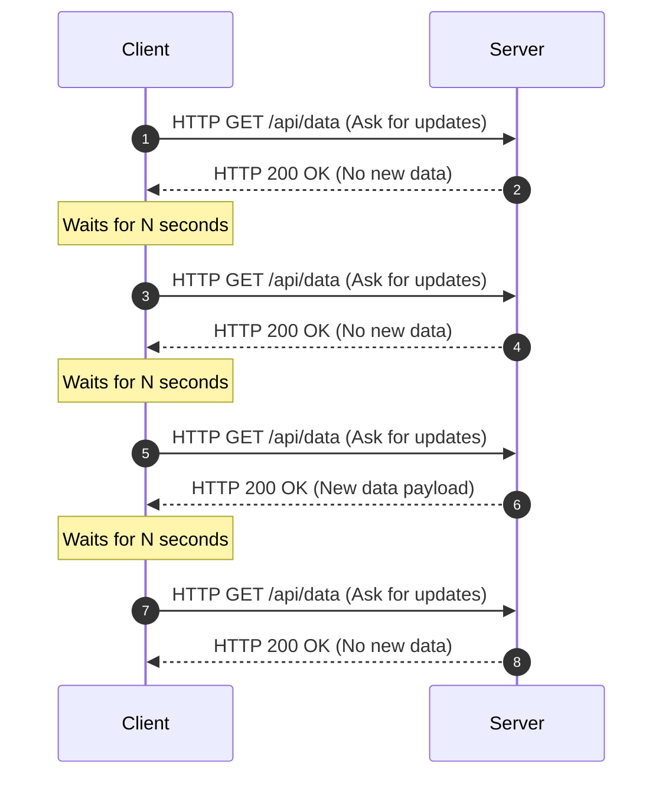

# Short Polling

- Short polling = client hits server every N seconds to ask "any update?".

Short polling is a client-server communication technique where the client repeatedly sends HTTP requests to the server at fixed intervals to check for new updates ("any updates?").

## Sequence Diagram

Here is a visual representation of how short polling works:

## How it Works

1. Client sends a request to the server.
2. Server responds immediately with the current data (or an empty response if there's no update).
3. Client waits for _N_ seconds.
4. Client sends the next request.
5. **→ cycle repeats**

## Key Characteristics

- **Short-lived HTTP connections:** Each request is closed immediately after the response.
- **No persistent connection:** Unlike WebSockets, the connection does not stay open.
- **Less Resource Utilization (per request):** Does not hold connection threads open on the server.
- **Predictable request pattern:** Traffic happens at fixed intervals.

## Pros

- **Easy to build and debug:** Uses standard request-response loops.
- **Works with standard HTTP:** No special protocols or firewalls configurations needed.
- **No special infrastructure required:** Works out-of-the-box with basic REST APIs.

## Cons

- **Scales poorly:** Generates massive amounts of traffic as the user base grows.
- **Wasted requests:** Creates high network overhead when no data changes.
- **Higher server load:** Handling connection setup/teardown repeatedly is heavy compared to long polling or WebSockets.

## Typical Use Cases

- **Low-frequency notifications:** Checking for a new message every minute.
- **Simple analytics refresh:** Refreshing a dashboard widget periodically.
- **Version / config update checks:** Checking if a new software version is available.
- **Lightweight dashboards:** Internal admin panels that don't require instant real-time data.

## When NOT to Use

- **High-frequency real-time systems:** Fast-paced trading apps, live GPS tracking.
- **Chat, gaming, live collaboration:** Applications where latency must be minimal.
- **Large concurrent user bases:** Where repeated polling would DDoS your own servers.

## Alternatives

If Short Polling doesn't fit your scale or latency requirements, consider:

- **Long Polling** - Client requests data, and the server holds the connection open until new data is available (fewer wasted requests).
- **Server-Sent Events (SSE)** - Persistent one-way (server-to-client) real-time stream.
- **WebSockets** - Persistent full-duplex (two-way) real-time communication
