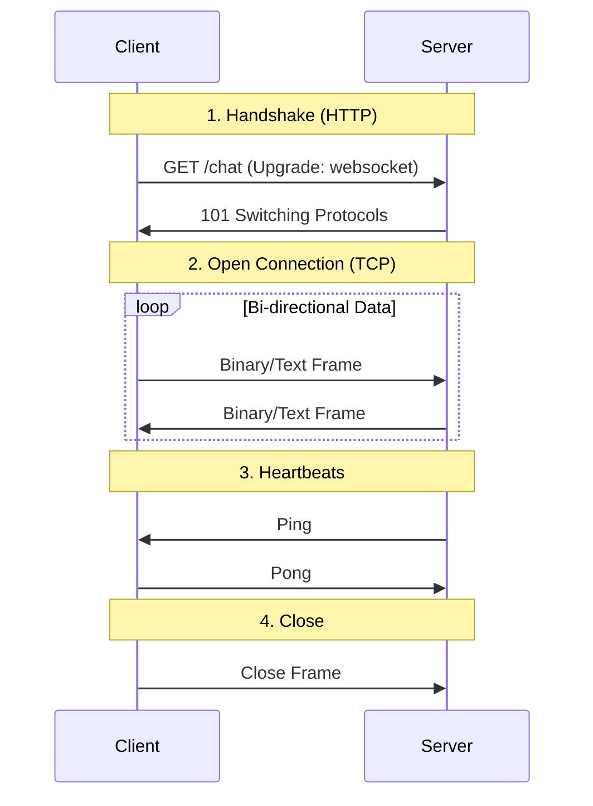

# WebSockets: The Complete Architectural Guide

A persistent, full-duplex communication protocol over a single TCP connection for real-time, bi-directional messaging.

---

## 1. Core Building Blocks

- **Full-Duplex vs. Half-Duplex:**
  - **Full-Duplex:** Both sides send/receive simultaneously (WebSocket).
  - **Half-Duplex:** One side at a time (e.g., HTTP request/response or Walkie-Talkie).
- **TCP Connection:**
  - Reliable, ordered, error-checked byte stream.
  - **The Catch:** TCP has no message boundaries; WebSocket adds **Framing** on top.
- **Bi-directional:** Client ↔ Server can push anytime without a request/response lock.
- **Serialization / Deserialization:**
  - Convert Objects ↔ Bytes.
  - **JSON:** Simple, human-readable, but larger.
  - **Protobuf/MessagePack:** Compact, faster, binary-based.
  - _Pitfall:_ Schema drift/versioning can break clients.
- **Packet Switching:** Data split into packets and routed independently. TCP reorders them so you see a clean stream.
- **ws:// vs wss://:** `ws` is plaintext; `wss` is TLS encrypted. **Always use wss:// in production.**
- **HTTP Upgrade (101):**
  - Starts as HTTP: `Upgrade: websocket` + `Connection: Upgrade`.
  - Server replies `101 Switching Protocols` → the socket becomes WebSocket.
- **Framing:**
  - Large messages split into chunks (frames).
  - Includes opcodes (text/binary), masking (client→server), and control frames (ping/pong).

---

## 2. The Lifecycle & Handshake

WebSockets start as a standard HTTP request to ensure compatibility with existing infrastructure.



**Lifecycle States:**

- **Handshake:** HTTP Upgrade request → 101 Switching Protocols.
- **Open:** Connection established and ready for data.
- **Message Exchange:** Bi-directional event-driven communication.
- **Heartbeats:** Periodic Ping/Pong to keep the connection alive.
- **Close:** Graceful (closing frame) or abrupt (network failure).

---

## 3. Minimal Flow (Code)

**Server (Node.js/ws)**

```javascript
import { WebSocketServer } from 'ws';
const wss = new WebSocketServer({ port: 8080 });

wss.on('connection', (ws) => {
  ws.on('message', (data) => ws.send(data)); // Echo
  const hb = setInterval(() => {
    if (ws.readyState === ws.OPEN) ws.ping();
  }, 30000);
  ws.on('close', () => clearInterval(hb));
});
```

**Client**

```javascript
const ws = new WebSocket('wss://your-domain');
ws.onopen = () => ws.send(JSON.stringify({ type: 'ping' }));
ws.onmessage = (e) => console.log(JSON.parse(e.data));
ws.onclose = () => {
  /* Implement exponential backoff here */
};
```

---

## 4. Architecture Patterns

- **Simple (Single Node):** Connections held in-memory. Only for prototypes.
- **Scaled (Multi-Node):**
  - **Sticky Sessions:** Load balancer ensures client → same node.
  - **Pub/Sub (Redis/NATS/Kafka):** Nodes sync via a message bus to broadcast across the cluster.
- **Gateway Layer:** Dedicated WS gateway (Node/Go) that handles connections and talks to microservices via a message bus.

---

## 5. Key Challenges & Fixes

- **Resource Usage:** Every socket = RAM + File Descriptor. Tune `ulimit` and use lightweight servers (Go/uWebSockets.js).
- **Connection Limits:** Browsers limit per-origin sockets; Servers limited by OS. Use subdomains if sharding is needed.
- **Load Balancers:** Must support `Upgrade` header. (e.g., NGINX: `proxy_set_header Upgrade $http_upgrade`).
- **Authentication:** Done during handshake (Cookies/JWT). _Note:_ Validate per-message on the server if logic is complex.
- **Firewalls:** Some block `ws://`. Use `wss://` on Port 443 to bypass.
- **Connection Drops:** Use **Exponential Backoff** for reconnections and **Last Event ID** to resume missed state.
- **Testing:** Use tools like `wscat`, `websocat`, or Browser DevTools → WS tab.
- **Compatibility:** Version your messages: `{ "v": 2, "type": "update" }`.

---

## 6. Common Pitfalls

- **Huge JSON blobs:** Causes latency spikes.
- **No Backpressure:** Sending data faster than the client can read → memory leaks.
- **Zombie Connections:** Missing heartbeats lead to resource exhaustion.
- **Blind Broadcasting:** Sending to 100k users at once → CPU spikes. Use room/channel partitioning.
- **Broken State:** Assuming message order across different shards.

---

## 7. Use Cases: When to use?

- **Financial Trading:** Sub-second stock/crypto price updates.
- **Online Gaming:** Syncing player movements and game state instantly.
- **Collaborative Tools:** Real-time cursor tracking or typing indicators (Google Docs/Figma).
- **Live Analytics:** Dashboards showing active users or server health.

---

## 8. When NOT to use WebSockets

- **Simple CRUD:** Use standard REST/GraphQL.
- **Low Frequency:** Use Polling or Server-Sent Events (SSE) (cheaper/simpler).
- **Cacheable Data:** WebSockets cannot be cached by CDNs; use HTTP.

---

## 10. Libraries: `ws` vs `Socket.io`

| Feature           | `ws` (Raw WebSockets)           | `Socket.io` (Abstraction Layer)          |
| :---------------- | :------------------------------ | :--------------------------------------- |
| **Protocol**      | Pure WebSocket (RFC 6455)       | Custom protocol (WS + Polling fallback)  |
| **Serialization** | Manual (`JSON.stringify/parse`) | Automatic (Pass objects directly)        |
| **Reconnection**  | Manual implementation required  | Automatic built-in (Exponential backoff) |
| **Events**        | Basic `on('message')`           | Custom named events (`on('chat')`)       |
| **Broadcast**     | Manual loop over `wss.clients`  | Built-in `io.emit()` or `Rooms`          |
| **Overhead**      | Minimal (High performance)      | Higher (Extra metadata per packet)       |

---

## 11. Which one to choose? (Interview Perspective)

### Use **`ws` (Raw)** when:

- **Performance at Scale:** Handling 100k+ concurrent connections with minimal RAM.
- **IoT & Mobile:** Low-power devices where every byte and CPU cycle counts.
- **Machine-to-Machine:** Internal microservices or high-frequency trading.
- **Standard Compliance:** When you need a "pure" implementation without a proprietary library.

#### Use **`Socket.io`** when:

- **User-Facing Apps:** Chat, Social Feeds, or Dashboards where UX is critical.
- **Reliability:** You need automatic reconnection and fallback to **Long Polling** if WS is blocked by firewalls.
- **Feature Richness:** You need **Rooms** (e.g., specific chat groups) or **Namespaces** out of the box.
- **Developer Speed:** You want to focus on business logic rather than low-level protocol handling.

---

## 12. Serialization & Deserialization (Data on the Wire)

Since computers send raw bytes over network cables/Wi-Fi, we must convert our high-level objects into a transmittable format.

1.  **Serialization (Sender Side):** Converting a JavaScript Object into a string or binary buffer.
    - _Example:_ `JSON.stringify({ text: "Hello" })` -> `"{\"text\":\"Hello\"}"`
2.  **Transmission:** The string is broken into packets and sent over the TCP pipe.
3.  **Deserialization (Receiver Side):** Converting the raw string/buffer back into a JavaScript Object.
    - _Example:_ `JSON.parse(data)` -> `{ text: "Hello" }`

**Socket.io** abstracts this away, doing the stringify/parse for you automatically.

---

## 12. Running the Examples

1.  **Raw WS:**
    - Run: `node server-ws.js`
    - Open `client-ws.html` in your browser.
2.  **Socket.io:**
    - Run: `node server-socketio.js`
    - Open `client-socketio.html` in your browser.
