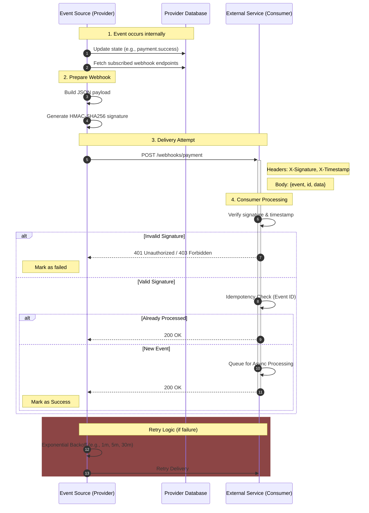

# Webhooks: A Comprehensive Guide to Event-Driven Communication

## 1. Overview

A **Webhook** is a mechanism that allows one system to automatically send real-time data to another system when a specific event occurs. It is often described as a "user-defined HTTP callback."

Unlike traditional APIs where a client must repeatedly "pull" or request data (Polling), webhooks "push" data to the client as soon as an event happens.

### The Fundamental Definition

> **"When X happens on our platform, we will send an HTTP POST request to your URL with the details."**

---

## 2. Webhooks vs. Polling: Push vs. Pull

The core difference lies in who initiates the communication and when.

### The Real-World Analogy

- **Polling (Pull):** Imagine checking your physical mailbox every 10 minutes. Most of the time, it's empty. You waste energy checking, and you only find the mail up to 10 minutes _after_ it arrived.
- **Webhooks (Push):** Imagine the mail carrier ringing your doorbell the moment they drop off mail. You only act when there is actually something to receive, and you get it instantly.

### Comparison Table

| Feature              | Polling (Pull)                        | Webhooks (Push)                  |
| :------------------- | :------------------------------------ | :------------------------------- |
| **Initiator**        | The Client (Consumer)                 | The Server (Provider)            |
| **Action**           | Client asks: "Any new data?"          | Server says: "Here is new data!" |
| **Real-time Nature** | Delayed (limited by polling interval) | Near-instant                     |
| **Server Load**      | High (constant requests)              | Efficient (only on events)       |
| **Client Load**      | High (constant scheduling)            | Low (passive listener)           |
| **Efficiency**       | Inefficient (many empty responses)    | Highly efficient                 |

---

## 3. How Webhooks Work (Architecture Flow)

The following diagram illustrates the lifecycle of a webhook event, from the internal trigger to successful delivery and processing.

---

## 4. Core Pillars of a Webhook Strategy

A robust webhook implementation relies on these five pillars:

1.  **Event-Driven Trigger:** Actions are triggered by specific state changes (e.g., `user.created`, `invoice.paid`).
2.  **Standardized Payload:** Data is typically sent as a JSON object containing a unique event ID, timestamp, event type, and the relevant data.
3.  **Security (Verification):** The consumer must verify that the request came from the trusted source using techniques like HMAC signatures.
4.  **Reliability (Retries):** The provider must handle network failures or consumer downtime by retrying delivery with exponential backoff.
5.  **Acknowledgment:** The consumer must respond with a `2xx` status code quickly to signal successful receipt.

---

## 5. Technical Implementation Best Practices

### 5.1. Security: Verification via HMAC

Since webhook endpoints are public, they must be secured.

1.  **Shared Secret:** Provider and Consumer share a secret key.
2.  **Signing:** Provider hashes the payload with the secret (HMAC-SHA256) and sends it in a header (e.g., `X-Hub-Signature`).
3.  **Verification:** Consumer re-computes the hash using their secret and compares it to the header.

### 5.2. Reliability: Exponential Backoff

If a delivery fails (non-2xx response or timeout), the provider should retry.

- **Attempt 1:** Immediate
- **Attempt 2:** +30 seconds
- **Attempt 3:** +5 minutes
- **Attempt 4:** +1 hour
- **Final:** After X attempts, disable the webhook and alert the user.

### 5.3. Idempotency

Network issues can cause duplicate webhooks. Consumers should:

- Log the unique `event_id`.
- If an ID is seen again, acknowledge it (`200 OK`) but do not re-process the business logic.

### 5.4. Asynchronous Processing

**Never** perform heavy processing (e.g., generating a PDF, sending an email) during the webhook request.

- **Correct Flow:** Receive Hook → Validate Signature → Store in Queue (Redis/SQS) → Return `200 OK` immediately.

---

## 6. Challenges and Pitfalls

- **Ordering:** Event A might arrive after Event B if Event A failed its first delivery attempt. Use timestamps in the payload to determine the correct order.
- **Timeouts:** Most providers expect a response within 5-10 seconds. Long-running processes will cause the provider to mark the attempt as a failure.
- **Firewalls:** Consumers must ensure their servers can receive incoming POST requests from the provider's IP ranges.

---

## 🔥 Senior/Staff Level "Grill" Questions

### Q1: How do you handle "Message Ordering" in Webhooks when retries are involved?

> **Answer:** If Event A fails but Event B succeeds, and then Event A is retried and succeeds, they arrive out of order.
>
> - **The Solution:** Use an **Incremental Version** or **Timestamp** in the payload. The consumer should only process a webhook if its version is _greater_ than the last processed version stored in the database.

### Q2: What is a "Webhook Fan-out" and how do you architect for it?

> **Answer:** This occurs when a single event (e.g., a "Product Price Update") triggers 10,000+ webhooks to different third-party consumers simultaneously.
>
> - **The Architecture:** Don't send webhooks from your main API thread.
>   1. Push the event to a **Message Queue** (SQS/Kafka).
>   2. Have a fleet of **Worker Nodes** consume the queue.
>   3. Use a **Rate Limiter** per consumer so you don't accidentally DDoS your own partners.

### Q3: How do you handle "Webhook Ingestion" at scale (10k requests/sec)?

> **Answer:** If your system is receiving thousands of webhooks, your server might crash under the load.
>
> - **The "Staff" Way:** Implement a **Serverless Ingestion Layer**. Use an AWS Lambda or a lightweight Go service that does NOTHING but:
>   1. Verify the signature.
>   2. Drop the payload into a queue (e.g., Kinesis or SQS).
>   3. Return `200 OK` immediately.
>      All business logic happens asynchronously from the queue.

### Q4: Explain "Webhook Circuit Breaking".

> **Answer:** If a partner's server is down and returning `500` errors, retrying 10,000 times is a waste of your resources.
>
> - **The Fix:** Implement a **Circuit Breaker**. If a specific endpoint fails X times in a row, "open" the circuit and stop sending webhooks to that consumer for a cooldown period (e.g., 1 hour). Notify the developer via email.

---

## 7. Common Use Cases

1.  **Payment Gateways:** Notifying your system when a subscription payment succeeds (e.g., Stripe).
2.  **CI/CD Pipelines:** Alerting Slack or Teams when a build fails (e.g., GitHub Actions).
3.  **CRM Sync:** Updating customer records in Salesforce when they change in your app.
4.  **E-commerce:** Triggering a warehouse shipment once an order is marked as paid.
