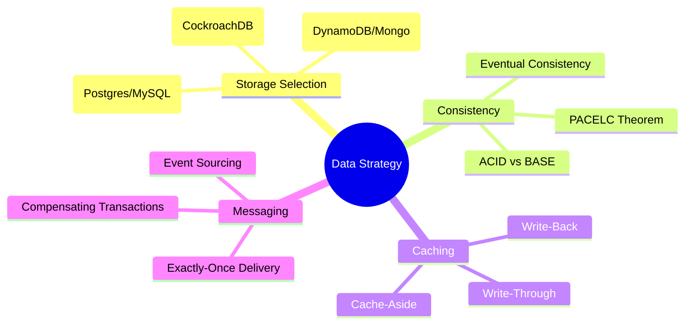

# Distributed Data, Caching & Storage

The "Hard Drive" of the internet. This module covers how to choose the right database, how to scale it globally, and how to use caching to achieve sub-millisecond latency.

---

## Data Strategy Mindmap

---

## 🏛️ Storage Selection: PACELC Matrix

Beyond CAP, we use the **PACELC** theorem to choose databases during normal operation (Else).

| Database      | Partition (P) Choice | Else (E) Choice | Use Case                             |
| :------------ | :------------------- | :-------------- | :----------------------------------- |
| **Postgres**  | Consistency (C)      | Consistency (C) | Financial, ACID transactions.        |
| **DynamoDB**  | Availability (A)     | Latency (L)     | Global high-scale, low latency.      |
| **Cassandra** | Availability (A)     | Latency (L)     | Time-series, IoT, huge write-volume. |
| **MongoDB**   | Consistency (C)      | Latency (L)     | Flexible schema, content management. |

---

## ⚡ Caching Strategies

1. **Cache-Aside (Most Popular):**
   - App checks Cache. If miss, reads from DB and updates Cache.
   - **Pro:** Resilient to cache failure. **Con:** Initial latency (miss).
2. **Write-Through:**
   - App writes to Cache; Cache synchronously writes to DB.
   - **Pro:** Data in cache is never stale. **Con:** Slow writes.
3. **Write-Back (Write-Behind):**
   - App writes to Cache; Cache updates DB asynchronously.
   - **Pro:** High-speed writes. **Con:** Risk of data loss if cache crashes.

---

## 🔄 Cache Coherency & Invalidation

> **"There are only two hard things in Computer Science: cache invalidation and naming things."** — Phil Karlton

### 1. TTL (Time to Live)

- **Strategy:** Set an expiration timer.
- **Staff Tip:** Use **Jittered TTLs** to prevent the "Thundering Herd" (where all keys expire at once).

### 2. CDC (Change Data Capture)

- **Strategy:** Use a tool (like Debezium) to listen to the DB transaction log and automatically invalidate/update the cache key.
- **Pro:** Perfect consistency between DB and Cache.

---

## 📩 Messaging: Exactly-Once Delivery

In distributed systems, achieving **Exactly-Once** is mathematically impossible without cooperation between sender and receiver.

- **The Problem:** Network failure during ACK.
- **The Solution:** **At-Least-Once Delivery + Idempotent Consumers.**
  - The producer sends the message (potentially multiple times).
  - The consumer checks an `idempotency_key` (usually a UUID) in a database. If it's already processed, it ignores it.

---
