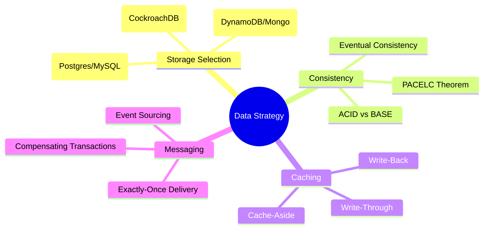

# Distributed Data, Caching & Storage

The "Hard Drive" of the internet. This module covers how to choose the right database, how to scale it globally, and how to use caching to achieve sub-millisecond latency.

---

## Data Strategy Mindmap

---

## 🏛️ Storage Selection: PACELC Matrix

Beyond CAP, we use the **PACELC** theorem to choose databases during normal operation (Else).

| Database      | Partition (P) Choice | Else (E) Choice | Use Case                             |
| :------------ | :------------------- | :-------------- | :----------------------------------- |
| **Postgres**  | Consistency (C)      | Consistency (C) | Financial, ACID transactions.        |
| **DynamoDB**  | Availability (A)     | Latency (L)     | Global high-scale, low latency.      |
| **Cassandra** | Availability (A)     | Latency (L)     | Time-series, IoT, huge write-volume. |
| **MongoDB**   | Consistency (C)      | Latency (L)     | Flexible schema, content management. |

---

## ⚡ Caching Strategies

1. **Cache-Aside (Most Popular):**
   - App checks Cache. If miss, reads from DB and updates Cache.
   - **Pro:** Resilient to cache failure. **Con:** Initial latency (miss).
2. **Write-Through:**
   - App writes to Cache; Cache synchronously writes to DB.
   - **Pro:** Data in cache is never stale. **Con:** Slow writes.
3. **Write-Back (Write-Behind):**
   - App writes to Cache; Cache updates DB asynchronously.
   - **Pro:** High-speed writes. **Con:** Risk of data loss if cache crashes.

---

## 🔄 Cache Coherency & Invalidation

> **"There are only two hard things in Computer Science: cache invalidation and naming things."** — Phil Karlton

### 1. TTL (Time to Live)

- **Strategy:** Set an expiration timer.
- **Staff Tip:** Use **Jittered TTLs** to prevent the "Thundering Herd" (where all keys expire at once).

### 2. CDC (Change Data Capture)

- **Strategy:** Use a tool (like Debezium) to listen to the DB transaction log and automatically invalidate/update the cache key.
- **Pro:** Perfect consistency between DB and Cache.

---

## 📩 Messaging: Exactly-Once Delivery

In distributed systems, achieving **Exactly-Once** is mathematically impossible without cooperation between sender and receiver.

- **The Problem:** Network failure during ACK.
- **The Solution:** **At-Least-Once Delivery + Idempotent Consumers.**
  - The producer sends the message (potentially multiple times).
  - The consumer checks an `idempotency_key` (usually a UUID) in a database. If it's already processed, it ignores it.

---

## Senior/Staff Level "Grill" Questions

### Q1: When is "NoSQL" the wrong choice for a high-scale system?

> **Answer:** When your access patterns are **unpredictable** or require **complex joins**.
>
> - NoSQL (like DynamoDB) requires you to design your schema based on your queries (**Query-First Design**). If the business adds a requirement to "Search by any field," NoSQL becomes an expensive nightmare. In that case, a sharded SQL database or a NewSQL (CockroachDB) is better.

### Q2: Explain the "Stale Read" risk in DynamoDB Global Tables.

> **Answer:** DynamoDB Global Tables use **Eventual Consistency** across regions.
>
> - **The Scenario:** A user writes to `us-east-1` and immediately tries to read from `eu-west-1`. Because the replication takes ~500ms, they will see the _old_ data.
> - **Architect's Fix:** If "Read-your-own-writes" is critical, you must route that specific user's requests to the **same region** for a short window after a write.

### Q3: How do you solve the "Dual Write" problem without Distributed Transactions?

> **Answer:** If you update the DB and then send an event to Kafka, the second step might fail. Now your DB and Kafka are out of sync.
>
> - **The Fix:** **The Outbox Pattern.**
>   1. Write the record AND the "Outbox Event" to the DB in a single ACID transaction.
>   2. A separate "Relay" service reads the Outbox table and pushes to Kafka.
>   3. This ensures the event is _guaranteed_ to be sent if the DB update succeeded.

### Q4: Why is `Redis` often used as a "Rate Limiter" instead of a Database?

> **Answer:** Performance and Atomic Operations. Redis has the **`INCR`** and **`EXPIRE`** commands which are atomic. You can increment a counter and set an expiration in a single operation, making it the perfect tool for sliding-window rate limiting at 100k+ requests/sec.
