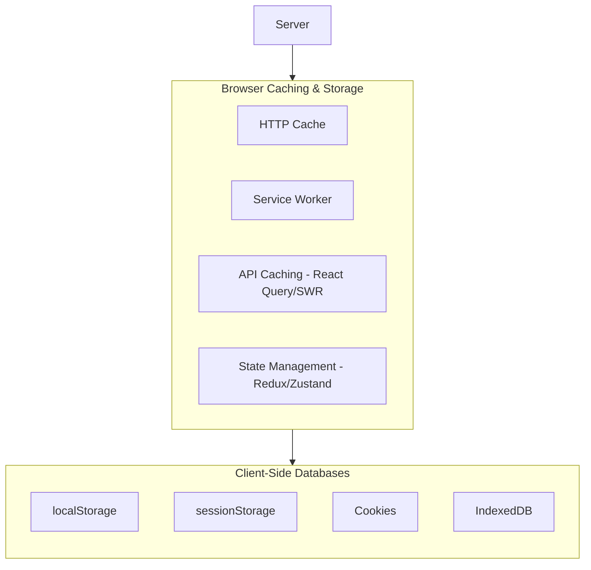

## Frontend Storage & Caching Overview

Modern web applications use multiple layers of caching and storage to ensure a smooth, offline-capable experience.



---

## ⚡ HTTP Caching: The Deep Dive

### 1. Freshness (Cache-Control)

Tells the browser **how long** to keep a resource without checking the server.

- **`Cache-Control: max-age=3600`**: Cache for 1 hour.
- **`Cache-Control: no-cache`**: MUST revalidate with the server every time (using ETag/Last-Modified).
- **`Cache-Control: no-store`**: Do not cache anything.
- **`Cache-Control: immutable`**: This file will NEVER change (used with hashed assets like `main.a1b2.js`).

### 2. Validation (ETag & Last-Modified)

Tells the browser **how to check** if the cached file is still valid.

| Header              | Type   | Description                                                    |
| :------------------ | :----- | :------------------------------------------------------------- |
| **`ETag`**          | Strong | A unique hash/fingerprint of the file content.                 |
| **`Last-Modified`** | Weak   | The timestamp of when the file was last changed on the server. |

#### The Conditional Request Flow:

1. **Initial Request:** Server sends `ETag: "v1"` and `Cache-Control: no-cache`.
2. **Subsequent Request:** Browser sends `If-None-Match: "v1"`.
3. **Response:**
   - If same: Server returns **`304 Not Modified`** (No body, very fast).
   - If different: Server returns **`200 OK`** with the new file and new `ETag`.

---

## 🏗️ Database Normalization

Normalization is the process of organizing data to reduce redundancy and improve data integrity.

### Why Normalize?

- **Single Source of Truth:** Update a user's name in one place, and it reflects everywhere.
- **Reduced Size:** Don't repeat large objects (like User profiles) in every Post.
- **Performance:** Smaller records mean faster lookups in indexed databases.

### Example: Social Media App

**Unnormalized (Denormalized) Data:**

```json
[
  {
    "id": "p1",
    "text": "Hello World",
    "author": { "id": "u1", "name": "Alice", "avatar": "alice.png" }
  },
  {
    "id": "p2",
    "text": "Second Post",
    "author": { "id": "u1", "name": "Alice", "avatar": "alice.png" }
  }
]
```

_Issue: If Alice changes her avatar, we have to update every single post object._

**Normalized Data:**

```json
{
  "posts": {
    "p1": { "id": "p1", "text": "Hello World", "authorId": "u1" },
    "p2": { "id": "p2", "text": "Second Post", "authorId": "u1" }
  },
  "users": {
    "u1": { "id": "u1", "name": "Alice", "avatar": "alice.png" }
  }
}
```

_Solution: To update Alice's avatar, we change one record in the `users` table._

---

## 🗄️ Client-Side Databases (1-2 Liners)

- **localStorage:** Persistent key-value storage (up to 5MB) that survives browser restarts; synchronous and blocking.
- **sessionStorage:** Similar to localStorage but data is cleared when the tab/session ends.
- **Cookies:** Small (4KB) tokens sent with every HTTP request; used for auth and tracking.
- **IndexedDB:** A powerful, asynchronous NoSQL database for storing large amounts of structured data (files/blobs).

---

## Senior/Staff Level "Grill" Questions (Frontend)

### Q1: ETag vs. Last-Modified—which is better?

> **Answer:** **ETag** is generally superior because it is content-based. `Last-Modified` is time-based and has a 1-second resolution; if a file is updated twice in one second, it fails. ETags also handle cases where a file was "touched" but the content didn't actually change.

### Q2: Why use `Cache-Control: no-cache` if you still want to cache?

> **Answer:** It's a confusing name! `no-cache` doesn't mean "don't cache"; it means **"revalidate before use"**. It allows the browser to store the file but forces it to send an `If-None-Match` request to the server first. If you want to stop caching entirely, use `no-store`.

### Q3: What is "Cache Busting" and why do we need it with `immutable`?

> **Answer:** When we use `Cache-Control: immutable`, the browser will NEVER ask the server for that file again until the cache is cleared. To update the app, we must change the **filename** (e.g., `app.v1.js` -> `app.v2.js`). This is called Cache Busting.

### Q4: When should you deliberately **Denormalize** data?

> **Answer:** For **Read Performance** in high-scale systems. If you have a dashboard that needs to show 100 posts with author names, doing 100 lookups (or a complex join) can be slow. Storing the `authorName` directly in the `Post` record (Denormalization) makes the read instant, at the cost of more complex updates.
