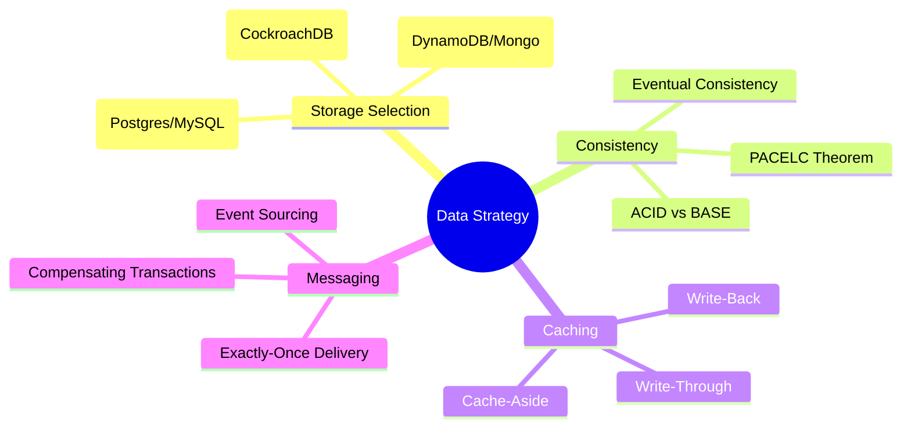
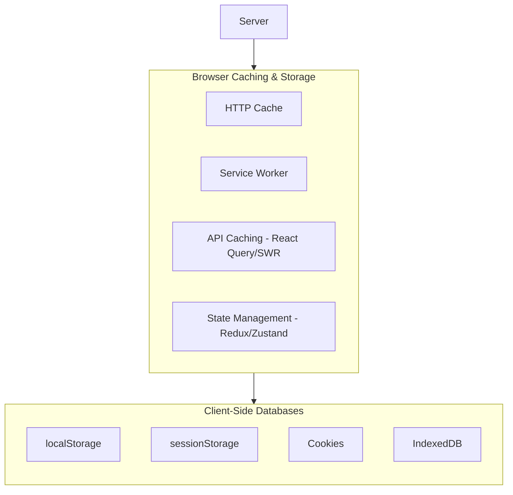

# Full-Stack Database & Caching Architecture

This module covers both backend distributed data strategies and frontend client-side caching mechanisms to build fast, resilient, and eventually consistent applications.

## Table of Contents

- [Full-Stack Database \& Caching Architecture](#full-stack-database--caching-architecture)
  - [Table of Contents](#table-of-contents)
  - [Part 1: Distributed Data Strategy \& Storage (Backend)](#part-1-distributed-data-strategy--storage-backend)
    - [Data Strategy Mindmap](#data-strategy-mindmap)
    - [PACELC Storage Selection](#pacelc-storage-selection)
    - [Distributed Caching Strategies](#distributed-caching-strategies)
    - [Cache Coherency \& Invalidation](#cache-coherency--invalidation)
      - [1. Time-to-Live (TTL)](#1-time-to-live-ttl)
      - [2. Change Data Capture (CDC)](#2-change-data-capture-cdc)
    - [Exactly-Once Message Delivery](#exactly-once-message-delivery)
  - [Part 2: Client-Side Storage \& Caching (Frontend)](#part-2-client-side-storage--caching-frontend)
    - [Browser Caching \& Storage Landscape](#browser-caching--storage-landscape)
    - [HTTP Caching \& Validation](#http-caching--validation)
      - [1. Freshness (`Cache-Control`)](#1-freshness-cache-control)
      - [2. Validation (`ETag` \& `Last-Modified`)](#2-validation-etag--last-modified)
    - [Database Normalization vs. Denormalization](#database-normalization-vs-denormalization)
      - [Normalization (Single Source of Truth)](#normalization-single-source-of-truth)
      - [Denormalization (Read Optimization)](#denormalization-read-optimization)
    - [Client-Side Storage Landscape](#client-side-storage-landscape)
      - [Tabular Quick Lookup: Client-Side Caching \& Storage Landscape](#tabular-quick-lookup-client-side-caching--storage-landscape)
      - [LocalStorage Architectural Core](#localstorage-architectural-core)
      - [SessionStorage Architectural Core](#sessionstorage-architectural-core)
      - [Cookie Architectural Core](#cookie-architectural-core)
      - [IndexedDB Architectural Core](#indexeddb-architectural-core)
      - [HTTP Caching Architectural Core](#http-caching-architectural-core)
      - [Service Worker Architectural Core](#service-worker-architectural-core)
  - [Part 3: Senior/Staff Level "Grill" Questions](#part-3-seniorstaff-level-grill-questions)
    - [Q1: ETag vs. Last-Modified—which should be preferred for visual resources?](#q1-etag-vs-last-modifiedwhich-should-be-preferred-for-visual-resources)
    - [Q2: Why use `Cache-Control: no-cache` if you intend to cache the resource?](#q2-why-use-cache-control-no-cache-if-you-intend-to-cache-the-resource)
    - [Q3: How do you handle updates for files using `Cache-Control: immutable`?](#q3-how-do-you-handle-updates-for-files-using-cache-control-immutable)
    - [Q4: Explain the difference between Application-level cache invalidation and CDC-based invalidation.](#q4-explain-the-difference-between-application-level-cache-invalidation-and-cdc-based-invalidation)
    - [Q5: How do you protect a cache against "Cache Penetration" (fetching keys that don't exist)?](#q5-how-do-you-protect-a-cache-against-cache-penetration-fetching-keys-that-dont-exist)

---

## Part 1: Distributed Data Strategy & Storage (Backend)

The "Hard Drive" of the internet. This section covers storage models, ACID vs. BASE consistency, and high-scale backend caching architectures.

### Data Strategy Mindmap



### PACELC Storage Selection

While the CAP theorem describes system guarantees during a network partition, the **PACELC** theorem extends this by describing trade-offs during normal operation (Else).

$$\text{If Partition (P)} \rightarrow \text{choose Availability (A) vs. Consistency (C)} \quad \text{Else (E)} \rightarrow \text{choose Latency (L) vs. Consistency (C)}$$

| Database      | Partition (P) Choice | Else (E) Choice | Ideal Use Case                                     |
| :------------ | :------------------- | :-------------- | :------------------------------------------------- |
| **Postgres**  | Consistency (C)      | Consistency (C) | Financial, ACID compliance, strict relations.      |
| **DynamoDB**  | Availability (A)     | Latency (L)     | Global high-scale shopping carts, metadata lookup. |
| **Cassandra** | Availability (A)     | Latency (L)     | Time-series metrics, high-frequency IoT logging.   |
| **MongoDB**   | Consistency (C)      | Latency (L)     | Dynamic documents, content management catalogs.    |

---

### Distributed Caching Strategies

Caching on the backend is used to offload database reads and achieve sub-millisecond response latencies.

1. **Cache-Aside (Lazy Loading):**
   - **Flow:** App checks the cache. On a miss, it queries the database, updates the cache, and returns the data.
   - **Pro:** Simple, resilient to cache node failures (reverts to DB).
   - **Con:** Cache misses incur double latency.
2. **Write-Through:**
   - **Flow:** App writes to the cache; the cache synchronously writes to the database before confirming success.
   - **Pro:** Cache data is never stale; read hits are guaranteed to be fresh.
   - **Con:** Slow write performance due to synchronous double-write overhead.
3. **Write-Back (Write-Behind):**
   - **Flow:** App writes to the cache, which acknowledges immediately. The cache updates the DB asynchronously in the background.
   - **Pro:** Extremely high write throughput.
   - **Con:** Risk of data loss if the cache node crashes before flushing dirty writes to the DB.

---

### Cache Coherency & Invalidation

> **"There are only two hard things in Computer Science: cache invalidation and naming things."** — Phil Karlton

#### 1. Time-to-Live (TTL)

- **Strategy:** Evict keys automatically after a set duration.
- **Staff Tip (Jitter):** Always inject random variance (jitter) into TTL limits (e.g., $3600 \pm 120$ seconds). This prevents the **Thundering Herd** problem where thousands of keys expire simultaneously, exposing the database to traffic spikes.

#### 2. Change Data Capture (CDC)

- **Strategy:** Use transaction log tailing (e.g., Debezium + Kafka) to observe database modifications and invalidate/update corresponding cache keys automatically.
- **Pro:** Decoupled architecture, extremely low risk of stale cache states.

---

### Exactly-Once Message Delivery

In distributed event-driven systems, achieving exactly-once delivery is theoretically impossible over an unreliable network. Instead, we architect for **At-Least-Once Delivery + Idempotency**:

- **Producer:** Retries sending the event until it receives an acknowledgement (ACK).
- **Consumer:** Maintains a processed keys store (often a fast cache or DB index). When a message arrives, it verifies the `idempotency_key` (UUID). If the key already exists, the consumer discards the duplicate and returns success.

---

## Part 2: Client-Side Storage & Caching (Frontend)

Modern client-side engineering uses caching to bypass network round-trips entirely, enable offline accessibility, and manage local states.

### Browser Caching & Storage Landscape



---

### HTTP Caching & Validation

#### 1. Freshness (`Cache-Control`)

Specifies the duration resources can be served directly from the browser cache without validating with the server.

- **`Cache-Control: max-age=3600`:** Considers resource fresh for 1 hour.
- **`Cache-Control: no-cache`:** Forces the browser to send a validation request to the server before using the cached resource.
- **`Cache-Control: no-store`:** Prevents any caching.
- **`Cache-Control: immutable`:** Tells the browser the file content will never change.

#### 2. Validation (`ETag` & `Last-Modified`)

Enables conditional requests to the server to check if a cached resource has changed:

- **`ETag` (Strong):** A unique hash signature generated by the server for the file contents.
- **`Last-Modified` (Weak):** A timestamp indicating when the file was last updated.

**The Conditional Validation Loop:**

1. Browser requests `/main.js`. Server returns file with `ETag: "abc"` and `Cache-Control: no-cache`.
2. On next request, browser sends `If-None-Match: "abc"`.
3. If file hasn't changed, server returns a **`304 Not Modified`** header (empty body), saving bandwidth and processing time.

---

### Database Normalization vs. Denormalization

#### Normalization (Single Source of Truth)

Organizing nested objects into flat tables referenceable by IDs to prevent redundant data entries.

- **Example (Normalized):**
  ```json
  {
    "posts": {
      "p1": { "id": "p1", "text": "Hello World", "authorId": "u1" }
    },
    "users": {
      "u1": { "id": "u1", "name": "Alice", "avatar": "alice.png" }
    }
  }
  ```
- **Pro:** Mutating the avatar of `u1` only requires updating a single location.

#### Denormalization (Read Optimization)

Duplicating specific fields directly into records to prevent join operations during read phases.

- **Example (Denormalized):**
  ```json
  [
    {
      "id": "p1",
      "text": "Hello World",
      "authorName": "Alice"
    }
  ]
  ```
- **Pro:** Fetching a post immediately provides the author name, bypassing nested database lookups.

> [!IMPORTANT]
> A detailed deep dive into state massage, transformation rules, lookup complexity math ($O(N)$ vs $O(1)$), and React rendering pitfalls of client-side data normalization is available at:
>
> - **[State Normalization Architecture Deep Dive](file:///Users/atulkumarawasthi/projects/SystemDesign/Database&Caching/normalization/README.md)**

---

### Client-Side Storage Landscape

To support offline access, dynamic UI states, and request performance, modern web applications leverage client-side storage mechanisms. These APIs execute directly in the user's browser but carry various constraints, security rules, and performance implications.

- For the complete senior/staff architectural deep dive, see the **[LocalStorage Architecture & Mechanics Deep Dive](file:///Users/atulkumarawasthi/projects/SystemDesign/Database&Caching/localstorage/README.md)**.
- For a fully interactive, browser-based demonstration illustrating quotas, thread-blocking, serialization quirks, and cross-tab storage events, see the **[Interactive LocalStorage Demo](file:///Users/atulkumarawasthi/projects/SystemDesign/Database&Caching/localstorage/index.html)**.
- For the complete senior/staff architectural deep dive on session boundaries, see the **[SessionStorage Architecture & Mechanics Deep Dive](file:///Users/atulkumarawasthi/projects/SystemDesign/Database&Caching/sessionstorage/README.md)**.
- For a fully interactive, browser-based demonstration illustrating tab cloning, copy-on-write decoupling, and session quotas, see the **[Interactive SessionStorage Demo](file:///Users/atulkumarawasthi/projects/SystemDesign/Database&Caching/sessionstorage/index.html)**.
- For the complete senior/staff architectural deep dive on structured client databases, see the **[IndexedDB Architecture & Mechanics Deep Dive](file:///Users/atulkumarawasthi/projects/SystemDesign/Database&Caching/indexeddb/README.md)**.
- For a fully interactive, browser-based demonstration illustrating transactional CRUD, event loop auto-commit gotchas, and version upgrades blockages, see the **[Interactive IndexedDB Demo](file:///Users/atulkumarawasthi/projects/SystemDesign/Database&Caching/indexeddb/index.html)**.
- For a standalone, premium-styled Todo application utilizing client-side IndexedDB transactions and browser alerts, see the **[IndexedDB Todo Application](file:///Users/atulkumarawasthi/projects/SystemDesign/Database&Caching/indexeddb/todo.html)**.
- For the complete senior/staff architectural deep dive on HTTP Caching and revalidations, see the **[HTTP Caching Architecture & Mechanics Deep Dive](file:///Users/atulkumarawasthi/projects/SystemDesign/Database&Caching/httpCaching/README.md)**.
- For a fully interactive, local browser demonstration illustrating revalidation loops, ETags, Last-Modified, and stale-while-revalidate caches, see the **[Interactive HTTP Caching Demo](file:///Users/atulkumarawasthi/projects/SystemDesign/Database&Caching/httpCaching/index.html)**.
- For the complete senior/staff architectural deep dive on Service Workers and cache interception patterns, see the **[Service Worker Architecture & Implementation Patterns](file:///Users/atulkumarawasthi/projects/SystemDesign/Database&Caching/serviceWorker/README.md)**.

#### Tabular Quick Lookup: Client-Side Caching & Storage Landscape

| Storage Mechanism    | Size Limit                 | Performance & Blocking           | Data Type                               | Persistence & Lifecycle                                                   | Sent on HTTP Requests?                             | Available in Web/Service Workers?               | Cross-Tab Synchronization?                       | Best Security Practice                                       | Primary Use Case                                        |
| :------------------- | :------------------------- | :------------------------------- | :-------------------------------------- | :------------------------------------------------------------------------ | :------------------------------------------------- | :---------------------------------------------- | :----------------------------------------------- | :----------------------------------------------------------- | :------------------------------------------------------ |
| **`localStorage`**   | ~5MB                       | Synchronous (blocks main thread) | Strings only                            | Permanent (until manually cleared or Safari 7-day purge)                  | No                                                 | No                                              | Yes (via `storage` event)                        | Never store sensitive data (no HttpOnly); vulnerable to XSS. | Non-sensitive UI preferences (theme, language).         |
| **`sessionStorage`** | ~5MB                       | Synchronous (blocks main thread) | Strings only                            | Tied to active tab/session lifecycle                                      | No                                                 | No                                              | No                                               | Vulnerable to XSS.                                           | Transient multi-step form data.                         |
| **`Cookies`**        | ~4KB                       | Non-blocking                     | Strings only                            | Configurable via `Expires`/`Max-Age`                                      | Yes (sent on every network request matching scope) | Partially (Cookie Store API in Service Workers) | Yes (natively synced across same origin cookies) | Use `HttpOnly`, `Secure`, and `SameSite=Strict/Lax` flags.   | Session IDs, auth tokens, client-state correlation.     |
| **`IndexedDB`**      | Limitless (up to 80% disk) | Asynchronous (non-blocking)      | Structured objects, Blobs, ArrayBuffers | Permanent (subject to global disk pressure eviction & Safari 7-day purge) | No                                                 | Yes                                             | Yes (via shared DB connections/events)           | Scoped to Origin. Sanitize values read to avoid XSS.         | Offline application databases, large datasets, assets.  |
| **`Cache Storage`**  | Limitless (up to 80% disk) | Asynchronous (non-blocking)      | Request/Response pairs                  | Permanent (managed by SW lifecycle, subject to browser disk pressure)     | No                                                 | Yes                                             | Yes (accessible by all matching clients)         | Only accessible on HTTPS secure origins.                     | Progressive Web App (PWA) static assets, API responses. |

#### LocalStorage Architectural Core

LocalStorage provides simple key-value persistence but introduces major performance and operational trade-offs:

- **Synchronous Thread Blocking**: Both read and write operations block the browser's single main thread. Large writes trigger disk I/O latency, while page startup loads the entire database into RAM, causing frame drops (jank) if used in high-frequency loops.
- **Apple WebKit Eviction Rules**: Subject to Safari's 7-day Intelligent Tracking Prevention (ITP) eviction. If a website gets no user interaction for 7 days, Safari permanently purges all LocalStorage, SessionStorage, and IndexedDB data.
- **Cross-Tab State Synchronization**: Mutating data in one tab automatically fires a window `storage` event across all other open tabs/windows of the same origin, enabling native synchronization.
- **Type Coercion Gotchas**: Data is coerced to strings via `.toString()`. Storing primitives like `false` or `null` turns them into the string literals `"false"` and `"null"`, which evaluate as truthy on retrieval.

> [!IMPORTANT]
> Detailed deep dives and interactive examples for LocalStorage are available at:
>
> - **[LocalStorage Architecture & Mechanics Deep Dive](./localstorage/README.md)**
> - **[Interactive LocalStorage Demo](./localstorage/index.html)**

#### SessionStorage Architectural Core

SessionStorage introduces strict context boundaries suited for transient, tab-isolated state:

- **Tab-Bound Isolation**: Scoped exclusively to the creating tab context. Opening multiple tabs to the same URL creates separate, isolated SessionStorage instances.
- **Tab Duplication (Copy-on-Write)**: Duplicating a tab (via browser menu or programmatically via `window.open`) copies the parent's SessionStorage to the child tab. Once cloned, the storage objects are fully decoupled; mutations do not sync. URL copy-pasting or manual tab entry opens an empty database.
- **Protocol Partitioning**: Scheme differences isolate databases under Same-Origin Policy (SOP). Storing a key under `http://example.com` does not make it available to the `https://example.com` context.
- **Security & Session Expiry**: Data survives reloads/restores but is purged on tab closure. Lacks time-based expiration; developers must programmatically implement sliding inactivity timers (TTL) to clear data.

> [!IMPORTANT]
> Detailed deep dives and interactive examples for SessionStorage are available at:
>
> - **[SessionStorage Architecture & Mechanics Deep Dive](./sessionstorage/README.md)**
> - **[Interactive SessionStorage Demo](./sessionstorage/index.html)**
> - **[SessionStorage Todo CRUD Application](./sessionstorage/todo.html)**

#### Cookie Architectural Core

Cookies are managed by the browser but automatically sent on every matching HTTP request, presenting unique scoping and security behaviors:

- **Automatic Request Transmission**: Transmitted automatically in HTTP request headers. Large cookies cause header bloat and slow down asset-loading performance, requiring CDNs/cookie-free domains for optimization.
- **HTTP-Only Shielding**: Supports the `HttpOnly` flag, protecting authentication tokens (e.g., Session IDs, JWTs) from being read or stolen by scripts during XSS attacks.
- **CSRF Protection via SameSite**: Controls cookie attachment on cross-site requests using `SameSite=Strict/Lax/None` to mitigate Cross-Site Request Forgery (CSRF).
- **Vulnerabilities & Overwrites**: Prone to subdomain "cookie tossing" attacks. Using cookie prefixes (`__Host-` and `__Secure-`) locks cookies to HTTPS secure transport and domain contexts, preventing overwrite attacks.

> [!IMPORTANT]
> Detailed deep dives and interactive examples for Cookies are available at:
>
> - **[Cookie Architecture & Security Mechanics Deep Dive](./cookie/README.md)**
> - **[Interactive Cookie Demo](./cookie/index.html)**

#### IndexedDB Architectural Core

IndexedDB serves as a full client-side transactional database suited for offline storage:

- **Asynchronous & Non-Blocking**: Runs database writes asynchronously, keeping the main UI thread free from disk latency spikes.
- **Microtask Auto-Commit Trap**: Closed automatically by the browser when the microtask queue clears. Asynchronous tasks (like network fetches) cannot be run inside transactions.
- **Schema & Version Upgrades**: Require versioned upgrades under `onupgradeneeded`, which can be blocked by other open tabs of the same origin.
- **Large Capacity Limits**: Reaches up to 80% of disk space in standard browsers, but undergoes 7-day inactivity purge in Safari.

> - **[IndexedDB Architecture & Mechanics Deep Dive](file:///Users/atulkumarawasthi/projects/SystemDesign/Database&Caching/indexeddb/README.md)**
> - **[Interactive IndexedDB Demo](file:///Users/atulkumarawasthi/projects/SystemDesign/Database&Caching/indexeddb/index.html)**
> - **[IndexedDB Todo Application](file:///Users/atulkumarawasthi/projects/SystemDesign/Database&Caching/indexeddb/todo.html)**

#### HTTP Caching Architectural Core

HTTP Caching controls transport-level resource reuse directly at the network boundary:

- **Directives Precedence**: Freshness and security behaviors follow strict precedence checks: `no-store` (never cache) > `no-cache` / `must-revalidate` (must validate with server before use) > `max-age` / `Expires` (relative/absolute TTL freshness).
- **Validation Handshakes**: Employs cryptographic hashes (`ETag` / `If-None-Match`) and timestamps (`Last-Modified` / `If-Modified-Since`) to revalidate stale assets via bandwidth-efficient `304 Not Modified` headers.
- **Cache Invalidation Protocols**:
  - _Cache Busting (URL Fingerprinting)_: Appending unique content hashes to file paths (e.g. `main.a7f9.js`), forcing the browser to fetch new asset names instantly when server code updates.
  - _Response Clearances_: Using the `Clear-Site-Data: "cache"` HTTP header to programmatically wipe browser-cached data on the client.
  - _Request Overrides_: User-initiated force-reloads (e.g. Ctrl+F5) injecting `Cache-Control: no-cache` in request headers to bypass local caches.

> [!IMPORTANT]
> A detailed architectural deep dive and interactive playground for HTTP Caching are available at:
>
> - **[HTTP Caching Architecture & Mechanics Deep Dive](file:///Users/atulkumarawasthi/projects/SystemDesign/Database&Caching/httpCaching/README.md)**
> - **[Interactive HTTP Caching Demo](file:///Users/atulkumarawasthi/projects/SystemDesign/Database&Caching/httpCaching/index.html)**

#### Service Worker Architectural Core

Service Workers act as client-side network proxies running in an independent background execution context:

- **Thread Isolation & DOM Restrictions**: Execute in a separate thread from the page's UI thread, completely isolated from direct DOM access. All communications with client pages must use asynchronous messaging (`postMessage`).
- **Programmable Interception Flow**: Intercept all outgoing HTTP fetch requests from pages in their registered scope, choosing to serve them from the Cache API or forwarding them to the network.
- **Event-Driven Lifecycle**: Follow a stateful execution lifecycle (`install` -> `waiting` -> `activate` -> `active`). Assets are typically pre-cached during installation, and obsolete caches are cleaned during activation.
- **Immediate Claims & Updates**: The new worker script stays in a waiting state until all tabs running the older worker are closed, unless bypassed via `self.skipWaiting()` and `self.clients.claim()`.

> [!IMPORTANT]
> A detailed architectural deep dive and code example template implementations for Service Workers are available at:
>
> - **[Service Worker Architecture & Implementation Patterns](file:///Users/atulkumarawasthi/projects/SystemDesign/Database&Caching/serviceWorker/README.md)**

---

## Part 3: Senior/Staff Level "Grill" Questions

### Q1: ETag vs. Last-Modified—which should be preferred for visual resources?

> **Answer:** **ETag** is preferred. `Last-Modified` has a 1-second resolution limit. If an asset is modified multiple times in a single second, the modification timestamp will not capture it. Additionally, if an asset is touched/re-saved without content alterations, `Last-Modified` triggers a cache invalidation, whereas ETags recognize the matching file hash and return `304 Not Modified`.

### Q2: Why use `Cache-Control: no-cache` if you intend to cache the resource?

> **Answer:** Despite its name, `no-cache` does _not_ disable caching. It tells the browser it can cache the resource, but must **revalidate** it with the server (using conditional headers like `If-None-Match`) before serving it. If you want to disable caching entirely, you must use `no-store`.

### Q3: How do you handle updates for files using `Cache-Control: immutable`?

> **Answer:** Files marked `immutable` are never revalidated by the browser. To update the resource, you must use **Cache Busting**—changing the file URL/name dynamically (typically by appending a content hash: `main.a8d3f.js`). When code updates, the index HTML imports the new file name, bypassing the cached file.

### Q4: Explain the difference between Application-level cache invalidation and CDC-based invalidation.

> **Answer:**
>
> - **Application-Level:** The app code explicitly deletes or updates the cache keys when running database write commands.
>   - _Drawback:_ If the app crashes midway or a database write finishes but the cache write fails, the cache and database get out of sync.
> - **CDC-Based:** Invalidation is decoupled. A log tailer monitors database commit logs and updates the cache.
>   - _Benefit:_ Guarantees eventual consistency, even if individual application instances crash.

### Q5: How do you protect a cache against "Cache Penetration" (fetching keys that don't exist)?

> **Answer:** Cache penetration occurs when users query keys that exist in neither the cache nor the database, forcing a database lookup every time. To prevent this:
>
> 1. **Cache Nulls:** Store an empty value in the cache with a short TTL (e.g., 5 minutes) when a query returns empty.
> 2. **Bloom Filters:** Place a Bloom filter (a space-efficient probabilistic data structure) in front of the cache to quickly reject requests for keys that are definitely not in the dataset.
