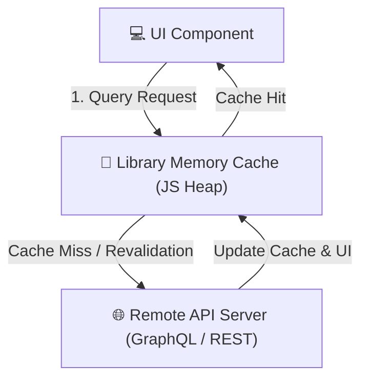
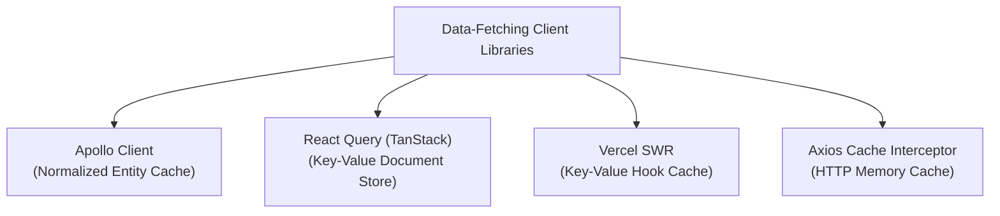

# Client-Side API Caching & Fetch Policies

**API Caching** at the application level refers to caching structured datasets (such as JSON payloads, GraphQL entities, or dynamic API responses) directly inside the client application's JavaScript runtime memory (the JS Heap).

Rather than relying on low-level transport caching (HTTP headers or Service Workers), client-side data-fetching libraries manage an in-memory cache and expose configurable **Fetch Policies** to dictate how UI components request, display, and synchronize server data.

---

## 1. Application-Memory vs. Network-Transport Caching

To design a robust caching architecture, it is essential to distinguish between **Application-Level API Caching** and **Transport-Level Caching** (HTTP and Service Workers):

| Feature              | Application-Level API Caching                      | Transport-Level Caching (HTTP / SW)                     |
| :------------------- | :------------------------------------------------- | :------------------------------------------------------ |
| **Storage Medium**   | JavaScript Heap (RAM / Variable Memory)            | Disk Cache, Memory Cache, or Cache API                  |
| **Data Format**      | Native JavaScript Objects / Decoded JSON           | Raw HTTP Response Streams (Headers + Body Blob)         |
| **Access Control**   | Managed by JS libraries (React Query, Apollo)      | Managed by Browser Engines or Service Workers           |
| **Bypass Mechanics** | Programmatic Fetch Policies                        | HTTP Headers (`no-store`, `no-cache`, `ETag`)           |
| **DOM / UI Binding** | Directly bound to UI state (triggering re-renders) | Decoupled from UI state (triggers network fetch events) |
| **Performance**      | Extremely fast (microsecond JS reference lookups)  | Fast (millisecond disk reads or stream parsing)         |

---

## 2. The 5 Core Fetch Policies

A **Fetch Policy** defines the logical path a query takes between the UI component, the local application cache, and the remote API server. The five standard policies (as illustrated in your architecture diagram) operate as follows:



### A. `cache-first`

- **Mechanic**: The query checks the local memory cache first.
  - **Cache Hit**: Returns the cached data instantly to the UI without making a network request.
  - **Cache Miss**: Fetches data from the API server, writes it to the local cache, and renders the UI.
- **Best For**: Stable or slow-changing data (e.g., configurations, static metadata).

### B. `network-only`

- **Mechanic**: The query completely bypasses the local cache when reading. It always dispatches an HTTP request to the API server. However, once the response is received, it writes the result to the cache so other query nodes can read it.
- **Best For**: Volatile, time-sensitive data where reading cached values is unacceptable (e.g., stock tickers, live user balances).

### C. `cache-and-network`

- **Mechanic**: Checks the local cache.
  - **Cache Hit**: Instantly returns the cached data so the UI renders immediately (0ms user latency), but _simultaneously dispatches an asynchronous fetch_ to the network in the background. Once the network response returns, it updates the cache and triggers a UI re-render.
  - **Cache Miss**: Fetches from the network and updates the cache.
- **Best For**: Feeds, lists, profiles, and dashboards where rendering speed is prioritized, but data freshness must be guaranteed.

### D. `cache-last` (Network-First Fallback)

- **Mechanic**: The query attempts to fetch fresh data from the network first.
  - **Network Success**: Updates the local cache and renders the UI.
  - **Network Failure (Offline)**: If the network call fails or the client is offline, it falls back to reading the latest cached data.
- **Best For**: Crucial dynamic records that require network freshness but need offline resilience (e.g., offline message history, downloaded checklists).

### E. `no-cache`

- **Mechanic**: Similar to `network-only`, the query always fetches from the network. However, it **does not** store the response in the local cache, keeping the memory heap clear of the response data.
- **Best For**: Highly sensitive, single-use, or secure data that should not persist in client memory (e.g., transactional receipts, payment checkout details).

---

## 3. Client Libraries & Cache Models

Modern data-fetching libraries implement these fetch policies and cache models at the runtime layer:



### A. Apollo Client (GraphQL Normalized Cache)

Apollo Client utilizes a normalized in-memory cache (`InMemoryCache`).

- **Normalization**: It splits nested JSON response payloads into individual flat entities identified by a globally unique key (by default, `__typename:id`).
- **Synchronization**: If Query A fetches user `u1` with `name: "Alice"`, and Mutation B updates user `u1` to `name: "Bob"`, Apollo automatically normalizes both and updates all components querying `u1` instantly, resolving data mismatch bugs.
- **Fetch Policies**: Apollo natively supports all five fetch policies:
  ```javascript
  const { loading, data } = useQuery(GET_USER_PROFILE, {
    variables: { id: 'u1' },
    fetchPolicy: 'cache-and-network', // cache-first, network-only, etc.
    nextFetchPolicy: 'cache-first', // subsequent queries fall back to cache-first
  });
  ```

### B. React Query / TanStack Query (Key-Value Document Cache)

React Query does not normalize entities by default; it operates as a key-value document store where cache entries are identified by query keys (e.g., `['user', 'profile', userId]`).

- **Freshness States**: Queries are classified into states: `fresh`, `stale`, `fetching`, and `inactive`.
- **StaleTime vs. GcTime**:
  - `staleTime`: The duration (in ms) that query data is considered fresh. During this time, subsequent component mounts will serve data purely from the cache without fetching from the network.
  - `gcTime` (formerly `cacheTime`): The duration that inactive query data (when no mounted components are using the query) is preserved in memory before being garbage collected from the JS Heap.
- **Implementation Example**:

  ```javascript
  import { useQuery } from '@tanstack/react-query';

  const { data, isPending } = useQuery({
    queryKey: ['user', 'profile', userId],
    queryFn: () => fetch(`/api/user/${userId}`).then((res) => res.json()),
    staleTime: 1000 * 60 * 5, // Data remains fresh for 5 minutes
    gcTime: 1000 * 60 * 10, // Keep in memory for 10 minutes before GC
    refetchOnWindowFocus: true, // Refetch stale queries on tab focus
  });
  ```

### C. Vercel SWR (Hook-Bound State Cache)

SWR is Vercel's lightweight React hook data-fetching library. It enforces the **Stale-While-Revalidate** pattern.

- **Focus & Reconnect Revalidations**: SWR specializes in automatic background syncs. It refetches data whenever the window is focused (`revalidateOnFocus`) or the network reconnects (`revalidateOnReconnect`).
- **Implementation Example**:

  ```javascript
  import useSWR from 'swr';

  const { data, error } = useSWR(`/api/user/${userId}`, fetcher, {
    revalidateIfStale: true,
    revalidateOnFocus: true,
    dedupingInterval: 2000, // Deduplicate requests for the same key within 2s
  });
  ```

### D. Axios Caching (HTTP Memory Interceptors)

Axios does not feature a built-in cache, but developers use interceptors (like `axios-cache-interceptor`) to cache requests.

- **Interceptors**: Intercept outgoing requests and check if a matching URL + parameter payload exists in a local JS memory map. If present, it returns the cached response, preventing the HTTP request from hitting the network.
- **Implementation Example**:

  ```javascript
  import axios from 'axios';
  import { setupCache } from 'axios-cache-interceptor';

  const instance = axios.create();
  const api = setupCache(instance, {
    ttl: 1000 * 60 * 5, // Cache duration (5 minutes)
  });

  // Subsequent fetches to the same endpoint within 5 minutes bypass network
  const response = await api.get('/api/metadata');
  ```

---

## 4. Staff-Level Pitfalls & Architecture Hardening

### A. JavaScript Memory Heap Bloat (Garbage Collection Failures)

Because application-level caching stores parsed JavaScript objects directly in RAM, massive datasets (e.g. infinite scroll logs, heavy nested tables) can result in severe memory leaks.

- **Mitigation**: Set explicit garbage collection limits (`gcTime` in React Query). Clear inactive cache registers on route changes, and prune large lists programmatically.

### B. Mismatched UI State (Entity Fragmentation)

In non-normalized caching libraries (like React Query or SWR), data is isolated by query keys. If Query A fetches user list `['users']`, and Query B fetches user profile `['user', userId]`, updating a user's name via Query B will **not** update the user list in Query A. The UI will show mismatched data.

- **Mitigation**:
  1.  Use **Query Invalidation** on mutation (e.g., `queryClient.invalidateQueries({ queryKey: ['users'] })`), forcing the list to refetch.
  2.  Perform **Optimistic Updates** or manual cache writes, mutating the cached list state directly.
  3.  Upgrade to a normalized caching engine (like Apollo Client) for highly relational datasets.

### C. Mutation Race Conditions

When multiple mutations are fired rapidly (e.g., toggling a checkbox repeatedly), server responses might arrive out of order. If a late network response overwrites the latest UI state, it causes visual flickering and corrupted data.

- **Mitigation**: Always cancel active refetches for the query key inside the mutation lifecycle handler before applying new states:
  ```javascript
  // In TanStack Query:
  onMutate: async (newTodo) => {
    await queryClient.cancelQueries({ queryKey: ['todos'] });
    // Apply optimistic update next
  };
  ```
