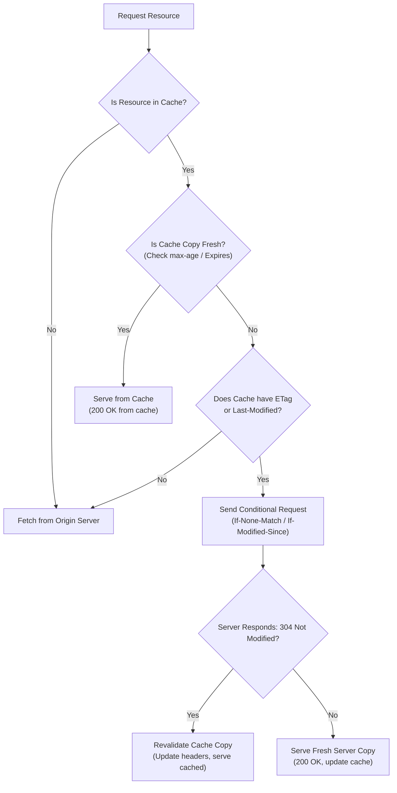

# HTTP Caching Architecture

HTTP Caching is one of the most critical performance and scalability levers in web architecture. By storing copies of server responses closer to the client (in the browser or at intermediate CDN edges), it reduces network latency, eliminates redundant bandwidth consumption, and shields origin databases from traffic spikes.

---

## Table of Contents

- [HTTP Caching Architecture](#http-caching-architecture)
  - [Table of Contents](#table-of-contents)
  - [1. Core Taxonomy: Browser vs. Shared Caches](#1-core-taxonomy-browser-vs-shared-caches)
    - [A. Private Caches (Browser Cache)](#a-private-caches-browser-cache)
    - [B. Shared Caches (CDN, Proxies, Gateways)](#b-shared-caches-cdn-proxies-gateways)
  - [2. HTTP Caching Decision Flowchart](#2-http-caching-decision-flowchart)
  - [3. Freshness \& TTL Headers (Expires vs. Cache-Control)](#3-freshness--ttl-headers-expires-vs-cache-control)
    - [A. Expires (HTTP/1.0 Legacy)](#a-expires-http10-legacy)
    - [B. Cache-Control (HTTP/1.1 Standard)](#b-cache-control-http11-standard)
      - [Cache-Control Directives: Request vs. Response Matrix](#cache-control-directives-request-vs-response-matrix)
      - [Deep Dive: Key Directives Explained with Server Examples](#deep-dive-key-directives-explained-with-server-examples)
        - [1. The `Expires` Header (Legacy TTL)](#1-the-expires-header-legacy-ttl)
        - [2. `no-store` (No Caching Permitted)](#2-no-store-no-caching-permitted)
        - [3. `private` vs. `public` (Cache Scoping)](#3-private-vs-public-cache-scoping)
        - [4. `proxy-revalidate` (Shared Cache Control)](#4-proxy-revalidate-shared-cache-control)
        - [5. `stale-if-error` (Fault Tolerance / Error Resilience)](#5-stale-if-error-fault-tolerance--error-resilience)
    - [C. HTTP Caching Header Priority \& Precedence (P0, P1, P2)](#c-http-caching-header-priority--precedence-p0-p1-p2)
      - [Precedence Hierarchy:](#precedence-hierarchy)
  - [4. Cache Validation \& Conditional Requests (ETag vs. Last-Modified)](#4-cache-validation--conditional-requests-etag-vs-last-modified)
    - [A. Last-Modified / If-Modified-Since](#a-last-modified--if-modified-since)
      - [Limitations of Last-Modified:](#limitations-of-last-modified)
    - [B. ETag / If-None-Match](#b-etag--if-none-match)
      - [Strong vs. Weak ETags:](#strong-vs-weak-etags)
  - [5. Advanced Caching Mechanics (Vary, Request Collapsing, SWR)](#5-advanced-caching-mechanics-vary-request-collapsing-swr)
    - [A. The Vary Header](#a-the-vary-header)
    - [B. Stale-While-Revalidate (SWR)](#b-stale-while-revalidate-swr)
    - [C. Request Collapsing](#c-request-collapsing)
  - [6. Cache Busting, Query String Salting, \& Architectural Caching Pitfalls](#6-cache-busting-query-string-salting--architectural-caching-pitfalls)
    - [A. Build-Time URL Fingerprinting](#a-build-time-url-fingerprinting)
    - [B. Dynamic Query String Salting (e.g., `?cb=khk`)](#b-dynamic-query-string-salting-eg-cbkhk)
    - [C. Staff-Level Caching Pitfalls \& Mitigation Strategies](#c-staff-level-caching-pitfalls--mitigation-strategies)
      - [1. The CDN Cache Key Splitting / Cache Bloat Trap](#1-the-cdn-cache-key-splitting--cache-bloat-trap)
      - [2. The "Stale HTML" / Deadlock Trap](#2-the-stale-html--deadlock-trap)
      - [3. Latency Overhead of Conditional Revalidation (The "304 Penalty")](#3-latency-overhead-of-conditional-revalidation-the-304-penalty)
      - [4. The `Vary` Header Wildcard Trap](#4-the-vary-header-wildcard-trap)
  - [7. Playground \& Practical Node.js Simulation](#7-playground--practical-nodejs-simulation)
    - [How to Run:](#how-to-run)
  - [8. Disabling \& Stripping Cache Headers in Express.js](#8-disabling--stripping-cache-headers-in-expressjs)
    - [A. Disabling Headers in static Middleware](#a-disabling-headers-in-static-middleware)
    - [B. Stripping or Customizing Headers on Dynamic Routes](#b-stripping-or-customizing-headers-on-dynamic-routes)
  - [9. Client-Side Cache Bypass: Fetching Fresh Data Without Modifying Server Headers](#9-client-side-cache-bypass-fetching-fresh-data-without-modifying-server-headers)
    - [A. URL Query Parameter Salting (URL Cache Busting)](#a-url-query-parameter-salting-url-cache-busting)
    - [B. The `fetch` API `cache` Parameter](#b-the-fetch-api-cache-parameter)
    - [C. Programmatic Request Headers (`Cache-Control` / `Pragma`)](#c-programmatic-request-headers-cache-control--pragma)

---

## 1. Core Taxonomy: Browser vs. Shared Caches

Caching occurs at multiple tiers along the network request path:

```
[ Client Browser ] ===> [ CDN Edge Cache ] ===> [ Reverse Proxy / Varnish ] ===> [ Origin Server ]
  (Private Cache)        (Shared Cache)           (Shared Gateway Cache)
```

### A. Private Caches (Browser Cache)

- **Scope**: Dedicated to a single user.
- **Location**: Browser memory (RAM) or disk.
- **Behavior**: Stores user-specific data (e.g., personalized dashboards, HTML pages behind login). It cannot be shared across sessions.

### B. Shared Caches (CDN, Proxies, Gateways)

- **Scope**: Serves responses to multiple users.
- **Location**: Edge nodes (e.g., Cloudflare, Akamai) or gateway reverse proxies (e.g., Varnish, Nginx).
- **Behavior**: Caches public assets (e.g., stylesheets, images, generic API responses) to reduce traffic traveling all the way to the origin server.

---

## 2. HTTP Caching Decision Flowchart

When a browser makes a request, it performs a series of validation checks:



---

## 3. Freshness & TTL Headers (Expires vs. Cache-Control)

Freshness indicates whether a cached response can be used directly without checking the origin server.

### A. Expires (HTTP/1.0 Legacy)

The `Expires` header uses an absolute HTTP-date timestamp to declare cache expiration.

```http
Expires: Sun, 24 May 2027 12:00:00 GMT
```

- **Pitfall**: Requires strict clock synchronization between the server and the client browser. If the client system clock is set incorrectly (e.g. manually changed by a user), assets can be marked stale prematurely or cached indefinitely.
- **Precedence**: Overridden by `Cache-Control: max-age` in modern browsers.

### B. Cache-Control (HTTP/1.1 Standard)

The modern caching standard using relative delta durations (in seconds) alongside cache behavior directives.

```http
Cache-Control: public, max-age=31536000
```

#### Cache-Control Directives: Request vs. Response Matrix

While `Cache-Control` is used in both HTTP requests and HTTP responses, the set of valid directives differs between the two. The following matrix illustrates the differences in support and behavior:

| Request Directive              | Response Directive                     | Classification           | Detailed Behavior & Architectural Use Case                                                                                                                                                                                                                                                          |
| :----------------------------- | :------------------------------------- | :----------------------- | :-------------------------------------------------------------------------------------------------------------------------------------------------------------------------------------------------------------------------------------------------------------------------------------------------- |
| **`max-age=<seconds>`**        | **`max-age=<seconds>`**                | Relative TTL / Freshness | **Request**: Client accepts a response whose age is not greater than the specified time. <br>**Response**: Sets the relative freshness lifetime of the resource (in seconds) for private and shared caches.                                                                                         |
| **`max-stale[=<seconds>]`**    | —                                      | Stale Tolerance          | **Request Only**: Client is willing to accept a stale response. If seconds are defined, it specifies the maximum tolerance limit of staleness.                                                                                                                                                      |
| **`min-fresh=<seconds>`**      | —                                      | Freshness Buffer         | **Request Only**: Client wants a response that will remain fresh for at least the specified number of seconds.                                                                                                                                                                                      |
| —                              | **`s-maxage=<seconds>`**               | Shared TTL               | **Response Only**: Overrides `max-age` or `Expires` specifically for shared caches (e.g., CDNs, proxies). Ignored by browser/private caches.                                                                                                                                                        |
| **`no-cache`**                 | **`no-cache`**                         | Revalidation Requirement | **Request**: Forces the cache to perform origin server revalidation before serving a cached response. <br>**Response**: Crucially, **does not prevent caching**; instead, it forces caches to validate the cached response with the origin server (using ETags or Last-Modified) before serving it. |
| **`no-store`**                 | **`no-store`**                         | Cache Bypass / Security  | **Request & Response**: Prevents any caching. The response must not be saved to disk or memory; it must be fetched fresh from the origin on every request. Ideal for highly sensitive PII or financial data.                                                                                        |
| **`no-transform`**             | **`no-transform`**                     | Content Integrity        | **Request & Response**: Prevents intermediate caches or proxies (such as CDNs, ISPs, or gateways) from modifying the payload body (e.g., prevents transcoding images, minifying assets, or altering compression formats).                                                                           |
| **`only-if-cached`**           | —                                      | Disconnected Mode        | **Request Only**: Client requests that the response be served from cache only. If a cache miss occurs, the cache must respond with a `504 Gateway Timeout` without forwarding the request to the origin server.                                                                                     |
| —                              | **`must-revalidate`**                  | Strict Revalidation      | **Response Only**: Forces the cache to revalidate stale assets with the origin before serving. Prevents caches from serving stale resources even during offline scenarios or transient network failures.                                                                                            |
| —                              | **`proxy-revalidate`**                 | Shared Revalidation      | **Response Only**: Identical to `must-revalidate`, but applies exclusively to shared caches (CDNs, edge proxies). Ignored by private browser caches.                                                                                                                                                |
| —                              | **`must-understand`**                  | Status Compatibility     | **Response Only**: Instructs intermediate caches to store the response only if they fully understand and support the specific cacheability requirements of the response status code.                                                                                                                |
| —                              | **`private`**                          | Cache Scope              | **Response Only**: Restricts caching to the end-user's browser (private cache). Intermediate shared caches (CDNs/proxies) are strictly prohibited from caching the response.                                                                                                                        |
| —                              | **`public`**                           | Cache Scope              | **Response Only**: Explicitly allows the response to be stored by any private or shared cache, even if the response is normally non-cacheable (e.g., requires HTTP authentication or has a default uncacheable status code).                                                                        |
| —                              | **`immutable`**                        | Performance Hardening    | **Response Only**: Indicates that the response body will never change over its lifetime. The browser completely bypasses revalidation checks (conditional requests) during active TTL, even if the user manually reloads the page.                                                                  |
| —                              | **`stale-while-revalidate=<seconds>`** | Async Revalidation       | **Response Only**: Allows the cache to serve a stale response immediately to the client while spawning an asynchronous background request to revalidate and update the cache.                                                                                                                       |
| **`stale-if-error=<seconds>`** | **`stale-if-error=<seconds>`**         | Error Resilience         | **Request & Response**: Instructs the cache that it may serve a stale cached response if the origin server returns a 5xx gateway error (500, 502, 503, 504) or is completely offline during revalidation checks.                                                                                    |

#### Deep Dive: Key Directives Explained with Server Examples

To understand how these headers operate in practice, here is a detailed breakdown of their architectural roles alongside code implementations in Express.js:

##### 1. The `Expires` Header (Legacy TTL)

The `Expires` header defines an absolute date/time timestamp when the response becomes stale.

- **Server Implementation**:
  ```javascript
  app.get('/static/expires.js', (req, res) => {
    // Set expiration to exactly 24 hours in the future
    const oneDayFuture = new Date(Date.now() + 24 * 60 * 60 * 1000).toUTCString();
    res.setHeader('Expires', oneDayFuture);
    res.send('...');
  });
  ```
- **Architectural Impact**: Browsers cache this resource and bypass the server until the exact UTC clock ticks past `oneDayFuture`. However, modern browsers prioritize `Cache-Control: max-age` if both are sent.

##### 2. `no-store` (No Caching Permitted)

Forces all caches (private browsers and shared CDNs) to completely discard the response after serving it. It guarantees that the client always fetches the payload from the origin.

- **Server Implementation**:
  ```javascript
  app.get('/static/no-store.js', (req, res) => {
    res.setHeader('Cache-Control', 'no-store, no-cache, must-revalidate');
    res.send('...');
  });
  ```
- **Architectural Impact**: Crucial for sensitive endpoints (e.g., API payloads with personal identifiers, financial data) where storing copies on user disks or public CDN nodes is a security compliance violation.

##### 3. `private` vs. `public` (Cache Scoping)

- **`private`**: Prevents shared caches (like CDNs, proxies, gateway reverse-proxies) from caching the response. Only the end-user's browser is allowed to store it.
- **`public`**: Allows any cache (browser, intermediate CDN, ISP cache) to store the file, even if it has an `Authorization` header or status code that is typically uncacheable.
- **Server Implementation**:
  ```javascript
  // Browser-only private caching
  app.get('/static/private.js', (req, res) => {
    res.setHeader('Cache-Control', 'private, max-age=60');
    res.send('...');
  });
  ```
- **Architectural Impact**: Using `private` ensures that user-specific dynamic pages (e.g., `/dashboard/profile`) are never accidentally cached by a CDN and served to other users requesting the same URL path.

##### 4. `proxy-revalidate` (Shared Cache Control)

Identical to `must-revalidate`, but it only applies to **shared caches** (CDNs, edge proxies). It instructs CDNs that once the asset's TTL expires, they _must_ revalidate the asset with the origin server before serving it to any downstream client (even if the CDN is experiencing connectivity issues).

- **Server Implementation**:
  ```javascript
  app.get('/static/proxy-revalidate.js', (req, res) => {
    res.setHeader('Cache-Control', 'public, max-age=10, proxy-revalidate');
    res.send('...');
  });
  ```
- **Architectural Impact**: Enables browsers (which ignore `proxy-revalidate`) to continue using their stale cached copies during network dropouts, while forcing public CDNs to strictly revalidate content to avoid stale information from propagating globally.

##### 5. `stale-if-error` (Fault Tolerance / Error Resilience)

Instructs caches (both client browser caches and intermediate shared CDNs) that they may serve a stale cached response if the origin server is unreachable or responds with a 5xx server error (e.g., 500, 502, 503, 504) during revalidation.

- **Server Implementation**:
  ```javascript
  app.get('/static/resilient-data.json', (req, res) => {
    // Serve cached response, fresh for 30 seconds; allow stale fallback for 1 day if server crashes
    res.setHeader('Cache-Control', 'public, max-age=30, stale-if-error=86400');
    res.json({ status: 'healthy', data: 'critical-reference-configuration' });
  });
  ```
- **Architectural Impact**: Highly useful for read-heavy microservices or static data feeds where rendering old/stale data is vastly preferable to displaying a blank screen or a "502 Bad Gateway" error page to the end user during transient database failures or deployment outages.

---

### C. HTTP Caching Header Priority & Precedence (P0, P1, P2)

When multiple caching headers are present on a resource, the browser evaluates them in a strict order of priority. This prevents conflicting instructions and determines whether a cache hit is served instantly or validated with the server.

```mermaid
graph TD
    A["Request Web Resource (JS, CSS, Images, Fonts)"] --> B{"P0 Check: Is Cache-Control Present?"}

    B -->|Yes| C["Evaluate Cache-Control (max-age, no-store, no-cache, etc.)"]
    B -->|No| D{"P1 Check: Is Expires Present?"}

    D -->|Yes| E["Evaluate Expires (Absolute UTC Timestamp)"]
    D -->|No| F["Heuristic Caching (Fallback check)"]

    C --> G{"Is Cache Stale?"}
    E --> G

    G -->|No (Fresh)| H["Serve from Cache (200 OK from Cache)"]
    G -->|Yes (Stale)| I{"P2 Check: Are Validation Headers Present?"}

    I -->|Yes| J["Send Conditional Request: If-None-Match (ETag) or If-Modified-Since (Last-Modified)"]
    I -->|No| K["Fetch Fresh Copy from Server (200 OK)"]
```

#### Precedence Hierarchy:

| Priority | Header                       | Type                   | Description / Evaluation Rule                                                                                                                                                                                                                                                                                 |
| :------- | :--------------------------- | :--------------------- | :------------------------------------------------------------------------------------------------------------------------------------------------------------------------------------------------------------------------------------------------------------------------------------------------------------ |
| **`P0`** | **`Cache-Control`**          | Freshness (HTTP/1.1)   | **Highest priority**. If `Cache-Control` (specifically `max-age` or `s-maxage`) is present, modern browsers completely ignore `Expires` headers.                                                                                                                                                              |
| **`P1`** | **`Expires`**                | Freshness (HTTP/1.0)   | **Fallback freshness check**. Only evaluated by browsers if `Cache-Control` is missing. Uses an absolute HTTP UTC date string.                                                                                                                                                                                |
| **`P2`** | **`ETag` / `Last-Modified`** | Conditional Validation | **Validation check**. Evaluated only after the resource is determined to be stale (or if `no-cache` is set). The browser sends a conditional request to check if the file changed: <br>- `ETag` maps to `If-None-Match` (higher priority in verification). <br>- `Last-Modified` maps to `If-Modified-Since`. |

---

## 4. Cache Validation & Conditional Requests (ETag vs. Last-Modified)

When a cached response becomes stale (exceeds its TTL or is marked `no-cache`), the browser issues a **conditional request** to verify if the content has changed.

### A. Last-Modified / If-Modified-Since

A time-based validation handshake.

1. **Initial Response**: Server returns a modification timestamp.
   ```http
   HTTP/1.1 200 OK
   Last-Modified: Sun, 24 May 2026 10:15:30 GMT
   ```
2. **Subsequent Request**: Client appends this timestamp in a conditional request.
   ```http
   GET /styles.css HTTP/1.1
   If-Modified-Since: Sun, 24 May 2026 10:15:30 GMT
   ```
3. **Server Check**: If the file hasn't changed since that date, the server returns:
   ```http
   HTTP/1.1 304 Not Modified
   ```
   _(No body is sent, saving network bandwidth)_.

#### Limitations of Last-Modified:

- **1-Second Resolution Limit**: HTTP date strings only resolve to the nearest second. High-frequency updates occurring multiple times per second cannot be accurately validated.
- **False Invalidation**: If a file is opened, re-saved, or touched without actual content changes, its modification date updates, forcing caches to re-download identical content.
- **Clock Drift**: Dynamic multi-server setups with unsynced clocks can yield inconsistent revalidations.

---

### B. ETag / If-None-Match

An entity-tag (ETag) is a unique string token representing a specific version of a resource (typically a SHA-256 cryptographic content hash).

1. **Initial Response**: Server sends the content hash.
   ```http
   HTTP/1.1 200 OK
   ETag: "w/3a8b2c-9a4f"
   ```
2. **Subsequent Request**: Client sends the tag back.
   ```http
   GET /script.js HTTP/1.1
   If-None-Match: "w/3a8b2c-9a4f"
   ```
3. **Server Check**: If the server-computed hash matches `If-None-Match`, it responds with `304 Not Modified`.

#### Strong vs. Weak ETags:

- **Strong ETag (`ETag: "abc123xyz"`)**: Guarantees byte-for-byte identity. Useful for binary resources, ranges, and byte-sensitive transfers.
- **Weak ETag (`ETag: W/"abc123xyz"`)**: Indicated by the `W/` prefix. Guarantees semantic equivalence (the content is identical, but maybe some minor metadata or compression byte encoding varies). Allowed for normal page loads but prohibited for HTTP Range requests.

---

## 5. Advanced Caching Mechanics (Vary, Request Collapsing, SWR)

### A. The Vary Header

The `Vary` header instructs downstream caches that a cached response is bound to specific request headers.

```http
Vary: Accept-Encoding, User-Agent
```

- **How it works**: If a client requests `/index.html` with `Accept-Encoding: gzip`, the CDN caches the gzip compressed version. If a second client requests with `Accept-Encoding: br` (Brotli), the CDN bypasses the gzip cache and fetches the Brotli version from origin, caching it separately.
- **Warning: Vary Cache Bloat**: Specifying too many headers (like `User-Agent`) destroys cache hit ratios because user-agents contain endless minor differences, causing caches to store thousands of duplicate copies of the same asset.
- **Best Practice**: Normalize headers at the CDN edge (e.g. translating diverse `User-Agent` strings down to simple headers like `X-Device: Mobile` or `X-Device: Desktop` before checking cache key mappings).

---

### B. Stale-While-Revalidate (SWR)

SWR decouples asset loading from network latency by serving stale content instantly while updating the cache in the background.

```http
Cache-Control: public, max-age=60, stale-while-revalidate=30
```

```
0s                 60s                           90s
|--- Served Fresh --|----- Served Stale (SWR) -----|--- Must Fetch Fresh ---|
```

- **0s - 60s**: Response is completely fresh; served from cache directly ($O(0)$ network delay).
- **60s - 90s**: Response is stale, but falls within the 30-second revalidation window. The browser immediately serves the cached stale response, while asynchronously dispatching a background HTTP request to update the cache with fresh data.
- **After 90s**: Response is too old; the browser must wait for a fresh network request.

---

### C. Request Collapsing

When a popular resource expires, thousands of users might concurrently request it, leading to a **thundering herd** attack on the origin server.

```
Users [C1, C2, C3] ===> [ CDN Cache (Expired) ] === collapsed ===> [ Origin Server ]
                         (Dispatches only 1 upstream request)
```

- **Solution**: Intermediate shared caches (like Varnish or CDNs) use **request collapsing** to intercept concurrent requests for a single stale resource. The cache holds clients `C2` and `C3` in a queue, dispatches a single upstream request for `C1`, and once the response arrives, distributes it to all queued clients simultaneously.

---

## 6. Cache Busting, Query String Salting, & Architectural Caching Pitfalls

For web applications, caching is a double-edged sword. On one hand, caching static assets indefinitely ensures instant page loads. On the other hand, failing to invalidate the cache when updates occur leads to broken user experiences.

Developers use two main strategies to force browsers to load fresh assets: **Build-Time Fingerprinting** and **Dynamic Query String Salting**.

### A. Build-Time URL Fingerprinting

During the compilation and bundling phase (using tools like Webpack, Vite, or Esbuild), build systems generate unique hashes based on the contents of each file.

- **Example**: `main.js` becomes `main.d8f3c21a.js`.
- **Precedence**: Because the filename itself changes, the browser treats it as a completely new request. The old cached file is bypassed naturally, and the server configures the fingerprinted asset with an aggressive caching directive:
  ```http
  Cache-Control: public, max-age=31536000, immutable
  ```

### B. Dynamic Query String Salting (e.g., `?cb=khk`)

When assets cannot be fingerprinted at build-time, or when triggering dynamic requests (such as API fetches or document downloads) that are cached but need to bypass the cache on demand (e.g., when a user clicks a button to reload data), **query string salting** is used.

- **Mechanism**: Caches (browser and CDNs) map resources using a **Cache Key**, which by default is the complete request URI (including query parameters). By appending a unique salt parameter (like a random string or current timestamp) to the URL on every action, the browser is forced to treat the URL as a new resource, bypassing the local cache and fetching from the server.
- **Code Example**:

  ```javascript
  // Triggered on user interaction (e.g., button click)
  async function fetchData() {
    const salt = Math.random().toString(36).substring(7); // generates random string, e.g. "cb=khk"
    const url = `/api/reports/monthly?cb=${salt}`;

    // Bypasses local browser and edge cache, forcing fresh server request
    const response = await fetch(url);
    const data = await response.json();
    return data;
  }
  ```

---

### C. Staff-Level Caching Pitfalls & Mitigation Strategies

While cache-busting solves cache-stale problems, it introduces significant architectural challenges.

#### 1. The CDN Cache Key Splitting / Cache Bloat Trap

- **The Pitfall**: CDNs map cache keys to full URLs by default. If a client appends a unique random salt (e.g., `?cb=khk`, `?cb=xyz`) on every click, each request creates a new cache key. The CDN edge proxy will:
  1. Fail to find the key (Cache Miss).
  2. Query the origin server.
  3. Store a separate, duplicate cached copy of the response for _every single unique salt_.

  This causes **Cache Bloat**, consumes enormous CDN memory/disk, lowers the CDN hit ratio to near 0%, and increases egress bandwidth bills.

- **Mitigation**:
  - **CDN Query Parameter Ignoring**: Configure the CDN (e.g., Cloudflare, CloudFront) to strip specific query parameters (like `cb` or `v`) from the cache key definition while forwarding it, or disable caching entirely for URLs with those parameters.
  - **Prefer Revalidation**: For API endpoints, use `Cache-Control: no-cache` (require ETag validation) instead of client-side query string salting. This allows the browser to make a quick conditional request (returning `304 Not Modified` with 0 bytes body) instead of forcing full-payload downloads.

#### 2. The "Stale HTML" / Deadlock Trap

- **The Pitfall**: If your HTML file (`index.html`) is cached (e.g., by omitting `Cache-Control` headers, allowing the browser to apply default heuristic caching, or setting a long `max-age`), the browser will load `index.html` directly from disk. Even if you deploy a new version of the app with fingerprinted assets (`main.newhash.js`), the browser loads the old, cached `index.html` which imports the old asset filename (`main.oldhash.js`). The user is locked into an outdated version of the application until they force-refresh.
- **Mitigation**: **Never cache the HTML landing pages**. Set strict cache-prevention headers on HTML document responses:
  ```http
  Cache-Control: no-store, no-cache, must-revalidate
  ```
  This forces the browser to fetch the HTML fresh on every page load, which in turn imports the correct, updated fingerprinted asset links.

#### 3. Latency Overhead of Conditional Revalidation (The "304 Penalty")

- **The Pitfall**: Setting `Cache-Control: no-cache` ensures clients never render stale content, but it still requires the browser to send a network request to the origin server to validate the ETag (`304 Not Modified`). On high-latency connections (e.g., mobile networks), the Round-Trip Time (RTT) to complete the ETag handshake can take hundreds of milliseconds, defeating the speed benefits of caching.
- **Mitigation**: Use a short `max-age` (e.g., `max-age=60`) combined with `stale-while-revalidate` (SWR). This serves the stale local copy instantly (zero latency) while validation happens asynchronously in the background.

#### 4. The `Vary` Header Wildcard Trap

- **The Pitfall**: Using `Vary: *` tells caches that no two requests are equivalent, disabling caching entirely. Similarly, specifying too many dynamic request headers (e.g., `Vary: User-Agent, Accept-Language, Cookie`) causes the cache key space to fracture, as minor differences in headers yield unique cache keys.
- **Mitigation**: Only vary on deterministic headers (such as `Accept-Encoding` for gzip/Brotli payloads) and normalize header values at the CDN edge before caching.

---

## 7. Playground & Practical Node.js Simulation

An interactive caching simulator is available under this directory. It includes:

- **[server.js](file:///Users/atulkumarawasthi/projects/SystemDesign/Database&Caching/httpCaching/server.js)**: A local Node.js server simulating different combinations of HTTP cache headers.
- **[index.html](file:///Users/atulkumarawasthi/projects/SystemDesign/Database&Caching/httpCaching/index.html)**: An interactive frontend dashboard to trigger requests and view latency, caching status (e.g., Disk Cache vs 304 Server Revalidated), size, and response headers.

### How to Run:

```bash
node server.js
```

_Open your browser to `http://localhost:3000` to interact with the dashboard._

---

## 8. Disabling & Stripping Cache Headers in Express.js

By default, backend web frameworks like **Express.js** automatically generate caching headers (such as `ETag` content hashes, `Last-Modified` file timestamps, and default `Cache-Control` max-ages) when serving static files.

For development environments or dynamic assets where browser caching is undesirable, you can configure Express to completely disable or remove these headers.

### A. Disabling Headers in static Middleware

You can pass an options configuration object to `express.static` to prevent the generation of validation and freshness headers:

```javascript
const express = require('express');
const path = require('path');
const app = express();

// Serve static assets from 'public' with all HTTP caching headers disabled
app.use(
  express.static(path.join(__dirname, 'public'), {
    etag: false, // Disables ETag generation (removes 'ETag' header from response)
    cacheControl: false, // Disables default Cache-Control (removes 'Cache-Control' header)
    lastModified: false, // Disables Last-Modified (removes 'Last-Modified' header)
  }),
);

const PORT = 3000;
app.listen(PORT, () => {
  console.log(`Server running on port ${PORT}`);
});
```

### B. Stripping or Customizing Headers on Dynamic Routes

If you want to strip headers programmatically for specific dynamic routes or API endpoints, you can use the built-in `res.removeHeader` method or override them with strict prevention headers:

```javascript
app.get('/api/live-rates', (req, res) => {
  // 1. Completely strip default headers from the response
  res.removeHeader('Cache-Control'); // Removes Cache-Control header if set by middleware
  res.removeHeader('ETag'); // Removes ETag signature

  // 2. Explicitly override with strict cache-prevention headers
  res.setHeader('Cache-Control', 'no-store, no-cache, must-revalidate, proxy-revalidate');
  res.setHeader('Pragma', 'no-cache'); // Fallback HTTP/1.0 support
  res.setHeader('Expires', '0'); // Absolute date fallback (forces immediate expiration)

  res.json({ rate: Math.random() * 100 });
});
```

---

## 9. Client-Side Cache Bypass: Fetching Fresh Data Without Modifying Server Headers

In production environments, you may have resources configured with aggressive caching headers (e.g., cached images or third-party assets) that you cannot change on the server side. If a client-side requirement arises to fetch a fresh version of this resource on demand without touching the server's cache implementation, developers can enforce validation and cache bypasses strictly from the client.

### A. URL Query Parameter Salting (URL Cache Busting)

This is the most common technique and works across all HTML elements (e.g., ``, `<iframe>`, `<script>`, `<link>`) as well as programmatic fetch requests.

- **Mechanism**: Caches are indexed using the request URL as the Cache Key. By appending a dynamically generated random query parameter on each trigger, the browser is forced to treat the URL as a new resource, bypassing local browser caches and shared CDNs.
- **Client Implementation Example**:

  ```javascript
  function fetchNewImage() {
    // 1. Generate a random query parameter to bypass caching
    const randomQuery = Math.random().toString(36).substring(7);

    // 2. Update the image source with the new query parameter
    const imgElement = document.getElementById('cachedImage');
    imgElement.src = `image.gif?${randomQuery}`; // Bypasses cache by altering the Cache Key
  }
  ```

- **Tradeoffs**: Extremely reliable and works natively on HTML tags, but risks **CDN Cache Bloat** (edge proxies storing thousands of duplicate copies of the same image for each unique query parameter) if query parameter caching is not ignored on the CDN.

### B. The `fetch` API `cache` Parameter

If you are querying data programmatically using JavaScript's native `fetch` API, you can control the browser's cache behavior directly using the `cache` configuration option.

- **Client Implementation Example**:
  ```javascript
  // Bypasses the local cache and forces a full network download
  fetch('/api/data', { cache: 'no-store' })
    .then((response) => response.json())
    .then((data) => console.log(data));
  ```
- **How different `cache` modes operate**:
  - **`cache: 'default'`**: Standard browser caching behavior (looks up cache, checks freshness, validates if stale).
  - **`cache: 'no-store'`**: Browser bypasses the cache entirely, fetches from the network, and **does not update** the cache with the new response.
  - **`cache: 'reload'`**: Browser bypasses the cache, fetches from the network, and **updates the cache** with the fresh response.
  - **`cache: 'no-cache'`**: Browser checks the cache, but **always sends a conditional request** (with `If-None-Match`/`If-Modified-Since`) to revalidate with the server, even if the asset is still fresh according to `max-age`.
- **Tradeoffs**: Standard and elegant, prevents CDN cache key bloat, but only works for programmatic `fetch` requests (cannot be applied to native HTML `` or `<script>` tag requests directly).

### C. Programmatic Request Headers (`Cache-Control` / `Pragma`)

When using `fetch` or custom HTTP clients (like Axios), you can manually append request headers that force intermediate shared proxies (like CDNs) and the browser cache to bypass the stored copy.

- **Client Implementation Example**:
  ```javascript
  fetch('/api/reports/annual', {
    headers: {
      'Cache-Control': 'no-cache', // Forces browser and intermediate proxies to revalidate
      Pragma: 'no-cache', // HTTP/1.0 backward compatibility
    },
  });
  ```
- **Tradeoffs**: Useful when targeting intermediate proxy/gateway revalidation, but some browser settings may restrict altering certain secure headers, and it doesn't prevent local browser caching if `no-store` is not explicitly set in the request object.

```

```
