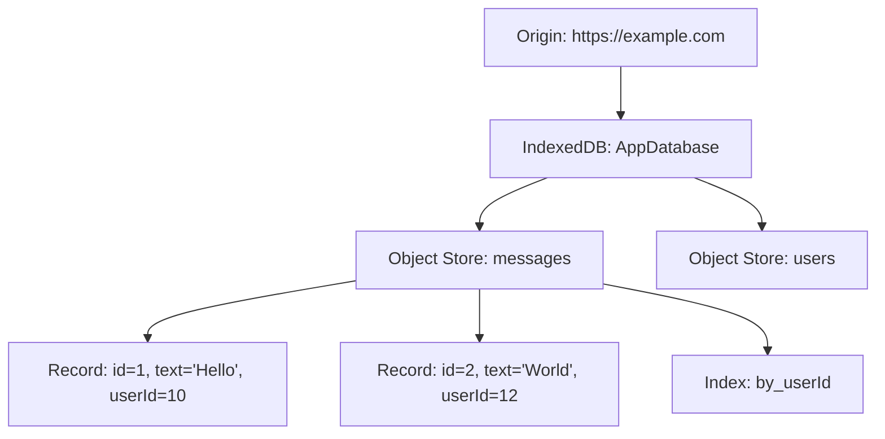
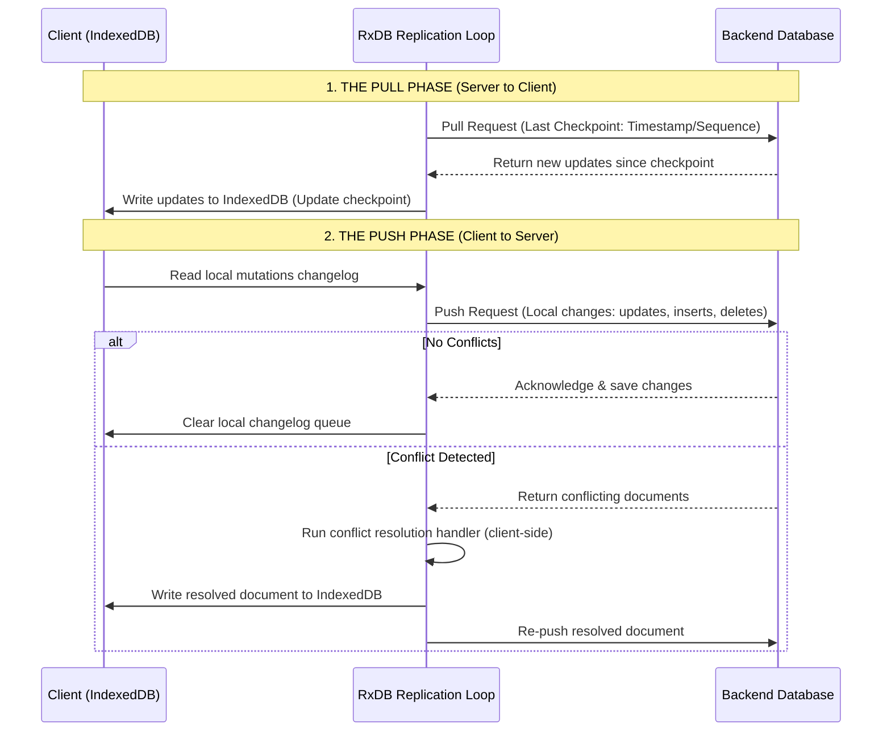

# IndexedDB Architecture & Mechanics

IndexedDB is a low-level, transactional, object-oriented database running inside the user's browser. Unlike LocalStorage and SessionStorage, IndexedDB is designed to store **massive volumes of complex, structured JavaScript data** (such as nested objects, Blobs, Files, and ArrayBuffers) asynchronously without blocking the main rendering thread.

- **Key Takeaway**: IndexedDB is the standard choice for offline-first web applications (e.g., Microsoft Teams, Google Docs, WhatsApp Web), allowing complete application states and historical records to be cached locally and queried efficiently. However, its asynchronous callback-based API is complex, making wrapper utilities and strict transaction management essential for production usage.

## Key Architectural Rules

> [!IMPORTANT]
> Keep the following database design rules in mind during planning:
>
> - **Flexible Storage Formats**: Unlike Web Storage APIs (which coerce everything to strings), IndexedDB stores data in **virtually any JavaScript format** (including nested objects, Arrays, Dates, Map/Set structures, and binary data like Blobs, Files, or ArrayBuffers) via the browser's native Structured Clone algorithm.
> - **Mandatory Asynchronous Execution**: All IndexedDB operations run **asynchronously** via non-blocking microtasks and callbacks (or Promises). There is **no synchronous client-side API** available on the browser's main window thread, ensuring disk I/O latency never blocks UI rendering loops. Avoid trying to block or run synchronous operations on top of it.
> - **Designed for Complex, Massive Data**: Engineered specifically for high-capacity scenarios. Industry-standard applications like **Microsoft Teams** (chat message history), **Google Docs** (offline document backups), and **WhatsApp Web** cache their databases in IndexedDB. This allows the application to retrieve and render entire historical datasets on the **very first load** directly from disk, bypassing network delays.
> - **Avoid for Small Datasets**: Do not use IndexedDB for small configuration sets, preferences, or key-value parameters (like theme state `user_theme = 'dark'`). The transactional and async execution overhead is excessive; use LocalStorage or SessionStorage instead.

---

## 1. Core API & Mechanics

IndexedDB does not use a relational SQL engine. Instead, it behaves similarly to a NoSQL document database (like MongoDB) running in the client.



### A. Core Components

- **Database**: A container scoped strictly to the requesting origin (Same-Origin Policy). An origin can create multiple databases.
- **Object Store**: The basic storage unit of IndexedDB, equivalent to a SQL table or a MongoDB collection. It contains records (key-value pairs) where values are JavaScript objects.
- **Key Path / Key Generator**: Defines how records are indexed.
  - _Key Path_: A property path in the object (e.g., `id`) used as the primary key.
  - _Key Generator_: An auto-incrementing counter that generates unique keys automatically.
- **Index**: A secondary object store used to query the primary object store by properties other than the primary key (e.g., querying messages by `userId` rather than `messageId`).
- **Transaction**: All read and write operations **must** occur within an active transaction. Transactions guarantee ACID properties (Atomicity, Consistency, Isolation, Durability) across operations.
- **Cursor**: A mechanism for iterating over multiple records in an object store or index sequentially without loading the entire dataset into memory at once.

---

## 2. Lifecycles & Versioning

IndexedDB databases are versioned using positive integers (e.g., `1`, `2`, `3`). Schema changes (creating or deleting object stores and indexes) can **only** occur during a version change transition.

### The `onupgradeneeded` Event

When opening a database connection, you specify a target version. If the client's current database version is lower than the target version (or doesn't exist), the browser fires the `onupgradeneeded` event.

```javascript
const request = indexedDB.open('ChatApp', 2);

request.onupgradeneeded = (event) => {
  const db = event.target.result;

  // Create object store if it doesn't exist
  if (!db.objectStoreNames.contains('messages')) {
    const store = db.createObjectStore('messages', { keyPath: 'id' });
    // Create secondary index to query messages by senderId
    store.createIndex('by_sender', 'senderId', { unique: false });
  }
};
```

---

## 3. Capacity, Quotas & Eviction

### A. Storage Limits

IndexedDB limits are managed dynamically by the browser and are tied to the user's local disk space:

- **Chromium (Chrome, Edge, Opera)**: An origin can consume up to **60%** of the total disk space, up to the global browser quota (which can be up to **80%** of total disk space shared among all origins).
- **Firefox**: An origin can use up to **10%** of the available disk space before prompting the user, up to a maximum shared limit.
- **Safari (ITP Purging)**: Under WebKit’s Intelligent Tracking Prevention (ITP), if a website has not received any user interaction for **7 days**, Safari will permanently delete all client-side databases (IndexedDB, LocalStorage, and SessionStorage) for that origin.

### B. Programmatically Checking Quotas

You can query the remaining quota dynamically using the async `StorageManager` API:

```javascript
if (navigator.storage && navigator.storage.estimate) {
  const { usage, quota } = await navigator.storage.estimate();
  const usageInMB = (usage / (1024 * 1024)).toFixed(2);
  const quotaInMB = (quota / (1024 * 1024)).toFixed(2);
  console.log(`IndexedDB Usage: ${usageInMB}MB of ${quotaInMB}MB`);
}
```

---

## 4. Security Architecture

### A. Same-Origin Policy (SOP)

IndexedDB is bound to the exact origin (scheme + domain + port). A database created on `https://app.example.com` cannot be read or written to by scripts executing on `https://admin.example.com` or `http://app.example.com`.

### B. Data Wiping on Logout

When a user logs out of an application, leaving historical records or offline drafts in IndexedDB exposes them to physical device access and token abuse. You must explicitly delete user databases during the logout routine:

```javascript
function clearUserDatabase() {
  return new Promise((resolve, reject) => {
    const req = indexedDB.deleteDatabase('UserDatabase');
    req.onsuccess = () => resolve(true);
    req.onerror = () => reject(req.error);
    req.onblocked = () => {
      console.warn('Database deletion blocked. Close other open tabs.');
      resolve(false);
    };
  });
}
```

### C. Client-Side Encryption

Because IndexedDB data is stored in unencrypted local database files on the user's hard drive, a malicious application or malware running on the host system could read it.

- **Mitigation**: Encrypt sensitive payloads (e.g., personal identifiers, credentials) on write using the browser's native **Web Crypto API** (AES-GCM) with keys derived from the user's session credentials (never stored in plain text in LocalStorage).

---

## 5. When to Use vs. When NOT to Use

### A. Ideal Use Cases (Best Practices)

- **Large Datasets**: Offline message archives (e.g., **Microsoft Teams**, **WhatsApp Web**), storing thousands of messages, contacts, and media metadata.
- **Offline-First Capabilities**: Applications like **Google Docs Offline**, which sync document contents into IndexedDB and queue edits locally during network dropouts.
- **Asset/Binary Caching**: Storing media files, compiled binaries, or WebAssembly artifacts as Blobs or ArrayBuffers to bypass network fetches.

### B. Anti-Patterns (When NOT to Use)

- **Small Simple Settings**: Storing light UI preferences like `user_theme = 'dark'` or `user_language = 'es'`. These are better suited for the synchronous, lightweight `localStorage` API.
- **Synchronous Blocks**: IndexedDB operations are **asynchronous**. Do not attempt to run blocking synchronous checks in rendering critical loops.
- **Unencrypted Sensitive Data**: Storing plaintext access tokens or health metrics on shared computers.

---

## 6. Staff-Level Pitfalls & Gotchas (Critical)

### Gotcha #1: The Transaction Auto-Commit Trap (Event Loop Yielding)

The browser automatically commits an IndexedDB transaction as soon as the event loop microtask queue clears and no new operations are requested on the transaction.

> [!CAUTION]
> If you execute an asynchronous operation (like `await fetch(...)` or `setTimeout`) inside an active transaction, control is yielded back to the browser's main task queue. By the time the fetch completes, the browser has already **automatically committed** the transaction. Any subsequent operation on that transaction will throw a `TransactionInactiveError`.

#### ❌ The Broken Code:

```javascript
const transaction = db.transaction('messages', 'readwrite');
const store = transaction.objectStore('messages');

// 1. Write metadata
store.add({ id: 1, text: 'Syncing...' });

// 2. Network yield (Triggers Auto-Commit!)
const response = await fetch('/api/sync');
const data = await response.json();

// 3. CRASH: Transaction is already closed!
store.put({ id: 1, text: 'Synced', syncTime: data.time });
```

#### The Correct Pattern:

Keep network requests outside of database transactions. Perform all asynchronous fetching _first_, and only open the transaction when you are ready to write immediately:

```javascript
// 1. Fetch first
const response = await fetch('/api/sync');
const data = await response.json();

// 2. Open transaction and write in one continuous execution block
const transaction = db.transaction('messages', 'readwrite');
const store = transaction.objectStore('messages');
store.put({ id: 1, text: 'Synced', syncTime: data.time });
```

---

### Gotcha #2: The Multi-Tab Upgrade Blockage (`onblocked`)

When a user has multiple tabs open to your web application, and a new deployment upgrades the database schema (e.g., from version 1 to version 2):

1. Tab B (running the new deployment code) tries to open the database with version 2.
2. The browser sees that Tab A (running the old code) still holds an active connection to version 1.
3. Tab B's upgrade request is **blocked** indefinitely. The user sees a frozen screen.

#### Mitigation:

Both tabs must listen for version changes and react immediately. Tab A must close its connection to let Tab B upgrade, and Tab B must handle being blocked:

```javascript
// In Tab A (Old Deployment): Listen for upgrades requested by other tabs
db.onversionchange = () => {
  db.close(); // Close connection immediately to allow upgrade
  alert('The database is upgrading. Please reload the page.');
};

// In Tab B (New Deployment): Handle being blocked
const request = indexedDB.open('AppDB', 2);
request.onblocked = () => {
  console.warn('Database upgrade blocked by another tab. Please close other tabs.');
};
```

---

## 7. Code Wrapper: `SafeIndexedDB`

The raw IndexedDB API relies heavily on old-school event handler callbacks (`onerror`, `onsuccess`). In production systems, wrapping these mechanics inside a modern, Promise-based TypeScript class is crucial for code maintainability.

```typescript
export interface DBStoreConfig {
  name: string;
  keyPath: string;
  autoIncrement?: boolean;
  indexes?: { name: string; keyPath: string; unique?: boolean }[];
}

export class SafeIndexedDB {
  private db: IDBDatabase | null = null;

  constructor(
    private dbName: string,
    private version: number,
    private stores: DBStoreConfig[],
  ) {}

  /**
   * Initialize connection and handle schema version migrations safely.
   */
  public connect(): Promise<IDBDatabase> {
    return new Promise((resolve, reject) => {
      if (this.db) {
        return resolve(this.db);
      }

      const request = indexedDB.open(this.dbName, this.version);

      request.onupgradeneeded = (event: IDBVersionChangeEvent) => {
        const db = request.result;
        this.stores.forEach((config) => {
          // Remove old store if upgrading/changing structure
          if (db.objectStoreNames.contains(config.name)) {
            db.deleteObjectStore(config.name);
          }

          const store = db.createObjectStore(config.name, {
            keyPath: config.keyPath,
            autoIncrement: config.autoIncrement || false,
          });

          if (config.indexes) {
            config.indexes.forEach((idx) => {
              store.createIndex(idx.name, idx.keyPath, { unique: idx.unique || false });
            });
          }
        });
      };

      request.onsuccess = () => {
        this.db = request.result;

        // Auto-close connection if another tab demands an upgrade
        this.db.onversionchange = () => {
          if (this.db) {
            this.db.close();
            this.db = null;
            console.warn('IndexedDB connection closed due to version upgrade in another tab.');
          }
        };

        resolve(this.db);
      };

      request.onerror = () => {
        reject(request.error);
      };

      request.onblocked = () => {
        console.warn('IndexedDB connection blocked by another active tab.');
      };
    });
  }

  /**
   * Helper to fetch store in transactional context
   */
  private getStore(storeName: string, mode: IDBTransactionMode = 'readonly'): Promise<IDBObjectStore> {
    return this.connect().then((db) => {
      const transaction = db.transaction(storeName, mode);
      return transaction.objectStore(storeName);
    });
  }

  /**
   * Write data (Insert or Update)
   */
  public put(storeName: string, value: any): Promise<boolean> {
    return new Promise((resolve, reject) => {
      this.getStore(storeName, 'readwrite')
        .then((store) => {
          const req = store.put(value);
          req.onsuccess = () => resolve(true);
          req.onerror = () => reject(req.error);
        })
        .catch(reject);
    });
  }

  /**
   * Read single item by key
   */
  public get(storeName: string, key: any): Promise<any> {
    return new Promise((resolve, reject) => {
      this.getStore(storeName, 'readonly')
        .then((store) => {
          const req = store.get(key);
          req.onsuccess = () => resolve(req.result || null);
          req.onerror = () => reject(req.error);
        })
        .catch(reject);
    });
  }

  /**
   * Delete single item by key
   */
  public delete(storeName: string, key: any): Promise<boolean> {
    return new Promise((resolve, reject) => {
      this.getStore(storeName, 'readwrite')
        .then((store) => {
          const req = store.delete(key);
          req.onsuccess = () => resolve(true);
          req.onerror = () => reject(req.error);
        })
        .catch(reject);
    });
  }

  /**
   * Get all items in a store
   */
  public getAll(storeName: string): Promise<any[]> {
    return new Promise((resolve, reject) => {
      this.getStore(storeName, 'readonly')
        .then((store) => {
          const req = store.getAll();
          req.onsuccess = () => resolve(req.result || []);
          req.onerror = () => reject(req.error);
        })
        .catch(reject);
    });
  }

  /**
   * Query records by a specific secondary index
   */
  public queryByIndex(storeName: string, indexName: string, queryValue: any): Promise<any[]> {
    return new Promise((resolve, reject) => {
      this.getStore(storeName, 'readonly')
        .then((store) => {
          const index = store.index(indexName);
          const req = index.getAll(queryValue);
          req.onsuccess = () => resolve(req.result || []);
          req.onerror = () => reject(req.error);
        })
        .catch(reject);
    });
  }
}
```

---

## 8. Higher-Level Client-Side Abstractions: Dexie.js & RxDB

While raw IndexedDB is incredibly powerful, managing connections, migrations, transaction scope, and complex querying is highly boilerplate-heavy. In real-world production systems, developers often use high-level abstractions to simplify development and implement robust synchronization.

### A. Dexie.js (The Promise-Based Query Helper)

Dexie.js is a minimalist, Promise-based wrapper around IndexedDB. It drastically reduces boilerplate and provides a clean, syntax-friendly Fluent API.

- **Key Advantages**:
  - Eliminates the need to listen to `.onsuccess` / `.onerror` events by wrapping operations in standard JS Promises.
  - Provides a beautiful, SQL-like query interface.
  - Automates transaction management (all operations within a Dexie callback run in a single transaction).
  - Offers type safety when combined with TypeScript.

#### Basic Usage Example:

```typescript
import Dexie, { type Table } from 'dexie';

interface Message {
  id?: number;
  text: string;
  senderId: string;
  timestamp: number;
}

class ChatDatabase extends Dexie {
  messages!: Table<Message>;

  constructor() {
    super('ChatDatabase');
    // Define schema: primary key ++id (auto-incremented), index on senderId
    this.version(1).stores({
      messages: '++id, senderId, timestamp',
    });
  }
}

const db = new ChatDatabase();

// Write record
await db.messages.add({ text: 'Hello Dexie!', senderId: 'user-123', timestamp: Date.now() });

// Query matching records
const userMessages = await db.messages.where('senderId').equals('user-123').sortBy('timestamp');
```

---

### B. RxDB (Reactive Database for Local-First Syncing)

RxDB (Reactive Database) is a local-first, reactive database system that utilizes IndexedDB (typically via Dexie or custom adapters) as its client-side storage engine.

- **Reactivity (RxJS Observables)**: Unlike raw IndexedDB, RxDB exposes data queries as RxJS Observables. If a query is rendered on the UI, any change to the database (from a websocket, another tab, or a background worker) automatically updates the UI reactively.
- **Offline Replication**: RxDB has built-in synchronization protocols to keep client-side IndexedDB databases synchronized with backend server-side databases (GraphQL, CouchDB, REST, etc.).

#### The Push/Pull Replication Protocol

RxDB's synchronization uses a lightweight push/pull handler architecture that operates over standard HTTP/REST, WebSockets, or GraphQL.



##### 1. The Pull Handler (Downstream Sync)

The **Pull Handler** is responsible for fetching documents from the backend server that have been updated since the client's last known synchronization checkpoint (typically a timestamp or sequence ID).

- **Behavior**:
  1. The replication engine calls the `pull` function, passing the last stored checkpoint.
  2. The handler queries the server endpoint (e.g. `GET /api/sync/pull?since=1716500000`).
  3. The server returns a list of modified documents and a new checkpoint.
  4. RxDB writes these changes directly to IndexedDB.

##### 2. The Push Handler (Upstream Sync)

The **Push Handler** handles sending any mutations made locally on the client while offline or active back to the central server database.

- **Behavior**:
  1. The replication engine monitors local write events in IndexedDB.
  2. It bundles changed records (inserts, updates, deletes) into a changelog queue.
  3. The engine calls the `push` function, sending the array of mutated documents to the server.
  4. The server applies these modifications to the master database.

##### 3. Conflict Resolution

When identical documents are modified concurrently on both the client (IndexedDB) and the server, a conflict occurs. RxDB allows custom conflict resolution functions to run on the client side:

- **Client Wins**: Local changes overwrite server changes.
- **Server Wins**: Server changes discard local changes.
- **Custom Merge**: A handler merges fields (e.g., combining chat messages, joining arrays) and re-pushes the resolved document.
