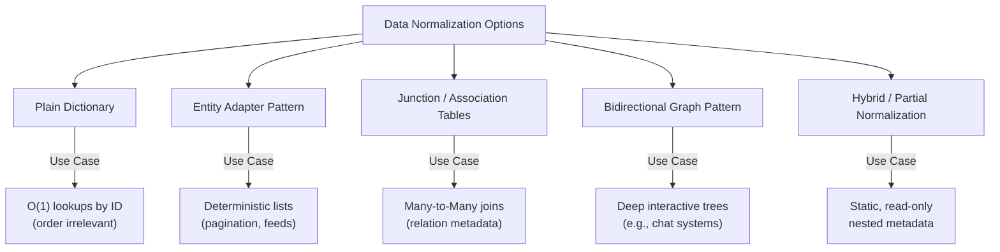

# Client-Side State Normalization

State normalization is the architectural practice of structuring client-side application state or database caches by flattening nested records into relational, key-value lookup tables.

- **Key Takeaway**: Storing data in a nested tree structure (the default format returned by most JSON REST APIs) is an anti-pattern for dynamic applications. It causes redundant records, state sync bugs, and slow traversal lookups ($O(N)$). Normalizing the state transforms reads and writes into efficient, constant-time ($O(1)$) operations.

---

## 1. What is Normalization?

Normalization involves reorganizing complex data into three primary structures:

1. **Flattening the data structure**: Removing arrays of nested objects and converting them into flat objects keyed by unique IDs.
2. **Storing entities separately**: Giving each type of entity (e.g., users, posts, comments) its own dedicated collection.
3. **Relationships via unique IDs**: Connecting entities together using ID references rather than nesting objects inside one another.

### A. The Student-College Schema Example

#### ❌ The Denormalized (Nested) Structure:

```javascript
const student = {
  id: 1,
  name: 'Atul',
  city: 'bangalore',
  college: {
    id: 'cg1',
    name: 'IIT Delhi',
    pincode: 110003,
  },
};
```

_If 500 students attend `IIT Delhi`, the entire `college` object is duplicated 500 times in memory. If the college pincode changes, we must search and update all 500 records._

#### The Normalized (Flat) Structure:

```javascript
const student = {
  id: 1,
  name: 'Chirag',
  city: 'bangalore',
  college: 'cg1', // Relational reference using a unique ID
};

const colleges = {
  cg1: {
    id: 'cg1',
    name: 'IIT Delhi',
    pincode: 110003,
  },
};
```

_Now, the college details are stored in exactly **one** location. Updates are applied once, and all referencing students instantly access the updated state._

---

## 2. Why Normalize? (Core Benefits)

- **Remove Redundancy**: Avoid duplicating objects across multiple parent containers (e.g., a shared post appearing in multiple users' feeds).
- **Efficiency & Performance**: Drastically reduces the memory footprint of the application and speeds up state mutations.
- **Simplifies Nested Relationships**: Prevents UI inconsistencies where updating a record in one list doesn't update the same record in another list.

---

## 3. Problem Statement: Nested State & Search Complexity

Consider a standard relational payload of users and posts returned by an API:

```javascript
const state = {
  users: [
    {
      id: 1,
      name: 'Alice',
      posts: [
        { id: 101, title: 'Post 1' },
        { id: 102, title: 'Post 2' },
      ],
    },
    {
      id: 2,
      name: 'Bob',
      posts: [{ id: 103, title: 'Post 3' }],
    },
  ],
};
```

### A. Reading & Searching Complexity

To look up a post by its ID (e.g., finding the title of post `103`), we must execute a nested loop traversal over the array of users and their nested posts:

```javascript
function findPostById(state, postId) {
  for (const user of state.users) {
    for (const post of user.posts) {
      if (post.id === postId) return post;
    }
  }
  return null;
}
```

- **Search Complexity**: **$O(U \cdot P)$** (where $U$ is the number of users and $P$ is the average number of posts per user). If the client application caches a large list of feeds or messages, searching through arrays on every render or user interaction blocks the main thread.

### B. Write & Update Complexity

If a post is shared (e.g., if `Post 1` is nested under both `Alice` and another user `Charlie`'s feed), updating the post's title requires:

1. Scanning the entire data tree to find all instances.
2. Mutating each duplicate object in-place.

- **Result**: High risk of **stale state bugs**, where editing a post in one view does not update it in another view.

---

## 4. The Solution: Massaged & Normalized State

We normalize the nested state by splitting users and posts into flat objects, where keys correspond to entity IDs:

```javascript
const normalizedState = {
  users: {
    1: { id: 1, name: 'Alice', posts: [101, 102] },
    2: { id: 2, name: 'Bob', posts: [103] },
  },
  posts: {
    101: { id: 101, title: 'Post 1' },
    102: { id: 102, title: 'Post 2' },
    103: { id: 103, title: 'Post 3' },
  },
};
```

### A. Lookup Complexity Shift

- **Reading by ID**: To retrieve post `103`, we bypass search loops and access the key directly:

  ```javascript
  const post = state.posts[103];
  ```

  - **Complexity**: **$O(1)$** constant time.

- **Writing & Updating**: To edit a post's title:

  ```javascript
  state.posts[101].title = 'Updated Post Title';
  ```

  - **Complexity**: **$O(1)$** constant time. The single source of truth is modified. Any UI component rendering post `101` will automatically receive the updated title.

### B. Advanced Multi-Level & Cross-Referenced Example

Real-world applications often present multi-level nesting combined with cross-referenced tables. Consider this complex dataset containing **Users**, **Posts**, **Comments**, and **Tags** that reference the same posts:

```javascript
const state = {
  users: [
    {
      id: 1,
      name: 'Alice',
      posts: [
        {
          id: 101,
          title: 'Post 1',
          comments: [{ id: 201, text: 'Great writeup!' }],
        },
      ],
    },
    {
      id: 2,
      name: 'Bob',
      posts: [
        {
          id: 102,
          title: 'Post 2',
          comments: [{ id: 202, text: 'Interesting read' }],
        },
      ],
    },
  ],
  tags: [
    {
      id: 301,
      name: 'Tech',
      posts: [{ id: 101 }, { id: 102 }],
    },
    {
      id: 302,
      name: 'Travel',
      posts: [{ id: 102 }],
    },
  ],
};
```

#### The Problem: Lookup Waterfalls & Duplicate Graph Traversal

In this nested state, `Post 1` and `Post 2` are nested inside `users` with their full title and comments, but in `tags` they are only referenced by partial objects `{ id: 101 }`.
If you want to **find the comments of all posts tagged with "Tech"**:

1. Scan `tags` to find `Tech` (ID `301`), returning its post IDs: `[101, 102]`.
2. For each post ID, you must do a linear scan across the entire `users` array, inspect their nested `posts` arrays to find the post details, and then extract the `comments` arrays.

- **Complexity**: **$O(T \cdot U \cdot P)$** where $T$ is tags, $U$ is users, and $P$ is posts per user.
- **Stale Updates**: If you add a new comment to `Post 1` under `users[0].posts[0].comments`, components displaying posts by tags won't receive it unless you manually crawl and sync both hierarchies.

#### The Solution: Fully Normalized Multi-Entity Graph

We massage the complex nested graph into four completely flat lookup tables interlinked via ID pointers:

```javascript
const normalizedState = {
  users: {
    1: { id: 1, name: 'Alice', posts: [101] },
    2: { id: 2, name: 'Bob', posts: [102] },
  },
  posts: {
    101: { id: 101, authorId: 1, title: 'Post 1', comments: [201], tags: [301] },
    102: { id: 102, authorId: 2, title: 'Post 2', comments: [202], tags: [301, 302] },
  },
  comments: {
    201: { id: 201, postId: 101, text: 'Great writeup!' },
    202: { id: 202, postId: 102, text: 'Interesting read' },
  },
  tags: {
    301: { id: 301, name: 'Tech', posts: [101, 102] },
    302: { id: 302, name: 'Travel', posts: [102] },
  },
};
```

#### Why This is Highly Optimized

- **Constant Time Comment Retrieval by Tag**: To get the comments for "Tech" (ID `301`):
  1. Retrieve post IDs directly: `state.tags[301].posts` -> `[101, 102]` ($O(1)$).
  2. Map post IDs to comments: `state.posts[101].comments` -> `[201]` ($O(1)$).
  3. Look up comments: `state.comments[201]` ($O(1)$).
- **Single Source of Truth**: Adding a comment (ID `203`) to `Post 1` only requires:
  1. Writing to `state.comments[203] = { id: 203, postId: 101, text: 'New Comment' }` ($O(1)$).
  2. Pushing the ID to `state.posts[101].comments.push(203)` ($O(1)$).
     _This automatically updates all UI elements rendering `Post 1`, whether they are viewing it from Alice's profile feed or from the "Tech" tags feed._

---

## 5. Normalization Patterns & Implementations by Use Case

State normalization is not a one-size-fits-all strategy. Depending on performance budgets, data relations, and UI requirements, developers leverage different architectural patterns to model their normalized state.



### Pattern 1: Plain Dictionary / Lookup Object (`{ [id]: entity }`)

This is the simplest form of normalization, storing entities as key-value pairs where the key is the entity ID.

#### 📝 Structure

```javascript
const state = {
  posts: {
    101: { id: 101, title: 'Post 1' },
    102: { id: 102, title: 'Post 2' },
  },
};
```

- **Pros**:
  - Trivial implementation with minimal boilerplate.
  - Constant-time $O(1)$ lookups and updates.
- **Cons**:
  - **No Guaranteed Order**: Modern JS engines automatically sort numeric keys in ascending order. If your items are chronological (e.g. newest post first), the engine will sort them by ID (oldest first if IDs are incremental), destroying feed order.
  - **Slow Iteration**: Iterating requires extracting keys first (`Object.values()`), which is an $O(N)$ operation.
  - **Slow Emptiness Check**: Checking if the collection is empty requires `Object.keys(posts).length === 0` ($O(N)$ overhead).
- **Best Used For**: Simple reference data (e.g., a dictionary of country codes, localized strings) or when entity order is managed entirely by another collection (e.g., user profiles referencing post IDs).

---

### Pattern 2: Entity Adapter Pattern (`{ byIds, allIds }`)

Also known as the **Relational Table Pattern**, this is the standard client-side state structure popularized by **Redux Toolkit** (`createEntityAdapter`) and **normalizr**. It decouples the entity data from its ordering.

#### 📝 Structure

```javascript
const state = {
  posts: {
    byIds: {
      101: { id: 101, title: 'Post 1' },
      102: { id: 102, title: 'Post 2' },
    },
    allIds: [102, 101], // Enforces chronological or custom sorting (Post 2 first)
  },
};
```

- **Pros**:
  - **Guaranteed Deterministic Ordering**: The array `allIds` preserves the exact sequence (e.g. chronological feed, drag-and-drop ordering).
  - **O(1) Emptiness Check**: Checking if empty is a constant-time check: `allIds.length === 0`.
  - **Optimal Render Paths**: Components rendering lists can map over `allIds` directly and pass the ID to child items, which look up their details via `byIds[id]` in $O(1)$.
  - **Efficient Pagination**: Performing slice, splice, append, or prepend operations is extremely fast using the `allIds` index.
- **Cons**:
  - **Mutation Overhead**: Adding or removing items requires updating _both_ the map (`byIds`) and the array (`allIds`), which increases reducer complexity.
- **Best Used For**: Relational feeds, chat history threads, search result lists, tables, and pagination-heavy UIs.

---

### Pattern 3: Junction / Association Tables (Decoupled Relations)

In traditional databases, many-to-many relationships with metadata are managed via junction tables. The same pattern can be applied to client-side state to avoid polluting primary entities with relational data.

#### 📝 Structure

Instead of attaching arrays like `user.groupIds` or `group.userIds` directly to the user and group objects, we maintain separate lookup indices.

```javascript
const state = {
  users: {
    byIds: {
      1: { id: 1, name: 'Alice' },
      2: { id: 2, name: 'Bob' },
    },
    allIds: [1, 2],
  },
  groups: {
    byIds: {
      g1: { id: 'g1', name: 'Engineering' },
    },
    allIds: ['g1'],
  },
  // Junction store mapping relations and metadata
  memberships: {
    byUserAndGroup: {
      '1-g1': { joinedAt: '2026-01-10T10:00:00Z', role: 'admin' },
      '2-g1': { joinedAt: '2026-05-24T12:00:00Z', role: 'member' },
    },
    groupIdsByUserId: {
      1: ['g1'],
      2: ['g1'],
    },
    userIdsByGroupId: {
      g1: [1, 2],
    },
  },
};
```

- **Pros**:
  - **Entity Purity**: Avoids polluting core entity models (Users, Groups) with contextual, session-specific relation details.
  - **Houses Relation Metadata**: Provides a clear location to store relational metadata (e.g., `role`, `joinedAt` timestamps) that belongs to the connection itself rather than either entity.
  - **Prevents Multi-Entity Updates**: Removing a user from a group only requires modifying the `memberships` store, avoiding mutations in both `users` and `groups`.
- **Cons**:
  - **Double Indirection**: To render a list of a group's members, you must first read `userIdsByGroupId`, and then resolve each ID from the `users` lookup map.
- **Best Used For**: Highly complex, interactive workspace tools, document permissions, group memberships, or user roles.

---

### Pattern 4: Bidirectional Graph Pattern (Two-Way References)

Under this pattern, related entities hold mutual pointers. For example, a `Comment` contains a `postId` back-reference, and its parent `Post` contains a `commentIds` array.

#### 📝 Structure

```javascript
const state = {
  posts: {
    byIds: {
      101: { id: 101, title: 'Post 1', commentIds: [201] },
    },
  },
  comments: {
    byIds: {
      201: { id: 201, postId: 101, text: 'Great post!' },
    },
  },
};
```

- **Pros**:
  - **Seamless Navigation**: Allows components to easily traverse upwards (Comment -> parent Post title) or downwards (Post -> list of Comments) without needing to fetch from root selectors.
- **Cons**:
  - **High Sync Cost**: Creating or deleting a comment requires updating two collections (adding comment to comment map and appending ID to parent post's comment list). If any sync operation fails, the database falls into an inconsistent state.
- **Best Used For**: Threaded discussion boards, nested folders/files, or comment sections where bidirectional linking is frequently traversed in the UI.

---

### Pattern 5: Hybrid / Partial Normalization

In highly complex apps, normalizing everything can introduce significant developer overhead and memory lookup waterfalls. A hybrid approach normalizes only dynamic/shared entities, while keeping static, read-only nested structures inline.

#### 📝 Structure

```javascript
const state = {
  posts: {
    byIds: {
      101: {
        id: 101,
        title: 'Post 1',
        authorId: 1, // Normalized relation (author details are shared/mutable)
        // Static read-only metadata nested inline to reduce join overhead
        meta: {
          license: 'CC-BY-4.0',
          viewingRestrictions: { countryWhitelist: ['IN', 'US'] },
        },
      },
    },
  },
};
```

- **Pros**:
  - **Reduces Selector Overhead**: Avoids complex join selector mapping for static metadata, saving CPU rendering cycles.
  - **Saves Memory**: Eliminates the overhead of maintaining individual tables for trivial, non-relational configurations.
- **Cons**:
  - **Risk of Stale UI**: If any of the nested metadata needs to be modified dynamically, it cannot easily be done without performing deep clones or re-fetching the entire parent tree.
- **Best Used For**: Rich nested JSON structures that are purely static or read-only once loaded (e.g. geo-coordinates, styling config objects, localized translation blocks).

---

## 6. When to Use vs. When NOT to Use

| When to Normalize (Best Practices)                                                                                               | When NOT to Normalize (Anti-Patterns)                                                                             |
| :------------------------------------------------------------------------------------------------------------------------------- | :---------------------------------------------------------------------------------------------------------------- |
| **Relational Data Structures**: Data containing many-to-many or one-to-many relationships (e.g., users, posts, comments, likes). | **Static / Flat Lists**: Datasets without relationships (e.g., a simple list of states/countries for a dropdown). |
| **Highly Dynamic Stores**: State graphs that undergo frequent client-side updates, deletes, or additions.                        | **Read-Only / Single Views**: Data fetched once for a single detail page and discarded immediately without edits. |
| **Large Shared Caches**: Global stores accessed by multiple components simultaneously (e.g. Redux, Zustand, Pinia).              | **Local Component UI States**: Simple states like `isModalOpen: true` or `activeTabIndex: 0`.                     |

---

## 7. Staff-Level Pitfalls & Gotchas

### Gotcha #1: The Orphaned Entities Trap (Garbage Collection)

Because relationships are stored only as ID arrays, deleting a parent entity does not automatically remove its child entities from the lookup store.

> [!WARNING]
> If a user is deleted from `state.users`, their post IDs (`[101, 102]`) remain in `state.posts` indefinitely. This creates **orphaned entities**, leading to progressive client-side memory leaks and bloated cache payloads.

#### Mitigation:

Implement cascading deletions in your state reducer/mutation logic to ensure children are cleaned up when parents are removed:

```javascript
function deleteUser(state, userId) {
  const user = state.users[userId];
  if (!user) return;

  // 1. Delete user's posts (cascading cleanup)
  user.posts.forEach((postId) => {
    delete state.posts[postId];
  });

  // 2. Delete the user
  delete state.users[userId];
}
```

### Gotcha #2: Selector Join Overhead (The React Rendering Trap)

To render a normalized list on the UI (e.g., rendering a User Card showing their actual post titles), we must perform a "join" by mapping the user's post ID array back to the post objects:

```javascript
// A selector running on every render loop
const selectUserPosts = (state, userId) => {
  const user = state.users[userId];
  return user ? user.posts.map((id) => state.posts[id]) : [];
};
```

> [!CAUTION]
> In libraries like React, `.map()` creates a **new array reference** on every call. If this selector runs during every render cycle of a parent component, it will trigger unnecessary re-renders of all child components, degrading UI responsiveness.

#### Mitigation:

Always wrap join operations in **memoized selectors** (e.g., using `reselect` or `useMemo` hooks) to ensure the join operation only recomputes when the underlying `users` or `posts` lookup tables actually change:

```javascript
import { createSelector } from 'reselect';

const selectUsers = (state) => state.users;
const selectPosts = (state) => state.posts;

// Memoized selector: only re-runs map if users or posts table references change
export const selectUserPostsMemoized = createSelector(
  [selectUsers, selectPosts, (state, userId) => userId],
  (users, posts, userId) => {
    const user = users[userId];
    return user ? user.posts.map((id) => posts[id]) : [];
  },
);
```

#### Mitigation #2: ID-Only List Rendering Pattern

For large feeds or lists, instead of projecting a fully joined list of objects from the parent component, use the **ID-Only List Rendering** pattern to decouple components:

1. **Parent Component**: Selects only the array of entity IDs (e.g., `state.posts.allIds`).
2. **Parent Render**: Iterates over the ID array to render child elements, passing _only_ the ID as a prop.
3. **Child Component**: Connects to the store independently to select its own detailed data slice by ID.

##### ❌ Parent-Level Deep Selector (Unoptimized):

```javascript
// Triggers parent re-render and ALL children re-renders if ANY post title changes
const PostList = () => {
  const posts = useSelector(selectAllPostsJoined); // returns array of full post objects
  return (
    <div>
      {posts.map((post) => (
        <PostCard key={post.id} post={post} />
      ))}
    </div>
  );
};
```

##### ✔ Optimized ID-Only Pattern:

```javascript
// Parent component - only re-renders if list order or items list changes
const PostList = () => {
  const postIds = useSelector((state) => state.posts.allIds); // returns array of numbers [101, 102]
  return (
    <div>
      {postIds.map((id) => (
        <PostCard key={id} id={id} />
      ))}
    </div>
  );
};

// Child component - only re-renders if post 101 specifically updates
const PostCard = React.memo(({ id }) => {
  const post = useSelector((state) => state.posts.byIds[id]);
  return <h2>{post.title}</h2>;
});
```

- **Why this is highly performant**: If a single post (e.g. ID `101`) undergoes an update (like title change or comment addition), its selector inside `<PostCard id={101} />` returns a new reference, triggering only that card to re-render. Since `allIds` array references in the parent component remain identical, the parent `PostList` and all other `PostCard` siblings bypass re-rendering entirely.

---

## 8. Interactive Code Playground (Node.js Implementation)

To help you run and experiment with these concepts locally, a functional normalization playground is included in this directory. It compares handcoded normalization loops against a custom, schema-driven normalizer (similar to how `normalizr` works under the hood).

### Playground Files

- **[dataset1.js](file:///Users/atulkumarawasthi/projects/SystemDesign/Database&Caching/normalization/dataset1.js)**: Contains a deeply nested hierarchical blog data tree (Users -> Posts -> Comments -> Authors).
- **[dataset2.js](file:///Users/atulkumarawasthi/projects/SystemDesign/Database&Caching/normalization/dataset2.js)**: Contains a complex Kanban project board structure (Projects -> Columns -> Tasks -> Tags/Assignees/Comments).
- **[index.js](file:///Users/atulkumarawasthi/projects/SystemDesign/Database&Caching/normalization/index.js)**: The core runner script implementing manual mapping, a recursive schema engine, lookup benchmarks, dynamic store mutations, and selector joins (denormalization).

### How to Run

Execute the script using Node.js:

```bash
node index.js
```

### Script Capabilities Demonstrations

1. **Ad-Hoc Manual Loops**: Demonstrates how to map nested records to `{ byIds, allIds }` structures using vanilla JavaScript `forEach` loops.
2. **Schema-Driven Recursive Engine**: Demonstrates a generic, schema-driven recursive normalizer using entity relationships:

   ```javascript
   const commentSchema = new Entity('comments');
   const postSchema = new Entity('posts');
   const userSchema = new Entity('users');

   commentSchema.define({ author: userSchema });
   postSchema.define({ comments: [commentSchema] });
   userSchema.define({ posts: [postSchema] });
   ```

3. **Lookup Benchmarking**: Runs a real-time lookup comparison comparing an $O(N)$ nested scan traversal to an $O(1)$ direct hash map lookup.
4. **State Mutation Simplicity**: Updates a comment nested deep within the store and shows how the modification is applied in constant time $O(1)$ at a single source of truth.
5. **Selector Join Projection**: Projects the normalized stores back into a denormalized tree layout suitable for UI rendering without duplicate records.
