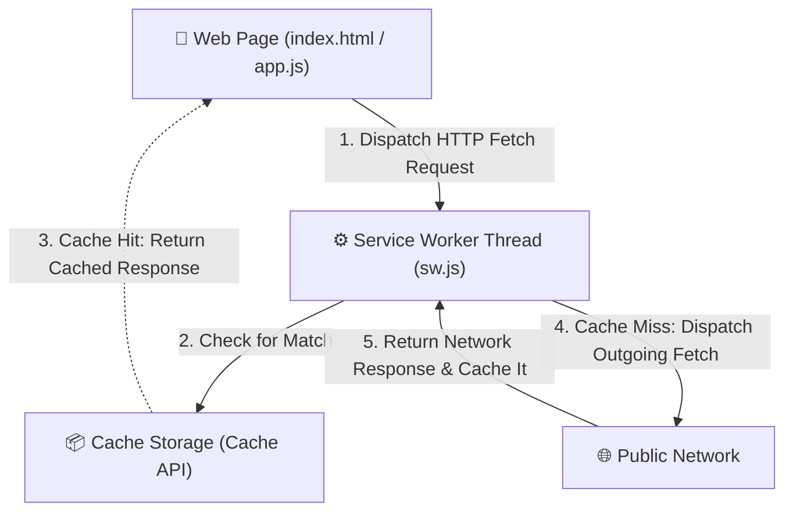
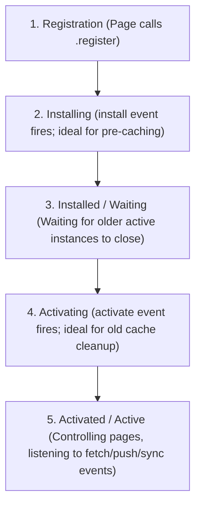

# Service Worker Architecture & Implementation Patterns

A **Service Worker** is a event-driven, background script run by the browser in a thread completely separate from the main web application page. It acts as a client-side programmable network proxy, intercepting outgoing network requests, managing client-side caches, enabling offline resilience, and facilitating background operations (like push notifications and background sync).

---

## 1. Core Characteristics & Thread Isolation

Service Workers differ fundamentally from standard client-side scripts:

1. **Thread Isolation**: They run in a separate execution context (the Worker thread) distinct from the page's main UI thread. Because of this, **Service Workers have no direct access to the DOM**. Communication with the main page must happen asynchronously via the `postMessage` API.
2. **Fully Asynchronous Execution**: To prevent blocking the main thread, Service Workers are entirely asynchronous. **Synchronous APIs (like `localStorage` and synchronous `XMLHttpRequests`) are completely blocked** inside a Service Worker. Instead, asynchronous APIs like `fetch()`, `Cache Storage`, and `IndexedDB` are utilized.
3. **HTTP/Network Proxy Capability**: They run as a middleman between the web app and the network. Any HTTP requests dispatched by pages under the worker's scope flow through the worker first.
4. **Lifecycle Independence**: A Service Worker runs independently of page lifetime. It starts up when needed (e.g., when a network request is made, a push notification is received, or background sync triggers) and goes idle when inactive to conserve system memory.
5. **Security Constraints (HTTPS Enforced)**: To prevent man-in-the-middle exploits (where a malicious script intercepts all user network requests), Service Workers can only be registered on secure origins (**HTTPS**), with the exception of `localhost` for development.

---

## 2. Request Interception Architecture

The Service Worker operates as a client-side proxy layer. The diagram below illustrates the network flow when a page requests a resource, mapping to the **5-step network interception sequence**:



### The 5-Step Interception Sequence Explained:

1. **Request Dispatch**: The main web page (or dynamic scripts like `app.js`) dispatches an HTTP request (e.g., for an image, stylesheet, or API data).
2. **Interception & Cache Lookup**: The Service Worker intercepts the request via the `fetch` listener and checks if a matching resource exists in the `Cache Storage` API (`caches.match(event.request)`).
3. **Cache Hit Fallback**: If a match is found, the cached resource is immediately returned to the page without hitting the network, ensuring instantaneous rendering and offline support.
4. **Network Request**: If a cache miss occurs, the Service Worker forwards the request to the public network using the `fetch()` API.
5. **Caching & Resolution**: The network returns the response to the Service Worker. The worker caches a cloned copy of the response for subsequent request hits and forwards the original response back to the main web page.

---

## 3. The Service Worker Lifecycle

Service Workers follow a rigorous, stateful lifecycle designed to prevent older page instances from breaking when a new worker update is deployed:



### Lifecycle States Detailed:

1. **Registration**: The main page executes `navigator.serviceWorker.register('/sw.js')`. The browser downloads, parses, and begins installing the script.
2. **Installing**: The `install` event fires. This is the ideal stage for **pre-caching the application shell** (HTML, CSS, core JS, and logo assets) using `caches.open()` and `cache.addAll()`.
3. **Installed / Waiting**: The service worker has installed successfully. However, if there is an _older service worker_ currently controlling active tabs of the web app, the new worker is put into a **waiting** state. It will not take control until all tabs running the old worker are closed.
4. **Activating**: Once all controlling pages are closed (or if `self.skipWaiting()` is called), the new worker moves to the activating phase. The `activate` event fires. This is the optimal time to **clean up outdated caches** from previous service worker versions.
5. **Activated / Active**: The worker takes full control of the pages within its scope. It is now listening for functional events such as `fetch`, `push`, and `sync`. Note: By default, a newly activated service worker will not control pages that were loaded _before_ the activation completed, unless `self.clients.claim()` is called.

---

## 4. Complete Implementation Example

Below is a complete implementation mapping the registration in `index.html` to a service worker `sw.js` that pre-caches key assets and intercepts network requests.

### A. Main Page Registration (`index.html`)

This template demonstrates safe registration checks and scopes matching the registration structure:

```html
<!DOCTYPE html>
<html lang="en">
  <head>
    <meta charset="UTF-8" />
    <meta name="viewport" content="width=device-width, initial-scale=1.0" />
    <title>Service Worker Example</title>
    <link rel="stylesheet" href="/styles.css" />
  </head>
  <body>
    <h1>Hello, Service Worker!</h1>
    

    <script src="/app.js"></script>

    <!-- Service Worker Registration Script -->
    <script>
      if ('serviceWorker' in navigator) {
        window.addEventListener('load', () => {
          navigator.serviceWorker
            .register('/sw.js', { scope: '/' })
            .then((registration) => {
              console.log('Service Worker registered with scope:', registration.scope);
            })
            .catch((error) => {
              console.error('Service Worker registration failed:', error);
            });
        });
      }
    </script>
  </body>
</html>
```

### B. Service Worker Script (`sw.js`)

This script pre-caches assets during installation, purges stale caches on activation, and intercepts requests to serve assets using a cache-first caching strategy:

```javascript
// Versioned cache name for cache-busting during activation
const CACHE_NAME = 'app-shell-v1';

// Assets to pre-cache during the install phase (App Shell)
const PRECACHE_ASSETS = ['/', '/index.html', '/styles.css', '/app.js', '/image.gif'];

// 1. INSTALL EVENT: Pre-cache static app assets
self.addEventListener('install', (event) => {
  console.log('[Service Worker] Installing...');
  event.waitUntil(
    caches
      .open(CACHE_NAME)
      .then((cache) => {
        console.log('[Service Worker] Pre-caching app shell assets');
        return cache.addAll(PRECACHE_ASSETS);
      })
      .then(() => {
        // Force the waiting service worker to become the active service worker immediately
        return self.skipWaiting();
      }),
  );
});

// 2. ACTIVATE EVENT: Clean up outdated caches
self.addEventListener('activate', (event) => {
  console.log('[Service Worker] Activating...');
  event.waitUntil(
    caches
      .keys()
      .then((cacheNames) => {
        return Promise.all(
          cacheNames.map((cacheName) => {
            // If the cache key does not match the current version, delete it
            if (cacheName !== CACHE_NAME) {
              console.log('[Service Worker] Purging old cache:', cacheName);
              return caches.delete(cacheName);
            }
          }),
        );
      })
      .then(() => {
        // Force the newly active Service Worker to claim control of all open clients instantly
        return self.clients.claim();
      }),
  );
});

// 3. FETCH EVENT: Intercept requests and apply Cache-First Caching Strategy
self.addEventListener('fetch', (event) => {
  // Only handle HTTP/S requests (ignore chrome-extension, data URIs, etc.)
  if (!event.request.url.startsWith(self.location.origin)) {
    return;
  }

  event.respondWith(
    caches.match(event.request).then((cachedResponse) => {
      // Return resource from cache if found (Cache Hit)
      if (cachedResponse) {
        console.log('[Service Worker] Serving from cache:', event.request.url);
        return cachedResponse;
      }

      // Otherwise, fetch from network (Cache Miss)
      console.log('[Service Worker] Cache miss. Fetching from network:', event.request.url);
      return fetch(event.request).then((networkResponse) => {
        // Check if response is valid (must be status 200, ignore basic errors)
        if (!networkResponse || networkResponse.status !== 200 || networkResponse.type !== 'basic') {
          return networkResponse;
        }

        // Clone the response because the stream can only be consumed once
        const responseToCache = networkResponse.clone();

        caches.open(CACHE_NAME).then((cache) => {
          cache.put(event.request, responseToCache);
          console.log('[Service Worker] Caching new asset:', event.request.url);
        });

        return networkResponse;
      });
    }),
  );
});
```

---

## 5. Core Caching Strategies

Depending on the dynamic nature of your application data, you must select the appropriate caching strategy inside the `fetch` event listener:

### A. Cache-First (Cache falling back to Network)

- **Best for**: Static assets (images, CSS styles, web fonts, build scripts).
- **Mechanic**: Check cache first. If a match is found, return it. Otherwise, fetch from network, update the cache, and return the response.

### B. Network-First (Network falling back to Cache)

- **Best for**: Dynamic data, API requests, profile configurations, or dashboard states.
- **Mechanic**: Dispatch to network first. If successful, write response to cache and return. If network fails (offline), serve the latest cached copy.
- **Code Example**:
  ```javascript
  self.addEventListener('fetch', (event) => {
    if (event.request.mode === 'navigate' || event.request.url.includes('/api/')) {
      event.respondWith(
        fetch(event.request)
          .then((response) => {
            const responseCopy = response.clone();
            caches.open('dynamic-api-cache').then((cache) => {
              cache.put(event.request, responseCopy);
            });
            return response;
          })
          .catch(() => {
            return caches.match(event.request);
          }),
      );
    }
  });
  ```

### C. Stale-While-Revalidate (SWR)

- **Best for**: Content that updates regularly but speed is highly prioritized (e.g., news feeds, inbox lists, avatars).
- **Mechanic**: Serves the cached response instantly. In the background, dispatches a network call to fetch a fresh version and update the cache for the next reload.
- **Code Example**:
  ```javascript
  self.addEventListener('fetch', (event) => {
    event.respondWith(
      caches.open('swr-cache').then((cache) => {
        return cache.match(event.request).then((cachedResponse) => {
          const fetchPromise = fetch(event.request).then((networkResponse) => {
            cache.put(event.request, networkResponse.clone());
            return networkResponse;
          });
          // Return cached response instantly if present; otherwise wait for network
          return cachedResponse || fetchPromise;
        });
      }),
    );
  });
  ```

---

## 6. Staff-Level Caching Pitfalls & Architecture Hardening

### A. The Registration Scope Rule

The directory location of the `sw.js` file determines its control scope by default:

- A service worker registered at `/js/sw.js` can **only** intercept requests starting with `/js/` (e.g., `/js/app.js` but NOT `/index.html` or `/images/logo.png`).
- To register a service worker located at `/js/sw.js` but have it control the entire root (`/`) scope, you must return the custom HTTP header on the `sw.js` response from the server:
  ```http
  Service-Worker-Allowed: /
  ```
  Then, pass the scope option during page registration:
  ```javascript
  navigator.serviceWorker.register('/js/sw.js', { scope: '/' });
  ```

### B. The Service Worker Update Deadlock (Staleness Trap)

If you serve your `sw.js` file with aggressive HTTP caching headers:

```http
Cache-Control: public, max-age=31536000
```

The browser will cache the worker script on disk and will **not** request the updated version from the server, locking your users out of new application releases permanently (a common developer trap).

- **Mitigation**: Always serve your `sw.js` file with HTTP headers disabling cache storage on intermediate and client caches:
  ```http
  Cache-Control: no-cache, no-store, must-revalidate
  Expires: 0
  ```
- **Browser Safeguard**: Even if HTTP headers are configured poorly, modern browsers will perform a byte-for-byte check of the `sw.js` file against the network server at least once every 24 hours to force update checks.

### C. Active Tab Upgrades: `skipWaiting` and `clients.claim`

By default, when an active service worker is replaced, the new worker stays in the `waiting` state until the user closes all open tabs.

- `self.skipWaiting()` forces the installing worker to activate immediately.
- `self.clients.claim()` forces the newly activated worker to immediately take control of all open clients (pages) without requiring a user page refresh.
- **UX Pattern**: In production systems, instead of forcing updates silently, apps listen for the `updatefound` event and display a prompt (e.g., _"New version available. Click to reload"_), invoking `postMessage({ action: 'skipWaiting' })` only upon user confirmation to prevent active user sessions from breaking.

### D. Query Parameter Cache Busting (Search Query Matching)

When clients use cache-busting query strings (e.g. `fetch('/styles.css?r=123')`) to bypass HTTP browser-level caches, the Service Worker intercepts the request including those query parameters. By default, `caches.match()` performs an exact string check, which causes cache misses for pre-cached assets (e.g. `/styles.css`).

- **Solution**: Always configure your Service Worker cache matching with the `ignoreSearch` option:
  ```javascript
  caches.match(event.request, { ignoreSearch: true });
  ```
  This instructs the Cache API to ignore query parameters (everything following `?` in the URL), ensuring the query-busted client requests successfully match cached assets while still bypassing browser-level HTTP caches.
