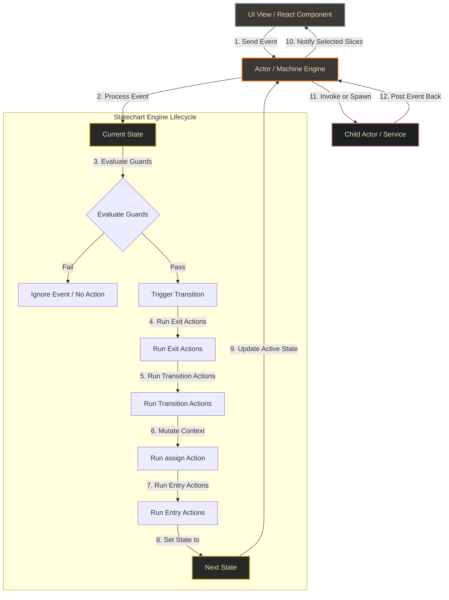
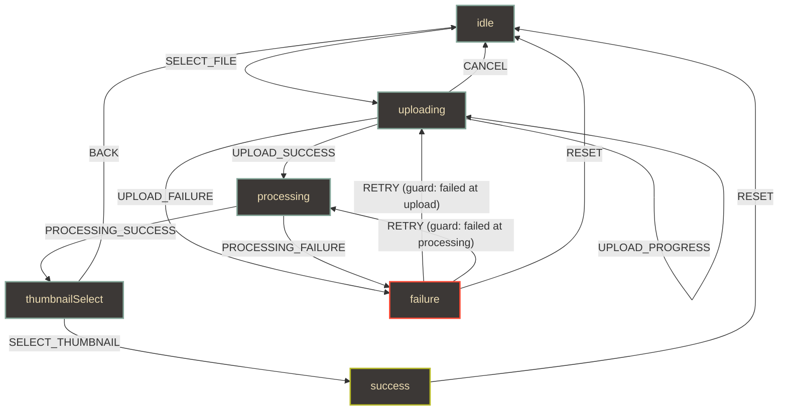
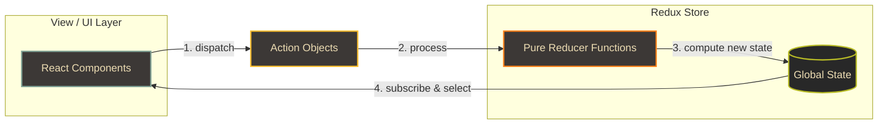
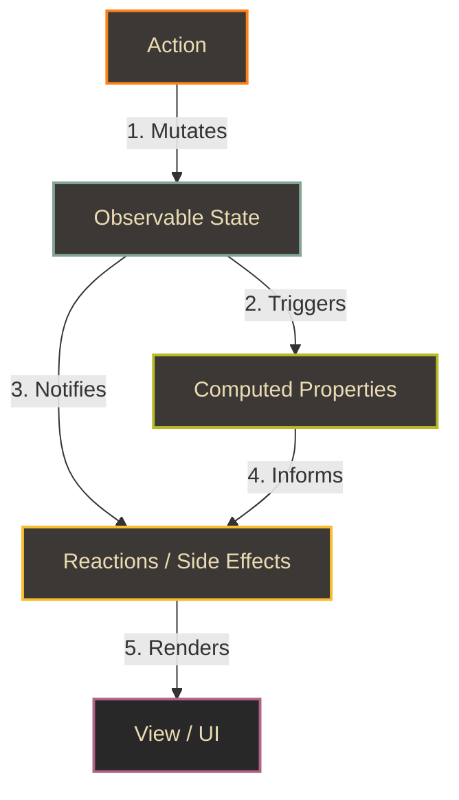
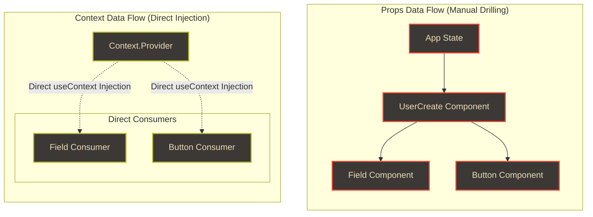
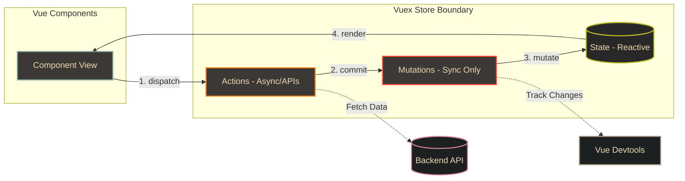
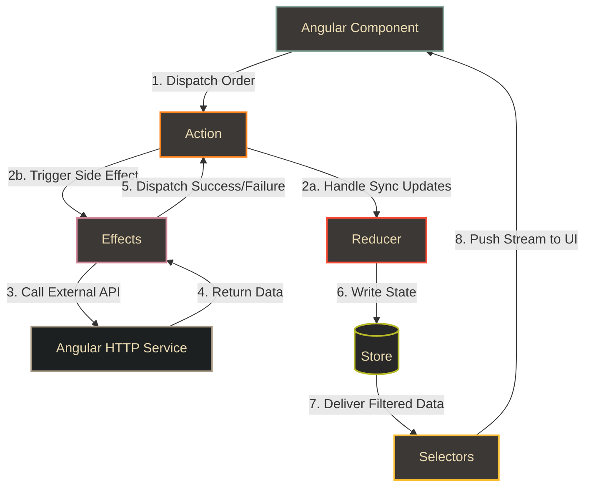

# Frontend State Management Architecture & Paradigm Guide

Modern client-side application engineering requires managing state that spans local component interactions, global application contexts, server-cache synchronizations, and complex transition lifecycles. Selecting the correct state management pattern directly impacts rendering performance, bundle size, code maintainability, and data consistency.

---

## 1. State Management Library Comparison Matrix

| Library / API       | State Paradigm                     | Re-rendering Control                                   | Complexity / Boilerplate | Best Use Cases                                                            | Primary Trade-off                                                |
| :------------------ | :--------------------------------- | :----------------------------------------------------- | :----------------------- | :------------------------------------------------------------------------ | :--------------------------------------------------------------- |
| **`useState`**      | Local Component Primitive          | Component-level (triggers subtree re-render)           | Extremely Low            | Simple, isolated component states (toggles, input fields).                | Hard to share across sibling or distant components.              |
| **`useReducer`**    | Local Unidirectional State         | Component-level (triggers subtree re-render)           | Low to Medium            | Complex component state with co-dependent fields or history.              | Still bound to component tree; triggers full subtree render.     |
| **`XState`**        | Finite State Machine / Statecharts | State-directed selectors                               | Medium to High           | Highly stateful components with complex transition rules (auth, wizards). | High initial learning curve; verbose definitions.                |
| **`React Context`** | Dependency Injection               | None native (re-renders all consumers on any change)   | Low                      | App-wide static configuration (themes, localization, global auth).        | Bad performance for high-frequency updates without optimization. |
| **`Redux`**         | Centralized Unidirectional Store   | Selector-based (highly optimized)                      | High                     | Enterprise apps with complex, global, write-heavy state.                  | Verbose action/reducer setup (mitigated slightly by Toolkit).    |
| **`MobX`**          | Reactive (Observable/Observer)     | Fine-grained (mutates observables, triggers reactions) | Low to Medium            | Data-heavy applications with complex relational schemas.                  | Magic tracking makes debugging stack traces difficult.           |
| **`Vuex`**          | Centralized Unidirectional Store   | Reactive bindings                                      | Medium                   | Large Vue applications requiring global structured state.                 | Vue-specific; introduces strict mutation boundaries.             |
| **`NgRx`**          | Reactive Unidirectional Store      | Observable selectors                                   | High                     | Complex Angular applications matching RxJS patterns.                      | Intense boilerplate; requires strong RxJS expertise.             |
| **`Zustand`**       | Atomic/Sleek Unidirectional Store  | Selector-based (highly optimized)                      | Low                      | Small-to-large React apps needing global state without Context.           | Lacks native time-travel debugging out-of-the-box.               |

## 2. Progressive Learning Path: Beginner to Advanced

To build a clean mental model of frontend state management, it is best to view state complexity as a progressive ladder. Jumping straight into complex libraries without solid foundations leads to buggy architectures.

---

### 2.1 Beginner: Local Primitive State (`useState`)

`useState` is the fundamental state primitive in React. It stores values locally inside a component context across render cycles.

#### 1. Mental Model: The Sealed Box

Imagine a sealed box containing a value (e.g. a number `0`).

- You cannot reach in and modify the value directly (immutability).
- To change the value, you use a special stamp tool (the setter function, `setCount`).
- Stamping the box with a new value destroys the old one, seals the box, and signals the parent room (React) to redraw the screen (re-render).

```javascript
import React, { useState } from 'react';

export function Counter() {
  const [count, setCount] = useState(0); // State box starts with 0
  return <button onClick={() => setCount(count + 1)}>Count: {count}</button>;
}
```

#### 2. Advanced Beginner Gotchas:

- **The Asynchronous State Value Trap**:
  State updates are batched and scheduled asynchronously. If you read state immediately after setting it, you will get the old value:
  ```javascript
  const handleIncrement = () => {
    setCount(count + 1);
    console.log(count); // Prints the OLD value (e.g., 0, not 1) because the render hasn't occurred yet!
  };
  ```
- **The Multiple Update Overwrite**:
  If you trigger multiple state updates sequentially, React batches them. The values do not accumulate:

  ```javascript
  const handleTripleAdd = () => {
    setCount(count + 1); // Schedules: count = 0 + 1
    setCount(count + 1); // Schedules: count = 0 + 1
    setCount(count + 1); // Schedules: count = 0 + 1
    // Result after render: count is 1, not 3!
  };

  // FIX: Use the functional updater pattern:
  const handleTripleAddCorrect = () => {
    setCount((prev) => prev + 1); // Reads latest queued value: 0 + 1
    setCount((prev) => prev + 1); // Reads latest queued value: 1 + 1
    setCount((prev) => prev + 1); // Reads latest queued value: 2 + 1
    // Result after render: count is 3!
  };
  ```

- **The Shallow Mutation Bug**:
  React determines if state changed via shallow reference comparison (`Object.is`). Mutating properties inside objects or arrays directly does not change the reference, so React fails to trigger a re-render:

  ```javascript
  const [user, setUser] = useState({ name: 'Alice', age: 25 });

  const handleAgeChangeBad = () => {
    user.age = 26; // Mutates properties directly
    setUser(user); // Sends the SAME object reference. React ignores the render request!
  };

  // FIX: Create a shallow copy with a new reference:
  const handleAgeChangeGood = () => {
    setUser({ ...user, age: 26 }); // Creates a new object reference!
  };
  ```

---

### 2.2 Intermediate: Action-Driven State (`useReducer`)

`useReducer` is the native React hook designed for complex component state. It implements a local Flux-like architecture.

#### 1. Mental Model: The Clerk and the Ledger

Imagine a corporate office:

- **Ledger (State)**: A read-only booklet representing the current company records.
- **Envelope (Action)**: A structured note explaining what occurred (e.g., `{ type: 'ADD_EMPLOYEE', payload: 'Bob' }`).
- **Office Clerk (Reducer)**: A pure, isolated clerk. Components cannot update the Ledger themselves. Instead, they drop an Action envelope into the clerk's mail slot (dispatch). The clerk reads the action type, reviews the current ledger, computes the new ledger values, and returns the updated booklet.

```javascript
import React, { useReducer } from 'react';

const INITIAL_STATE = { count: 0 };

function counterReducer(state, action) {
  switch (action.type) {
    case 'INCREMENT':
      return { count: state.count + 1 };
    case 'RESET':
      return { count: 0 };
    default:
      return state;
  }
}

export function ReducerCounter() {
  const [state, dispatch] = useReducer(counterReducer, INITIAL_STATE);
  return <button onClick={() => dispatch({ type: 'INCREMENT' })}>Count: {state.count}</button>;
}
```

#### 2. When to Transition from `useState` to `useReducer`:

- **Co-dependent State Updates**: Updating one field requires updating three others atomically (e.g., updating a search filter must also reset pagination and set loading states).
- **State Updates Depend on Previous State**: The next state is calculated using the current state value (e.g., adding/removing items in a shopping cart).
- **Nested State Structures**: Deeply nested objects or arrays where mutating fields directly causes shallow-comparison rendering bugs.
- **Separation of Concerns**: You want to test state mutation logic in isolation via pure functions without rendering React components.

#### 3. Code Comparison: Filter Dashboard Refactoring

##### The Naive Way (`useState`)

In this approach, resetting or changing filters requires calling multiple independent setters, risking mismatched render updates and component-level spaghetti code.

```javascript
import React, { useState } from 'react';

export function NaiveDashboard() {
  const [query, setQuery] = useState('');
  const [category, setCategory] = useState('All');
  const [minPrice, setMinPrice] = useState(0);
  const [maxPrice, setMaxPrice] = useState(1000);
  const [sortBy, setSortBy] = useState('name');
  const [page, setPage] = useState(1);
  const [isLoading, setIsLoading] = useState(false);

  // Triggering a reset requires coordinating 6 manual state setters
  const handleResetFilters = () => {
    setQuery('');
    setCategory('All');
    setMinPrice(0);
    setMaxPrice(1000);
    setSortBy('name');
    setPage(1);
  };

  const handleFilterChange = (newCategory) => {
    setCategory(newCategory);
    setPage(1); // Meticulously reset page on filter change
  };

  return (
    <div>
      {/* UI Elements */}
      <button onClick={handleResetFilters}>Reset</button>
    </div>
  );
}
```

##### The Architectural Way (`useReducer`)

By centralizing state mutations in a pure reducer function, state transitions are predictable, testable, and guaranteed to occur atomically in a single render cycle.

```javascript
import React, { useReducer } from 'react';

const INITIAL_STATE = {
  query: '',
  category: 'All',
  minPrice: 0,
  maxPrice: 1000,
  sortBy: 'name',
  page: 1,
  isLoading: false,
};

function dashboardReducer(state, action) {
  switch (action.type) {
    case 'SET_QUERY':
      return { ...state, query: action.payload, page: 1 }; // Reset page atomically
    case 'SET_CATEGORY':
      return { ...state, category: action.payload, page: 1 }; // Reset page atomically
    case 'SET_PRICE_RANGE':
      return { ...state, minPrice: action.payload.min, maxPrice: action.payload.max, page: 1 };
    case 'SET_SORT':
      return { ...state, sortBy: action.payload };
    case 'SET_PAGE':
      return { ...state, page: action.payload };
    case 'RESET_ALL':
      return { ...INITIAL_STATE };
    case 'START_FETCH':
      return { ...state, isLoading: true };
    case 'FINISH_FETCH':
      return { ...state, isLoading: false };
    default:
      throw new Error(`Unhandled action type: ${action.type}`);
  }
}

export function ArchitecturalDashboard() {
  const [state, dispatch] = useReducer(dashboardReducer, INITIAL_STATE);

  return (
    <div>
      <h3>Page: {state.page}</h3>
      <button onClick={() => dispatch({ type: 'SET_CATEGORY', payload: 'Electronics' })}>Electronics</button>
      <button onClick={() => dispatch({ type: 'RESET_ALL' })}>Reset All</button>
    </div>
  );
}
```

##### The FSM Way (`XState` V5)

For comparison, here is the same dashboard logic implemented using an XState V5 machine. The machine registers context schema, events, and mutation actions in `setup()`, and handles updates cleanly via a single event dispatch channel (`send`) in the React component.

```typescript
import React from 'react';
import { setup, assign } from 'xstate';
import { useMachine } from '@xstate/react';

const dashboardSetup = setup({
  types: {
    context: {} as {
      query: string;
      category: string;
      minPrice: number;
      maxPrice: number;
      sortBy: string;
      page: number;
      isLoading: boolean;
    },
    events: {} as
      | { type: 'SET_QUERY'; query: string }
      | { type: 'SET_CATEGORY'; category: string }
      | { type: 'SET_PRICE_RANGE'; min: number; max: number }
      | { type: 'SET_SORT'; sortBy: string }
      | { type: 'SET_PAGE'; page: number }
      | { type: 'RESET_ALL' }
      | { type: 'START_FETCH' }
      | { type: 'FINISH_FETCH' }
  },
  actions: {
    setQuery: assign({
      query: ({ event }) => event.type === 'SET_QUERY' ? event.query : '',
      page: 1
    }),
    setCategory: assign({
      category: ({ event }) => event.type === 'SET_CATEGORY' ? event.category : 'All',
      page: 1
    }),
    setPriceRange: assign({
      minPrice: ({ event }) => event.type === 'SET_PRICE_RANGE' ? event.min : 0,
      maxPrice: ({ event }) => event.type === 'SET_PRICE_RANGE' ? event.max : 1000,
      page: 1
    }),
    setSort: assign({
      sortBy: ({ event }) => event.type === 'SET_SORT' ? event.sortBy : 'name'
    }),
    setPage: assign({
      page: ({ event }) => event.type === 'SET_PAGE' ? event.page : 1
    }),
    startFetch: assign({ isLoading: true }),
    finishFetch: assign({ isLoading: false }),
    resetAll: assign({
      query: '',
      category: 'All',
      minPrice: 0,
      maxPrice: 1000,
      sortBy: 'name',
      page: 1,
      isLoading: false
    })
  }
});

const dashboardMachine = dashboardSetup.createMachine({
  id: 'dashboard',
  initial: 'active',
  context: {
    query: '',
    category: 'All',
    minPrice: 0,
    maxPrice: 1000,
    sortBy: 'name',
    page: 1,
    isLoading: false
  },
  states: {
    active: {
      on: {
        SET_QUERY: { actions: 'setQuery' },
        SET_CATEGORY: { actions: 'setCategory' },
        SET_PRICE_RANGE: { actions: 'setPriceRange' },
        SET_SORT: { actions: 'setSort' },
        SET_PAGE: { actions: 'setPage' },
        START_FETCH: { actions: 'startFetch' },
        FINISH_FETCH: { actions: 'finishFetch' },
        RESET_ALL: { actions: 'resetAll' }
      }
    }
  }
});

export function FsmDashboard() {
  const [state, send] = useMachine(dashboardMachine);

  return (
    <div>
      <h3>Page: {state.context.page}</h3>
      <button onClick={() => send({ type: 'SET_CATEGORY', category: 'Electronics' })}>
        Electronics
      </button>
      <button onClick={() => send({ type: 'RESET_ALL' })}>
        Reset All
      </button>
    </div>
  );
}
```

---

### 2.3 Advanced: Statecharts & Finite State Machines (XState)

For advanced scenarios with complex transitions, FSMs and Statecharts are used to govern system logic formally. See [Section 3](#3-advanced-statecharts--finite-state-machines-xstate) for the complete visual and conceptual guide.

---

## 3. Advanced: Statecharts & Finite State Machines (XState)

Traditional React state structures model data implicitly. For example, developers track state via binary flags like `isLoading`, `isError`, and `data`. This approach is highly prone to **impossible states** (e.g., a component displaying a loading spinner while simultaneously showing an error banner and the successful result because flags were not cleared correctly).

XState solves this by introducing formal **Finite State Machines (FSMs)** and **Statecharts**, which govern application transitions explicitly.

### 3.1 Architectural Concepts of XState

To architect systems with XState, you must distinguish between its core building blocks:

1. **State vs. Context (Finite vs. Infinite State)**:
   - **State (Finite)**: The qualitative behavior of the system (e.g., `idle`, `loading`, `success`, `failure`). The machine can only be in _one_ finite state at a time.
   - **Context (Infinite / Extended State)**: Quantitative data associated with the machine (e.g., `retriesCount: 3`, `userProfileData: { name: "Alice" }`).
2. **Events & Transitions**:
   - **Event**: A trigger dispatched from the UI or external services (e.g., `FETCH`, `CANCEL`, `INPUT_CHANGE`).
   - **Transition**: A deterministic state change triggered by an event (e.g., being in `idle` and receiving `FETCH` transitions the machine to `loading`).
3. **Actions (Side Effects)**:
   - Synchronous, fire-and-forget side effects that do not block transitions.
   - **Entry Actions**: Triggered automatically when entering a specific state.
   - **Exit Actions**: Triggered automatically when exiting a specific state.
   - **Transition Actions**: Triggered _during_ the transition between two states.
4. **Guards (Conditional Logic)**:
   - Boolean conditions that evaluate whether a transition is allowed to occur (e.g., a transition from `cart` to `checkout` is guarded by `isCartNotEmpty`).
5. **Actors (Invoked vs. Spawned)**:
   - XState operates on the **Actor Model**. Every machine is an actor that can spin up, communicate with, and destroy other actors.
   - **Invoked Actor (Service)**: Tied directly to the lifecycle of a specific state. When the machine enters the state, the service starts; when the machine exits the state, the service is automatically cancelled.
   - **Spawned Actor**: Spawned dynamically inside `context` and survives state transitions. Managed manually.

---

### 3.2 XState Architecture & Runtime Flowchart



---

### 3.3 Modern XState V5 Setup Pattern

XState V5 introduced the `setup()` function, which acts as a type-safe schema registry. It separates action, guard, and actor definitions from the machine configuration, drastically improving TypeScript support and reusability.

```typescript
import { setup, assign } from 'xstate';

// 1. Define the type schema, actions, guards, and services inside setup()
const fetchUserSetup = setup({
  types: {
    context: {} as { data: any | null; error: Error | null; userId: string | null },
    events: {} as { type: 'FETCH'; userId: string } | { type: 'RETRY' } | { type: 'CANCEL' },
  },
  actors: {
    fetchUserActor: setup.createActor(async ({ input }: { input: { userId: string } }) => {
      const response = await fetch(`/api/users/${input.userId}`);
      if (!response.ok) throw new Error('Failed to fetch user');
      return response.json();
    }),
  },
  actions: {
    saveData: assign({
      data: ({ event }) => event.output,
      error: null,
    }),
    saveError: assign({
      error: ({ event }) => event.error as Error,
    }),
    resetContext: assign({
      data: null,
      error: null,
    }),
  },
  guards: {
    hasValidUserId: ({ context, event }) => {
      // Access event or context to enforce validation guards
      return !!event.userId || !!context.userId;
    },
  },
});

// 2. Instantiate the machine by referencing the registry entries
export const fetchUserMachine = fetchUserSetup.createMachine({
  id: 'userFetcher',
  initial: 'idle',
  context: {
    data: null,
    error: null,
    userId: null,
  },
  states: {
    idle: {
      on: {
        FETCH: {
          guard: 'hasValidUserId',
          target: 'loading',
          actions: assign({ userId: ({ event }) => event.userId }),
        },
      },
    },
    loading: {
      invoke: {
        src: 'fetchUserActor',
        input: ({ context }) => ({ userId: context.userId! }),
        onDone: {
          target: 'success',
          actions: 'saveData',
        },
        onError: {
          target: 'failure',
          actions: 'saveError',
        },
      },
      on: {
        CANCEL: {
          target: 'idle',
          actions: 'resetContext',
        },
      },
    },
    success: {
      on: {
        FETCH: {
          guard: 'hasValidUserId',
          target: 'loading',
          actions: assign({ userId: ({ event }) => event.userId }),
        },
      },
    },
    failure: {
      on: {
        RETRY: {
          target: 'loading',
        },
      },
    },
  },
});
```

---

### 3.4 When to Adopt XState

Transition to **XState** when:

1. **Zero Tolerance for Impossible States**: The application's state logic is critical (e.g., checkout flows, payment processing, or medical equipment interfaces).
2. **Highly Complex Workflows**: The flow contains complex branching logic, multi-step forms, authentication states, or offline retry mechanisms.
3. **Implicit State Explosion**: You are managing multiple booleans (`isLoaded`, `isSubmitting`, `isHovered`, `isDropdownOpen`) and finding it difficult to trace what triggers transitions.
4. **Visual Collaboration**: You need to automatically generate interactive diagrams of your application logic to share with non-developers or QA teams.

---

### 3.5 Comparative Case Study: Video Upload & Processing Wizard (6+ States)

To understand the difference in implementation complexity, we compare four state management strategies to build a **Video Upload & Processing Wizard**.

#### The 6 States of the Wizard:

1. `idle`: Waiting for the user to select a video file.
2. `uploading`: Uploading the binary file to cloud storage (shows progress bar).
3. `processing`: Transcoding video formats on the server (shows transcoding spinner).
4. `thumbnailSelect`: Transcoding complete; waiting for the user to select from generated thumbnails.
5. `success`: Video successfully published.
6. `failure`: Error occurred (provides retry options).

#### State Transition Flowchart



---

#### Strategy 1: Multiple `useState` Hooks (Implicit & Scattered State)

This approach triggers multiple isolated updates. It is highly vulnerable to "impossible states" (e.g., status is `success` but `uploadProgress` is left at `45%`, or `error` is still populated while loading is true).

```javascript
import React, { useState } from 'react';

export function MultipleStateWizard() {
  const [status, setStatus] = useState('idle'); // 'idle'|'uploading'|'processing'|'thumbnailSelect'|'success'|'failure'
  const [file, setFile] = useState(null);
  const [uploadProgress, setUploadProgress] = useState(0);
  const [videoId, setVideoId] = useState(null);
  const [thumbnails, setThumbnails] = useState([]);
  const [selectedThumbnail, setSelectedThumbnail] = useState(null);
  const [error, setError] = useState(null);
  const [failedAtStage, setFailedAtStage] = useState(null); // 'upload' | 'processing'

  const handleSelectFile = (selectedFile) => {
    setFile(selectedFile);
    setStatus('uploading');
    setUploadProgress(0);
  };

  const handleUploadProgress = (progress) => {
    setUploadProgress(progress);
  };

  const handleUploadSuccess = (id) => {
    setVideoId(id);
    setStatus('processing');
  };

  const handleUploadFailure = (err) => {
    setError(err);
    setFailedAtStage('upload');
    setStatus('failure');
  };

  const handleProcessingSuccess = (genThumbnails) => {
    setThumbnails(genThumbnails);
    setStatus('thumbnailSelect');
  };

  const handleProcessingFailure = (err) => {
    setError(err);
    setFailedAtStage('processing');
    setStatus('failure');
  };

  const handleSelectThumbnail = (thumbId) => {
    setSelectedThumbnail(thumbId);
    setStatus('success');
  };

  const handleRetry = () => {
    setError(null);
    if (failedAtStage === 'upload') {
      setStatus('uploading');
      setUploadProgress(0);
    } else if (failedAtStage === 'processing') {
      setStatus('processing');
    }
  };

  const handleReset = () => {
    setStatus('idle');
    setFile(null);
    setUploadProgress(0);
    setVideoId(null);
    setThumbnails([]);
    setSelectedThumbnail(null);
    setError(null);
    setFailedAtStage(null);
  };

  return (
    <div>
      <h3>Status: {status}</h3>
      {status === 'idle' && <button onClick={() => handleSelectFile('video.mp4')}>Select mp4</button>}
      {status === 'uploading' && <button onClick={() => handleUploadSuccess('vid_123')}>Finish Upload</button>}
      {status === 'failure' && <button onClick={handleRetry}>Retry</button>}
      {status === 'failure' && <button onClick={handleReset}>Cancel</button>}
    </div>
  );
}
```

---

#### Strategy 2: Single `useState` Object (Co-located but Unprotected State)

This approach packs all values into one object. While this groups variables together, state mutations still occur in the UI components, and the system lacks safety guards (nothing stops components from mutating `status` directly to `success` without uploading).

```javascript
import React, { useState } from 'react';

const INITIAL_STATE = {
  status: 'idle',
  file: null,
  uploadProgress: 0,
  videoId: null,
  thumbnails: [],
  selectedThumbnail: null,
  error: null,
  failedAtStage: null,
};

export function SingleStateObjectWizard() {
  const [state, setState] = useState(INITIAL_STATE);

  const handleSelectFile = (file) => {
    setState((prev) => ({
      ...prev,
      status: 'uploading',
      file,
      uploadProgress: 0,
      error: null,
    }));
  };

  const handleUploadSuccess = (videoId) => {
    setState((prev) => ({
      ...prev,
      status: 'processing',
      videoId,
    }));
  };

  const handleProcessingSuccess = (thumbnails) => {
    setState((prev) => ({
      ...prev,
      status: 'thumbnailSelect',
      thumbnails,
    }));
  };

  const handleFailure = (error, stage) => {
    setState((prev) => ({
      ...prev,
      status: 'failure',
      error,
      failedAtStage: stage,
    }));
  };

  const handleRetry = () => {
    const stage = state.failedAtStage;
    setState((prev) => ({
      ...prev,
      status: stage === 'upload' ? 'uploading' : 'processing',
      uploadProgress: stage === 'upload' ? 0 : prev.uploadProgress,
      error: null,
    }));
  };

  const handleReset = () => {
    setState(INITIAL_STATE);
  };

  return (
    <div>
      <h3>Status: {state.status}</h3>
      {state.status === 'idle' && <button onClick={() => handleSelectFile('movie.avi')}>Select avi</button>}
      {state.status === 'uploading' && <button onClick={() => handleUploadSuccess('vid_789')}>Complete</button>}
      {state.status === 'failure' && <button onClick={handleRetry}>Retry</button>}
    </div>
  );
}
```

---

#### Strategy 3: `useReducer` (Centralized Mutations, Manual Guards)

This approach consolidates modifications inside a reducer function. However, to prevent invalid transitions (e.g. hitting `SELECT_THUMBNAIL` while status is `uploading`), developers must write defensive logic manually (e.g. `if (state.status !== 'thumbnailSelect') return state`).

```javascript
import React, { useReducer } from 'react';

const WIZARD_INITIAL_STATE = {
  status: 'idle',
  file: null,
  uploadProgress: 0,
  videoId: null,
  thumbnails: [],
  selectedThumbnail: null,
  error: null,
  failedAtStage: null,
};

function wizardReducer(state, action) {
  switch (action.type) {
    case 'SELECT_FILE':
      if (state.status !== 'idle') return state; // Manual transition guard
      return { ...state, status: 'uploading', file: action.payload, uploadProgress: 0, error: null };

    case 'UPLOAD_PROGRESS':
      if (state.status !== 'uploading') return state;
      return { ...state, uploadProgress: action.payload };

    case 'UPLOAD_SUCCESS':
      if (state.status !== 'uploading') return state;
      return { ...state, status: 'processing', videoId: action.payload };

    case 'UPLOAD_FAILURE':
      if (state.status !== 'uploading') return state;
      return { ...state, status: 'failure', error: action.payload, failedAtStage: 'upload' };

    case 'PROCESSING_SUCCESS':
      if (state.status !== 'processing') return state;
      return { ...state, status: 'thumbnailSelect', thumbnails: action.payload };

    case 'PROCESSING_FAILURE':
      if (state.status !== 'processing') return state;
      return { ...state, status: 'failure', error: action.payload, failedAtStage: 'processing' };

    case 'SELECT_THUMBNAIL':
      if (state.status !== 'thumbnailSelect') return state;
      return { ...state, status: 'success', selectedThumbnail: action.payload };

    case 'RETRY':
      if (state.status !== 'failure') return state;
      return {
        ...state,
        status: state.failedAtStage === 'upload' ? 'uploading' : 'processing',
        uploadProgress: state.failedAtStage === 'upload' ? 0 : state.uploadProgress,
        error: null,
      };

    case 'RESET':
      return WIZARD_INITIAL_STATE;

    default:
      return state;
  }
}

export function ReducerWizard() {
  const [state, dispatch] = useReducer(wizardReducer, WIZARD_INITIAL_STATE);

  return (
    <div>
      <h3>Reducer status: {state.status}</h3>
      {state.status === 'idle' && (
        <button onClick={() => dispatch({ type: 'SELECT_FILE', payload: 'v.mp4' })}>Upload</button>
      )}
      {state.status === 'uploading' && (
        <button onClick={() => dispatch({ type: 'UPLOAD_SUCCESS', payload: 'id_1' })}>Complete</button>
      )}
    </div>
  );
}
```

---

#### Strategy 4: XState V5 Machine (Explicit & Mathematically Guarded State)

In this implementation, the machine acts as an explicit state guardian. Invalid events are structurally ignored because they are not registered in the active state's event scope. It also natively handles asynchronous services (actors) and conditional retry targets (guards).

```typescript
import { setup, assign } from 'xstate';
import { useMachine } from '@xstate/react';

const wizardSetup = setup({
  types: {
    context: {} as {
      file: string | null;
      uploadProgress: number;
      videoId: string | null;
      thumbnails: string[];
      selectedThumbnail: string | null;
      error: Error | null;
      failedAtStage: 'upload' | 'processing' | null;
    },
    events: {} as
      | { type: 'SELECT_FILE'; file: string }
      | { type: 'UPLOAD_PROGRESS'; progress: number }
      | { type: 'UPLOAD_SUCCESS'; videoId: string }
      | { type: 'UPLOAD_FAILURE'; error: Error }
      | { type: 'PROCESSING_SUCCESS'; thumbnails: string[] }
      | { type: 'PROCESSING_FAILURE'; error: Error }
      | { type: 'SELECT_THUMBNAIL'; thumbnailId: string }
      | { type: 'CANCEL' }
      | { type: 'BACK' }
      | { type: 'RETRY' }
      | { type: 'RESET' },
  },
  actions: {
    setFile: assign({
      file: ({ event }) => (event.type === 'SELECT_FILE' ? event.file : null),
      uploadProgress: 0,
      error: null,
    }),
    setProgress: assign({
      uploadProgress: ({ event }) => (event.type === 'UPLOAD_PROGRESS' ? event.progress : 0),
    }),
    setVideoId: assign({
      videoId: ({ event }) => (event.type === 'UPLOAD_SUCCESS' ? event.videoId : null),
    }),
    setUploadError: assign({
      error: ({ event }) => (event.type === 'UPLOAD_FAILURE' ? event.error : null),
      failedAtStage: 'upload',
    }),
    setThumbnails: assign({
      thumbnails: ({ event }) => (event.type === 'PROCESSING_SUCCESS' ? event.thumbnails : []),
    }),
    setProcessingError: assign({
      error: ({ event }) => (event.type === 'PROCESSING_FAILURE' ? event.error : null),
      failedAtStage: 'processing',
    }),
    setThumbnail: assign({
      selectedThumbnail: ({ event }) => (event.type === 'SELECT_THUMBNAIL' ? event.thumbnailId : null),
    }),
    resetContext: assign({
      file: null,
      uploadProgress: 0,
      videoId: null,
      thumbnails: [],
      selectedThumbnail: null,
      error: null,
      failedAtStage: null,
    }),
  },
  guards: {
    failedAtUpload: ({ context }) => context.failedAtStage === 'upload',
    failedAtProcessing: ({ context }) => context.failedAtStage === 'processing',
  },
});

export const videoWizardMachine = wizardSetup.createMachine({
  id: 'videoWizard',
  initial: 'idle',
  context: {
    file: null,
    uploadProgress: 0,
    videoId: null,
    thumbnails: [],
    selectedThumbnail: null,
    error: null,
    failedAtStage: null,
  },
  states: {
    idle: {
      on: {
        SELECT_FILE: {
          target: 'uploading',
          actions: 'setFile',
        },
      },
    },
    uploading: {
      on: {
        UPLOAD_PROGRESS: {
          actions: 'setProgress',
        },
        UPLOAD_SUCCESS: {
          target: 'processing',
          actions: 'setVideoId',
        },
        UPLOAD_FAILURE: {
          target: 'failure',
          actions: 'setUploadError',
        },
        CANCEL: {
          target: 'idle',
          actions: 'resetContext',
        },
      },
    },
    processing: {
      on: {
        PROCESSING_SUCCESS: {
          target: 'thumbnailSelect',
          actions: 'setThumbnails',
        },
        PROCESSING_FAILURE: {
          target: 'failure',
          actions: 'setProcessingError',
        },
      },
    },
    thumbnailSelect: {
      on: {
        SELECT_THUMBNAIL: {
          target: 'success',
          actions: 'setThumbnail',
        },
        BACK: {
          target: 'idle',
          actions: 'resetContext',
        },
      },
    },
    success: {
      on: {
        RESET: {
          target: 'idle',
          actions: 'resetContext',
        },
      },
    },
    failure: {
      on: {
        RETRY: [
          {
            guard: 'failedAtUpload',
            target: 'uploading',
            actions: assign({ error: null }),
          },
          {
            guard: 'failedAtProcessing',
            target: 'processing',
            actions: assign({ error: null }),
          },
        ],
        RESET: {
          target: 'idle',
          actions: 'resetContext',
        },
      },
    },
  },
});
```

---

### 3.6 Mapping XState to Redux (Understanding the Parallels)

To help developers familiar with Redux (slices, actions, selectors, and dispatch) understand XState, here is how the concepts map to each other:

| Redux Concept                | XState Parallel                          | Architectural Mapping & Interaction                                                                                                                                                                                                                                             |
| :--------------------------- | :--------------------------------------- | :------------------------------------------------------------------------------------------------------------------------------------------------------------------------------------------------------------------------------------------------------------------------------ |
| **Store (Global State)**     | **Actor Service (State / Context)**      | Redux uses a single global store. XState uses decentralized Actors, where each machine service acts as an isolated micro-store containing its state name and data context.                                                                                                      |
| **Slice (Slice State)**      | **Sub-states (Hierarchical / Parallel)** | Redux slices isolate state properties. XState uses nested and orthogonal states to divide state logic without separating contexts.                                                                                                                                              |
| **Action & Type**            | **Event & Type**                         | Redux: `dispatch({ type: 'cart/addItem', payload })`. <br> XState: `send({ type: 'ADD_ITEM', payload })`. Both describe "what occurred".                                                                                                                                        |
| **Reducer Function**         | **Transitions & `assign()` Actions**     | Redux reducers are pure functions mutating the entire store state. XState handles this in two parts: **Transitions** determine the next string state, and **`assign()` actions** update the context data.                                                                       |
| **Selector (`useSelector`)** | **Selector (`useSelector`)**             | Redux: `const items = useSelector(selectCartItems)`. <br> XState: `const count = useSelector(actorRef, state => state.context.count)`. Additionally, XState allows matching the active state: `const isUploading = useSelector(actorRef, state => state.matches('uploading'))`. |

**How they can work together**:
A common architecture in complex applications is **Redux as the Global Data Register (Single Source of Truth for raw data)** and **XState as the Orchestrator / Process Manager**.
For example, in a checkout wizard:

1. XState manages the state machine (e.g., transitions between `enteringShipping`, `calculatingTax`, `processingPayment`, `orderConfirmed`).
2. When the user enters data, XState fires events.
3. Upon entering `processingPayment`, XState triggers an actor service to run the API call.
4. On success, XState dispatches a Redux action to save the final order invoice to the global Redux store for other parts of the app (like navbar orders count or dashboard order list) to read.

---

## 4. Deep Dives: Major State Management Libraries & Lifecycles

## 4. Deep Dives: Major State Management Libraries & Lifecycles

This section details the architectures, architectural components, and data flow directories of the primary global state libraries.

### 4.1 Redux: Unidirectional Data Flow

Redux operates on a strict, predictable unidirectional data loop. The application state is stored inside a single, read-only JavaScript object (the Store). The only way to modify state is to dispatch an Action describing what happened, which is then processed by pure functions (Reducers) to generate a new state object.

#### Redux Architecture Flowchart



**Key Phases:**

1. **Dispatch**: The UI fires a command (e.g. `dispatch({ type: 'ADD_ITEM', payload: item })`).
2. **Action**: A simple JSON object containing a `type` string and optional payload.
3. **Reducer**: Receives the current state and the incoming action, executes a pure update, and returns a new state object.
4. **Subscribe / Selection**: React components listening to specific slices of state are notified, trigger a re-render, and pull updated values.

---

### 4.2 MobX: Reactive Observables

MobX implements transparent functional reactive programming (TFRP). Instead of generating new state objects via pure updates, MobX uses mutable data trees wrapped in ES6 Proxies (Observables). The library tracks which components read these observables during rendering and automatically updates only those specific components when mutations occur.

#### MobX Architecture Flowchart



**Key Architectural Elements:**

1. **Observable State**: Properties wrapped in reactive proxies that notify subscribers on mutation.
2. **Computed Properties**: Pure getters deriving values from observables (e.g. `fullName = firstName + lastName`). MobX caches these and only recomputes them if the underlying observables mutate.
3. **Reactions**: Automatic side-effects (e.g. UI re-renders, synchronization to `localStorage`) triggered by observable mutations.
4. **Actions**: Explicitly marked methods allowed to mutate observable states, ensuring tracking batches multiple updates into a single render cycle.

---

### 4.3 React Context API: Tree Dependency Injection

React Context is a dependency injection mechanism rather than a complete state management system. It provides a way to pass data down the component tree without manually drilling props through every intermediate level.

#### Context Data Flow Comparison



> [!WARNING]
> **The Context Render Pitfall**: React Context does not support selective subscription out of the box. If your Context Provider value changes, **every** component calling `useContext(MyContext)` will re-render, even if it only reads a field that did not change. To prevent performance degradation, split contexts by concern (e.g., `AuthContext`, `ThemeContext`) or wrap child components in `React.memo`.

---

### 4.4 Vuex: Unidirectional Architecture for Vue

Vuex is Vue's official state management library. It leverages Vue's internal reactive system but enforces strict rules: states can only be mutated inside synchronous Mutation functions. Asynchronous side-effects (e.g., API calls) must be wrapped in Actions, which commit Mutations.

#### Vuex Architecture Flowchart



**Key Architectural Elements:**

1. **Actions**: Functions capable of running asynchronous code, making HTTP calls, and committing multiple mutations.
2. **Mutations**: The _only_ allowed entry point for modifying state. Must be strictly synchronous to ensure Vue Devtools can record deterministic state snapshots.
3. **State**: Reactive data source supplying values to components.

---

### 4.5 NgRx: Enterprise Reactive Lifecycle (Angular)

NgRx is Angular's RxJS-powered state library. It extends the Redux architecture with asynchronous side-effects (Effects) that listen to dispatched actions, run background processes (Services), and dispatch new actions based on the results.

#### The "Uber Eats" Restaurant Analogy

To make the complex NgRx architecture intuitive, we map the components to a restaurant operation:

- **Customer (Component)**: Orders a meal.
- **Waiter (Action)**: Takes the order and dispatches it.
- **Kitchen Staff (Reducer)**: Prepares standard dishes using available ingredients.
- **Delivery Driver (Selector)**: Picks up the finished meal and delivers it back to the customer.
- **External Grocer (Effects / Services)**: If the kitchen runs out of ingredients, the order triggers a runner to fetch ingredients from the external market (API/DB) before cooking can resume.

#### NgRx Architecture Flowchart



---

### 4.6 Zustand: Modern Atomic Hook Stores

Zustand is a lightweight state library for React. It uses a simplified Flux pattern that does not require wrapping the application in Context Providers, bypassing React's tree rendering rules completely.

```javascript
import { create } from 'zustand';

// 1. Create a global store with actions nested inside
const useStore = create((set) => ({
  count: 0,
  increase: () => set((state) => ({ count: state.count + 1 })),
  reset: () => set({ count: 0 }),
}));

// 2. Consume state inside components using fine-grained selectors
export function CounterComponent() {
  // Component ONLY re-renders if count changes
  const count = useStore((state) => state.count);
  const increase = useStore((state) => state.increase);

  return <button onClick={increase}>{count}</button>;
}
```

#### Why Zustand is Replacing Redux & Context API for Core React Apps:

1. **No Provider Wrapper**: Stores are externalized outside the React fiber tree. Components subscribe to store changes selectively via hook selectors.
2. **Strict Rendering Optimization**: Components only re-render if the returned value of the selector changes (using shallow comparisons by default).
3. **No Boilerplate**: Actions are defined alongside state variables in a single function call, eliminating the need to write separate actions, reducers, types, and connection layouts.
