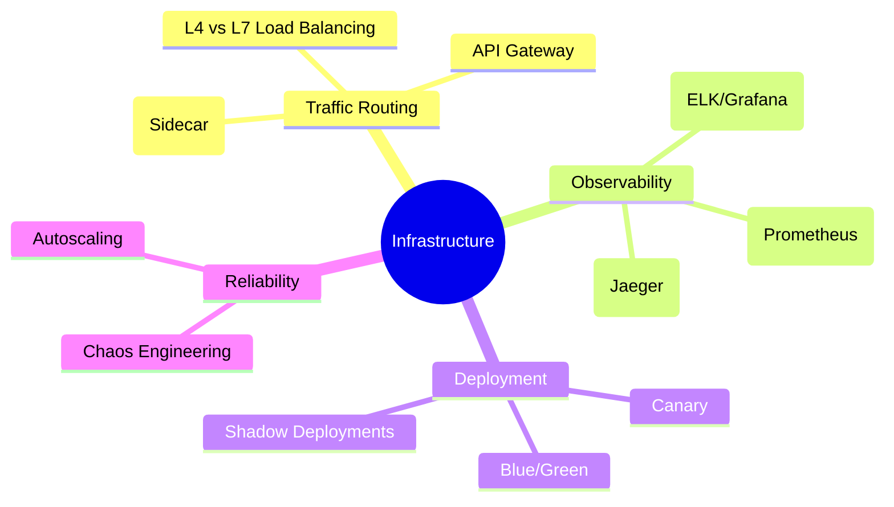

# Infrastructure, Observability & Deployment

The "Nervous System" of distributed systems. This module covers how traffic is routed, how systems are monitored, and how code is safely deployed to millions of users.

---

## 🗺️ Infrastructure Mindmap

---

## 🚦 Traffic Management: L4 vs. L7

| Feature         | L4 (Transport Layer)             | L7 (Application Layer)                  |
| :-------------- | :------------------------------- | :-------------------------------------- |
| **Level**       | TCP/UDP (IP + Port)              | HTTP/HTTPS/gRPC (URL, Headers, Cookies) |
| **Visibility**  | Fast, but "blind" to payload.    | Inspects headers/paths (Smart routing). |
| **Termination** | Passes connection through.       | Terminates TLS (SSL Offloading).        |
| **Best For**    | High-throughput, simple routing. | Microservices, A/B testing, JWT Auth.   |

---

## 🏛️ API Gateway vs. Service Mesh

### 1. API Gateway (North-South Traffic)

- **Role:** The entry point for external clients.
- **Functions:** Rate limiting, Auth, Protocol Translation (REST to gRPC), SSL termination.
- **Examples:** Kong, Apigee, AWS API Gateway.

### 2. Service Mesh (East-West Traffic)

- **Role:** Managing communication _between_ internal microservices.
- **Architecture:** Uses a **Sidecar Proxy** (e.g., Envoy) next to every service.
- **Functions:** mTLS, Circuit Breaking, Service Discovery, Retries.
- **Examples:** Istio, Linkerd.

---

## 👁️ The 3 Pillars of Observability

| Pillar      | Focus                                 | Tooling                           |
| :---------- | :------------------------------------ | :-------------------------------- |
| **Metrics** | "Is the system up?" (Aggregation).    | Prometheus, Grafana, Datadog.     |
| **Logs**    | "What happened?" (Events).            | ELK Stack (Elastic), Splunk.      |
| **Tracing** | "Where is the bottleneck?" (Context). | Jaeger, Honeycomb, OpenTelemetry. |

> **The "Staff" Insight:** Metrics tell you _that_ there is a problem. Logs tell you _what_ the problem is. Tracing tells you _where_ it is in a complex microservice chain (solving the p99 tail latency problem).

---

## 🚀 Deployment Strategies

1. **Blue/Green:** Two identical environments. Switch 100% of traffic from "Blue" to "Green." **Pros:** Zero-downtime, instant rollback. **Cons:** Doubles infra costs.
2. **Canary:** Release to 5% of users first. Monitor metrics. If healthy, rollout to 100%. **Pros:** Limits blast radius.
3. **Shadow (Dark Launch):** Mirror production traffic to a new service version without sending the results to users. **Pros:** Tests performance and logic against real-world load without risk.

---

## 🌍 CDN Internals: How the Global Edge Works

A CDN isn't just "servers in different cities." It relies on advanced network routing.

### 1. Anycast Routing (The Secret Sauce)

Normally, an IP address belongs to one machine (Unicast). With **Anycast**, the _same IP_ is broadcasted from hundreds of data centers worldwide.

- **The Magic:** When you request `cdn.com`, the global BGP (Border Gateway Protocol) automatically routes your packets to the **geographically closest** data center.

### 2. Edge Logic: Workers & Compute

Modern CDNs (Cloudflare, Akamai) allow you to run code at the edge.

- **Use Case:** A/B testing, JWT verification, and **Image Transformation** (resizing images on the fly based on the User-Agent) without ever hitting the origin server.

---

## 🔥 Senior/Staff Level "Grill" Questions

### Q1: Why does a "Service Mesh" introduce latency, and how do we justify it?

> **Answer:** Every request now has two extra "hops" (Client Sidecar → Server Sidecar). This adds ~1-5ms per call.
>
> - **The Justification:** It offloads "Common Concerns" (Retries, mTLS, Observability) from the application code. Developers focus on business logic while the infrastructure handles reliability. For a system with 500+ services, the visibility gain outweighs the latency cost.

### Q2: What is "Context Propagation" in Distributed Tracing?

> **Answer:** It's the process of passing a unique `trace_id` through every service in a request chain via HTTP headers (e.g., `X-Trace-Id`).
>
> - **The Challenge:** If one service in the middle doesn't forward the header, the trace "breaks," and you lose visibility into the downstream calls.

### Q3: Explain "Fat Clients" vs. "Sidecars" for Service Discovery.

> **Answer:**
>
> - **Fat Clients (Netflix Eureka/Hystrix):** The discovery logic is a library inside the app. **Pro:** High performance. **Con:** Hard to maintain across multiple languages (Polyglot).
> - **Sidecar (Istio/Envoy):** The logic is in a separate process. **Pro:** Language agnostic. **Con:** Slight latency and higher memory overhead.

### Q4: How do you perform a "DB Migration" during a Blue/Green deployment?

> **Answer:** This is the hardest part. You must ensure the DB is compatible with both versions.
>
> - **The Strategy:** **Expand and Contract.**
>   1. **Expand:** Add the new column/table.
>   2. **Dual Write:** The app writes to both old and new columns.
>   3. **Migrate:** Backfill old data to new columns.
>   4. **Switch:** Switch the app to read from the new columns.
>   5. **Contract:** Delete the old columns.
