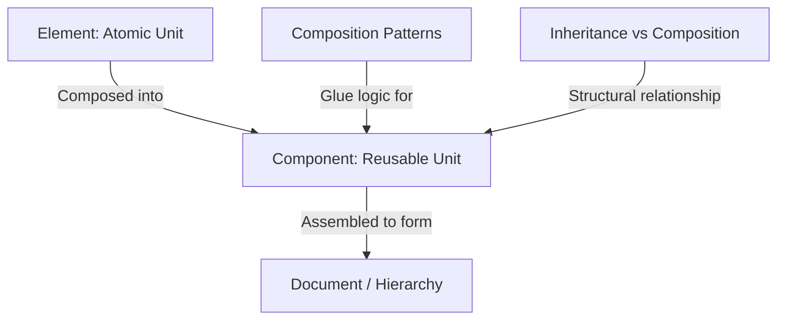
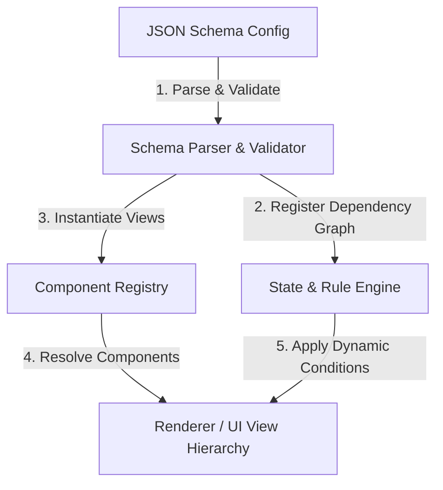

# Low-Level Design (LLD) & Object-Oriented Design (OOD) Laboratory

Low-Level Design (LLD) is the process of translating high-level system requirements into clean, modular, extensible, and performant code. While High-Level Design (HLD) focuses on services, databases, and network boundaries, LLD focuses on classes, interfaces, object interaction, concurrency primitives, and design patterns.

---

## 🏗️ The Core Building Blocks of Software Design

Before exploring the learning roadmap, you must master the fundamental vocabulary of structural software design. These concepts apply across both backend systems and frontend component architectures:



### 1. Element

An **Element** is the most atomic, immutable building block in a system.

- **In UI Frameworks (e.g., React):** An element is a plain JavaScript object describing a DOM node or a component instance. It has no lifecycle, is extremely cheap to create, and is destroyed/recreated on every render.
- **In Systems/OOP:** An element is a primitive unit—a single function, a data structure, or an individual value type (e.g., a coordinate class, an enum).
- **Key Characteristic:** Elements are stateless blueprints. They describe _what_ should exist, not _how_ it behaves over time.

### 2. Component

A **Component** is a self-contained, reusable module that encapsulates structure, behavior, and state.

- **In UI Frameworks:** A component is a function or class that accepts inputs (props), maintains internal state, manages a lifecycle (mount, update, unmount), and returns elements.
- **In Systems/OOP:** A component is a package, service, class hierarchy, or library module (e.g., a `PaymentProcessor`, a `DatabaseConnector`).
- **Key Characteristic:** Components have lifecycles, hold state, and expose APIs. They are the active agents in your system.

### 3. Document

A **Document** represents the structured representation or schema of a complete view or dataset.

- **Examples:** The HTML DOM tree, a JSON configuration file, a markdown AST (Abstract Syntax Tree), or a database document.
- **In LLD:** Designing how documents are parsed, represented in memory, and transformed is a key challenge (e.g., using the _Composite_ or _Interpreter_ patterns).

### 4. Component Composition

Component Composition is the act of combining smaller, simple components/elements to build complex systems.

- **The Core Rule:** _Favor Composition over Inheritance._
  - **Inheritance (`is-a`):** Rigid. If `class SmartPhone` extends `class Camera`, any change in `Camera` can break `SmartPhone` (the Fragile Base Class problem).
  - **Composition (`has-a`):** Flexible. `class SmartPhone` has a reference to a `Camera` interface. The implementation can be swapped at runtime.
- **Composition Paradigms:**
  - **Delegation:** Passing a task from one object to a helper object.
  - **Wrapper / Decorator:** Adding behavior to an existing component by wrapping it in another.
  - **Dependency Injection (DI):** Passing a component's dependencies through its constructor or setter, allowing loose coupling and easy unit testing.

### 5. Config-Driven UI (CDUI) / Server-Driven UI (Dynamic UI)

**Config-Driven UI** (also frequently referred to as **Server-Driven UI (SDUI)** or **Dynamic UI**) is an architectural low-level design pattern where the user interface's layout, component tree structure, styling, actions, and validation rules are computed dynamically by a backend API and served as metadata (typically a JSON schema), rather than being hardcoded inside the client application bundle.

#### 🔄 "Dynamic UI" & Hyper-Personalization

When a system is built using Dynamic UI, the **exact same website or native application** can render in completely different ways for different users, depending on runtime contexts evaluated by the server:

- **Role-Based Layouts:** A manager sees a dashboard composed of analytical charts, approval lists, and configuration widgets, whereas a field employee sees a simplified checklist and camera scanning interface.
- **Geographic Personalization:** A user logging in from Brazil is served a payment layout centered around Pix transfer components, while a user in Germany sees an IBAN input, and a US user sees a credit card and Apple Pay layout.
- **Experimentation / A/B Testing:** The server resolves that User A is in cohort `checkout_redesign_v2` and serves a JSON config with a compact single-page layout. User B is in the control group and is served the traditional multi-step layout. Neither client needs code logic for the split.
- **Risk & Compliance Adaptability:** If a user triggers a fraud warning at runtime, the backend can instantly swap the next screen config to inject an additional verification input field (e.g. dynamic biometric or SMS input element) before they proceed, without modifying app code.

#### 🎯 Critical Pain Points Solved by CDUI

CDUI is an advanced design paradigm that directly solves key engineering and business bottlenecks:

| Pain Point                        | Without CDUI (Hardcoded)                                                                                                                                     | With CDUI (Dynamic Schema)                                                                                                                                                   |
| :-------------------------------- | :----------------------------------------------------------------------------------------------------------------------------------------------------------- | :--------------------------------------------------------------------------------------------------------------------------------------------------------------------------- |
| **App Store Delivery Cycle**      | Native iOS/Android app updates require a code change, build submission, and App Store review (taking days to weeks).                                         | The UI structure is updated instantly by serving a modified JSON configuration from the backend API. No store release needed.                                                |
| **Multi-Platform Duplication**    | Logic and layouts must be independently written, tested, and maintained across Web, iOS, and Android platforms.                                              | The backend serves a single, unified JSON blueprint. All platforms build a local parser to render identical layouts from the same source of truth.                           |
| **Spaghetti Conditional Forms**   | Complex dynamic forms (e.g., _"If Country is US and Age > 18, show SSN, otherwise hide it"_) lead to deep, messy nested conditional logic inside components. | Visibility, validation, and layout rules are defined declaratively in JSON (e.g., `visibleIf: "age > 18 && country == 'US'"`). The parser engine resolves these dynamically. |
| **Engineering Bottlenecks**       | Product Managers or Marketing teams needing simple text, order of forms, or color changes require developer resources and release sprints.                   | Non-technical operators can use a CMS / admin dashboard to update the JSON schemas directly, instantly modifying the live user journeys.                                     |
| **A/B Testing & Personalization** | A/B testing variations require branching code routes, custom flags, and client-side experiment evaluations, polluting the code.                              | The backend serves custom configurations tailored directly to user segments or experiment groups dynamically, ensuring clean client code.                                    |

#### 🛠️ Low-Level Architecture of a CDUI Engine

Implementing CDUI requires a robust low-level class architecture to parse, validate, and render components safely:



#### 📄 Practical CDUI Implementation Example

Here is a real-world scenario modeling a dynamic checkout payment selector. Depending on the `payment_method` selected, the UI should conditionally show either a `Card Number` text input or an `IBAN` text input.

##### 1. The Backend-Driven JSON Schema (`checkout_schema.json`)

```json
{
  "screenId": "payment_checkout",
  "children": [
    {
      "id": "payment_method",
      "type": "Select",
      "properties": {
        "label": "Payment Method",
        "options": [
          { "label": "Credit Card", "value": "card" },
          { "label": "Bank Transfer", "value": "bank" }
        ]
      }
    },
    {
      "id": "card_number",
      "type": "TextInput",
      "properties": {
        "label": "Card Number",
        "placeholder": "XXXX XXXX XXXX XXXX",
        "secure": true
      },
      "visibleIf": "payment_method === 'card'"
    },
    {
      "id": "iban",
      "type": "TextInput",
      "properties": {
        "label": "IBAN",
        "placeholder": "DE89 XXXX XXXX XXXX XXXX XX"
      },
      "visibleIf": "payment_method === 'bank'"
    }
  ]
}
```

##### 2. The Low-Level Object-Oriented Parsing Engine (TypeScript)

```typescript
// 1. Define Component Interface
interface UIComponent {
  render(state: Record<string, any>, onUpdate: (val: any) => void): string;
}

// 2. Implement Concrete UI Components
class TextInput implements UIComponent {
  constructor(private props: any) {}

  render(state: Record<string, any>, onUpdate: (val: any) => void): string {
    const isSecure = this.props.secure ? 'password' : 'text';
    return `<div class="field">
      <label>${this.props.label}</label>
      <input type="${isSecure}" placeholder="${this.props.placeholder || ''}" onchange="event => onUpdate(event.target.value)"/>
    </div>`;
  }
}

class SelectDropdown implements UIComponent {
  constructor(private props: any) {}

  render(state: Record<string, any>, onUpdate: (val: any) => void): string {
    const optionsHtml = this.props.options.map((o: any) => `<option value="${o.value}">${o.label}</option>`).join('');
    return `<div class="field">
      <label>${this.props.label}</label>
      <select onchange="event => onUpdate(event.target.value)">${optionsHtml}</select>
    </div>`;
  }
}

// 3. Implement Registry for Component Resolution (Registry Pattern)
class ComponentRegistry {
  private static registry = new Map<string, new (props: any) => UIComponent>();

  static register(type: string, constructorFn: new (props: any) => UIComponent) {
    this.registry.set(type, constructorFn);
  }

  static resolve(type: string, props: any): UIComponent {
    const ComponentClass = this.registry.get(type);
    if (!ComponentClass) throw new Error(`UI component not registered: ${type}`);
    return new ComponentClass(props);
  }
}

// Register components on initialization
ComponentRegistry.register('TextInput', TextInput);
ComponentRegistry.register('Select', SelectDropdown);

// 4. Rule Engine for Dependency Resolution
class RuleEngine {
  static evaluateVisibility(condition: string | undefined, state: Record<string, any>): boolean {
    if (!condition) return true; // Visible by default
    try {
      // Evaluate condition safely using state variables (in production, use AST parsers)
      const keys = Object.keys(state);
      const values = Object.values(state);
      const evalFn = new Function(...keys, `return ${condition};`);
      return !!evalFn(...values);
    } catch (e) {
      console.error('Rule Engine Evaluation Error:', e);
      return false;
    }
  }
}

// 5. Orchestrating Renderer
class FormRenderer {
  private state: Record<string, any> = {};

  constructor(private schema: any) {}

  onFieldUpdate(fieldId: string, value: any) {
    this.state[fieldId] = value;
    this.render(); // Re-trigger layout resolution on state change
  }

  render(): string {
    return this.schema.children
      .filter((child: any) => RuleEngine.evaluateVisibility(child.visibleIf, this.state))
      .map((child: any) => {
        const comp = ComponentRegistry.resolve(child.type, child.properties);
        return comp.render(this.state, (val) => this.onFieldUpdate(child.id, val));
      })
      .join('\n');
  }
}
```

---

## 🗺️ The LLD Learning Roadmap

---

## 🟢 1. The Beginner (Bigi) Level

_Focus: Mastering syntax, basic Object-Oriented principles, and clean-coding fundamentals._

### Key Concepts

- **The 4 Pillars of OOP:**
  - **Encapsulation:** Hiding internal state via private fields and exposing control via public methods (getters/setters).
  - **Abstraction:** Hiding complex implementation details behind simple interfaces.
  - **Inheritance:** Reusing code by extending base classes.
  - **Polymorphism:** Allowing different classes to respond to the same message/method call in their own way (Overriding and Overloading).
- **Clean Code Basics:** Meaningful naming, small single-purpose functions, removing magic numbers/strings, and writing readable comments.
- **Basic Class Relationships:** Association, Aggregation, and Composition.
- **Unit Testing Intro:** Writing basic test cases using assertions.

### How to Learn & Practice

- **Read:** _Clean Code_ (Chapters 1–5) by Robert C. Martin.
- **Exercise:** Write a program and force yourself to keep functions under 15 lines and classes under 150 lines.
- **Tools:** Configure a linter and formatter (e.g., Prettier, ESLint, or your IDE's auto-format rules).

### Implementation Projects

1.  **Parking Lot (Basic):** Model a parking lot with spots for motorcycles, cars, and buses. Keep track of occupied spots.
2.  **Library Management System:** Model books, members, librarians, and basic borrowing operations.
3.  **Tic-Tac-Toe Console Game:** Model the board, players, and win-checking logic using strict OOP principles.

---

## 🟡 2. The Mid-level

_Focus: Writing extensible, maintainable, and testable code using SOLID principles and Design Patterns._

### Key Concepts

- **SOLID Principles:**
  - **SRP (Single Responsibility):** A class should have one, and only one, reason to change.
  - **OCP (Open/Closed):** Software entities should be open for extension, but closed for modification.
  - **LSP (Liskov Substitution):** Subtypes must be substitutable for their base types without altering correctness.
  - **ISP (Interface Segregation):** Clients should not be forced to depend on methods they do not use.
  - **DIP (Dependency Inversion):** Depend on abstractions, not concretions.
- **Gang of Four (GoF) Design Patterns:**
  - **Creational:** Singleton, Factory Method, Abstract Factory, Builder, Prototype.
  - **Structural:** Adapter, Decorator, Facade, Proxy, Composite, Flyweight.
  - **Behavioral:** Strategy, Observer, Command, Template Method, State, Chain of Responsibility.
- **Refactoring & Code Smells:** Identifying long methods, duplicate code, switch statement abuse, and applying refactoring recipes.
- **Mocking & Stubbing:** Writing unit tests with isolated external dependencies.

### How to Learn & Practice

- **Read:** _Head First Design Patterns_ (great for practical examples) or _Refactoring_ by Martin Fowler.
- **Exercise:** Pick a legacy block of code containing nested `if/else` or `switch` statements and refactor it using the **Strategy** or **State** pattern.
- **Study:** Study how standard libraries use patterns (e.g., Java's `InputStream` decorator pattern, JavaScript's event listener observer pattern).

### Implementation Projects

1.  **Vending Machine:** Implement a vending machine state machine (Idle, HasMoney, Dispensing, OutOfStock) using the **State Pattern**.
2.  **Splitwise (Basic Expense Sharing):** Design classes for Users, Groups, and Expenses (Equal, Exact, Percent) using the **Strategy Pattern**.
3.  **Movie Ticket Booking System:** Design the booking flow, seat configurations, and pricing engines.

---

## 🟠 3. The Senior Level

_Focus: Designing for high concurrency, robust API contracts, domain boundaries, and runtime performance._

### Key Concepts

- **Low-Level Concurrency:**
  - **Thread Safety:** Race conditions, critical sections, and mutual exclusion.
  - **Synchronization Primitives:** Mutexes, semaphores, read-write locks, condition variables.
  - **Concurrency Patterns:** Producer-Consumer, Thread Pool, Future/Promise, Active Object.
- **Domain-Driven Design (DDD) at the Code Level:**
  - **Entities:** Objects with a distinct identity that persists over time.
  - **Value Objects:** Immutable objects defined solely by their attributes (e.g., `Money(amount, currency)`).
  - **Aggregates:** A cluster of associated objects treated as a single unit for data changes, controlled by an Aggregate Root.
  - **Repositories & Domain Events:** Decoupling persistence and publishing changes.
- **Advanced API & Library Design:**
  - Fluent interfaces and API versioning/compatibility.
  - Graceful error handling (Exceptions vs. functional `Result` / `Either` types).
- **Performance & Memory Allocation:**
  - Object pooling (reusing objects to reduce Garbage Collection pressure).
  - Data Locality & CPU Cache-friendly layouts (structs vs. classes in memory).

### How to Learn & Practice

- **Read:** _Effective Java_ (Joshua Bloch), _Domain-Driven Design_ (Eric Evans), or language-specific concurrency manuals.
- **Exercise:** Write a highly concurrent program and run thread-sanitizers to detect race conditions.
- **Study:** Look at the source code of production-grade libraries (e.g., the internals of Redux, Spring Container, or a Web Server router).

### Implementation Projects

1.  **In-Memory Cache Library:** Design a thread-safe cache with eviction policies (LRU, LFU, TTL) supporting concurrent reads and writes without global locks.
2.  **Distributed Message Queue (Local Internals):** Model topics, partitions, producers, and consumers with offsets, ensuring correct concurrent access.
3.  **Log Aggregator Framework:** Design an extensible logging framework that asynchronously flushes logs to console, file, and network endpoints using a thread-safe ring buffer.
4.  **Config-Driven Form Engine:** Model a schema parser, dependency resolver (conditions like `visibleIf`), validation engine, and component renderer for custom forms defined by a dynamic JSON structure.

---

## 🟣 4. The Staff Level

_Focus: Setting architectural standards, lock-free engine design, metamodeling, and runtime environments._

### Key Concepts

- **Lock-Free & Wait-Free Algorithms:**
  - **CAS (Compare-And-Swap) operations:** Using atomic CPU primitives instead of OS-level locks.
  - **Memory Models & Fences:** Instruction reordering, volatile reads/writes, and happens-before guarantees.
  - **High-Throughput Ring Buffers:** E.g., LMAX Disruptor pattern.
- **Domain Metamodeling & DSLs (Domain-Specific Languages):**
  - Designing lexers, parsers, and custom expression evaluators for complex business rules.
  - Rules Engines (e.g., modeling a generic rule system that users can configure dynamically).
- **Dynamic Plugin & SPI Architectures:**
  - Dynamic class loading, reflection vs. code-generation (source generators).
  - Sandboxing third-party plugins, dependency isolation, and hot-reloading.
- **LLD Governance:**
  - Drafting **Architecture Decision Records (ADRs)** and RFCs for low-level library updates.
  - Defining automated static analysis rules (e.g., ArchUnit) to enforce package structure boundaries.

### How to Learn & Practice

- **Read:** _Enterprise Integration Patterns_ (Gregor Hohpe) and studies on lock-free structures (e.g., Maurice Herlihy's _The Art of Multiprocessor Programming_).
- **Exercise:** Build a high-throughput queue using CAS (Compare-And-Swap) and benchmark it against synchronized locks.
- **Study:** Read the source code of high-performance libraries like Netty, LMAX Disruptor, or Go's Scheduler.

### Implementation Projects

1.  **Custom DSL Rules Engine:** Design a text-based rules parser (e.g., `IF user.age > 18 AND user.country == 'US' THEN ALLOW`) that compiles into executable AST nodes.
2.  **Lock-Free Concurrent Queue:** Write a lock-free queue using CAS, and verify its correctness under high thread contention.
3.  **Plugin-Driven Extensible Web Gateway:** Design a gateway where routing, logging, and rate-limiting modules are dynamically loaded, isolated, and updated at runtime.

---

## 🎯 Senior/Staff Level "Grill" Questions: LLD Nuances

When evaluating LLD at senior and staff levels, focus switches from _"Do you know the pattern?"_ to _"Do you understand the memory, concurrency, and maintenance costs of this abstraction?"_

### Q1: Why is Singleton often considered an anti-pattern, and what is the modern alternative?

> **Answer:** Singleton creates tight coupling, introduces global state (making concurrent testing extremely difficult), and violates the Single Responsibility Principle (it manages its own lifecycle _and_ its core business logic).
>
> **Staff Alternative:** Use **Dependency Injection (DI)** frameworks to manage lifecycles. Let the container control the "Single Instance" scope while keeping the class itself simple, clean, and instantiable for testing.

### Q2: What is the "Fragile Base Class" problem in inheritance, and how does composition solve it?

> **Answer:** In inheritance, a subclass is tightly coupled to the implementation details of its parent. If the parent class changes a method or its call order, the subclass might break silently.
>
> **Staff Alternative:** Use **Interfaces** and **Delegation**. By relying on interfaces, you depend on a strict contract instead of implementation details. Composition allows you to swap behaviors dynamically at runtime.

### Q3: Explain how CPU L1/L2/L3 cache lines affect the performance of your Object-Oriented layouts.

> **Answer:** Modern CPUs fetch memory in cache lines (typically 64 bytes).
>
> - If you store objects in a contiguous array (e.g., flat structures, primitives), fetching one element loads adjacent elements into the cache, speeding up sequential processing (data-oriented design).
> - If you use reference-heavy object graphs (e.g., linked structures), the CPU suffers frequent cache misses because references point to random heap locations.
> - **Staff Tip:** For high-throughput systems, keep active data flat and avoid deep pointer chasing.
