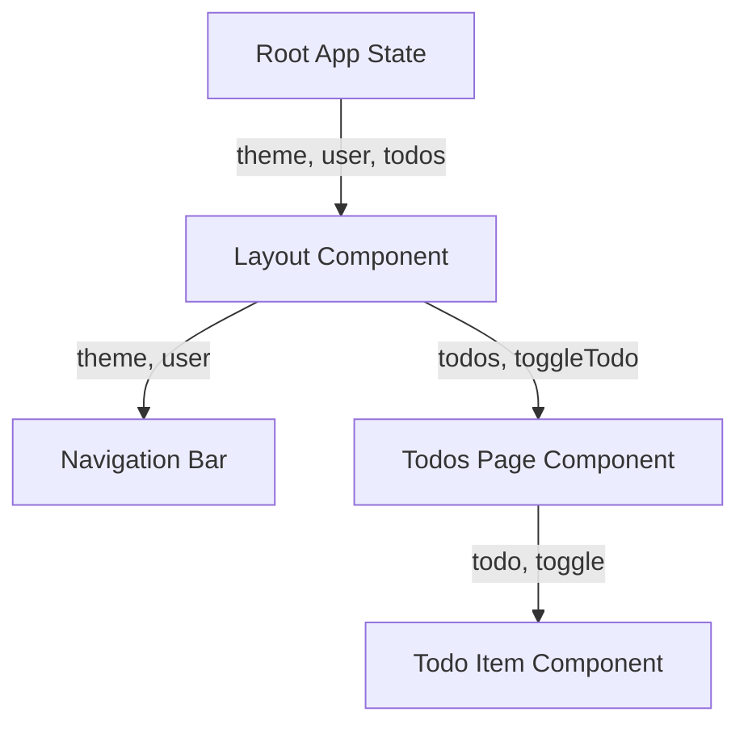

# 1. Prop Drilling Engine

## Concept & Working
Prop drilling (or threading props) is a natural React pattern where data is passed from a parent component down through intermediate components to a target child component that needs it.

In this strategy:
- The state resides at the root layout/orchestrator component using React `useState`.
- Actions are passed down as callback functions (`setTheme`, `login`, etc.).
- There is no central global store or context container; every component in the chain must explicitly declare and pass these props.

## How it is Wired
```tsx
// Root Component
const state = usePropDrillingState();
return (
  <Layout theme={state.theme} setTheme={state.setTheme}>
    <Routes>
      <Route path="/todos" element={<Todos todos={state.todos} toggleTodo={state.toggleTodo} />} />
    </Routes>
  </Layout>
)
```

## Data Flow Diagram


## Advantages & Trade-offs
- **Advantages**: No dependencies, complete type safety out of the box, easy debugging (state can be traced directly up the DOM tree).
- **Disadvantages**: Heavy boilerplate, highly coupled components, components in the middle are forced to accept and forward props they don't consume, causing unnecessary re-renders.
