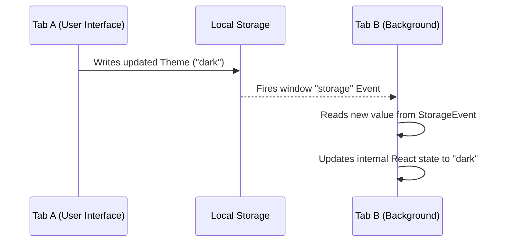

# 2. LocalStorage Persistence Engine

## Concept & Working
The LocalStorage Engine leverages the web browser's synchronous key-value store to persist state across page reloads and browser sessions.

To ensure consistency, this engine also implements a synchronization listener:
- Reads and parses JSON values from `localStorage` upon initial hook loading.
- Automatically writes stringified updates to `localStorage` key targets when states are modified.
- Registers a `storage` event listener on `window`. When state changes in **Tab A**, **Tab B** receives a trigger callback and dynamically syncs its active React state.

## How it is Wired
```tsx
const [theme, setThemeState] = useState<Theme>(() => 
  JSON.parse(localStorage.getItem("lld_theme") || '"light"')
);

const setTheme = (newTheme: Theme) => {
  setThemeState(newTheme);
  localStorage.setItem("lld_theme", JSON.stringify(newTheme));
};
```

## Cross-Tab Synchronization Flow


## Advantages & Trade-offs
- **Advantages**: Persistent across browser sessions, basic offline capabilities, native browser API, cross-tab state synchronization out of the box.
- **Disadvantages**: Reading and writing are synchronous operations that block the main JavaScript thread, storage size is capped at 5MB, security concerns (not suitable for sensitive security tokens like plain text passwords).
