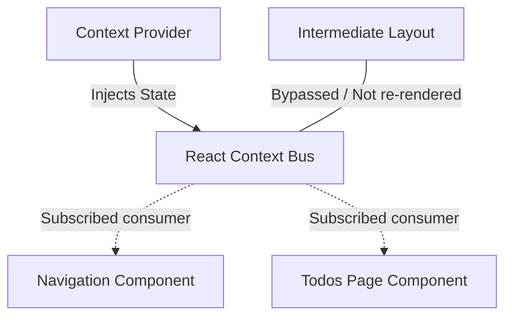

# 3. Context API Engine

## Concept & Working
The Context API is a built-in React dependency injection framework designed to pass global state down through the component tree without manually threading props at every level.

How it works:
- `<ContextProvider>` wraps the application and exposes a unified provider value context.
- Components use `useContext(AppStateContext)` to subscribe to changes.
- Avoids the need for intermediate forwarding components, decoupling the structural routing layout from individual consumers.

## How it is Wired
```tsx
// Provider Configuration
export const ContextProvider: React.FC = ({ children }) => {
  const [theme, setTheme] = useState<Theme>("light");
  return (
    <AppStateContext.Provider value={{ theme, setTheme }}>
      {children}
    </AppStateContext.Provider>
  );
};

// Consumer Component
const { theme, setTheme } = useContextApiState();
```

## Data Propagation Diagram


## Advantages & Trade-offs
- **Advantages**: Standard React feature (no external size weight), eliminates prop-drilling, simplifies nested child component consumption.
- **Disadvantages**: Lack of fine-grained selectors. Any change to any value in the context forces **all** subscribing components to re-render, which can lead to performance bottlenecks in complex trees (can be mitigated by splitting contexts or memoization).
