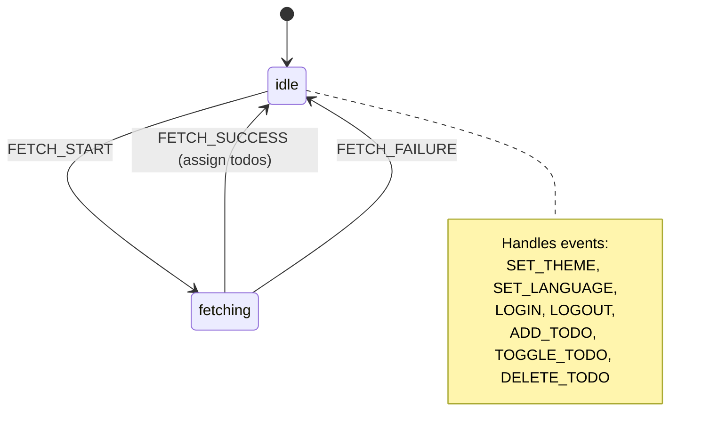

# 4. XState Finite State Machine Engine

## Concept & Working
XState implements the **Finite State Machine (FSM)** and Statecharts model. Unlike traditional stores which allow arbitrary variable modifications, state machines enforce strict control boundaries:
- The system can only exist in one of a finite set of **States** (`idle` or `fetching`).
- Transitions between states occur exclusively in response to explicit **Events** (`FETCH_START`, `FETCH_SUCCESS`, `FETCH_FAILURE`).
- Context holds quantitative state values, modified via declarative `assign` actions.

## How it is Wired
```tsx
const appMachine = createMachine({
  id: "app",
  initial: "idle",
  context: { ... },
  states: {
    idle: {
      on: {
        FETCH_START: { target: "fetching", actions: assign({ isLoadingTodos: true }) }
      }
    },
    fetching: {
      on: {
        FETCH_SUCCESS: { target: "idle", actions: assign({ todos: event => event.todos }) }
      }
    }
  }
});

// React Connection
const [state, send] = useMachine(appMachine);
```

## State Transition Diagram


## Advantages & Trade-offs
- **Advantages**: Elimination of illegal states, mathematically provable execution paths, excellent visualization tools, clear division of behavioral transitions from display rendering.
- **Disadvantages**: Steep conceptual learning curve, high amount of declarative boilerplate code, heavier runtime library footprint.
