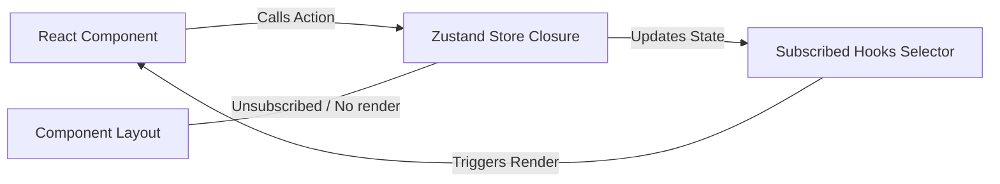

# 5. Zustand Engine

## Concept & Working
Zustand is an atomic and minimalistic state management library based on simplified Flux principles. It maintains a central store inside a closure, outside the React render cycle, and updates reactively:
- Uses a simple functional `set` method to merge state changes.
- Automatically handles hook subscriptions. When state changes, only components selecting the modified keys will re-render.
- Does not require enclosing `<Provider>` tags at the top level of the app, making it extremely lightweight to initialize.

## How it is Wired
```tsx
// Store definition
export const useZustandStore = create<AppState>((set) => ({
  theme: "light",
  setTheme: (theme) => set({ theme }),
}));

// Component Hook usage
const theme = useZustandStore((state) => state.theme);
const setTheme = useZustandStore((state) => state.setTheme);
```

## Architecture and Data Flow


## Advantages & Trade-offs
- **Advantages**: Very small footprint, zero boilerplate code, fine-grained selector subscription checks to prevent unnecessary re-renders, does not pollute the virtual DOM tree with provider wrapper tags.
- **Disadvantages**: Lacks standard structure defaults, easy to write messy stores if there is no internal schema enforcement, does not include extensive ecosystem tools like Redux (middleware must be manually set up).
