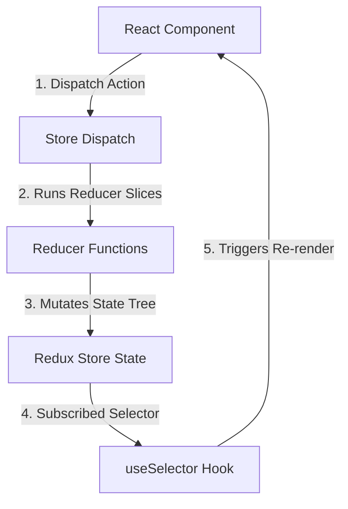

# 6. Redux Toolkit Engine

## Concept & Working
Redux Toolkit (RTK) is the standard library for writing Redux logic. It implements the classic **unidirectional data flow** architecture, keeping state read-only and dispatching actions to describe mutations.

How it works:
- **Slice**: Bundles initial state, action creators, and reducers together (using Immer internally for safe mutable-like mutations).
- **Store**: The centralized state container which holds the state tree.
- **Dispatch**: Sends action objects (`{ type, payload }`) to the store.
- **Reducers**: Pure functions that accept current state + action, and calculate the next state.
- **Selectors**: Retrieve values from the state tree and trigger component renders on value change.

## How it is Wired
```tsx
// Slice Definition
const appSlice = createSlice({
  name: "app",
  initialState,
  reducers: {
    setTheme(state, action) {
      state.theme = action.payload; // Safe mutation via Immer
    }
  }
});

// React Provider connection
import { Provider } from "react-redux";
<Provider store={reduxStore}>
  <App />
</Provider>
```

## Unidirectional Data Flow Diagram


## Advantages & Trade-offs
- **Advantages**: Unidirectional data flow makes state extremely predictable, easy debugging with Redux DevTools (time-travel debugging), highly structured configuration, rich middleware ecosystem.
- **Disadvantages**: Still relatively heavy boilerplate compared to Zustand, complex setup with slices/thunks/middleware, requires wrapping the application tree in a context `<Provider>`.
