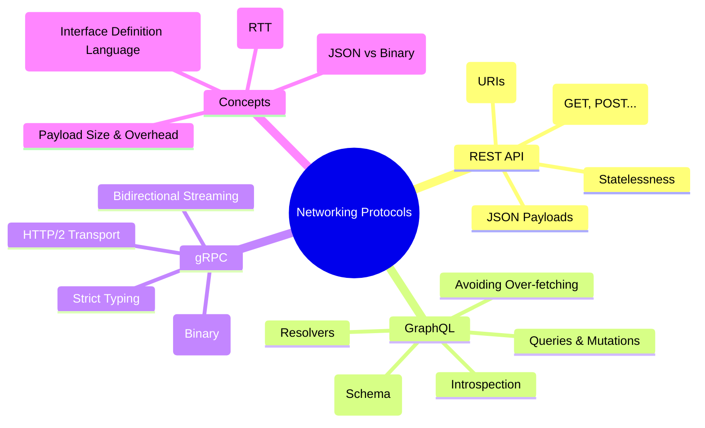

# Networking: API Architectural Styles

Modern applications rely on different architectural styles for service-to-service and client-to-server communication. This module explores the three most prominent patterns: REST, GraphQL, and gRPC.

---

## 🗺️ Networking Landscape

---

## 🛠️ Implemented Styles

### 1. [REST API](./RestAPI/)

The traditional resource-based approach using standard HTTP methods. Ideal for public APIs and simple CRUD operations.

### 2. [GraphQL](./Graphql/)

A query language for your API that gives clients the power to ask for exactly what they need and nothing more.

### 3. [gRPC](./gRPC/)

A high-performance, open-source universal RPC framework that uses Protocol Buffers and HTTP/2 for efficient microservices communication.

---

## 📊 Technical Comparison

| Feature         | REST               | GraphQL         | gRPC              |
| :-------------- | :----------------- | :-------------- | :---------------- |
| **Protocol**    | HTTP/1.1 or 2      | HTTP/1.1 or 2   | HTTP/2 Only       |
| **Payload**     | JSON (Text)        | JSON (Text)     | Protobuf (Binary) |
| **Contract**    | Optional (OpenAPI) | Mandatory (SDL) | Mandatory (Proto) |
| **Coupling**    | Loosely Coupled    | Client-Driven   | Tightly Coupled   |
| **Performance** | Medium             | Variable        | High              |
