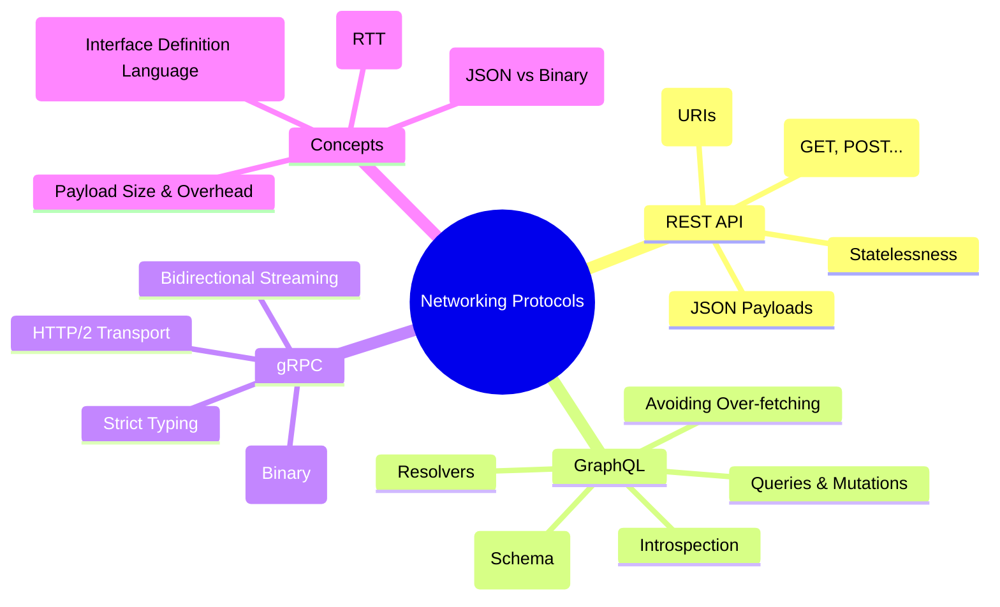

# Networking: API Architectural Styles

Modern applications rely on different architectural styles for service-to-service and client-to-server communication. This module explores the three most prominent patterns: REST, GraphQL, and gRPC.

---

## 🗺️ Networking Landscape

---

## 🛠️ Implemented Styles

### 1. [REST API](./RestAPI/)

The traditional resource-based approach using standard HTTP methods. Ideal for public APIs and simple CRUD operations.

### 2. [GraphQL](./Graphql/)

A query language for your API that gives clients the power to ask for exactly what they need and nothing more.

### 3. [gRPC](./gRPC/)

A high-performance, open-source universal RPC framework that uses Protocol Buffers and HTTP/2 for efficient microservices communication.

---

## 🏛️ Architect's Decision Matrix: Choosing Your Style

Choosing a networking style isn't about "which is better," but "which trade-offs are we willing to accept for our specific constraints."

| Constraint      | Use REST if...                                        | Use GraphQL if...                                         | Use gRPC if...                                             |
| :-------------- | :---------------------------------------------------- | :-------------------------------------------------------- | :--------------------------------------------------------- |
| **User Base**   | Public/Third-party developers (Industry Standard).    | Frontend-heavy apps with complex, nested data needs.      | Internal microservices or high-throughput systems.         |
| **Performance** | Performance is "good enough" and caching is critical. | You want to minimize round-trips for the mobile client.   | Every millisecond counts (Binary serialization + HTTP/2).  |
| **Contract**    | You want flexibility and "human-readable" debugging.  | You need a strict, self-documenting schema for frontends. | You want code-generated, type-safe stubs across languages. |
| **Caching**     | You need robust, easy-to-implement HTTP/CDN caching.  | Application-level caching is acceptable (Complex).        | Caching is handled at the service layer (Not at the edge). |

---

## 🔥 The Unified Networking "Grill"

### Q1: What are the "8 Fallacies of Distributed Computing" and which one hurts APIs the most?

> **Answer:** The most dangerous fallacy is **"Latency is zero."**
>
> - **The Impact:** Architects often design "Chatty" APIs (REST) that require multiple round-trips. This kills mobile performance.
> - **The Solution:** Use GraphQL for orchestration to aggregate data, or gRPC with streaming for high-volume data transfer.

### Q2: API Gateway vs. Service Mesh: Where does the networking logic live?

> **Answer:**
>
> - **API Gateway:** Handles "North-South" traffic (External client to Internal services). Focuses on Auth, Rate Limiting, and Protocol Translation (e.g., REST to gRPC).
> - **Service Mesh (e.g., Istio):** Handles "East-West" traffic (Service to Service). Focuses on Retries, Circuit Breaking, and Mutual TLS (mTLS) without the application knowing.

### Q3: How do you handle "The Fallback Strategy" when a protocol isn't supported?

> **Answer:**
>
> - **gRPC to REST:** Use **gRPC-Gateway** to automatically generate a RESTful JSON API from your gRPC service.
> - **GraphQL to REST:** Use GraphQL as an **Orchestration Layer** that wraps existing legacy REST services, providing a modern interface without rewriting the backend.

### Q4: Why is HTTP/2 "Head-of-Line Blocking" still a thing if we have Multiplexing?

> **Answer:** HTTP/2 solves HOL blocking at the **Application Layer** (logical streams). However, at the **Transport Layer** (TCP), if one packet is lost, all streams are blocked until it's retransmitted.
>
> - **The Evolution:** This is why we are moving to **HTTP/3 (QUIC)**, which uses UDP to eliminate TCP-level HOL blocking.
