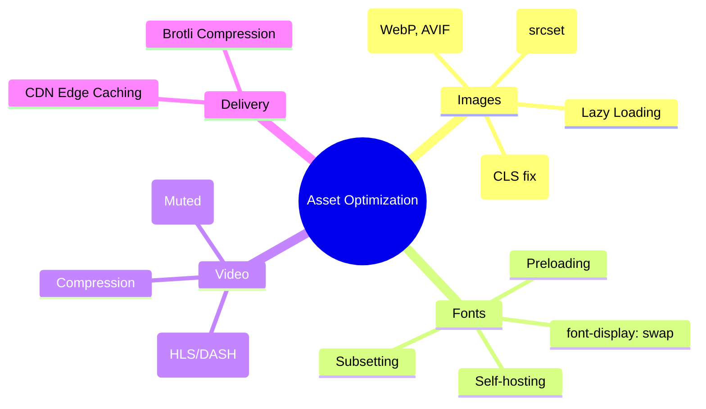

# Asset Optimization: Images, Fonts, and Media

Assets typically account for over 80% of a website's total byte weight. Optimizing them is the fastest way to improve **LCP** and **CLS**.

---

## 🗺️ Asset Optimization Mindmap



---

## 🖼️ Image Optimization

### 1. Modern Formats

Use **WebP** or **AVIF** instead of PNG/JPG. AVIF often provides 50% better compression than JPEG at the same quality.

#### 🛠️ Modern Image Formats: The Technical Difference

WebP and AVIF achieve higher efficiency without reducing resolution by using more advanced mathematics to eliminate **redundancy**:

| Feature                | JPEG                                           | WebP (VP8 based)                                   | AVIF (AV1 based)                                                                   |
| :--------------------- | :--------------------------------------------- | :------------------------------------------------- | :--------------------------------------------------------------------------------- |
| **Block Partitioning** | Rigid 8x8 blocks. Causes "blocking" artifacts. | 16x16 macroblocks. Better for flat areas.          | **Recursive "Superblocks"** (up to 128x128). Can split into non-square shapes.     |
| **Intra-Prediction**   | None (only predicts the average/DC color).     | 4-10 modes to predict pixel values from neighbors. | **56+ modes**. Includes "Chroma-from-Luma" (predicts color from brightness).       |
| **Entropy Coding**     | Huffman Coding (integer-length codes).         | Boolean Arithmetic Coding (fractional bits).       | **Multi-symbol Arithmetic Coding**. Reaches the mathematical limit of compression. |
| **Transformation**     | Discrete Cosine Transform (DCT) only.          | DCT or Walsh-Hadamard Transform.                   | DCT, ADST, Identity, and Flip transforms for better edge handling.                 |

**Summary:** While JPEG stores the "raw" differences in 8x8 chunks, AVIF "describes" the image using complex geometric predictions and high-efficiency math, allowing it to reconstruct the same resolution with 50-70% less data.

#### 🧠 Staff-Level Interview "Grill" Questions

**Q: If AVIF is 50% smaller than JPEG, why don't we use it for 100% of our images?**

> **Answer (The Decoding Cost):** Compression is a trade-off between **Network (IO)** and **CPU**. AVIF takes significantly more CPU power to decode (up to 10x more than WebP). On low-end mobile devices, decoding 20 large AVIF images simultaneously can cause "UI jank" and drain battery faster than the radio savings from the smaller file size.

**Q: How do WebP/AVIF handle "Progressive Loading" compared to JPEG?**

> **Answer:** They don't. Progressive JPEG allows an image to show a blurry version almost instantly. WebP and AVIF (in current browsers) render top-to-bottom or only after the file is mostly downloaded. If the user is on a 2G connection, a Progressive JPEG might actually feel faster even if the file is larger.

**Q: When would you MUST use AVIF over WebP?**

> **Answer:** When you need **High Dynamic Range (HDR)** or **Wide Color Gamut (10-bit/12-bit color)**. WebP is limited to 8-bit color. If you are building a photography portfolio or a site with deep gradients, WebP will cause "banding" artifacts where AVIF will remain smooth.

**Q: What is the "Race to Idle" strategy in this context?**
> **Answer:** It's the trade-off between saving battery by turning off the **Radio** (smaller AVIF file) vs. saving battery by using less **CPU** (simpler JPEG/WebP decoding). The "sweet spot" is usually serving AVIF for hero images (LCP) and WebP for the rest.

**Q: How do you actually deploy this safely without breaking older browsers?**
> **Answer (The Fallback Pattern):** You use the `<picture>` tag. The browser will iterate through the `<source>` tags and download the **first** one it understands, falling back to the `` tag for IE11 or very old browsers.
> ```html
> <picture>
>   <!-- 1. Try AVIF (Best compression, HDR support) -->
>   <source srcset="image.avif" type="image/avif"> 
>   <!-- 2. Fallback to WebP (Universal modern support) -->
>   <source srcset="image.webp" type="image/webp"> 
>   <!-- 3. Final Fallback (Progressive JPEG for UX/Legacy) -->
>   
> </picture>
> ```

### 2. Responsive Images (`srcset`)

Don't serve a 4000px image to a mobile phone.

```html

```

### 3. Visual Stability (CLS Fix)

Always provide `width` and `height` attributes to reserve space before the image loads.

```css
img {
  aspect-ratio: 16 / 9;
  width: 100%;
  height: auto;
}
```

---

## 🔤 Font Optimization

### 1. The `font-display` Property

Prevent "Flash of Invisible Text" (FOIT) by using `swap`.

```css
@font-face {
  font-family: 'MyFont';
  src: url('font.woff2') format('woff2');
  font-display: swap;
}
```

### 2. Preloading Critical Fonts

Tell the browser to fetch the font early in the lifecycle.

```html
<link rel="preload" href="font.woff2" as="font" type="font/woff2" crossorigin />
```

---

## 🧠 Staff Level Interview Question

**Q: What is the difference between "Lazy Loading" and "Priority Hints"?**

> **Answer:**
>
> - **Lazy Loading (`loading="lazy"`)** tells the browser _not_ to load a resource until it's close to the viewport. This saves bandwidth but can hurt LCP if applied to the main image.
> - **Priority Hints (`fetchpriority="high"`)** tells the browser that a resource is extremely important (like the LCP hero image) and should be fetched _immediately_, even if the browser's heuristics suggest otherwise.
> - **Rule of Thumb:** Lazy load everything below the fold; use high priority for the LCP image above the fold.
