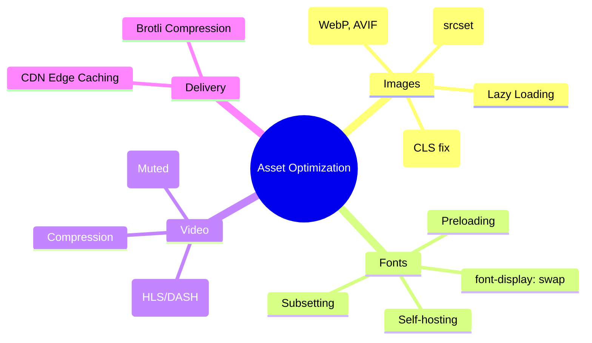

# Asset Optimization: Images, Fonts, and Media

Assets typically account for over 80% of a website's total byte weight. Optimizing them is the fastest way to improve **LCP** and **CLS**.

---

## 🗺️ Asset Optimization Mindmap



---

## 🖼️ Image Optimization

### 1. Modern Formats

Use **WebP** or **AVIF** instead of PNG/JPG. AVIF often provides 50% better compression than JPEG at the same quality.

### 2. Responsive Images (`srcset`)

Don't serve a 4000px image to a mobile phone.

```html

```

### 3. Visual Stability (CLS Fix)

Always provide `width` and `height` attributes to reserve space before the image loads.

```css
img {
  aspect-ratio: 16 / 9;
  width: 100%;
  height: auto;
}
```

---

## 🔤 Font Optimization

### 1. The `font-display` Property

Prevent "Flash of Invisible Text" (FOIT) by using `swap`.

```css
@font-face {
  font-family: 'MyFont';
  src: url('font.woff2') format('woff2');
  font-display: swap;
}
```

### 2. Preloading Critical Fonts

Tell the browser to fetch the font early in the lifecycle.

```html
<link rel="preload" href="font.woff2" as="font" type="font/woff2" crossorigin />
```

---

## 🧠 Staff Level Interview Question

**Q: What is the difference between "Lazy Loading" and "Priority Hints"?**

> **Answer:**
>
> - **Lazy Loading (`loading="lazy"`)** tells the browser _not_ to load a resource until it's close to the viewport. This saves bandwidth but can hurt LCP if applied to the main image.
> - **Priority Hints (`fetchpriority="high"`)** tells the browser that a resource is extremely important (like the LCP hero image) and should be fetched _immediately_, even if the browser's heuristics suggest otherwise.
> - **Rule of Thumb:** Lazy load everything below the fold; use high priority for the LCP image above the fold.
