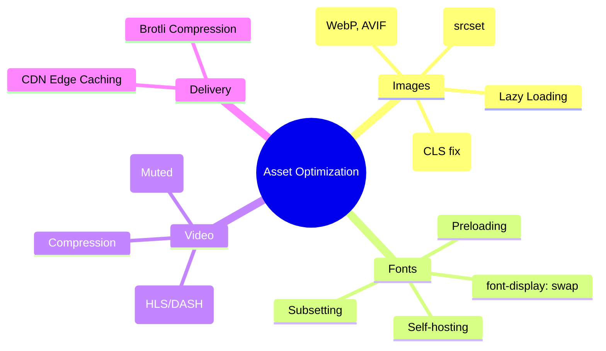

# Asset Optimization: Images, Fonts, and Media

Assets typically account for over 80% of a website's total byte weight. Optimizing them is the fastest way to improve **LCP** and **CLS**.

---

## 🗺️ Asset Optimization Mindmap



---

## 🖼️ Image Optimization

### 1. Modern Formats

Use **WebP** or **AVIF** instead of PNG/JPG. AVIF often provides 50% better compression than JPEG at the same quality.

#### 🛠️ Modern Image Formats: The Technical Difference

WebP and AVIF achieve higher efficiency without reducing resolution by using more advanced mathematics to eliminate **redundancy**:

| Feature                | JPEG                                           | WebP (VP8 based)                                   | AVIF (AV1 based)                                                                   |
| :--------------------- | :--------------------------------------------- | :------------------------------------------------- | :--------------------------------------------------------------------------------- |
| **Block Partitioning** | Rigid 8x8 blocks. Causes "blocking" artifacts. | 16x16 macroblocks. Better for flat areas.          | **Recursive "Superblocks"** (up to 128x128). Can split into non-square shapes.     |
| **Intra-Prediction**   | None (only predicts the average/DC color).     | 4-10 modes to predict pixel values from neighbors. | **56+ modes**. Includes "Chroma-from-Luma" (predicts color from brightness).       |
| **Entropy Coding**     | Huffman Coding (integer-length codes).         | Boolean Arithmetic Coding (fractional bits).       | **Multi-symbol Arithmetic Coding**. Reaches the mathematical limit of compression. |
| **Transformation**     | Discrete Cosine Transform (DCT) only.          | DCT or Walsh-Hadamard Transform.                   | DCT, ADST, Identity, and Flip transforms for better edge handling.                 |

**Summary:** While JPEG stores the "raw" differences in 8x8 chunks, AVIF "describes" the image using complex geometric predictions and high-efficiency math, allowing it to reconstruct the same resolution with 50-70% less data.

#### 🧠 Staff-Level Interview "Grill" Questions

**Q: If AVIF is 50% smaller than JPEG, why don't we use it for 100% of our images?**

> **Answer (The Decoding Cost):** Compression is a trade-off between **Network (IO)** and **CPU**. AVIF takes significantly more CPU power to decode (up to 10x more than WebP). On low-end mobile devices, decoding 20 large AVIF images simultaneously can cause "UI jank" and drain battery faster than the radio savings from the smaller file size.

**Q: How do WebP/AVIF handle "Progressive Loading" compared to JPEG?**

> **Answer:** They don't. Progressive JPEG allows an image to show a blurry version almost instantly. WebP and AVIF (in current browsers) render top-to-bottom or only after the file is mostly downloaded. If the user is on a 2G connection, a Progressive JPEG might actually feel faster even if the file is larger.

**Q: When would you MUST use AVIF over WebP?**

> **Answer:** When you need **High Dynamic Range (HDR)** or **Wide Color Gamut (10-bit/12-bit color)**. WebP is limited to 8-bit color. If you are building a photography portfolio or a site with deep gradients, WebP will cause "banding" artifacts where AVIF will remain smooth.

**Q: What is the "Race to Idle" strategy in this context?**

> **Answer:** It's the trade-off between saving battery by turning off the **Radio** (smaller AVIF file) vs. saving battery by using less **CPU** (simpler JPEG/WebP decoding). The "sweet spot" is usually serving AVIF for hero images (LCP) and WebP for the rest.

**Q: How do you actually deploy this safely without breaking older browsers?**

> **Answer (The Fallback Pattern):** You use the `<picture>` tag. The browser will iterate through the `<source>` tags and download the **first** one it understands, falling back to the `` tag for IE11 or very old browsers.
>
> ```html
> <picture>
>   <!-- 1. Try AVIF (Best compression, HDR support) -->
>   <source srcset="image.avif" type="image/avif" />
>   <!-- 2. Fallback to WebP (Universal modern support) -->
>   <source srcset="image.webp" type="image/webp" />
>   <!-- 3. Final Fallback (Progressive JPEG for UX/Legacy) -->
>   
> </picture>
> ```

### 2. Responsive Images (`srcset` & `sizes`)

Don't serve a 4000px image to a mobile phone. Responsive images ensure the browser downloads the _smallest_ sufficient version for the current device's screen size and pixel density (DPR).

#### 📱 Device-Specific Strategy

| Device Category         | Typical Width   | DPR (Density)    | Optimization Strategy                                                                                 |
| :---------------------- | :-------------- | :--------------- | :---------------------------------------------------------------------------------------------------- |
| **Small (Mobile)**      | 320px - 480px   | 2x - 3x (Retina) | Serve 2x resolution (640px-960px) but high compression (AVIF). Priority: **Bandwidth saving.**        |
| **Mid (Tablet/Laptop)** | 768px - 1024px  | 1x - 2x          | Serve exact size or 1.5x. Priority: **Balance CPU vs Network.**                                       |
| **Large (Desktop/4K)**  | 1440px - 3840px | 1x               | High-res source, but use `loading="lazy"` for everything non-critical. Priority: **Visual Fidelity.** |

#### 🛠️ Implementation: The "Resolution Switching" Pattern

```html

```

*Note: `sizes` tells the browser how wide the image will be on screen *before* the CSS is parsed, allowing it to pick the right `srcset` candidate immediately.*

### 3. Visual Stability (CLS Fix)

Always provide `width` and `height` attributes to reserve space before the image loads.

```css
img {
  aspect-ratio: 16 / 9;
  width: 100%;
  height: auto;
}
```

---

## 🏗️ Assets in Different Rendering Contexts

How you handle assets changes based on **CSR**, **SSR**, or **SSG**:

### 1. Client-Side Rendering (CSR)

- **Problem:** Assets are discovered _late_ because the browser must wait for the JS to execute before it knows what images/fonts are needed.
- **Solution:** Use **Resource Hints** (`<link rel="preload">`) in the initial index.html to fetch critical LCP images and fonts while the JS bundle is still downloading.

### 2. SSR & SSG (Next.js/Nuxt)

- **Problem:** "Hydration Mismatch" if the server and client pick different images (e.g., due to different user-agent detection).
- **Solution:** Use specialized components (like `<Image />` in Next.js) that automate:
  - **Automatic WebP Conversion** on the fly.
  - **Blurry Placeholders:** Base64 encoded low-res images served in the initial HTML to prevent empty white boxes.
  - **Image Proxying:** Resizing images at the "Edge" (CDN) based on request parameters.

---

## 🔤 Font Optimization

### 1. The `font-display` Property

Prevent "Flash of Invisible Text" (FOIT) by using `swap`.

```css
@font-face {
  font-family: 'MyFont';
  src: url('font.woff2') format('woff2');
  font-display: swap;
}
```

### 2. Preloading Critical Fonts

Tell the browser to fetch the font early in the lifecycle.

```html
<link rel="preload" href="font.woff2" as="font" type="font/woff2" crossorigin />
```

#### Staff-Level Interview: Font Optimization

**Q: What is the difference between FOIT and FOUT, and which is better for UX?**

> **Answer:**
>
> - **FOIT (Flash of Invisible Text):** Browser hides text until the font loads. Bad for LCP/FCP as the user sees a blank screen.
> - **FOUT (Flash of Unstyled Text):** Browser shows a system font immediately and "swaps" it later. Better for accessibility but can cause high **CLS**.
> - **Verdict:** FOUT is generally preferred for core content, provided you mitigate the layout shift.

**Q: How do you eliminate CLS during a font swap? (The "Metric-Aligned Fallback" strategy)**

> **Answer:** You use `@font-face` descriptors to "stretch" or "shrink" a local system font to match the dimensions of your web font.
>
> ```css
> /* 1. The Web Font */
> @font-face {
>   font-family: 'MyFont';
>   src: url('myfont.woff2');
>   font-display: swap;
> }
>
> /* 2. The Fallback (Matched to MyFont) */
> @font-face {
>   font-family: 'MyFont-Fallback';
>   src: local('Arial');
>   size-adjust: 105%; /* Scale glyphs */
>   ascent-override: 90%; /* Adjust space above baseline */
>   descent-override: 20%; /* Adjust space below baseline */
> }
> ```
>
> By doing this, the line-height and character width stay consistent, so the page doesn't "jump" when the web font arrives.

**Q: When would you use `font-display: optional`?**

> **Answer:** When CLS is your absolute priority. `optional` gives the font ~100ms to load. If it misses that window, the browser uses the fallback font for the **entire duration** of that page load. No swap = No shift.

**Q: How do you reduce font payload besides using WOFF2?**

> **Answer:** **Subsetting.** Most fonts contain 1000+ characters for many languages. You can "subset" the font to only include Latin characters (A-Z, 0-9), reducing a 200KB file to 20KB.

---

## 🔥 Advanced Asset "Grill" Questions (Senior/Staff)

### Q1: What is "Content-Aware Image Compression"?

> **Answer:** It's an optimization where the encoder (like Cloudinary or Imgix) analyzes the "saliency" of an image. If the image has a lot of flat space (sky), it applies aggressive compression. If it has high detail (a face), it preserves more data. This is often called **Q_AUTO** (Automatic Quality).

### Q2: How do you handle "Art Direction" vs. "Resolution Switching"?

> **Answer:**
>
> - **Resolution Switching:** Same image, different sizes (use `srcset`).
> - **Art Direction:** _Different_ image crops for different devices (e.g., a landscape photo on desktop, but a zoomed-in portrait on mobile). For Art Direction, you **MUST** use the `<picture>` tag with `media` queries.
>
> ```html
> <picture>
>   <source media="(max-width: 799px)" srcset="crop-portrait.webp" />
>   <source media="(min-width: 800px)" srcset="wide-landscape.webp" />
>   
> </picture>
> ```

### Q3: What is the "Preload Scanner" and how does it affect asset loading?

> **Answer:** The Preload Scanner is a background process in the browser that scans the HTML for `src` and `href` attributes while the main parser is blocked by scripts.
>
> - **Critical Insight:** If you put images in `background-image: url()` in CSS, or load them via JS, the Preload Scanner **cannot see them**. This delays the fetch by hundreds of milliseconds. Always use `` or `<link rel="preload">` for critical assets.

### Q4: Explain "Image Proxies" and why they are better than static asset folders.

> **Answer:** Instead of storing 10 versions of `logo.png`, you store one master high-res file and use a URL like `my-cdn.com/logo.png?width=400&format=webp`.
>
> - **The Edge:** The CDN computes the transformation once, caches it at the edge, and serves it to all subsequent users. This reduces build times (no need to generate 1000s of thumbnails) and ensures the most efficient format is always used.

---

## 🧠 Staff Level Interview Question (General Performance)

**Q: What is the difference between "Lazy Loading" and "Priority Hints"?**

> **Answer:**
>
> - **Lazy Loading (`loading="lazy"`)** tells the browser _not_ to load a resource until it's close to the viewport. This saves bandwidth but can hurt LCP if applied to the main image.
> - **Priority Hints (`fetchpriority="high"`)** tells the browser that a resource is extremely important (like the LCP hero image) and should be fetched _immediately_, even if the browser's heuristics suggest otherwise.
> - **Rule of Thumb:** Lazy load everything below the fold; use high priority for the LCP image above the fold.

---

## 📈 Optimization Checklist

1. **Format:** Is it AVIF/WebP?
2. **Size:** Is there a `srcset` for mobile vs desktop?
3. **Stability:** Does it have `aspect-ratio` or `width/height`?
4. **Priority:** Is the LCP image `fetchpriority="high"` and below-fold images `loading="lazy"`?
5. **Preload:** Are critical fonts preloaded and using `font-display: swap`?
