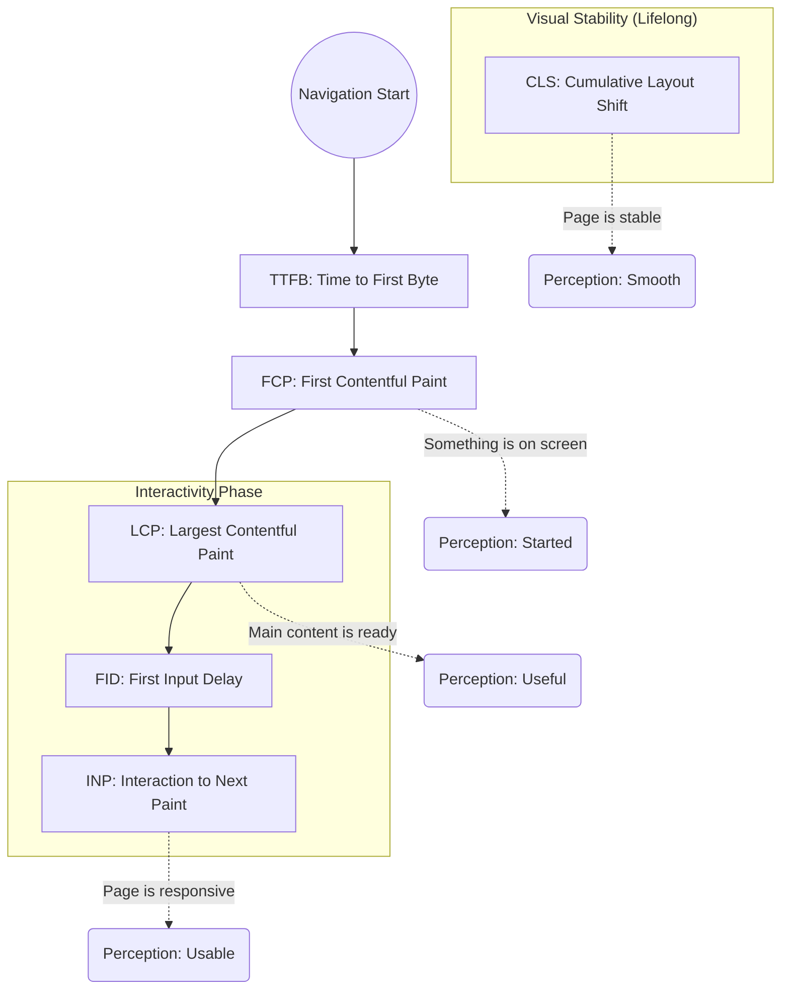

# Core Web Vitals & Performance Metrics

Core Web Vitals are a set of specific factors that Google considers important in a webpage's overall user experience. They are part of Google's "Page Experience" score, which affects SEO ranking.

---

## 🗺️ The Performance Timeline

This flow illustrates when each metric occurs during a typical page load and lifecycle.

---

> ### If we can't measure something we are not able to improve!

## 📊 The Key Metrics

### 0. First Contentful Paint (FCP)

**Focus:** Initial Perceived Speed
**Definition:** Measures the time from when the page starts loading to when any part of the page's content is rendered on the screen (text, images, svg).

| Status                   | Threshold     |
| :----------------------- | :------------ |
| 🟢 **Good**              | < 1.8 seconds |
| 🟡 **Needs Improvement** | 1.8s - 3.0s   |
| 🔴 **Poor**              | > 3.0 seconds |

---

### 1. Largest Contentful Paint (LCP)

**Focus:** Loading Performance
**Definition:** Measures the time it takes for the largest image or text block visible within the viewport to be fully rendered.

| Status                   | Threshold     |
| :----------------------- | :------------ |
| 🟢 **Good**              | < 2.5 seconds |
| 🟡 **Needs Improvement** | 2.5s - 4.0s   |
| 🔴 **Poor**              | > 4.0 seconds |

**Common Culprits:** Slow server response times (TTFB), Render-blocking JS/CSS, slow resource load times (large images).

---

### 2. First Input Delay (FID) / Interaction to Next Paint (INP)

**Focus:** Interactivity

**Definition:**

- **FID:** Measures the time from when a user first interacts with a page (click, tap) to the time when the browser is actually able to begin processing event handlers.
- **INP (The Successor):** As of March 2024, **INP has replaced FID** as a Core Web Vital. It measures the latency of _all_ interactions throughout the entire page lifecycle, not just the first one.

| Status                   | FID Threshold | INP Threshold |
| :----------------------- | :------------ | :------------ |
| 🟢 **Good**              | < 100ms       | < 200ms       |
| 🟡 **Needs Improvement** | 100ms - 300ms | 200ms - 500ms |
| 🔴 **Poor**              | > 300ms       | > 500ms       |

**Common Culprits:** Heavy JavaScript execution, long tasks on the main thread, large script bundles.

---

### 3. Cumulative Layout Shift (CLS)

**Focus:** Visual Stability
**Definition:** Measures the sum total of all individual layout shift scores for every unexpected layout shift that occurs during the entire lifespan of the page.

| Status                   | Threshold  |
| :----------------------- | :--------- |
| 🟢 **Good**              | < 0.1      |
| 🟡 **Needs Improvement** | 0.1 - 0.25 |
| 🔴 **Poor**              | > 0.25     |

**Common Culprits:** Images without dimensions, ads/embeds without reserved space, dynamically injected content, FOIT/FONT (Flash of Invisible/Unstyled Text).

---

## 🧠 Interview Deep Dive: Core Web Vitals

### 🟢 Basic (Junior / Mid Level)

**Q: What are Core Web Vitals and why should we care?**

> **Answer:** Core Web Vitals are a set of three metrics (LCP, INP/FID, CLS) that measure loading, interactivity, and visual stability. We care because they provide a standardized way to measure User Experience and they are a direct ranking factor for Google SEO.

**Q: How do you fix a high CLS (Visual Instability)?**

> **Answer:**
>
> 1. Always include `width` and `height` attributes on images and video elements.
> 2. Reserve space for ad slots and dynamic content (like banners) using CSS aspect-ratio or min-height.
> 3. Avoid inserting content above existing content unless in response to a user interaction.

---

### 🟡 Advanced (Senior Level)

**Q: Your LCP is poor (5s), but your JS bundles are tiny and your images are optimized. What else could be wrong?**

> **Answer:** The bottleneck might be **Time to First Byte (TTFB)**. If the server takes 3 seconds to send the initial HTML, the LCP will never be good. Other factors include **Render-Blocking CSS** in the `<head>` or a slow **Resource Load Delay** where the browser doesn't discover the LCP image until late (e.g., it's hidden in a CSS background-image or an external JS file).

**Q: Explain the difference between FID and INP. Why did Google switch?**

> **Answer:** FID only measures the _first_ interaction and only the _delay_ before processing starts. It often gave "Good" scores to pages that felt sluggish later. **INP (Interaction to Next Paint)** is more comprehensive: it tracks _all_ interactions, includes the _processing time_ and the _presentation delay_ (time to actually paint the result), and reports the worst (or near-worst) interaction on the page.

---

### 🔴 Staff / Architect Level

**Q: How would you architect a system to monitor Core Web Vitals for a site with 1 million daily users?**

> **Answer:** You need a **RUM (Real User Monitoring)** pipeline:
>
> 1. Use the `web-vitals` JS library to capture metrics from actual users.
> 2. Beacon this data to an analytics endpoint (e.g., using `navigator.sendBeacon`).
> 3. Aggregate data in a time-series database (ClickHouse/InfluxDB).
> 4. Focus on the **75th percentile (p75)** as per Google's recommendation.
> 5. Set up alerts for regressions tied to specific deployments or geographical regions.

**Q: Discuss the trade-offs of using a "Loading Spinner" vs. a "Skeleton Screen" in the context of Core Web Vitals.**

> **Answer:**
>
> - **Skeleton Screens** are generally better for **CLS** because they reserve the final space of the content, preventing layout shifts when data arrives.
> - However, if the Skeleton doesn't match the final content size exactly, it can still cause a minor shift.
> - From a **Perceived Performance** standpoint, Skeletons feel faster than a generic spinner, even if the actual LCP time is the same, because they provide immediate visual feedback about the expected layout.
