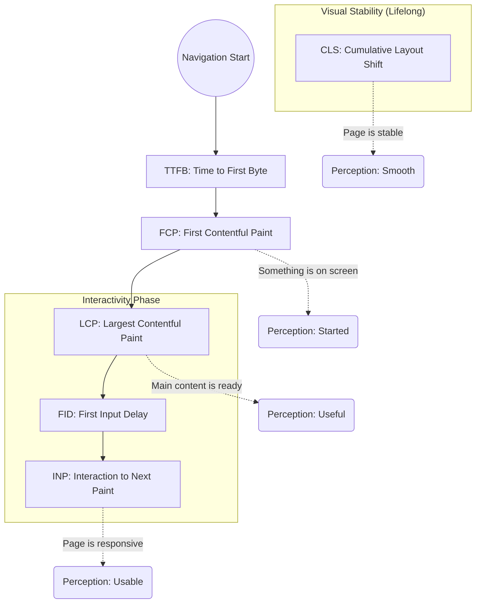

# Core Web Vitals & Performance Metrics

Core Web Vitals are a set of specific factors that Google considers important in a webpage's overall user experience. They are part of Google's "Page Experience" score, which affects SEO ranking.

---

## The Performance Timeline

This flow illustrates when each metric occurs during a typical page load and lifecycle.



---

> ### If we can't measure something we are not able to improve!

---

## ⚖️ Browser-Centric vs. User-Centric Metrics

To optimize effectively, we must distinguish between what the _browser_ sees (technical network events) and what the _user_ experiences (perceived speed and stability).

| Browser-Centric (Technical)            | User-Centric (Experience)            |
| :------------------------------------- | :----------------------------------- |
| **TTFB:** Time to First Byte           | **FCP:** First Contentful Paint      |
| **Network Requests:** Count & Size     | **LCP:** Largest Contentful Paint    |
| **DNS Resolution:** Lookup time        | **FID / INP:** Interactivity & Delay |
| **Connection Time:** TCP/TLS handshake | **TBT:** Total Blocking Time         |
| **DOM Content Loaded:** HTML parsed    | **CLS:** Cumulative Layout Shift     |
| **Page Load:** All assets finished     |                                      |

> **Key Insight:** A page can have a fast "Page Load" time but still feel slow to a user if the LCP is delayed or the page is unresponsive due to heavy JS (TBT).

---

## 🧪 Lab vs. Field Metrics (CrUX vs. Lighthouse)

Performance data comes from two distinct environments. Understanding the difference is critical for debugging.

### 1. Lab Data (Simulated)

- **Tools:** Lighthouse, PageSpeed Insights (Simulated), WebPageTest.
- **Pros:** Consistent, reproducible environment; great for debugging during development.
- **Cons:** Doesn't capture real-world network variability or actual user interactions (like FID/INP).
- **Key Metric:** **TBT** (Total Blocking Time) is the Lab star.

### 2. Field Data (Real User Monitoring - RUM)

- **Tools:** Chrome User Experience Report (CrUX), `web-vitals` library, PageSpeed Insights (Real Users).
- **Pros:** Captures the "True" user experience across diverse devices and networks.
- **Cons:** Harder to reproduce; data is delayed (28-day rolling average in CrUX).
- **Key Metric:** **INP** and **LCP** in the field are the source of truth for SEO.

---

## 🛠️ The Tooling Ecosystem

Performance monitoring is divided into three primary categories depending on the environment and the data source.

### 1. Developer Mode (Local Audits)

Used by engineers during active development to identify immediate regressions.

- **Lighthouse:** Automated audits for performance, accessibility, and SEO.
- **Network Tab:**
  - **Priority Column:** Right-click the header to enable "Priority" to see how the browser ranks resources (Highest, High, Medium, Low).
  - **Fetch Priority:** Inspecting how `fetchpriority="high"` or `loading="lazy"` changes the resource waterfall.
  - **Throttling:** Simulating "Fast 3G" or "Slow 3G" to see the impact of latency.
- **Performance Tab:**
  - **Screenshots:** Enable this to see a visual "filmstrip" of the page loading over time (useful for debugging CLS and LCP).
  - **Memory:** Enable to track the **Heap Size**, **DOM Nodes**, and **Listeners** to identify memory leaks.
  - **GPU:** View GPU activity to debug expensive "Composite" tasks and layer shifts.
  - **Bottom-Up / Call Tree:** Analyze function-level JavaScript execution to find specific "Heavy" functions causing long tasks.

### 2. Simulated Data (Synthetic Testing)

Reproducible environments that simulate specific devices and network conditions.

- **[webpagetest.org](https://www.webpagetest.org/):** The gold standard for deep waterfall analysis and connection throttling.
- **Lighthouse CI:** Running automated audits in the deployment pipeline.

### 3. Real User Data (RUM - Real User Monitoring)

The "Source of Truth" capturing how actual users experience the site in the wild.

- **CRUX (Chrome User Experience Report):** Public dataset of real user performance.
- **[PageSpeed Insights](https://pagespeed.web.dev/):** Combines Lab and Field data in a single view.
- **[requestMetrics.com](https://requestmetrics.com/):** Simplified RUM for monitoring web performance.
- **[clarity.microsoft.com](https://clarity.microsoft.com/):** Session replays and heatmaps to see where users struggle.
- **NewRelic / Sentry / Google Analytics:** Enterprise-grade observability and custom performance tracking.

---

### 🏛️ Detailed Comparison: Strategy & Purpose

| Criteria                 | Browser-Centric Metrics                                                                                                      | User-Centric Metrics                                                                                                                                            |
| :----------------------- | :--------------------------------------------------------------------------------------------------------------------------- | :-------------------------------------------------------------------------------------------------------------------------------------------------------------- |
| **Focus**                | Technical aspects of page loading and rendering.                                                                             | Directly measures user experience and perception of performance.                                                                                                |
| **Measurement Location** | Within the browser itself.                                                                                                   | Focuses on how quickly a page becomes usable and visually complete.                                                                                             |
| **Purpose**              | Emphasizes technical performance aspects within the browser.                                                                 | Directly evaluates the user's experience and perception of performance.                                                                                         |
| **User Perception**      | May not always align with user perception of performance.                                                                    | More accurately reflects how users experience and perceive the page.                                                                                            |
| **Responsiveness**       | Focuses on technical aspects of loading without considering user interactions.                                               | Includes metrics like FID and INP to evaluate actual responsiveness.                                                                                            |
| **Usage**                | Identifying technical bottlenecks and optimizing loading processes.                                                          | Prioritizing and ensuring a positive user experience.                                                                                                           |
| **Monitoring**           | Useful for tracking technical aspects of page loading.                                                                       | Essential for tracking the actual user experience on the page.                                                                                                  |
| **Best Practices**       | • Use to identify technical issues.<br>• Set performance budgets for key technical metrics.<br>• Optimize loading processes. | • Prioritize for a positive user experience.<br>• Continuously monitor both types for improvements.<br>• Use tools like Lighthouse/WebPageTest for measurement. |

---

## 📊 The Key Metrics

### -2. Time to First Byte (TTFB)

**Focus:** Server Responsiveness
**Definition:** The time it takes for the browser to receive the first byte of data from the server. This is the "root" of all other loading metrics.

| Status                   | Threshold     |
| :----------------------- | :------------ |
| 🟢 **Good**              | < 0.8 seconds |
| 🟡 **Needs Improvement** | 0.8s - 1.8s   |
| 🔴 **Poor**              | > 1.8 seconds |

**Common Culprits:** Slow server logic, database bottlenecks, lack of CDN, high network latency.

### -1. Total Blocking Time (TBT)

**Focus:** Responsiveness / Lab Metric
**Definition:** Measures the total amount of time between FCP and Time to Interactive (TTI) where the main thread was blocked for long enough to prevent input responsiveness (any task > 50ms).

| Status                   | Threshold     |
| :----------------------- | :------------ |
| 🟢 **Good**              | < 200ms       |
| 🟡 **Needs Improvement** | 200ms - 600ms |
| 🔴 **Poor**              | > 600ms       |

**Relationship:** TBT is the "Lab" equivalent of FID/INP. If you have high TBT in Lighthouse, your users will likely experience poor FID/INP in the field.

### 0. First Contentful Paint (FCP)

**Focus:** Initial Perceived Speed
**Definition:** Measures the time from when the page starts loading to when any part of the page's content is rendered on the screen (text, images, svg).

| Status                   | Threshold     |
| :----------------------- | :------------ |
| 🟢 **Good**              | < 1.8 seconds |
| 🟡 **Needs Improvement** | 1.8s - 3.0s   |
| 🔴 **Poor**              | > 3.0 seconds |

---

### 1. Largest Contentful Paint (LCP)

**Focus:** Loading Performance
**Definition:** Measures the time it takes for the largest image or text block visible within the viewport to be fully rendered.

| Status                   | Threshold     |
| :----------------------- | :------------ |
| 🟢 **Good**              | < 2.5 seconds |
| 🟡 **Needs Improvement** | 2.5s - 4.0s   |
| 🔴 **Poor**              | > 4.0 seconds |

**Common Culprits:** Slow server response times (TTFB), Render-blocking JS/CSS, slow resource load times (large images).

---

### 2. First Input Delay (FID) / Interaction to Next Paint (INP)

**Focus:** Interactivity

**Definition:**

- **FID:** Measures the time from when a user first interacts with a page (click, tap) to the time when the browser is actually able to begin processing event handlers.
- **INP (The Successor):** As of March 2024, **INP has replaced FID** as a Core Web Vital. It measures the latency of _all_ interactions throughout the entire page lifecycle, not just the first one.

| Status                   | FID Threshold | INP Threshold |
| :----------------------- | :------------ | :------------ |
| 🟢 **Good**              | < 100ms       | < 200ms       |
| 🟡 **Needs Improvement** | 100ms - 300ms | 200ms - 500ms |
| 🔴 **Poor**              | > 300ms       | > 500ms       |

**Common Culprits:** Heavy JavaScript execution, long tasks on the main thread, large script bundles.

---

### 3. Cumulative Layout Shift (CLS)

**Focus:** Visual Stability
**Definition:** Measures the sum total of all individual layout shift scores for every unexpected layout shift that occurs during the entire lifespan of the page.

| Status                   | Threshold  |
| :----------------------- | :--------- |
| 🟢 **Good**              | < 0.1      |
| 🟡 **Needs Improvement** | 0.1 - 0.25 |
| 🔴 **Poor**              | > 0.25     |

**Common Culprits:** Images without dimensions, ads/embeds without reserved space, dynamically injected content, FOIT/FONT (Flash of Invisible/Unstyled Text).

---

## 🏗️ The RAIL Model: A User-Centric Framework

RAIL is a model created by Google to help engineers break down performance into four key areas of the user lifecycle.

| Letter | Action        | Goal                                     | Metric           |
| :----- | :------------ | :--------------------------------------- | :--------------- |
| **R**  | **Response**  | Process events in < 50ms.                | INP / FID        |
| **A**  | **Animation** | Produce a frame in < 10ms.               | CLS / Smoothness |
| **I**  | **Idle**      | Maximize idle time for background tasks. | TBT              |
| **L**  | **Load**      | Deliver interactive content in < 5s.     | LCP / FCP        |

> **Staff Tip:** Users have different expectations for each phase. A 1-second delay in "Response" feels like a broken UI, but a 1-second delay in "Load" is often acceptable.

---

## 🧪 Next-Gen Metrics: LoAF (Long Animation Frames)

While **INP** tells you _that_ a page was slow, **LoAF** tells you _why_.

- **The Problem:** Long Tasks only tell you a script ran for > 50ms.
- **The Solution:** LoAF provides the "attribution"—it points to the specific script, event listener, or microtask that caused the frame to drop.
- **Usage:** Essential for identifying "Third-party bloat" (e.g., a chat widget or analytics script) that is killing your interactivity.

---

## Interview Deep Dive: Core Web Vitals

### 🟢 Basic (Junior / Mid Level)

**Q: What are Core Web Vitals and why should we care?**

> **Answer:** Core Web Vitals are a set of three metrics (LCP, INP/FID, CLS) that measure loading, interactivity, and visual stability. We care because they provide a standardized way to measure User Experience and they are a direct ranking factor for Google SEO.

**Q: How do you fix a high CLS (Visual Instability)?**

> **Answer:**
>
> 1. Always include `width` and `height` attributes on images and video elements.
> 2. Reserve space for ad slots and dynamic content (like banners) using CSS aspect-ratio or min-height.
> 3. Avoid inserting content above existing content unless in response to a user interaction.

---

### 🟡 Advanced (Senior Level)

**Q: Your LCP is poor (5s), but your JS bundles are tiny and your images are optimized. What else could be wrong?**

> **Answer:** The bottleneck might be **Time to First Byte (TTFB)**. If the server takes 3 seconds to send the initial HTML, the LCP will never be good. Other factors include **Render-Blocking CSS** in the `<head>` or a slow **Resource Load Delay** where the browser doesn't discover the LCP image until late (e.g., it's hidden in a CSS background-image or an external JS file).

**Q: Explain the difference between FID and INP. Why did Google switch?**

> **Answer:** FID only measures the _first_ interaction and only the _delay_ before processing starts. It often gave "Good" scores to pages that felt sluggish later. **INP (Interaction to Next Paint)** is more comprehensive: it tracks _all_ interactions, includes the _processing time_ and the _presentation delay_ (time to actually paint the result), and reports the worst (or near-worst) interaction on the page.

---

### 🔴 Staff / Architect Level

**Q: How would you architect a system to monitor Core Web Vitals for a site with 1 million daily users?**

> **Answer:** You need a **RUM (Real User Monitoring)** pipeline:
>
> 1. Use the `web-vitals` JS library to capture metrics from actual users.
> 2. Beacon this data to an analytics endpoint (e.g., using `navigator.sendBeacon`).
> 3. Aggregate data in a time-series database (ClickHouse/InfluxDB).
> 4. Focus on the **75th percentile (p75)** as per Google's recommendation.
> 5. Set up alerts for regressions tied to specific deployments or geographical regions.

**Q: Discuss the trade-offs of using a "Loading Spinner" vs. a "Skeleton Screen" in the context of Core Web Vitals.**

> **Answer:**
>
> - **Skeleton Screens** are generally better for **CLS** because they reserve the final space of the content, preventing layout shifts when data arrives.
> - However, if the Skeleton doesn't match the final content size exactly, it can still cause a minor shift.

- **Perceived Performance** standpoint, Skeletons feel faster than a generic spinner, even if the actual LCP time is the same, because they provide immediate visual feedback about the expected layout.

**Q: LCP is a complex metric. Can you break down its four primary sub-parts for diagnostic purposes?**

> **Answer:** To debug a poor LCP, you must break it into these four distinct phases:
>
> 1. **TTFB (Time to First Byte):** Time spent waiting for the server to respond with the initial HTML.
> 2. **Resource Load Delay:** The gap between TTFB and when the browser _starts_ downloading the LCP resource. (Often caused by the image being hidden in a script or CSS).
> 3. **Resource Load Duration:** The actual time spent downloading the LCP resource (Image/Video).
> 4. **Resource Render Delay:** The time between the resource finishing download and the browser actually painting it. (Often caused by a busy main thread or render-blocking styles).

**Q: In a large organization with 100+ developers, how do you prevent performance regressions?**

> **Answer:** You implement **Performance Budgets** and "Gatekeeping":
>
> 1. **Set the Budget:** Define limits for specific metrics (e.g., "LCP must be < 2.5s" or "JS Bundle must be < 200KB").
> 2. **CI/CD Integration:** Use tools like **Lighthouse CI** to run audits on every Pull Request.
> 3. **Blocking Builds:** Configure the CI to fail the build if the new code exceeds the budget.
> 4. **Transparency:** Use a dashboard (Grafana/Datadog) to track performance trends over time so teams can see the impact of their changes in real-time.

---

## 🧪 Custom Metrics & The User Timing API

While standard Core Web Vitals (LCP, CLS, INP) capture the general health of a webpage, they are generic. For complex applications, you need custom metrics to measure specific business-critical user journeys (e.g., "Time to Interactive Search Results" or "Checkout Button Click to Success").

### The User Timing API (`performance.mark` & `performance.measure`)

The browser provides the User Timing API to record high-precision, microsecond-level timestamps. These metrics are automatically integrated into the browser's performance timeline (visible in Chrome DevTools Performance audits) and can be extracted programmatically to report back to your Real User Monitoring (RUM) analytics.

#### How to Implement:

```javascript
function processCheckoutFlow() {
  // 1. Establish the starting mark
  performance.mark('checkout-flow-start');

  try {
    // Perform data processing / server calls
    executeCheckoutAPICall();

    // 2. Establish the ending mark once the UI has fully updated
    performance.mark('checkout-flow-end');

    // 3. Measure the difference between the two marks
    performance.measure('Checkout Flow Duration', 'checkout-flow-start', 'checkout-flow-end');

    // 4. Retrieve the measure entry to send to telemetry
    const measures = performance.getEntriesByName('Checkout Flow Duration');
    const duration = measures[0].duration; // in milliseconds (high precision decimal)

    sendToAnalytics({ metric: 'checkout_duration_ms', value: duration });
  } catch (error) {
    console.error('Checkout failed', error);
  } finally {
    // 5. Clean up marks and measures from the browser buffer to avoid memory bloat
    performance.clearMarks('checkout-flow-start');
    performance.clearMarks('checkout-flow-end');
    performance.clearMeasures('Checkout Flow Duration');
  }
}
```
