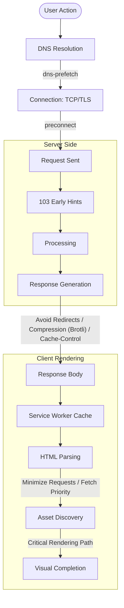
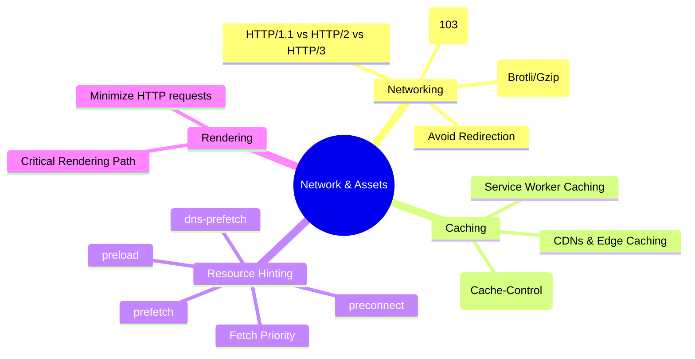
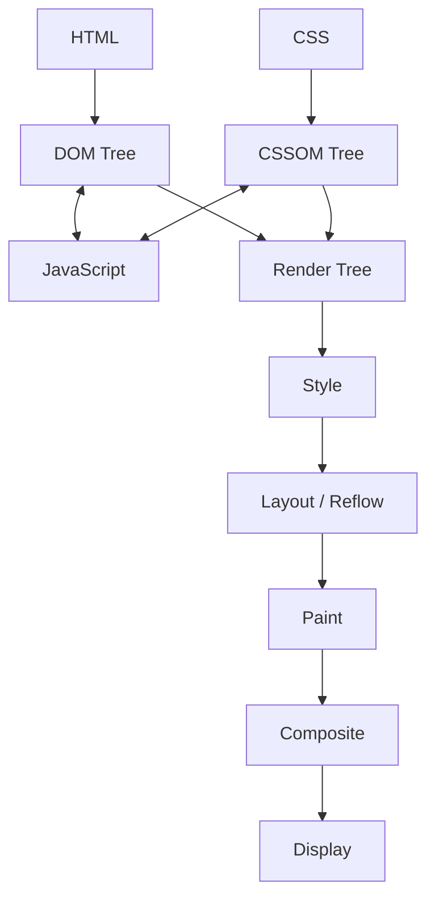
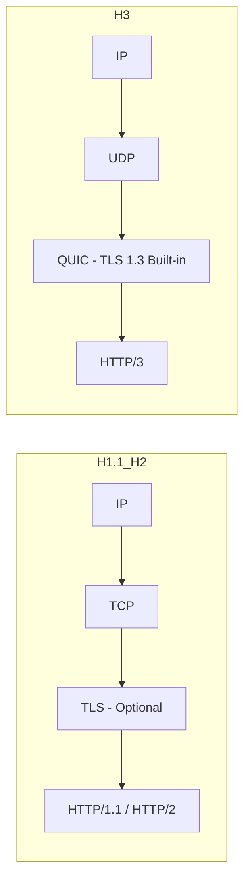
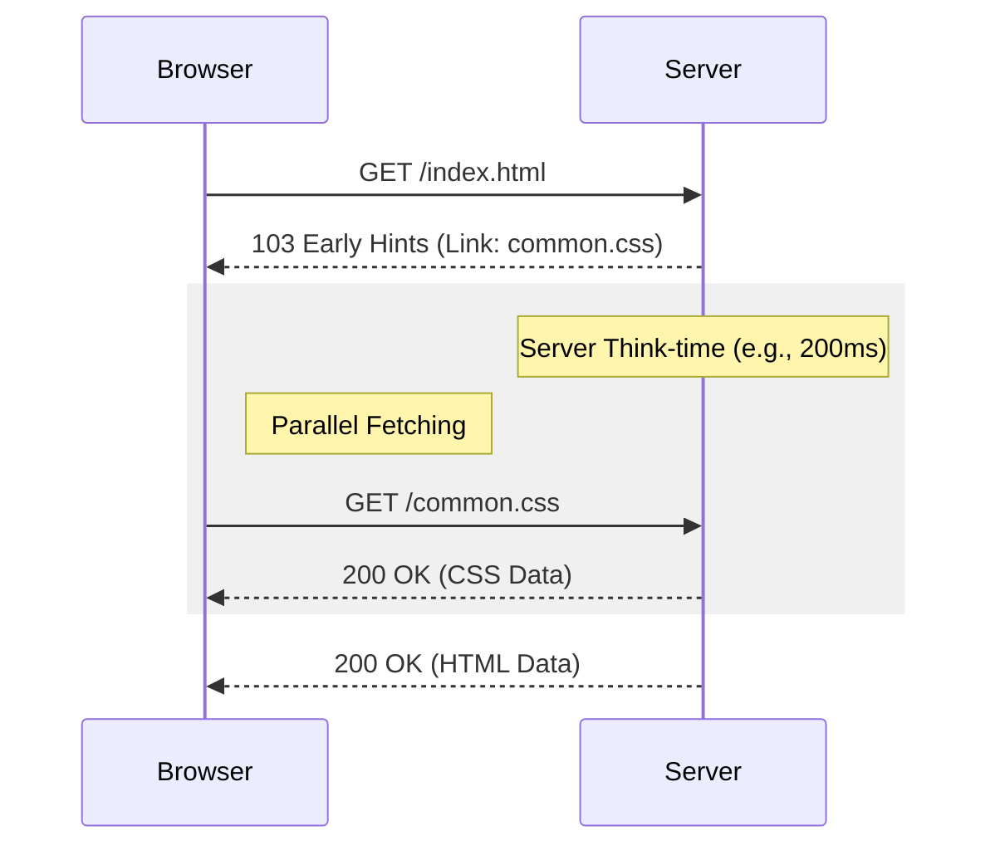

# Network & Asset Optimization

Optimizing the delivery and size of resources to minimize latency and bandwidth.

## 📌 Table of Contents

- [Network \& Asset Optimization](#network--asset-optimization)
  - [📌 Table of Contents](#-table-of-contents)
  - [Network Optimization Mental Model](#network-optimization-mental-model)
  - [Network \& Assets Mindmap](#network--assets-mindmap)
  - [🚀 Core Optimization Strategies](#-core-optimization-strategies)
    - [1. Critical Rendering Path (CRP)](#1-critical-rendering-path-crp)
      - [⚡ Script Loading: Async vs. Defer](#-script-loading-async-vs-defer)
    - [🔍 Deep Dive \& Examples](#-deep-dive--examples)
      - [1. Normal Script (`<script src="...">`)](#1-normal-script-script-src)
      - [2. Async Script (`<script async src="...">`)](#2-async-script-script-async-src)
      - [3. Defer Script (`<script defer src="...">`)](#3-defer-script-script-defer-src)
    - [💡 Summary: Which one should I use?](#-summary-which-one-should-i-use)
    - [📦 The 14KB Rule: The First Round-Trip](#-the-14kb-rule-the-first-round-trip)
      - [⚠️ Reflow vs. Repaint vs. Composite](#️-reflow-vs-repaint-vs-composite)
  - [🏛️ Browser Object Model (BOM)](#️-browser-object-model-bom)
    - [2. Minimize HTTP Requests](#2-minimize-http-requests)
      - [⚠️ Challenges](#️-challenges)
      - [✅ Solutions](#-solutions)
    - [3. Avoid Redirection](#3-avoid-redirection)
    - [4. Fetch Priority](#4-fetch-priority)
  - [🌐 Modern Networking Protocols](#-modern-networking-protocols)
    - [1. Evolution of the Protocol Stack](#1-evolution-of-the-protocol-stack)
    - [2. HTTP/1.1 vs HTTP/2 vs HTTP/3 Comparison](#2-http11-vs-http2-vs-http3-comparison)
      - [🛠️ Core Protocol Definitions](#️-core-protocol-definitions)
      - [🚀 Implementing HTTP/2 with `spdy`](#-implementing-http2-with-spdy)
      - [🔐 Generating SSL Certificates with OpenSSL](#-generating-ssl-certificates-with-openssl)
      - [🌐 Browser Behavior: HTTP/1.1 vs. HTTP/2](#-browser-behavior-http11-vs-http2)
    - [3. Real-world Protocol Usage](#3-real-world-protocol-usage)
    - [4. HTTP/2 (Multiplexing)](#4-http2-multiplexing)
    - [5. HTTP/3 (QUIC - UDP based)](#5-http3-quic---udp-based)
  - [💡 Resource Hints: Guiding the Browser](#-resource-hints-guiding-the-browser)
    - [🚀 Advanced Fetch Priority Patterns](#-advanced-fetch-priority-patterns)
      - [1. Prioritizing the LCP Image](#1-prioritizing-the-lcp-image)
      - [2. Deprioritizing Non-Critical Scripts](#2-deprioritizing-non-critical-scripts)
      - [3. Non-Blocking CSS Preload](#3-non-blocking-css-preload)
      - [4. Fetch API Integration](#4-fetch-api-integration)
  - [Compression \& Delivery](#compression--delivery)
    - [1. Gzip vs. Brotli](#1-gzip-vs-brotli)
    - [2. Implementation \& Delivery](#2-implementation--delivery)
    - [3. 103 Early Hints](#3-103-early-hints)
  - [Caching Strategies](#caching-strategies)
    - [1. HTTP Caching (Cache-Control)](#1-http-caching-cache-control)
    - [2. Service Worker Caching](#2-service-worker-caching)
  - [Key Topics Summary](#key-topics-summary)
  - [Senior/Staff Level "Grill" Questions](#seniorstaff-level-grill-questions)
    - [Q1: What is "TCP Slow Start" and how does it affect initial page load?](#q1-what-is-tcp-slow-start-and-how-does-it-affect-initial-page-load)
    - [Q2: Explain "Domain Sharding" and why it's an anti-pattern in HTTP/2+.](#q2-explain-domain-sharding-and-why-its-an-anti-pattern-in-http2)
    - [Q3: How do "103 Early Hints" differ from "HTTP/2 Server Push"?](#q3-how-do-103-early-hints-differ-from-http2-server-push)
    - [Q4: When would `preconnect` be "harmful" to performance?](#q4-when-would-preconnect-be-harmful-to-performance)
  - [🛠️ Main Thread Offloading \& Task Scheduling](#️-main-thread-offloading--task-scheduling)
    - [1. Web Workers: Offloading Heavy Calculations](#1-web-workers-offloading-heavy-calculations)
    - [2. Task Scheduling: `queueMicrotask` vs. `requestAnimationFrame` vs. `requestIdleCallback`](#2-task-scheduling-queuemicrotask-vs-requestanimationframe-vs-requestidlecallback)
    - [Deep Dive: Costs, Pitfalls, \& Best Use Cases](#deep-dive-costs-pitfalls--best-use-cases)
      - [1. `queueMicrotask`](#1-queuemicrotask)
      - [2. `requestAnimationFrame` (rAF)](#2-requestanimationframe-raf)
      - [3. `requestIdleCallback` (rIC)](#3-requestidlecallback-ric)
  - [Memory Management: WeakMap \& WeakSet for Memory Leak Prevention](#memory-management-weakmap--weakset-for-memory-leak-prevention)
    - [The Problem: Strong References](#the-problem-strong-references)
    - [The Solution: `WeakMap` \& `WeakSet`](#the-solution-weakmap--weakset)
      - [Implementation Pattern:](#implementation-pattern)
      - [Differences at a Glance:](#differences-at-a-glance)

---

## Network Optimization Mental Model

This model illustrates how different optimization techniques apply at various stages of the network lifecycle.



---

## Network & Assets Mindmap



---

## 🚀 Core Optimization Strategies

### 1. Critical Rendering Path (CRP)

The sequence of steps the browser goes through to convert HTML, CSS, and JavaScript into pixels on the screen.



- **DOM (Document Object Model):** The browser parses HTML bytes into tokens, which are then converted into a tree of nodes representing the page structure.
- **CSSOM (CSS Object Model):** The browser parses CSS rules to build a map of styles. **CSS is Render-Blocking:** The browser will not render any processed content until the CSSOM is constructed.
- **JavaScript:** **JS is Parser-Blocking:** The HTML parser is blocked when it encounters a `<script>` tag (unless `async` or `defer` is used), as JS can modify both the DOM and CSSOM.

#### ⚡ Script Loading: Async vs. Defer

Understanding the lifecycle of a script (Download vs. Execution) is critical for minimizing parser pauses.

| Attribute               | HTML Parsing                    | Script Download | Script Execution          | Order Guaranteed? |
| :---------------------- | :------------------------------ | :-------------- | :------------------------ | :---------------- |
| **Normal** (`<script>`) | **Paused** during fetch & exec. | Blocks parsing  | Immediately after fetch   | **Yes**           |
| **`async`**             | **Paused only** during exec.    | Concurrent      | Immediately after fetch   | **No**            |
| **`defer`**             | **Not Paused** (Non-blocking).  | Concurrent      | **After** parsing is done | **Yes**           |

---

### 🔍 Deep Dive & Examples

#### 1. Normal Script (`<script src="...">`)

- **Behavior:** The browser stops parsing HTML, fetches the script, executes it, and then resumes parsing.
- **Example:** `<script src="critical-lib.js"></script>`
- **When to use:** Rarely for external scripts. Only if the script **must** run before any subsequent HTML is parsed (e.g., a critical polyfill).

#### 2. Async Script (`<script async src="...">`)

- **Behavior:** The script is downloaded in the background. As soon as it's ready, **HTML parsing pauses** to execute the script.
- **Example:** `<script async src="https://google-analytics.com/ga.js"></script>`
- **Key Difference:** Execution happens "asynchronously" as soon as the download finishes, potentially interrupting the parser at any point.
- **When to use:** Independent third-party scripts (analytics, ads) that don't depend on other scripts or the DOM structure.

#### 3. Defer Script (`<script defer src="...">`)

- **Behavior:** The script is downloaded in the background, but **execution is delayed** until the HTML parser has completely finished.
- **Example:** `<script defer src="app-logic.js"></script>`
- **Key Difference:** Never interrupts the parser. It guarantees execution in the order they appear in the document, right before `DOMContentLoaded`.
- **When to use:** Scripts that need the full DOM or have dependencies on other scripts (e.g., your main application logic).

---

### 💡 Summary: Which one should I use?

1. **Does the script depend on other scripts?** Use `defer`.
2. **Is the script critical for the initial render?** Inline it or use a normal script in the `<head>` (sparingly).
3. **Is it an independent third-party tool?** Use `async`.
4. **General Rule of Thumb:** Default to **`defer`** for your own application code to ensure a smooth, non-blocking UI experience.

- **Render Tree:** The combination of DOM and CSSOM, containing only the visible elements (e.g., it excludes `<head>` and `display: none`).
- **Layout (Reflow):** The browser calculates the exact geometry (position and size) of each visible element on the viewport.
- **Paint:** The process of converting the render tree into actual pixels on the screen, including colors, text, and images.
- **Composite:** Different parts of the page are drawn in layers (often on the GPU) and flattened into the final image shown to the user.

### 📦 The 14KB Rule: The First Round-Trip

The first packet sent from the server to the client (after the handshake) is typically limited to **~14KB** due to the TCP Slow Start algorithm (initial congestion window).

- **Strategy:** Aim to fit the "above-the-fold" content—the bare minimum HTML, critical CSS, and essential JS—within this first 14KB.
- **Impact:** Fitting everything in the first packet allows the browser to start rendering immediately after the first round-trip, significantly improving the **First Contentful Paint (FCP)**.

#### ⚠️ Reflow vs. Repaint vs. Composite

Understanding the cost of each step is crucial for smooth animations and interactions.

| Stage         | Triggered By                                                      | Cost                                                                     | Optimization                            |
| :------------ | :---------------------------------------------------------------- | :----------------------------------------------------------------------- | :-------------------------------------- |
| **Reflow**    | Changes to geometry (`width`, `height`, `top`, `left`, `margin`)  | **High:** Triggers a chain reaction recalculating all affected elements. | Avoid animating these; use `transform`. |
| **Repaint**   | Changes to appearance (`color`, `visibility`, `background-color`) | **Medium:** Redraws affected elements but skips layout.                  | Use sparingly.                          |
| **Composite** | Changes to GPU-handled properties (`transform`, `opacity`)        | **Low:** Handled by the GPU, bypassing Layout and Paint.                 | **Preferred** for animations.           |

- **Why Reflow is Expensive:** It is a blocking, synchronous operation that can trigger a "Global Reflow" (entire tree) or "Local Reflow" (subtree). A single change can force the browser to recalculate the entire layout of the page.
- **What to use instead:** Favor "Composite-only" properties like `transform` (for translation, scaling, rotation) and `opacity`. These are offloaded to the GPU, ensuring 60fps animations.

---

## 🏛️ Browser Object Model (BOM)

The BOM provides objects that expose browser functionality beyond the document (DOM).

- **`window`:** The global object in the browser. It represents the browser window and contains all other BOM/DOM objects.
- **`navigator`:** Contains information about the browser (e.g., user agent, language, online status, and Geolocation).
- **`location`:** Provides details about the current URL and methods to navigate (e.g., `location.href`, `location.reload()`).
- **`history`:** Allows manipulation of the browser session history (e.g., `back()`, `forward()`, `pushState()`).
- **`screen`:** Contains information about the user's screen (e.g., width, height, color depth).

---

### 2. Minimize HTTP Requests

Reducing the overhead of multiple requests, especially in high-latency environments.

#### ⚠️ Challenges

- **Connection Overhead:** Each new connection requires time for DNS resolution, TCP handshake, and SSL negotiation.
- **Browser Limits:** Browsers typically limit parallel connections to **6-10 per domain**. Once this limit is reached, subsequent requests are queued (Head-of-Line Blocking).

#### ✅ Solutions

- **Inline CSS & JS:** Small, critical styles and scripts can be inlined directly in the HTML to avoid extra round-trips (ideally within the first 14KB).
- **Base64 for Images:** Converting small images (like icons) to Base64 strings in CSS/HTML removes the need for a separate image request.
- **SVG for Images:** Use SVGs for icons and simple graphics; they are text-based, scalable, and can be inlined directly in the HTML.
- **Bundling & Sprites:** Combining multiple files (JS/CSS) or images (sprites) into a single request to reduce connection overhead.

### 3. Avoid Redirection

Redirections (`301`, `302`) trigger additional round-trips before the browser can even begin downloading the actual content.

- **Impact:** Each redirect can add hundreds of milliseconds of latency, especially on mobile networks.

### 4. Fetch Priority

Using the `fetchpriority` attribute (e.g., `high`, `low`, `auto`) to hint to the browser which resources (like the LCP image) should be prioritized over others.

---

## 🌐 Modern Networking Protocols

### 1. Evolution of the Protocol Stack

The transition from H1 to H3 involved significant changes in the underlying transport and security layers to reduce latency.



### 2. HTTP/1.1 vs HTTP/2 vs HTTP/3 Comparison

| Feature                    | HTTP/1.1                | HTTP/2                    | HTTP/3                    |
| :------------------------- | :---------------------- | :------------------------ | :------------------------ |
| **Transport Layer**        | TCP                     | TCP                       | **UDP with QUIC**         |
| **Connection per Request** | **Yes** (one at a time) | **No** (multiple allowed) | **No** (multiple allowed) |
| **Multiplexing**           | No (Sequential)         | Yes (Interleaved)         | Yes (Interleaved)         |
| **Header Compression**     | No                      | **HPACK**                 | **QPACK**                 |
| **Server Push**            | No                      | Yes                       | Yes (Experimental)        |
| **Stream Prioritization**  | No                      | Yes                       | Yes                       |
| **Head-of-Line Blocking**  | Yes (Connection)        | Yes (TCP Level)           | **No**                    |

#### 🛠️ Core Protocol Definitions

- **TCP (Transmission Control Protocol):** Connection-oriented protocol that ensures reliable, ordered, and error-checked delivery of data.
- **UDP (User Datagram Protocol):** Connectionless, "fire-and-forget" protocol that prioritizes speed over reliability (used as the base for QUIC/H3).
- **HPACK:** A compression algorithm for HTTP/2 headers that uses a static dictionary, a dynamic dictionary, and Huffman encoding.
- **QPACK:** An evolution of HPACK for HTTP/3 that allows headers to be sent out-of-order to avoid HOL blocking.

#### 🚀 Implementing HTTP/2 with `spdy`

While Node.js has a native `http2` module, the `spdy` library is often used for easier setup and fallback support.

- **SSL Requirement:** HTTP/2 requires HTTPS. You must provide a **Private Key** (`server.key`) and a **Certificate** (`server.cert`).
- **Example Setup:**

```javascript
const spdy = require('spdy');
const fs = require('fs');

const options = {
  key: fs.readFileSync('./server.key'),
  cert: fs.readFileSync('./server.cert'),
};

spdy
  .createServer(options, (req, res) => {
    res.writeHead(200);
    res.end('Hello from HTTP/2!');
  })
  .listen(3000);
```

#### 🔐 Generating SSL Certificates with OpenSSL

To test HTTP/2 locally, you need self-signed certificates:

```bash
openssl req -x509 -newkey rsa:2048 -nodes -sha256 -keyout server.key -out server.cert
```

#### 🌐 Browser Behavior: HTTP/1.1 vs. HTTP/2

- **HTTP/1.1 (Queuing):** The browser limits parallel connections to ~6 per domain. If you have 50 images, only 6 start downloading; the rest are "Queued". This creates a "staircase" pattern in the network waterfall.
- **HTTP/2 (Multiplexing):** Using `spdy` and SSL, all 50 images are sent over a **single TCP connection** at once. They all download in parallel, drastically reducing UI render time.

### 3. Real-world Protocol Usage

| Version            | Main Use Case                               | Examples                                         |
| :----------------- | :------------------------------------------ | :----------------------------------------------- |
| **HTTP/0.9 - 1.0** | Legacy systems & simple IoT devices.        | Industrial sensors, legacy mainframe interfaces. |
| **HTTP/1.1**       | Simple APIs, local development without SSL. | Basic internal tools, simple REST endpoints.     |
| **HTTP/2**         | Modern websites with many small assets.     | Google Search, Amazon, Facebook, Twitter.        |
| **HTTP/3**         | Video streaming & unstable mobile networks. | YouTube, Instagram, WhatsApp, Netflix.           |

### 4. HTTP/2 (Multiplexing)

H/2 solved the "Head-of-Line Blocking" at the HTTP level by allowing multiple requests over a single TCP connection.

- **Binary Framing:** Data is sent in binary frames instead of plain text, making it more efficient to parse.
- **Multiplexing:** Multiple requests and responses can be in flight simultaneously over a single connection.
- **Server Push:** Allows the server to send resources to the client before they are requested (Now largely deprecated in favor of `103 Early Hints`).

### 5. HTTP/3 (QUIC - UDP based)

H/3 solves "Head-of-Line Blocking" at the **TCP level** by using the QUIC protocol.

- **UDP Transition:** Uses QUIC instead of TCP. If one packet is lost, it only blocks _that_ specific stream, not the entire connection.
- **0-RTT Handshake:** Combines the transport and cryptographic handshakes, allowing for faster connection establishment for returning users.
- **Connection Migration:** Allows connections to stay active even if the user switches networks (e.g., from Wi-Fi to 4G).

---

## 💡 Resource Hints: Guiding the Browser

| Hint                | Purpose                                                       | When to use?                                      |
| :------------------ | :------------------------------------------------------------ | :------------------------------------------------ |
| **`dns-prefetch`**  | Resolves domain name early.                                   | For third-party domains used later.               |
| **`preconnect`**    | DNS + TCP + TLS handshake.                                    | For high-priority third-party origins (CDN, API). |
| **`preload`**       | Fetches high-priority resource _now_.                         | For critical LCP images, fonts, and early CSS.    |
| **`prefetch`**      | Fetches low-priority resource for _next_ page.                | For predicting the user's next navigation.        |
| **`fetchpriority`** | Hints at the relative priority of a resource (high/low/auto). | ``        |

### 🚀 Advanced Fetch Priority Patterns

`fetchpriority` allows you to fine-tune how the browser allocates bandwidth among resources of the same type.

#### 1. Prioritizing the LCP Image

The most common use case is to ensure the Largest Contentful Paint (LCP) image starts downloading as soon as possible.

```html

```

#### 2. Deprioritizing Non-Critical Scripts

You can preload scripts that are needed later but shouldn't compete with more critical resources (like CSS or the LCP image).

```html
<!-- High priority preload for critical script -->
<link rel="preload" as="script" href="critical-script.js" />

<!-- Lower priority preload for non-critical script -->
<link rel="preload" href="/js/script.js" as="script" fetchpriority="low" />
```

#### 3. Non-Blocking CSS Preload

A powerful pattern to load non-critical CSS without blocking the render of the page.

```html
<link rel="preload" as="style" href="theme.css" fetchpriority="low" onload="this.rel='stylesheet'" />
```

#### 4. Fetch API Integration

You can also use it with the `fetch()` API to deprioritize background API calls.

```javascript
fetch('/api/data', { priority: 'low' });
```

> **Further Reading:** [Optimizing resource priority with Fetch Priority (web.dev)](https://web.dev/articles/fetch-priority)

---

## Compression & Delivery

Optimizing payload size is critical for reducing transfer time and bandwidth usage.

### 1. Gzip vs. Brotli

| Feature             | Gzip (DEFLATE)                           | Brotli (br)                                |
| :------------------ | :--------------------------------------- | :----------------------------------------- |
| **Standard**        | Established (RFC 1952)                   | Modern (RFC 7932)                          |
| **Performance**     | Fast compression, standard ratio         | Superior compression ratio (15-25% better) |
| **Browser Support** | Universal                                | All modern browsers (requires HTTPS)       |
| **Best For**        | Legacy support, fast dynamic compression | Text assets (HTML, JS, CSS, SVG)           |

- **Brotli (br):** A modern compression algorithm that uses a dictionary of common web strings (HTML tags, common JS keywords). It is more CPU-intensive to compress at high levels but offers much smaller file sizes and fast decompression.
- **Gzip:** The industry standard for decades. While Brotli is superior for most web content, Gzip remains a critical fallback for older browsers and is often faster for on-the-fly compression of dynamic responses.

> Further Reading: Compression techniques ([web.dev](https://web.dev/articles/codelab-text-compression-brotli))

### 2. Implementation & Delivery

- **Negotiation:** The browser sends `Accept-Encoding: gzip, deflate, br`. The server responds with `Content-Encoding: br` if it supports Brotli, otherwise falls back to Gzip.
- **Static vs. Dynamic:**
  - **Static Assets:** Should be pre-compressed (e.g., at build time) using maximum Brotli compression (level 11).
  - **Dynamic Content:** Usually compressed on-the-fly at lower levels (e.g., Brotli level 4 or Gzip level 6) to balance CPU overhead and latency.
- **Edge Compression:** Modern CDNs (like Cloudflare) can automatically compress assets at the edge, serving Brotli to supported browsers even if the origin only supports Gzip.

### 3. 103 Early Hints

Early Hints allows the server to overlap "Server Think-time" with asset discovery by sending a preliminary response while the main HTML is still being generated.



- **The Problem:** In a standard request, the browser is idle while the server "thinks" (database lookups, backend logic). Asset discovery only happens _after_ the HTML starts arriving.
- **The Solution:** The server sends a `103 Early Hints` response immediately with `Link: </style.css>; rel=preload`. This allows the browser to start fetching critical resources during the server's processing time.
- **Result:** Drastically reduces the time to **First Contentful Paint (FCP)** by ensuring the Critical Rendering Path assets are already in flight or downloaded when the HTML parsing begins.

---

## Caching Strategies

Caching is the most effective way to improve performance by avoiding the network entirely for subsequent requests.

### 1. HTTP Caching (Cache-Control)

Controlled via response headers to dictate how and for how long the browser and intermediate caches (CDNs) should store resources.

- **`max-age=N`:** Specifies the time in seconds the resource is considered fresh.
- **`immutable`:** Indicates the resource will never change. Used with hashed filenames (e.g., `style.a1b2.css`) to avoid revalidation.
- **`no-cache`:** Forces the browser to revalidate with the server (`ETag`) before using the cached version.
- **`no-store`:** Prevents any caching of the resource (useful for sensitive data).
- **`stale-while-revalidate`:** Allows the browser to use a stale resource while fetching a fresh one in the background.

### 2. Service Worker Caching

A programmable proxy between the browser and the network, allowing for fine-grained control over caching logic.

- **Pre-caching:** Downloading critical assets during the Service Worker installation phase.
- **Runtime Caching:** Intercepting network requests and applying strategies like:
  - **Cache First:** Use cache if available, fallback to network.
  - **Network First:** Try network, fallback to cache (ideal for dynamic data).
  - **Stale-While-Revalidate:** Serve from cache, update in background.
- **Offline Support:** Enables the application to function without an internet connection by serving cached shells and data.

---

## Key Topics Summary

- **Content Delivery Networks:** Reducing TTFB by moving data to the edge (PoPs).
- **Modern Image Pipelines:** Automatic conversion (AVIF/WebP) and dynamic resizing at the CDN Edge.
- **Resource Hints:** Strategically using `dns-prefetch`, `preconnect`, and `preload` to prioritize critical path resources.

---

## Senior/Staff Level "Grill" Questions

### Q1: What is "TCP Slow Start" and how does it affect initial page load?

> **Answer:** TCP doesn't send data at full speed immediately. It starts with a small "congestion window" (CWND, usually 10 segments or ~14KB) and doubles it for every successful acknowledgment. Keep "Above-the-fold" critical CSS under 14KB to fit in the first round-trip.

### Q2: Explain "Domain Sharding" and why it's an anti-pattern in HTTP/2+.

> **Answer:** In H/2 and H/3, this is harmful because it forces multiple DNS lookups and TLS handshakes, breaking the efficiency of multiplexing over a single connection.

### Q3: How do "103 Early Hints" differ from "HTTP/2 Server Push"?

> **Answer:** Server Push is often wasted bandwidth if the browser already had assets in cache. Early Hints lets the browser decide whether to fetch based on its own cache state.

### Q4: When would `preconnect` be "harmful" to performance?

> **Answer:** Every `preconnect` consumes CPU and memory for the handshake. If you preconnect to 10 different origins that aren't critical for the initial paint, you are "stealing" bandwidth and main-thread time from the resources that actually matter for LCP.

---

## 🛠️ Main Thread Offloading & Task Scheduling

To maintain excellent **INP (Interaction to Next Paint)**, the browser's main thread must remain free to process user interactions instantly. Heavy JavaScript calculations or low-priority background processing must be scheduled or offloaded.

### 1. Web Workers: Offloading Heavy Calculations

By default, JavaScript runs on a single thread (the main thread). If you perform complex computations (e.g., parsing a 5MB CSV file, processing images, or running path-finding algorithms), the thread freezes, and the page stops responding.

**Web Workers** allow you to spin up a background OS thread that runs JS in isolation. It communicates with the main thread via message passing (`postMessage`):

```javascript
// 1. worker.js (Background Thread)
self.onmessage = function (e) {
  const data = e.data;
  const result = runHeavyAnalysis(data); // CPU-heavy operation
  self.postMessage(result); // Send back to main thread
};

function runHeavyAnalysis(numbers) {
  return numbers.reduce((acc, val) => acc + Math.sqrt(val), 0);
}

// 2. main.js (Main Thread / React Component)
const worker = new Worker(new URL('./worker.js', import.meta.url));

function handleStartComputation(largeDataSet) {
  // Send data to worker, freeing up the main thread immediately
  worker.postMessage(largeDataSet);

  worker.onmessage = function (e) {
    console.log('Calculation complete:', e.data);
  };
}
```

---

### 2. Task Scheduling: `queueMicrotask` vs. `requestAnimationFrame` vs. `requestIdleCallback`

Choosing the correct task scheduling method is vital to prevent main thread blocking and visual lag.

| Scheduler                         | When does it execute?                                                                         | Impact on Rendering / Main Thread                                                                                        | Ideal Use Case                                             |
| :-------------------------------- | :-------------------------------------------------------------------------------------------- | :----------------------------------------------------------------------------------------------------------------------- | :--------------------------------------------------------- |
| **`queueMicrotask`**              | Immediately after the current call stack clears, _before_ yielding to the browser event loop. | **Blocking:** It halts rendering/painting. If a microtask triggers more microtasks, it will freeze the page.             | State updates, internal promise resolution, cleanups.      |
| **`requestAnimationFrame` (rAF)** | Right before the next layout, paint, and frame paint.                                         | **Synchronous:** Blocks paint if the task is too slow, but guarantees execution aligned with the monitor's refresh rate. | DOM animations, visual styling changes, canvas drawing.    |
| **`requestIdleCallback` (rIC)**   | When the browser is completely idle (empty event loop queue) or when a deadline is reached.   | **Non-blocking:** Yields instantly if a user interacts with the page, preserving responsiveness.                         | Logging analytics, preloading future assets, caching data. |

**Example: Splitting long lists of tasks with `requestIdleCallback`**

```javascript
const tasks = [task1, task2, task3 /* ... */];

function workLoop(deadline) {
  // Execute tasks only while there is remaining time in the current frame
  // and we haven't timed out.
  while ((deadline.timeRemaining() > 0 || deadline.didTimeout) && tasks.length > 0) {
    const currentTask = tasks.shift();
    performTask(currentTask);
  }

  // If there are tasks left, request another idle window
  if (tasks.length > 0) {
    requestIdleCallback(workLoop);
  }
}

// Start the idle loop
requestIdleCallback(workLoop, { timeout: 2000 }); // Ensure it runs after max 2s
```

---

### Deep Dive: Costs, Pitfalls, & Best Use Cases

#### 1. `queueMicrotask`

- **Cost:** **Negligible CPU overhead, but high UI blocking risk.** Microtasks are lightweight, but because they run _before_ the browser paint event, executing too many blocks the rendering process.
- **Pitfalls (Microtask Starvation):** If a microtask recursively schedules another microtask (e.g., a continuous loop of `Promise.resolve().then()`), the browser queue never empties. The event loop cannot proceed to render frames, layout, or capture user events, causing the entire browser tab to freeze.
- **When to use:** Use for tiny, critical operations that must execute _immediately_ after the current call stack finishes but _before_ layout and paint (e.g., batching state changes or handling internal library state cleanups).

#### 2. `requestAnimationFrame` (rAF)

- **Cost:** **Medium CPU cost.** Highly efficient as it is locked to the monitor's frame rate (e.g., 60Hz or 120Hz), but executing expensive JavaScript inside it will instantly drop frames.
- **Pitfalls (Layout Thrashing):** If you perform a DOM write (e.g., modifying `element.style.left`) and then immediately perform a DOM read (e.g., querying `element.offsetWidth`) inside a rAF loop, you force the browser to compute layout synchronously on the spot. Doing this repeatedly drops the rendering rate down to single digits.
- **When to use:** Use for any synchronous DOM changes, style adjustments, or canvas updates that must sync with screen updates (e.g., scrolling animations, gesture tracking, physics loops).

#### 3. `requestIdleCallback` (rIC)

- **Cost:** **Highest tracking overhead.** The browser must continuously monitor frame budget times to calculate the remaining idle millisecond slices.
- **Pitfalls:**
  1. **DOM Mutation Warning:** Never run DOM writes (styles/layouts) inside `requestIdleCallback`. Doing so triggers layout shifts that will delay the next frame, causing visible lag.
  2. **Main Thread Blocking:** The idle deadline is capped at a maximum of `50ms`. If your task exceeds this timeout without checking `deadline.timeRemaining()`, you will block user interactions.
  3. **Browser Support (Safari):** Safari does not natively support `requestIdleCallback`. Production code must include a polyfill (typically falling back to `setTimeout(fn, 1)`).
- **When to use:** Use for low-priority background operations (e.g., logging telemetry/analytics, prefetching future bundles/images, caching API responses, or indexing data in IndexedDB).

---

## Memory Management: WeakMap & WeakSet for Memory Leak Prevention

In high-performance single-page applications, memory leaks (such as **detached DOM nodes**) can gradually degrade performance, leading to high CPU usage, tab crashes, and lag.

### The Problem: Strong References

A standard JS `Map` or `Set` holds a **strong reference** to its keys and values. If you map metadata to a DOM element (e.g., tracking render times or touch states):

```javascript
const elementCache = new Map();

function cacheElementData(element, metadata) {
  elementCache.set(element, metadata);
}
```

Even if `element` is completely removed from the DOM (unmounted by React or removed via `removeChild`), the garbage collector **cannot** free its memory. Why? Because the `elementCache` Map still holds a strong reference to it as a key. This is a classic memory leak.

### The Solution: `WeakMap` & `WeakSet`

`WeakMap` (and `WeakSet`) hold **weak references** to their keys (which must be objects). If there are no other strong references to a key object (e.g., the DOM node is unmounted and no other variables refer to it), the garbage collector automatically releases the object and removes its entry from the `WeakMap`.

#### Implementation Pattern:

```javascript
// A WeakMap prevents garbage collection blocking
const domMetadata = new WeakMap();

export function associateMetadata(domNode, data) {
  // Key must be an object (the DOM node)
  domMetadata.set(domNode, {
    ...data,
    timestamp: performance.now(),
  });
}

// When the DOM node is unmounted/removed:
// 1. React removes it from the browser page.
// 2. We nullify local client references.
// 3. The garbage collector automatically reclaims the memory of the node and the metadata entry.
```

#### Differences at a Glance:

| Feature               | `Map` / `Set`                                  | `WeakMap` / `WeakSet`                                    |
| :-------------------- | :--------------------------------------------- | :------------------------------------------------------- |
| **Reference Type**    | Strong                                         | **Weak**                                                 |
| **Keys Type**         | Any type (primitives, objects)                 | **Objects only**                                         |
| **Iterability**       | Yes (has `.keys()`, `.values()`, `.forEach()`) | **No** (cannot be iterated; prevents GC exposure)        |
| **Size Property**     | Yes (`.size`)                                  | **No**                                                   |
| **Garbage Collected** | No (retained as long as Map exists)            | **Yes** (keys collected automatically when unreferenced) |
