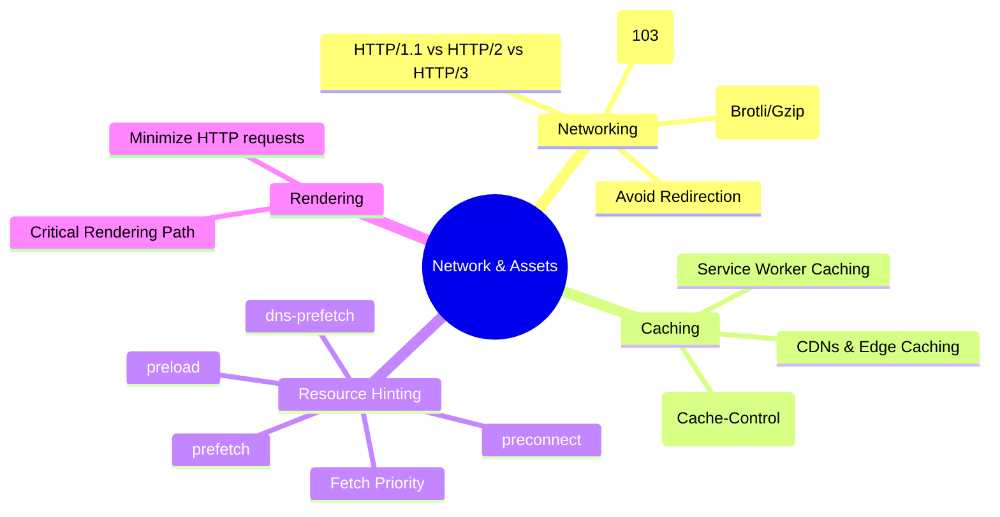
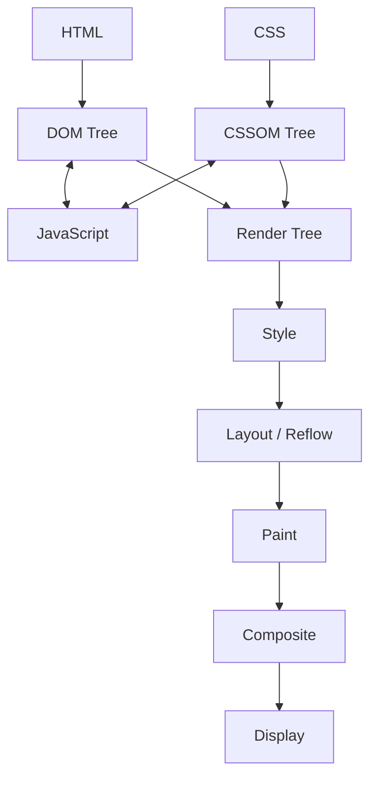

# Network & Asset Optimization

Optimizing the delivery and size of resources to minimize latency and bandwidth.

## Network Optimization Mental Model

This model illustrates how different optimization techniques apply at various stages of the network lifecycle.

---

## Network & Assets Mindmap

---

## 🚀 Core Optimization Strategies

### 1. Critical Rendering Path (CRP)

The sequence of steps the browser goes through to convert HTML, CSS, and JavaScript into pixels on the screen.

- **DOM (Document Object Model):** The browser parses HTML bytes into tokens, which are then converted into a tree of nodes representing the page structure.
- **CSSOM (CSS Object Model):** The browser parses CSS rules to build a map of styles. **CSS is Render-Blocking:** The browser will not render any processed content until the CSSOM is constructed.
- **JavaScript:** **JS is Parser-Blocking:** The HTML parser is blocked when it encounters a ``
- **When to use:** Rarely for external scripts. Only if the script **must** run before any subsequent HTML is parsed (e.g., a critical polyfill).

#### 2. Async Script (``
- **Key Difference:** Execution happens "asynchronously" as soon as the download finishes, potentially interrupting the parser at any point.
- **When to use:** Independent third-party scripts (analytics, ads) that don't depend on other scripts or the DOM structure.

#### 3. Defer Script (``
- **Key Difference:** Never interrupts the parser. It guarantees execution in the order they appear in the document, right before `DOMContentLoaded`.
- **When to use:** Scripts that need the full DOM or have dependencies on other scripts (e.g., your main application logic).

---

### 💡 Summary: Which one should I use?

1. **Does the script depend on other scripts?** Use `defer`.
2. **Is the script critical for the initial render?** Inline it or use a normal script in the `<head>` (sparingly).
3. **Is it an independent third-party tool?** Use `async`.
4. **General Rule of Thumb:** Default to **`defer`** for your own application code to ensure a smooth, non-blocking UI experience.

- **Render Tree:** The combination of DOM and CSSOM, containing only the visible elements (e.g., it excludes `<head>` and `display: none`).
- **Layout (Reflow):** The browser calculates the exact geometry (position and size) of each visible element on the viewport.
- **Paint:** The process of converting the render tree into actual pixels on the screen, including colors, text, and images.
- **Composite:** Different parts of the page are drawn in layers (often on the GPU) and flattened into the final image shown to the user.

### 📦 The 14KB Rule: The First Round-Trip

The first packet sent from the server to the client (after the handshake) is typically limited to **~14KB** due to the TCP Slow Start algorithm (initial congestion window).

- **Strategy:** Aim to fit the "above-the-fold" content—the bare minimum HTML, critical CSS, and essential JS—within this first 14KB.
- **Impact:** Fitting everything in the first packet allows the browser to start rendering immediately after the first round-trip, significantly improving the **First Contentful Paint (FCP)**.

#### ⚠️ Reflow vs. Repaint vs. Composite

Understanding the cost of each step is crucial for smooth animations and interactions.

| Stage         | Triggered By                                                      | Cost                                                                     | Optimization                            |
| :------------ | :---------------------------------------------------------------- | :----------------------------------------------------------------------- | :-------------------------------------- |
| **Reflow**    | Changes to geometry (`width`, `height`, `top`, `left`, `margin`)  | **High:** Triggers a chain reaction recalculating all affected elements. | Avoid animating these; use `transform`. |
| **Repaint**   | Changes to appearance (`color`, `visibility`, `background-color`) | **Medium:** Redraws affected elements but skips layout.                  | Use sparingly.                          |
| **Composite** | Changes to GPU-handled properties (`transform`, `opacity`)        | **Low:** Handled by the GPU, bypassing Layout and Paint.                 | **Preferred** for animations.           |

- **Why Reflow is Expensive:** It is a blocking, synchronous operation that can trigger a "Global Reflow" (entire tree) or "Local Reflow" (subtree). A single change can force the browser to recalculate the entire layout of the page.
- **What to use instead:** Favor "Composite-only" properties like `transform` (for translation, scaling, rotation) and `opacity`. These are offloaded to the GPU, ensuring 60fps animations.

---

## 🏛️ Browser Object Model (BOM)

The BOM provides objects that expose browser functionality beyond the document (DOM).

- **`window`:** The global object in the browser. It represents the browser window and contains all other BOM/DOM objects.
- **`navigator`:** Contains information about the browser (e.g., user agent, language, online status, and Geolocation).
- **`location`:** Provides details about the current URL and methods to navigate (e.g., `location.href`, `location.reload()`).
- **`history`:** Allows manipulation of the browser session history (e.g., `back()`, `forward()`, `pushState()`).
- **`screen`:** Contains information about the user's screen (e.g., width, height, color depth).

---

### 2. Minimize HTTP Requests

Reducing the overhead of multiple requests, especially in high-latency environments.

#### ⚠️ Challenges

- **Connection Overhead:** Each new connection requires time for DNS resolution, TCP handshake, and SSL negotiation.
- **Browser Limits:** Browsers typically limit parallel connections to **6-10 per domain**. Once this limit is reached, subsequent requests are queued (Head-of-Line Blocking).

#### ✅ Solutions

- **Inline CSS & JS:** Small, critical styles and scripts can be inlined directly in the HTML to avoid extra round-trips (ideally within the first 14KB).
- **Base64 for Images:** Converting small images (like icons) to Base64 strings in CSS/HTML removes the need for a separate image request.
- **SVG for Images:** Use SVGs for icons and simple graphics; they are text-based, scalable, and can be inlined directly in the HTML.
- **Bundling & Sprites:** Combining multiple files (JS/CSS) or images (sprites) into a single request to reduce connection overhead.

### 3. Avoid Redirection

Redirections (`301`, `302`) trigger additional round-trips before the browser can even begin downloading the actual content.

- **Impact:** Each redirect can add hundreds of milliseconds of latency, especially on mobile networks.

### 4. Fetch Priority

Using the `fetchpriority` attribute (e.g., `high`, `low`, `auto`) to hint to the browser which resources (like the LCP image) should be prioritized over others.

---

## 🌐 Modern Networking Protocols

### 1. HTTP/1.1 vs HTTP/2 vs HTTP/3

| Feature                   | HTTP/1.1         | HTTP/2           | HTTP/3                 |
| :------------------------ | :--------------- | :--------------- | :--------------------- |
| **Transport**             | TCP              | TCP              | UDP (QUIC)             |
| **Multiplexing**          | No (Limited)     | Yes (HTTP Level) | Yes (Connection Level) |
| **Head-of-Line Blocking** | Yes (Connection) | Yes (TCP Level)  | No                     |
| **Compression**           | Header: None     | Header: HPACK    | Header: QPACK          |

### 2. HTTP/2 (Multiplexing)

H/2 solved the "Head-of-Line Blocking" at the HTTP level by allowing multiple requests over a single TCP connection.

- **Binary Framing:** Data is sent in binary frames instead of plain text, making it more efficient to parse.
- **Multiplexing:** Multiple requests and responses can be in flight simultaneously over a single connection.
- **Server Push:** Allows the server to send resources to the client before they are requested (Now largely deprecated in favor of `103 Early Hints`).

### 3. HTTP/3 (QUIC - UDP based)

H/3 solves "Head-of-Line Blocking" at the **TCP level** by using the QUIC protocol.

- **UDP Transition:** Uses QUIC instead of TCP. If one packet is lost, it only blocks _that_ specific stream, not the entire connection.
- **0-RTT Handshake:** Combines the transport and cryptographic handshakes, allowing for faster connection establishment for returning users.
- **Connection Migration:** Allows connections to stay active even if the user switches networks (e.g., from Wi-Fi to 4G).

---

## 💡 Resource Hints: Guiding the Browser

| Hint                | Purpose                                        | When to use?                                          |
| :------------------ | :--------------------------------------------- | :---------------------------------------------------- |
| **`dns-prefetch`**  | Resolves domain name early.                    | For third-party domains used later.                   |
| **`preconnect`**    | DNS + TCP + TLS handshake.                     | For high-priority third-party origins (CDN, API).     |
| **`preload`**       | Fetches high-priority resource _now_.          | For critical LCP images, fonts, and early CSS.        |
| **`prefetch`**      | Fetches low-priority resource for _next_ page. | For predicting the user's next navigation.            |
| **`fetchpriority`** | Adjusts relative priority of a resource.       | Prioritize LCP image; Deprioritize off-screen images. |

---

## Compression & Delivery

Optimizing payload size is critical for reducing transfer time and bandwidth usage.

### 1. Gzip vs. Brotli

| Feature             | Gzip (DEFLATE)                           | Brotli (br)                                |
| :------------------ | :--------------------------------------- | :----------------------------------------- |
| **Standard**        | Established (RFC 1952)                   | Modern (RFC 7932)                          |
| **Performance**     | Fast compression, standard ratio         | Superior compression ratio (15-25% better) |
| **Browser Support** | Universal                                | All modern browsers (requires HTTPS)       |
| **Best For**        | Legacy support, fast dynamic compression | Text assets (HTML, JS, CSS, SVG)           |

- **Brotli (br):** A modern compression algorithm that uses a dictionary of common web strings (HTML tags, common JS keywords). It is more CPU-intensive to compress at high levels but offers much smaller file sizes and fast decompression.
- **Gzip:** The industry standard for decades. While Brotli is superior for most web content, Gzip remains a critical fallback for older browsers and is often faster for on-the-fly compression of dynamic responses.

### 2. Implementation & Delivery

- **Negotiation:** The browser sends `Accept-Encoding: gzip, deflate, br`. The server responds with `Content-Encoding: br` if it supports Brotli, otherwise falls back to Gzip.
- **Static vs. Dynamic:**
  - **Static Assets:** Should be pre-compressed (e.g., at build time) using maximum Brotli compression (level 11).
  - **Dynamic Content:** Usually compressed on-the-fly at lower levels (e.g., Brotli level 4 or Gzip level 6) to balance CPU overhead and latency.
- **Edge Compression:** Modern CDNs (like Cloudflare) can automatically compress assets at the edge, serving Brotli to supported browsers even if the origin only supports Gzip.
- **Early Hints (103):** Allows the server to tell the browser about critical resources (CSS/JS) before the full HTML response is even generated.

---

## Caching Strategies

Caching is the most effective way to improve performance by avoiding the network entirely for subsequent requests.

### 1. HTTP Caching (Cache-Control)

Controlled via response headers to dictate how and for how long the browser and intermediate caches (CDNs) should store resources.

- **`max-age=N`:** Specifies the time in seconds the resource is considered fresh.
- **`immutable`:** Indicates the resource will never change. Used with hashed filenames (e.g., `style.a1b2.css`) to avoid revalidation.
- **`no-cache`:** Forces the browser to revalidate with the server (`ETag`) before using the cached version.
- **`no-store`:** Prevents any caching of the resource (useful for sensitive data).
- **`stale-while-revalidate`:** Allows the browser to use a stale resource while fetching a fresh one in the background.

### 2. Service Worker Caching

A programmable proxy between the browser and the network, allowing for fine-grained control over caching logic.

- **Pre-caching:** Downloading critical assets during the Service Worker installation phase.
- **Runtime Caching:** Intercepting network requests and applying strategies like:
  - **Cache First:** Use cache if available, fallback to network.
  - **Network First:** Try network, fallback to cache (ideal for dynamic data).
  - **Stale-While-Revalidate:** Serve from cache, update in background.
- **Offline Support:** Enables the application to function without an internet connection by serving cached shells and data.

---

## Key Topics Summary

- **Content Delivery Networks:** Reducing TTFB by moving data to the edge (PoPs).
- **Modern Image Pipelines:** Automatic conversion (AVIF/WebP) and dynamic resizing at the CDN Edge.
- **Resource Hints:** Strategically using `dns-prefetch`, `preconnect`, and `preload` to prioritize critical path resources.

---

## Senior/Staff Level "Grill" Questions

### Q1: What is "TCP Slow Start" and how does it affect initial page load?

> **Answer:** TCP doesn't send data at full speed immediately. It starts with a small "congestion window" (CWND, usually 10 segments or ~14KB) and doubles it for every successful acknowledgment. Keep "Above-the-fold" critical CSS under 14KB to fit in the first round-trip.

### Q2: Explain "Domain Sharding" and why it's an anti-pattern in HTTP/2+.

> **Answer:** In H/2 and H/3, this is harmful because it forces multiple DNS lookups and TLS handshakes, breaking the efficiency of multiplexing over a single connection.

### Q3: How do "103 Early Hints" differ from "HTTP/2 Server Push"?

> **Answer:** Server Push is often wasted bandwidth if the browser already had assets in cache. Early Hints lets the browser decide whether to fetch based on its own cache state.

### Q4: When would `preconnect` be "harmful" to performance?

> **Answer:** Every `preconnect` consumes CPU and memory for the handshake. If you preconnect to 10 different origins that aren't critical for the initial paint, you are "stealing" bandwidth and main-thread time from the resources that actually matter for LCP.
