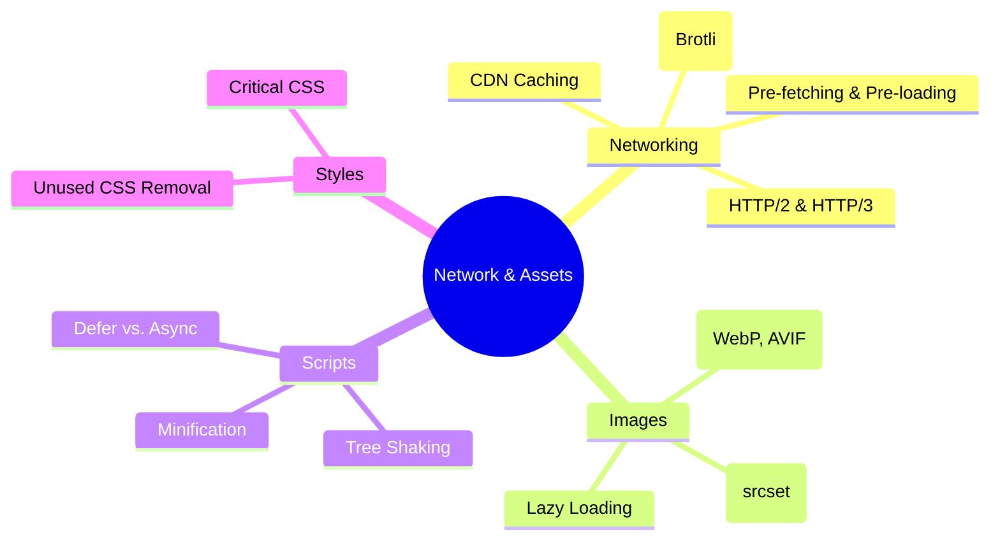

# Network & Asset Optimization

Optimizing the delivery and size of resources to minimize latency and bandwidth.

## 🗺️ Network & Assets Mindmap

## 📂 Key Topics

- **Content Delivery Networks:** Reducing TTFB by moving data to the edge.
- **Modern Image Pipelines:** Automatic conversion and resizing strategies.
- **Resource Hints:** Using `dns-prefetch`, `preconnect`, and `preload` effectively.
