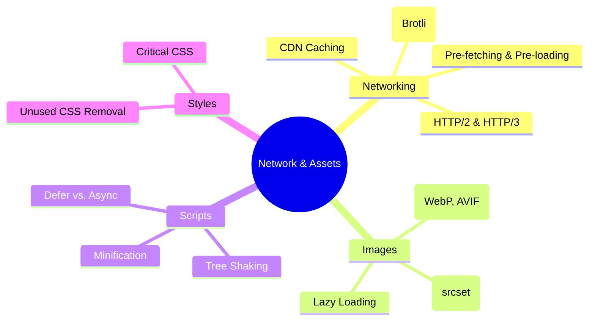

# Network & Asset Optimization

Optimizing the delivery and size of resources to minimize latency and bandwidth.

## 🗺️ Network & Assets Mindmap

---

## 🌐 Modern Networking Protocols

### 1. HTTP/2 (Multiplexing)

H/2 solved the "Head-of-Line Blocking" at the HTTP level by allowing multiple requests over a single TCP connection.

- **Binary Framing:** Data is sent in binary frames instead of plain text.
- **Server Push:** (Now largely deprecated in favor of `103 Early Hints`).

### 2. HTTP/3 (QUIC - UDP based)

H/3 solves "Head-of-Line Blocking" at the **TCP level**.

- **UDP Transition:** Uses QUIC instead of TCP. If one packet is lost, it only blocks _that_ stream, not the entire connection.
- **0-RTT Handshake:** Faster connection establishment for returning users.

---

## 💡 Resource Hints: Guiding the Browser

| Hint               | Purpose                                        | When to use?                                           |
| :----------------- | :--------------------------------------------- | :----------------------------------------------------- |
| **`dns-prefetch`** | Resolves domain name early.                    | For third-party domains (analytics, fonts) used later. |
| **`preconnect`**   | DNS + TCP + TLS handshake.                     | For high-priority third-party origins (CDN, API).      |
| **`preload`**      | Fetches high-priority resource _now_.          | For critical LCP images, fonts, and early CSS.         |
| **`prefetch`**     | Fetches low-priority resource for _next_ page. | For predicting the user's next navigation.             |

---

## 📦 Compression & Delivery

- **Brotli vs Gzip:** Brotli is ~15-20% more efficient than Gzip for text assets. Use Brotli at the Edge (CDN).
- **Early Hints (103):** Allows the server to tell the browser about critical resources (CSS/JS) before the full HTML response is even generated.

---

## 📂 Key Topics Summary

- **Content Delivery Networks:** Reducing TTFB by moving data to the edge (PoPs).
- **Modern Image Pipelines:** Automatic conversion (AVIF/WebP) and dynamic resizing at the CDN Edge.
- **Resource Hints:** Strategically using `dns-prefetch`, `preconnect`, and `preload` to prioritize critical path resources.

---

## 🔥 Senior/Staff Level "Grill" Questions

### Q1: What is "TCP Slow Start" and how does it affect initial page load?

> **Answer:** TCP doesn't send data at full speed immediately. It starts with a small "congestion window" (CWND, usually 10 segments or ~14KB) and doubles it for every successful acknowledgment.
>
> - **Impact:** If your critical CSS is > 14KB, it might require a second round-trip to finish downloading, doubling the time to render.
> - **Strategy:** Keep "Above-the-fold" critical CSS under 14KB.

### Q2: Explain "Domain Sharding" and why it's an anti-pattern in HTTP/2+.

> **Answer:** In HTTP/1.1, browsers limited connections to 6 per domain. "Sharding" (e.g., `static1.cdn.com`, `static2.cdn.com`) was used to bypass this.
>
> - **Anti-pattern:** In H/2 and H/3, this is harmful because it forces multiple DNS lookups and TLS handshakes, breaking the efficiency of multiplexing over a single connection.

### Q3: How do "103 Early Hints" differ from "HTTP/2 Server Push"?

> **Answer:**
>
> - **Server Push:** The server aggressively sends resources the browser didn't ask for. Often wasted bandwidth if the browser already had them in cache.
> - **Early Hints:** The server sends a "pre-response" with `Link: rel=preload` headers. The browser then decides if it needs those assets (checking its own cache) before fetching them. Much more efficient.

### Q4: When would `preconnect` be "harmful" to performance?

> **Answer:** Every `preconnect` consumes CPU and memory for the handshake. If you preconnect to 10 different origins that aren't critical for the initial paint, you are "stealing" bandwidth and main-thread time from the resources that actually matter for LCP.
