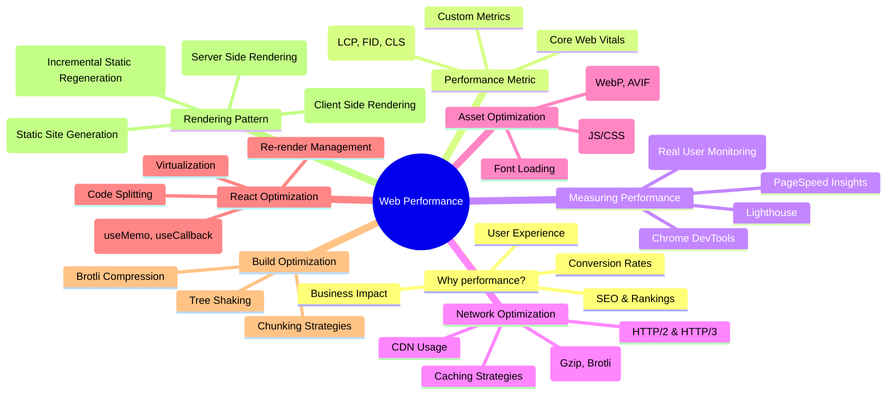
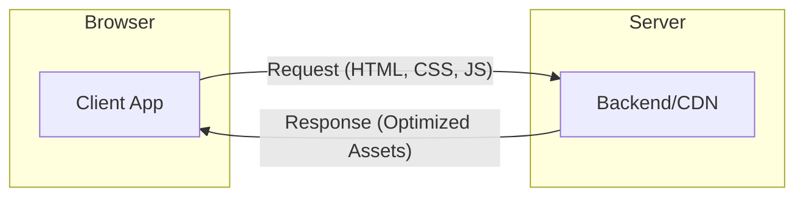

# Web Performance Optimization

Web performance is the speed at which web pages are downloaded and displayed on the user's web browser. It is a critical factor for user experience, SEO, and business success.

## 🗺️ Performance Overview

The following graph illustrates the key pillars and touchpoints of web performance optimization as discussed in this module.

---

## 🏗️ The Browser-Server Loop

Performance is fundamentally about optimizing the data exchange and processing between the **Browser** and the **Server**.

---

## 📁 Module Structure

This directory contains deep dives into each of the touchpoints mentioned above:

- `Metrics/`: Understanding LCP, FID, CLS, and more.
- `Network/`: Strategies for faster delivery.
- `Assets/`: Techniques for image and code optimization.
- `React/`: Framework-specific performance patterns.
- `Rendering/`: Choosing between SSR, CSR, and SSG.
