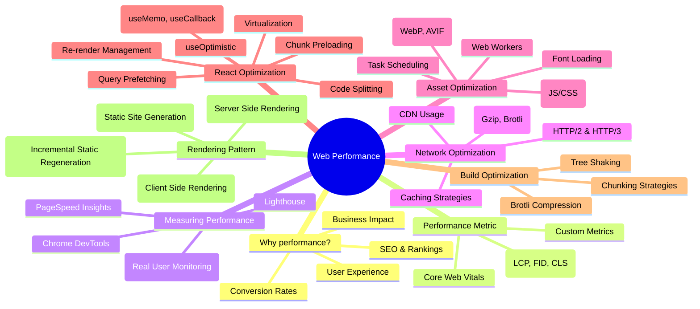
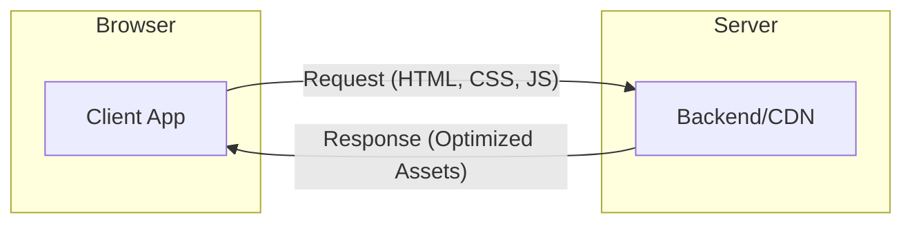

# Web Performance Optimization

Web performance is the speed at which web pages are downloaded and displayed on the user's web browser. It is a critical factor for user experience, SEO, and business success.

## Performance Overview

The following graph illustrates the key pillars and touchpoints of web performance optimization as discussed in this module.

---

## 💡 Why Performance is Critical?

Performance isn't just a technical metric; it's a fundamental aspect of user satisfaction and business success.

### 👤 User & Business Impact

- **User Experience:** Faster sites feel more responsive and professional.
- **Productivity:** Internal tools that load fast save thousands of hours of employee time.
- **Customer Satisfaction:** Speed is the #1 feature users care about.
- **Revenue & Profitability:** Every 100ms of latency can cost up to 1% in sales (Amazon).
- **Operational Costs:** Optimized assets mean less bandwidth usage and lower infrastructure bills.
- **Competitive Advantage:** If you are faster than your competitor, users will stay with you.
- **Google Ranking:** Performance (Core Web Vitals) is a direct SEO ranking factor.

### 📈 Business Metrics to Watch

- **Session Time:** High-performance sites keep users engaged longer.
- **Bounce Rate:** Slow sites drive users away before the first page even finishes loading.

---

## 📱 Understanding Your Users

To optimize effectively, you must understand the constraints of your target audience. Performance is **not equal** for everyone.

- **Device Diversity:** A $1,500 MacBook Pro parses JS significantly faster than a $100 Android phone.
- **Network Quality:** Users on 3G/4G have higher latency and lower bandwidth than those on Fiber/WiFi.
- **CPU & GPU:** Rendering complex CSS and executing heavy JS is a CPU-intensive task.

### ⏳ The "JavaScript Tax": Boot-up Time

JavaScript is the most expensive asset we send to users. It's not just about the download size; it's about the **time to parse and execute**.

| Platform    | Median Boot-up Time | Performance Gap  |
| :---------- | :------------------ | :--------------- |
| **Desktop** | **0.4 seconds**     | Reference        |
| **Mobile**  | **3.4 seconds**     | **+325% slower** |

> **Takeaway:** Always test your application on low-end mobile devices and "Fast 3G" network throttling in Chrome DevTools to see the reality for your users.

---

## ⚖️ Performance vs. Security (The Architect's Trade-off)

A critical role of a Staff Engineer is balancing performance with security. These two often pull in opposite directions.

- **Content Security Policy (CSP):** While vital for security, a strict CSP can block certain performance optimizations like inline scripts or styles.
- **Strict Transport Security (HSTS):** Adds a slight overhead to the initial connection but ensures a secure transport.
- **Resource Hints vs. Privacy:** Tools like `dns-prefetch` can slightly leak user browsing patterns to third parties.
- **JSON vs. Binary:** Binary protocols (gRPC) are faster but harder to inspect with traditional security firewalls compared to text-based JSON.

---

## 🏗️ The Browser-Server Loop

Performance is fundamentally about optimizing the data exchange and processing between the **Browser** and the **Server**.

---

## 📊 Quick-Reference: Frontend Performance Optimization Matrix

Below is a structured comparison of key frontend performance techniques across different layers of the web stack.

### 1. Code & Build-Time Optimizations

| Technique                     | Under the Hood / Description                                                                      | Primary Metric Affected                         | Best Practice / Example                                                                           |
| :---------------------------- | :------------------------------------------------------------------------------------------------ | :---------------------------------------------- | :------------------------------------------------------------------------------------------------ |
| **Tree Shaking**              | Static analysis of ES Modules (ESM) to remove unused exports from the final JavaScript bundle.    | **FCP / LCP** (reduces payload size)            | Use `import`/`export` and avoid importing full libraries: `import { debounce } from 'lodash-es'`. |
| **Lazy Loading**              | Divides JS bundles into chunks loaded on-demand via dynamic imports (`import()`).                 | **TBT / FCP** (reduces initial parse time)      | `const Cart = React.lazy(() => import('./Cart'))` wrapped in a `<Suspense>` loader.               |
| **Code Splitting**            | Automatically creating distinct chunks based on routes or shared modules during bundling.         | **FCP / TBT** (improves page caching)           | Configure route-based splitting in Next.js or rollup manual chunks.                               |
| **Build-Time Compilation**    | Replacing slow JS-based compiler steps with native binary toolchains.                             | **Build Speed / Dx** (cleaner JS output)        | Use compilers like `esbuild`, `SWC` (in Next.js), or `Turbopack` over Babel.                      |
| **Script Loading Control**    | Modifying `<script>` attributes to run scripts asynchronously or delay execution until DOM ready. | **TBT / LCP** (prevents parser blocking)        | `<script defer src="..." />` for core JS; `<script async src="..." />` for third-party scripts.   |
| **Suspense for Lazy Content** | Delays rendering parts of the DOM until dependent code chunks or assets are resolved.             | **TBT / Perceived Load** (prevents blank pages) | Wrap lazy components inside `<Suspense fallback={<Skeleton />}><LazyComp /></Suspense>`.          |

### 2. Modern Rendering & UX Strategies

| Strategy                    | How it Works                                                                                                 | Primary Metric Affected                      | Best Practice / Example                                                              |
| :-------------------------- | :----------------------------------------------------------------------------------------------------------- | :------------------------------------------- | :----------------------------------------------------------------------------------- |
| **Concurrent Rendering**    | Lets React pause a long render job, yield control back to browser interaction events, and resume.            | **INP / FID** (unblocks main thread)         | Standard in React 18+; use hooks like `useTransition` to mark non-urgent updates.    |
| **Optimistic UI**           | Immediately renders the expected outcome of an async update, reverting to base state only if it fails.       | **Perceived Speed / INP** (instant response) | Use React 19's `useOptimistic` hook for liking posts or posting comments.            |
| **Skeleton UI**             | Displays placeholder blocks matching the layout dimensions of incoming elements to avoid layout shifts.      | **CLS** (retains visual layout)              | `<Skeleton className="w-[300px] h-[200px]" />` to reserve card size before fetching. |
| **Pre-rendering (SSG/ISR)** | Compiling dynamic pages into static HTML at build time (SSG) or incrementally in the background (ISR).       | **TTFB / FCP / LCP** (edge delivery)         | Next.js dynamic routing with `getStaticProps` and a background `revalidate` timer.   |
| **Client-Side Prefetching** | Downloading future route bundles and assets in the background when a link enters the viewport or is hovered. | **LCP on Navigation** (instant page changes) | Next.js `<Link href="..." prefetch={true}>` or custom hovering scripts.              |

### 3. Data Layer & State Optimizations

| Optimization                      | How it Works                                                                                    | Primary Metric Affected                           | Best Practice / Example                                                                           |
| :-------------------------------- | :---------------------------------------------------------------------------------------------- | :------------------------------------------------ | :------------------------------------------------------------------------------------------------ |
| **Query Prefetching**             | Fetching and caching future request payloads before the user navigates or triggers the request. | **Perceived Latency / FCP** (instant transitions) | `queryClient.prefetchQuery()` on link hover or button hover events.                               |
| **State Colocation**              | Keeping component states as close to the actual rendering node as possible.                     | **TBT / Rendering Overhead** (limits re-renders)  | Maintain text input states locally within the `<Input>` node rather than in a global store.       |
| **Selective Context / Selectors** | Restricting component updates to only trigger when selected slices of a state store change.     | **TBT / CPU Overhead** (avoids global re-renders) | Use Zustand selectors: `const user = useStore(state => state.user)` instead of raw Context API.   |
| **Optimistic Mutations**          | Resolving UI changes locally and rollbacks caches using client-side store logic.                | **INP / UX** (zero-delay network mutations)       | Implement TanStack Query's `onMutate` (optimistic state set) and `onError` (rollback on failure). |

---

## 📁 Module Structure

This directory contains deep dives into each of the touchpoints mentioned above:

- **[Metrics/](./Metrics/README.md)**: Understanding FCP, LCP, FID, INP, and CLS.
- **[Network/](./Network/README.md)**: Strategies for faster delivery.
- **[Assets/](./Assets/README.md)**: Techniques for image and code optimization.
- **[React/](./React/README.md)**: Framework-specific performance patterns.
- **[Rendering/](./Rendering/README.md)**: Choosing between SSR, CSR, and SSG.
